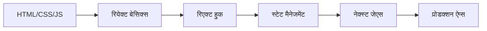

# React JS

This Document is about React JS.
रियेक्ट जेएस

```mermaid
graph LR
    A[HTML/CSS/JS] --> B[रियेक्ट बेसिक्स]
    B --> C[रिएक्ट हुक]
    C --> D[स्टेट मैनेजमेंट]
    D --> E[नेक्स्ट जेएस]
    E --> F[प्रोडक्शन ऐप्स]
```


```bash
cd notes
npm start
```

```python
print("Hello, World!")
def add(a, b):
    return a + b
```
