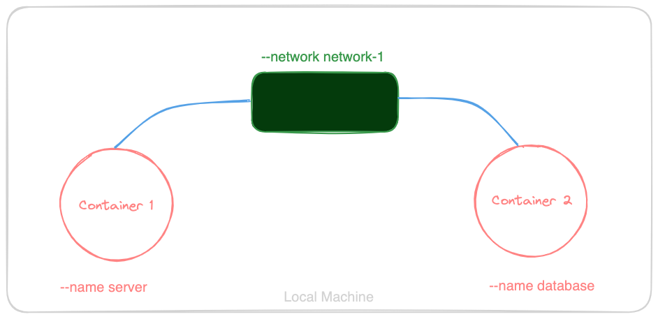

# Docker Commands

## Docker Image BUILD and RUN
```bash
docker build . -t <image_name>
docker run -it <image_name> # { This turn images to container }
```

## Docker CONTAINER
```bash
docker <container_name> start
docker <container_name> stop
```

## Docker images/container LISTING
```bash
docker images
docker container ls # { This will list only the running containers }
docker container ls -a # { This will list all containers }
```

## Docker image/container REMOVE
```bash
docker image rm <image_id>
docker container rm <container_id> # { Make sure the container is not UP }
```

## Docker Container EXECUTE
```bash
docker exec <container_name> <command>
docker exec -it <container_name> bash
```

## Docker PORT-MAPPING
```bash
docker run -it -p <mapping_port>:<container_port> <docker_username>/<image>
```

## Docker VOLUME
```bash
docker volume create <volume_name>
docker run -v <volume_name>:/path/to/volume -p <mapping_port>:<container_port> <image>
docker volume ls
docker volume rm <volume_name>
```

## Docker NETWORKING
```bash
docker network create <network_name>

# { Make sure the container you are trying to connect is already running on the same network }
docker run -p <mapping_port>:<container_port> --name <name_of_service> --network <network_name> <image>  
```
Example: The below command must be run in same order.
    1. docker run -p 27017:27017 --name mongo_db --network network-1 mongo
    2. docker run -p 8000:8000 --network network-1 express-server




## Multistage Build
```bash
docker build . --target <stage_name> -t <image_name>
```

## Mounting of files
This helps to provide the functioning of `hot reloading` 
```bash
docker run \
  -e <env_variable>=<value> \
  -p <mapping_port>:<container_port> \
  -v .:/path/to/WORKDIR <image_name>
 # { ↑ this .(dot) is resposible for data mounting }
```

## Docker Compose
```bash
docker-compose up
```

> You can download docker's official cheatsheet by clicking [here](https://docs.docker.com/get-started/docker_cheatsheet.pdf)