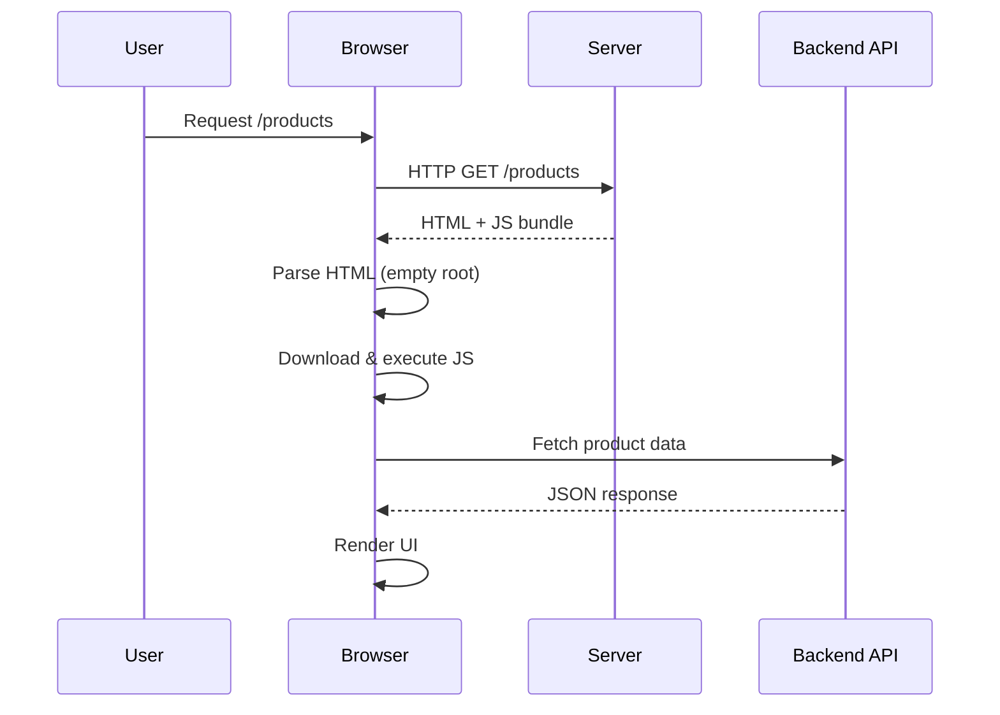

## One-line definition

> **CSR means the server sends an empty HTML shell, and the browser builds the page using JavaScript.**

---

## The Core Idea (no jargon)

- Server: “Here’s some HTML and a JS file”
- Browser: “Cool, I’ll run JS, fetch data, and render UI”
- User sees content **only after JS runs**

---

## What the server sends (important)

```html
<!DOCTYPE html>
<html>
  <head>
    <title>My App</title>
    <script src="/bundle.js" defer></script>
  </head>
  <body>
    <div id="root"></div>
  </body>
</html>
```

⚠️ **There is NO content inside `#root`**
Everything comes later.

---

## CSR Request → Response Flow (High Level)

```
User → Server → Browser → JavaScript → API → Render UI
```

That’s not enough. Let’s slow it down.

---

## Step-by-step lifecycle (very important)

### 1. User requests a page

```
GET /products
```

### 2. Server responds immediately

```
HTML + JS bundle
(no data)
(no UI)
```

### 3. Browser parses HTML

- Builds DOM
- Sees empty `#root`

### 4. Browser downloads JS bundle

- React / Vue / Angular code
- Routing logic
- Data-fetching logic

### 5. JavaScript executes

- Framework bootstraps
- Components mount

### 6. API calls happen

```
GET /api/products
```

### 7. Data arrives

- State updates
- Virtual DOM diff
- Real DOM updates

### 8. User finally sees content

---

## Sequence Diagram (Mermaid)



---

## ASCII Version (for quick recall)

```
User
 │
 │  request page
 ▼
Browser
 │
 │  get HTML + JS
 ▼
(empty page)
 │
 │  JS loads
 ▼
JS runtime
 │
 │  fetch data
 ▼
API
 │
 │  return JSON
 ▼
UI rendered
```

---

## Time-to-Content Breakdown

Let’s talk performance like an adult.

| Phase           | User sees something? |
| --------------- | -------------------- |
| HTML received   | ❌ No                |
| JS downloading  | ❌ No                |
| JS executing    | ❌ No                |
| API fetching    | ❌ No                |
| Render complete | ✅ Yes               |

👉 This is why CSR **feels slow on first load**.

---

## SEO Reality (critical)

### What search engines see

```html
<div id="root"></div>
```

Historically:

- ❌ Google couldn’t index CSR well
- ❌ SEO was terrible

Today:

- Google _can_ execute JS
- But:
  - Slower indexing
  - Not guaranteed
  - Other crawlers (social, bots) may fail

**CSR is SEO-hostile by default.**

---

## Caching Characteristics

### What can be cached well

- JS bundles (CDN)
- Static assets

### What cannot

- Page content
- Personalized data

Every user:

- Downloads JS
- Fetches data
- Renders UI

---

## Scaling Behavior

CSR scales **very well for servers**.

Why?

- Server does almost nothing
- No per-request rendering cost
- CDN-friendly

Trade-off:

- Client CPU & network take the hit

---

## Typical Use Cases (GOOD FIT)

CSR shines when:

- Authenticated dashboards
- Internal tools
- SaaS apps
- Highly interactive UIs
- Content is user-specific

Examples:

- Admin panels
- Analytics dashboards
- Email clients
- Project management tools

---

## Failure Modes (interview gold)

### ❌ JS fails to load

→ Blank page

### ❌ API is slow

→ Loading spinner forever

### ❌ Large JS bundle

→ Terrible TTI (Time to Interactive)

### ❌ Low-end devices

→ Janky UI, dropped frames

---

## CSR Mental Model (lock this in)

> **CSR optimizes server cost, not user experience.**

It assumes:

- Fast devices
- Good networks
- JS always works

---

## CSR in Interviews (what seniors say)

❌ Junior answer:

> “CSR renders on the client using React.”

✅ Senior answer:

> “CSR ships an empty HTML shell and relies entirely on JavaScript execution and client-side data fetching, which reduces server load but delays first meaningful paint and hurts SEO.”

---

## When NOT to use CSR

- Marketing pages
- Blogs
- E-commerce product pages
- Content-heavy sites
- SEO-critical pages

---

## Quick Summary (pin this)

- HTML: empty
- Rendering: browser
- SEO: weak
- First load: slow
- Server cost: low
- Interactivity: excellent
