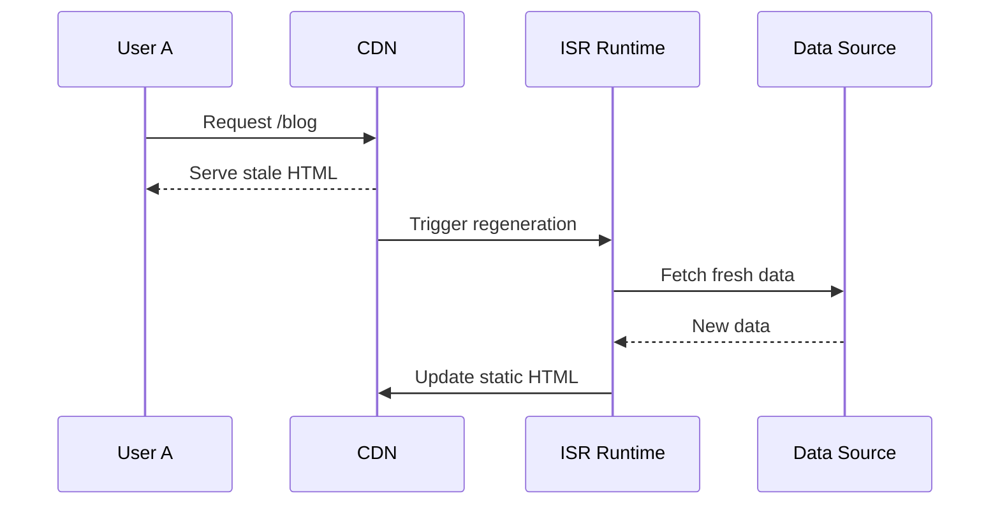

## Incremental Static Regeneration (ISR)

> **Core idea:**<br/>
> *Keep SSG’s speed, but allow pages to update after deployment.*

## One-line definition (pin this)

> **ISR lets you generate static pages at build time and then selectively regenerate them in the background when data becomes stale.**

No full rebuilds.
No per-request SSR.
No frozen content forever.

---

## Why ISR Exists (the real pain)

SSG gave us:

* ⚡ Extreme speed
* 🧠 Simple mental model
* 💰 Near-zero runtime cost

But it broke one thing:

> **Content freshness**

Rebuilding the entire site for:

* A new blog post
* A price update
* A CMS edit

…is slow and expensive.

ISR answers this question:

> **“Can we update static pages *only when needed*?”**

---

## The Big Mental Shift

### SSG

```
Build once → serve forever → rebuild everything
```

### ISR

```
Build once → serve → selectively regenerate → keep serving
```

The page is **never blocked** while updating.

---

## How ISR Works (conceptually)

ISR adds **one missing capability** to SSG:

> **Background regeneration**

Users never wait for it.

---

## Step-by-Step ISR Lifecycle

Let’s walk through this very slowly.

---

### 1️⃣ Build time (same as SSG)

```ts
export async function getStaticProps() {
  const posts = await fetchPosts();
  return {
    props: { posts },
    revalidate: 60, // seconds
  };
}
```

This does two things:

* Generates HTML at build time
* Sets a **staleness window**

---

### 2️⃣ User requests the page (fresh period)

```
Time since build < 60s
```

What happens?

```
User → CDN → Static HTML → Browser
```

* No regeneration
* No server execution
* Pure SSG speed

---

### 3️⃣ Page becomes stale (after 60s)

Important: **Stale does NOT mean unavailable**

:::note
It means: “This page *may* be outdated.”
:::
---

### 4️⃣ First user after staleness hits the page

This is the magic moment.

```
User A → Gets OLD HTML immediately
```

Simultaneously (in the background):

```
ISR server → Re-renders page → Updates cache
```

⚠️ The user is **not blocked**

---

### 5️⃣ Subsequent users get fresh content

```
User B → Gets NEW HTML
```

The cache is now updated.

---

## Sequence Diagram (Mermaid)




## ASCII Diagram (interview-friendly)

```
Request → Serve old page
         ↳ Background regenerate
         ↳ Cache updated
Next request → Serve new page
```

---

## The Key Rule of ISR (memorize this)

> **ISR never blocks the user.** This is why it scales.


## ISR vs SSG vs SSR (core comparison)

| Feature           | SSG        | ISR                | SSR           |
| ----------------- | ---------- | ------------------ | ------------- |
| HTML generation   | Build time | Build + background | Every request |
| Data freshness    | Frozen     | Eventually fresh   | Always fresh  |
| Server on request | No         | Sometimes          | Yes           |
| Performance       | Extreme    | Extreme            | Good          |
| Scalability       | Massive    | Massive            | Limited       |

---

## What “revalidate” REALLY means

```ts
revalidate: 60
```

This does NOT mean:

* “Update every 60 seconds exactly”

It means:

> “Allow regeneration *after* 60 seconds if a request comes in.”

No request → no regeneration.

---

## ISR Is **Request-Driven**, Not Timer-Driven

This is subtle but critical.

```
No traffic → no rebuild
```

Perfect for:

* Long-tail pages
* Rarely visited content

---

## On-Demand ISR (next-level control)

Instead of time-based:

```
revalidate: 60
```

You can do:

```
CMS → Webhook → Revalidate page
```

Meaning:

* Content changes
* Page regenerates instantly
* Still static for users

This is **enterprise-grade**.

---

## Hydration in ISR (important reminder)

ISR pages:

* Are still static HTML
* Still hydrated in the browser
* Same hydration rules apply

ISR does **not** change hydration behavior.

---

## Failure Modes (real production concerns)

### ❌ Regeneration fails

→ Old page continues serving (safe fallback)

### ❌ API is down

→ No user impact
→ Next regeneration attempt later

This is **graceful degradation by design**.

---

## ISR Mental Model (lock this in)

> **ISR is SSG with controlled staleness and background regeneration.**

Or even shorter:

> **“Static by default, dynamic when necessary.”**

---

## Common Interview Traps

❌ “ISR is SSR with caching”

✅ Correct:

> “ISR generates static pages and regenerates them asynchronously based on staleness or explicit revalidation, without blocking user requests.”

---

## When ISR is the BEST choice

* Blogs with frequent updates
* E-commerce product pages
* CMS-driven sites
* Large content platforms
* Pages with uneven traffic

---

## When ISR is NOT enough

* User-specific data
* Real-time dashboards
* Highly personalized views

Those still need:

* SSR
* Or CSR after SSG shell

---

## Final Timeline (ALL FOUR TOGETHER)

```text
Time ─────────────────────────▶

Build        Request        Browser
SSG   [Render]
ISR   [Render]      [Re-render occasionally]
SSR                [Render every time]
CSR                            [Render]
```

---

## The Ultimate Decision Framework (memorize this)

Ask **one question** per page:

> **“How fresh does this data need to be?”**

| Freshness need        | Strategy  |
| --------------------- | --------- |
| User-specific         | CSR / SSR |
| Always fresh          | SSR       |
| Mostly static         | SSG       |
| Occasionally changing | ISR       |

