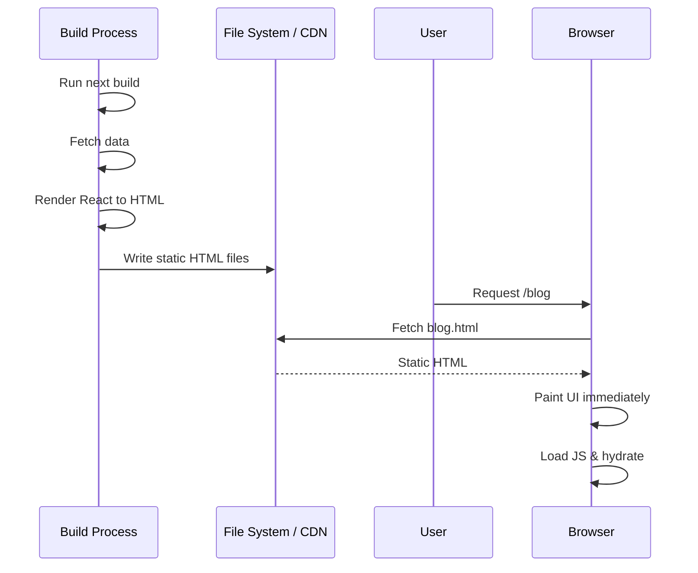

## Static Site Generation (SSG)

> **Core shift:**<br/>
> Rendering does NOT happen on request.<br/>
> Rendering happens **before users ever arrive**.

## One-line definition (pin this)

> **SSG means React runs at build time, generates HTML files once, and those files are served directly to users.**

No per-request rendering.<br/>
No server execution on page load.

---

## Why SSG Exists (the real motivation)

SSR fixed CSR’s *first paint & SEO* issues.<br/>
But SSR introduced new problems:

* High server cost
* Scaling pain
* Latency under load
* Cold starts (serverless)

SSG asks a radical question:

> **“What if the page doesn’t need to be rendered on every request at all?”**

---

## The Core Idea (plain English)

Instead of this:

```
User → Server → Render HTML → User
```

SSG does this:

```
Build time → Generate HTML → Save to disk/CDN
User → Get HTML file → Done
```

The server is **removed from the critical path**.

---

## When does React run in SSG?

⚠️ This is the most important sentence in this entire topic:

> **In SSG, React runs during the build process, not at request time.**

React executes:

* On your machine
* Or CI/CD
* Or build server

**Not when users visit the site.**

---

## Step-by-Step Lifecycle (slow and precise)

### 1️⃣ You run `next build`

This triggers:

* Route analysis
* Page discovery
* Data fetching
* React execution

---

### 2️⃣ Data is fetched at build time

Example:

```ts
export async function getStaticProps() {
  const posts = await fetchPosts();
  return { props: { posts } };
}
```

This runs:

* Once
* During build
* Not per request

---

### 3️⃣ React renders components

React generates HTML:

```html
<h1>Blog</h1>
<ul>
  <li>Post A</li>
  <li>Post B</li>
</ul>
```

---

### 4️⃣ HTML is written to disk

Example:

```
/out/blog/index.html
```

This file is now:

* Complete
* Static
* Cacheable forever

---

### 5️⃣ User requests page

```
GET /blog
```

They receive:

* A static HTML file
* From CDN or file system

No React execution.
No server rendering.

---

### 6️⃣ Browser hydrates (same as SSR)

* JS loads
* React hydrates
* Interactivity attaches

---

## Sequence Diagram (Mermaid)



---

## ASCII Diagram (interview gold)

```
Build time
──────────
React runs
HTML created
Files saved

Request time
────────────
User → HTML file → Browser → Hydration
```

---

## SSG vs SSR (core difference)

| Aspect                   | SSR           | SSG            |
| ------------------------ | ------------- | -------------- |
| When React runs          | Every request | Build time     |
| Server needed on request | Yes           | No             |
| Scalability              | Limited       | Massive        |
| Cost                     | High          | Near zero      |
| Speed                    | Fast          | Extremely fast |

---

## Why SSG is insanely fast

Because:

* No computation
* No data fetching
* No rendering
* No cold starts

Just:

> **File read → network transfer**

This is the fastest thing the web knows how to do.

---

## SEO Characteristics

SSG is **perfect** for SEO:

* Full HTML
* Deterministic content
* Stable URLs
* Instant crawl

Search engines love SSG.

---

## Caching Characteristics (this is the magic)

Static files can be:

* Cached at CDN
* Cached at edge
* Cached in browser
* Cached forever

With headers like:

```
Cache-Control: public, max-age=31536000
```

---

## Scaling Reality (why big sites love SSG)

Traffic spike?

* 1 user or 1 million users
* Same cost
* Same performance

This is why:

* Blogs
* Docs
* Marketing sites
* Landing pages

almost always use SSG.

---

## The Big Limitation of SSG

Here’s the catch.

> **Data is frozen at build time.**

If content changes:

* HTML does NOT update
* Until next build

Example:

* Build at 9:00 AM
* New blog at 9:30 AM
* Users won’t see it

---

## This leads to the key SSG question

> “How fresh does the data need to be?”

---

## Good Fits for SSG

* Blogs
* Documentation
* Marketing pages
* Product landing pages
* Content-heavy sites

---

## Bad Fits for SSG

* Real-time dashboards
* User-specific pages
* Rapidly changing data
* Personalized content

---

## Common Interview Trap

❌ “SSG is just static HTML”

✅ Correct answer:

> “SSG uses React at build time to generate static HTML, which is then hydrated on the client for interactivity.”

That distinction matters.

---

## SSG Mental Model (lock this in)

> **SSG trades data freshness for performance and scalability.**

---

## Why SSG does NOT eliminate React

Important:

* React still runs
* Just earlier
* Hydration still happens

SSG ≠ no JavaScript
SSG ≠ no React

---

## Timeline Comparison (all three so far)

```
CSR → Render in browser (late)
SSR → Render on server (request time)
SSG → Render at build time
```

---

## Natural Question (and the birth of ISR)

At this point, everyone asks:

> “SSG is amazing… but what if data changes occasionally?”

That exact pain leads to:

# 4️⃣ Incremental Static Regeneration (ISR)

A hybrid that:

* Keeps SSG speed
* Allows controlled freshness
* Avoids full rebuilds
