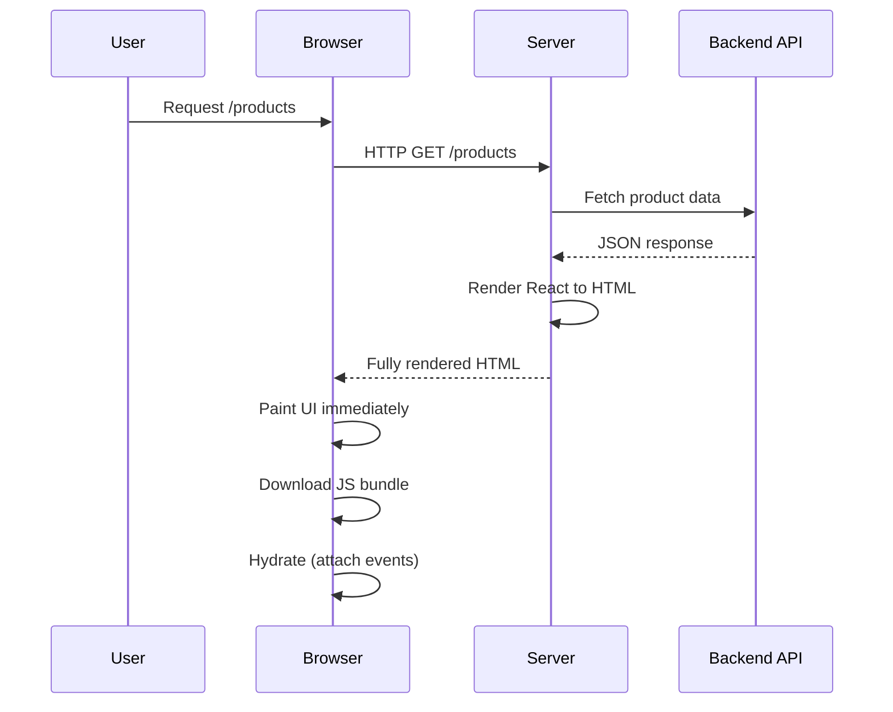
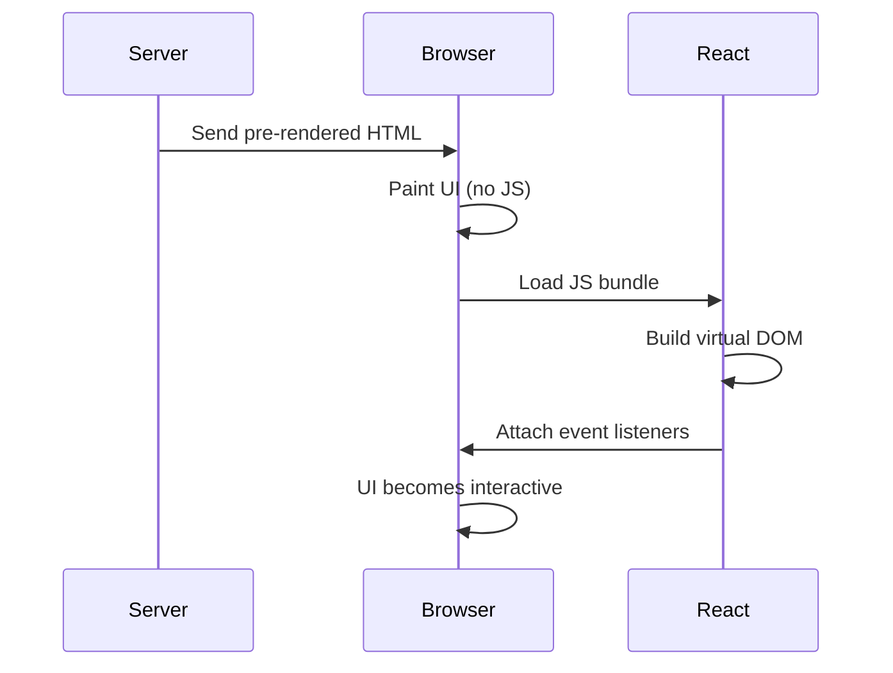

# Server-Side Rendering (SSR)

:::info
**Mental shift:**<br/>
In CSR, the browser builds the page.<br/>
In SSR, the **server builds the page for every request**.
:::

## One-line definition (pin this)

> **SSR means the server executes your JavaScript, fetches data, and sends fully rendered HTML to the browser on each request.**

---

## Why SSR Exists (the problem it solves)

CSR’s biggest issues:

- Blank page on first load
- Slow First Contentful Paint (FCP)
- Weak SEO
- Poor performance on low-end devices

:::info
SSR exists to answer one question:

> **“Why wait for JavaScript in the browser when the server can do the work upfront?”**
:::

---

## What the server sends (critical difference)

Instead of this 👇

```html
<div id="root"></div>
```

SSR sends this 👇

```html
<div id="root">
  <h1>Products</h1>
  <ul>
    <li>iPhone</li>
    <li>MacBook</li>
    <li>AirPods</li>
  </ul>
</div>
```

💡 The page is **already usable before JS loads**.

---

## SSR High-Level Flow

```
User → Server (runs JS + fetches data) → Browser → Hydration
```

> Hydration is the new concept here. We’ll dissect it properly.

---

## Step-by-Step Lifecycle (slow and precise)

### 1. User requests a page

```
GET /products
```

### 2. Server receives request

- Knows the route
- Knows which component to render

### 3. Server fetches data

```
GET /api/products
```

### 4. Server executes your JS

- React components run
- Data injected as props
- HTML is generated

### 5. Server sends rendered HTML

- UI already visible
- Content readable
- SEO-friendly

### 6. Browser parses HTML

- Page is visible **immediately**

### 7. Browser downloads JS bundle

- Same React code as server

### 8. Hydration happens

- React attaches event listeners
- Makes page interactive

---

## Sequence Diagram (Mermaid)



---

## ASCII Diagram (interview-friendly)

```
User
 │
 │ request page
 ▼
Server
 │
 │ fetch data
 │ render HTML
 ▼
Browser
 │
 │ page visible immediately
 │ JS loads
 ▼
Hydration
```

---

## Hydration (this is where seniors shine)

### What hydration is NOT

❌ Re-rendering the page<br/>
❌ Fetching data again<br/>
❌ Replacing HTML

### What hydration IS

✅ Attaching event listeners<br/>
✅ Syncing Virtual DOM with existing DOM<br/>
✅ Making UI interactive

---

## Timeline Comparison (CSR vs SSR)

| Phase                       | CSR   | SSR       |
| --------------------------- | ----- | --------- |
| HTML received               | Empty | Full      |
| First content visible       | Late  | Immediate |
| JS required to see UI       | Yes   | No        |
| JS required for interaction | Yes   | Yes       |

⚠️ SSR improves **perceived performance**, not necessarily total work.

---

## SEO Impact (huge)

Search engines receive:

```html
<h1>Products</h1>
<ul>
  ...
</ul>
```

Result:

- Fast indexing
- Reliable crawls
- Social previews work
- SEO tools behave correctly

**SSR is SEO-safe by default.**

---

## Performance Characteristics (truth, not hype)

### Pros

- Faster First Contentful Paint
- Faster Time to First Byte (with good infra)
- Better low-end device experience

### Cons

- Slower Time to Interactive (hydration cost)
- Heavy server CPU usage
- Slower under high traffic if not cached

---

## Caching Behavior (this is tricky)

### Can SSR be cached?

Yes — but carefully.

- Public pages → CDN cacheable
- Personalized pages → not cacheable

### Problem:

Each request may require:

- Data fetching
- JS execution
- HTML generation

That’s **expensive at scale**.

---

## Scaling Reality (the uncomfortable truth)

SSR shifts cost from:

```
Client → Server
```

Under load:

- CPU spikes
- Memory pressure
- Longer response times

This is why:

> **SSR without caching is a scaling nightmare.**

---

## Failure Modes (real production pain)

### ❌ API slow

→ Page load blocked entirely

### ❌ Server crash

→ Entire site down

### ❌ Hydration mismatch

→ Console errors, broken UI

### ❌ High traffic spike

→ Server overload

---

## SSR Mental Model (lock this in)

> **SSR optimizes first paint and SEO, at the cost of server complexity and scalability.**

---

## SSR in Interviews (what gets offers)

❌ Junior answer:

> “SSR renders HTML on the server.”

✅ Senior answer:

> “SSR executes the component tree and data fetching on every request, sending pre-rendered HTML for faster first paint, then hydrates on the client — trading server scalability for improved SEO and perceived performance.”

---

## When SSR is the RIGHT choice

- SEO-critical pages
- E-commerce listings
- News sites
- Marketing pages with dynamic data
- Content that changes often but must be indexable

---

## When SSR is the WRONG choice

- Heavy personalization
- Dashboards
- Internal tools
- Highly interactive apps
- Massive traffic without caching

---

## CSR vs SSR (quick mental contrast)

| Aspect      | CSR     | SSR    |
| ----------- | ------- | ------ |
| Rendering   | Browser | Server |
| SEO         | Weak    | Strong |
| Server load | Low     | High   |
| First paint | Slow    | Fast   |
| Complexity  | Low     | Medium |

---

## Where people get confused

> “SSR is always better than CSR”

❌ **Wrong.**
SSR solves _first paint_, not _everything_.

And this is exactly why **SSG** exists.

---

## Next step

In the **next response**, we’ll cover:

# 3️⃣ Static Site Generation (SSG)

This is where you’ll finally understand:

- Why builds exist
- Why cloning a repo on EC2 is not enough
- How React runs **at build time**
- Why SSG scales insanely well

👉 Say **“Continue with SSG”** when ready.


