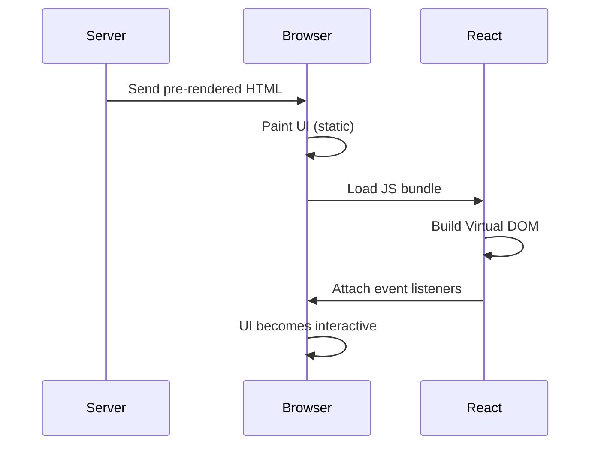

## What is Hydration?

### One-line definition (pin this)
import C from '@site/src/components/Color';
import H from "@site/src/components/Highlight"

*Hydration is the <H>process of attaching JavaScript behavior to pre-rendered HTML so it becomes interactive.</H>*

> Key phrase: ***HTML already exists before hydration starts***

Hydration does **not create UI**.<br/>
It **activates UI**.

---

## Where Does Hydration Come From?

### Very important clarification

| Technology   | Responsible for Hydration? |
| ------------ | -------------------------- |
| **React.js** | ✅ YES                      |
| **Next.js**  | ❌ NO (but it *uses* it)    |

### Correct mental model

* **Hydration <C color="orange">is a React feature</C>**
* **Next.js only decides <C color="orange">*when* hydration happens</C>, not *how***

👉 If React didn’t support hydration, **SSR/SSG/ISR would not exist**.

---

## Why Hydration Exists (The Core Problem)

Server-side rendering (SSR / SSG / ISR) gives you:

```html
<button>Click me</button>
```

Visually:

* ✅ Button exists
* ❌ Clicking does nothing

Because:

* HTML has **no event handlers**
* JavaScript logic is missing

Hydration bridges this gap.

---

## The Mental Model (Lock This In)

> **SSR / SSG give you a painted body.
> Hydration gives it a nervous system.**

Or:

> **Hydration = “Make this static HTML behave like a React app.”**

---

## Hydration Timeline (Critical)

```text
HTML arrives
↓
Browser paints page (fast)
↓
JS bundle downloads
↓
React hydrates
↓
Page becomes interactive
```

⚠️ Key insight: **A page can look ready but still be non-interactive**

This gap is called: **TTI gap** (Time To Interactive)

> TTI: Time period, between the page loads and the page becomes interactive.

---

## Step-by-Step: What React Does During Hydration

Let’s go deep and slow.

### Step 1: Server sends HTML

Example output from SSR / SSG:

```html
<div id="root">
  <button>Count: 0</button>
</div>
```

Browser renders it immediately.


### Step 2: Browser loads JS bundle

This bundle contains:
* React
* Your components
* Hooks
* Event handlers


### Step 3: React runs in **hydrate mode**

This is the key distinction.

React:
* Builds a **Virtual DOM**
* Matches it against **existing DOM**
* Does **NOT** create new DOM nodes


### Step 4: React attaches behavior

```jsx
<button onClick={increment}>
```

Becomes:
* Click listener attached
* State wired
* Component becomes “live”


## Sequence Diagram



---

## ASCII Diagram (Interview-friendly)

```text
Static HTML
    ↓
JS loads
    ↓
React matches DOM
    ↓
Events + state attached
    ↓
Interactive UI
```

---

## Hydration vs Normal Client Render

| Aspect             | Hydration | Client Render |
| ------------------ | --------- | ------------- |
| DOM already exists | ✅ Yes     | ❌ No          |
| DOM creation       | ❌ No      | ✅ Yes         |
| Event binding      | ✅ Yes     | ✅ Yes         |
| Used in SSR/SSG    | ✅ Yes     | ❌ No          |
| Performance cost   | Medium    | High          |

---

## Hydration in React vs Next.js (Very Explicit)

### 1. React.js

* Implements hydration logic
* Provides APIs:
  * `hydrateRoot`
  * `hydrate`

React does the **actual work**.

### 2. Next.js

* Chooses rendering strategy:
  * CSR
  * SSR
  * SSG
  * ISR
* Decides **when hydration runs**
* Ships the JS bundle

👉 Next.js **orchestrates**, React **executes**.

---

## When Does Hydration Happen?

| Rendering Strategy | Hydration Happens? |
| ------------------ | ------------------ |
| CSR                | ❌ No               |
| SSR                | ✅ Yes              |
| SSG                | ✅ Yes              |
| ISR                | ✅ Yes              |


:::info Important:

<H>Hydration only exists if HTML was rendered before JS.<br/></H>
CSR skips hydration because, **there is nothing to hydrate.**
:::

---

## Why Hydration is Expensive

Hydration cost comes from:

* Parsing JS
* Executing React
* DOM matching
* Event listener attachment

On:

* Large pages
* Low-end devices
* Slow networks

This is why:

> **SSR improves first paint, not always interactivity**

---

## Hydration Mismatch (Very Important)

### What is it?

When:

* Server HTML ≠ Client render output

Example:

```js
// server
Date.now() → 10:00

// client
Date.now() → 10:01
```

React expects:

```
10:00
```

But client renders:

```
10:01
```

💥 React warning:

> “Text content does not match server-rendered HTML”

---

## Common Causes of Hydration Mismatch

🚨 These are interview favorites:

* `Math.random()`
* `Date.now()`
* `window` usage
* `localStorage`
* Browser-only conditionals
* Non-deterministic rendering

**Golden rule**:

> Server render must be **deterministic**

---

## What Happens If Hydration Fails?

React may:

* Re-render subtree
* Lose SSR benefits
* Trigger warnings
* Hurt performance

Worst case:

> You paid SSR cost but fell back to CSR behavior.

---

## Hydration Is NOT Optional

❌ You cannot skip hydration
❌ You cannot partially hydrate (by default)
❌ You cannot interact without it

If you want **less hydration**:

* Use client boundaries
* Reduce JS
* Stream content
* Use server components

(Advanced topic — we can go there next.)

---

## Senior-Level Mental Model (Memorize)

> **Hydration is React reconciling its virtual DOM with pre-rendered HTML and attaching interactivity without recreating the DOM.**

If this sentence feels *natural*, you’re thinking at senior level.

---

## Final Summary (Pin This)

* Hydration is **done by React**
* Used by **Next.js SSR / SSG / ISR**
* Turns static HTML into an interactive app
* Improves perceived performance
* Can be expensive
* Requires deterministic rendering

