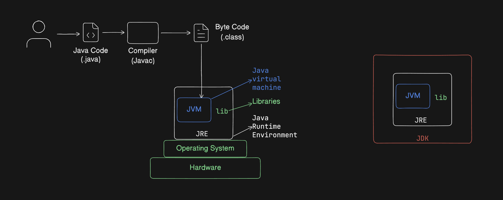

# How Java Works

Before writing a single line of Java, it helps to understand what actually happens when you run a Java program. Almost every "weird" thing about Java — why it's verbose, why it's fast despite being interpreted, why the same `.jar` runs on your Mac and on a Linux server — falls out of this one picture.

---

## 1. The problem Java was solving

In C or C++, you compile your source code straight down to **machine code** for one specific CPU and one specific operating system. A binary compiled on Windows/x86 will not run on Linux/ARM. You have to compile again for every target.

Java's answer was: **don't compile to machine code. Compile to an intermediate language, and ship a small program to every platform that knows how to execute that intermediate language.**

That intermediate language is **bytecode**. That small program is the **JVM**.

> **Write Once, Run Anywhere (WORA)** — you compile once, and any machine with a JVM can run the result.

---

## 2. The pipeline, end to end



Read the diagram left to right:

| Step | What you have | What does the work | What comes out |
| :-- | :-- | :-- | :-- |
| 1 | You write source code | your editor | `Main.java` |
| 2 | Source code | **`javac`** (the Java compiler) | `Main.class` — **bytecode** |
| 3 | Bytecode | **JVM**, inside the **JRE** | actual execution on the OS + hardware |

And the boxes on the right of the diagram are the nesting relationship you must remember:

```
JDK  =  JRE  +  developer tools (javac, javadoc, jdb, jar…)
JRE  =  JVM  +  standard libraries (java.lang, java.util, java.io…)
JVM  =  the engine that actually executes bytecode
```

- **JDK** (Java Development Kit) — what *you* install to **write** Java.
- **JRE** (Java Runtime Environment) — what a *machine* needs to **run** Java.
- **JVM** (Java Virtual Machine) — the piece inside the JRE that reads bytecode and executes it.

Since Java 11 the separate JRE download was retired — you just install a JDK, and it contains everything. But the three-layer concept is still exactly how the runtime is organised, and it's still an extremely common interview question.

---

## 3. Your first program, dissected

```java
// File: Main.java
public class Main {
    public static void main(String[] args) {
        System.out.println("Hello, Java!");
    }
}
```

Compile and run it:

```bash
javac Main.java     # produces Main.class (bytecode)
java Main           # the JVM loads Main.class and runs main()
```

Since Java 11 you can also skip the explicit compile step for single-file programs:

```bash
java Main.java      # compiles in memory, then runs
```

Now let's read that program word by word, because **every word is doing something**:

| Token | Meaning |
| :-- | :-- |
| `public` | Visible from anywhere. The JVM must be able to see `main` from outside, so it has to be public. |
| `class Main` | Java has no free-floating functions. **All code lives inside a class.** |
| `static` | The method belongs to the *class*, not to an *object*. The JVM must call `main` before any object exists, so `main` must be static. |
| `void` | Returns nothing. |
| `main` | The exact name the JVM looks for as the entry point. |
| `String[] args` | Command-line arguments, as an array of strings. |
| `System.out.println(...)` | `System` is a class, `out` is a static field on it (a `PrintStream`), `println` is a method on that stream. |

> **Rule:** a `public` class must live in a file with exactly the same name. `public class Main` ⇒ `Main.java`. The compiler enforces this.

### Coming from JavaScript / Python?

```javascript
// JavaScript — a function can just... exist.
console.log("Hello");
```

```java
// Java — everything is wrapped in a class, and types are mandatory.
public class Main {
    public static void main(String[] args) {
        System.out.println("Hello");
    }
}
```

That ceremony is the price of Java's core trade: **the compiler checks a huge amount for you before your program ever runs.** A typo in a method name is a compile error in Java and a 3 a.m. production error in JavaScript.

---

## 4. What is bytecode, really?

Bytecode is a compact instruction set for an imaginary CPU. You can look at it:

```bash
javap -c Main.class
```

```
public static void main(java.lang.String[]);
  Code:
     0: getstatic     #7   // Field java/lang/System.out:Ljava/io/PrintStream;
     3: ldc           #13  // String Hello, Java!
     5: invokevirtual #15  // Method java/io/PrintStream.println:(Ljava/lang/String;)V
     8: return
```

It's not machine code — no x86 or ARM instructions in sight. It's *instructions for the JVM*, and the JVM on each platform knows how to turn them into that platform's real instructions.

---

## 5. Inside the JVM

When you type `java Main`, the JVM does roughly this:

### 5.1 Class Loading

The **ClassLoader** finds `Main.class` on the classpath and reads it into memory. It works in three phases:

1. **Loading** — read the `.class` file, create a `Class` object for it.
2. **Linking** —
   - *Verification*: check the bytecode isn't malformed or malicious (this is why you can't hand-craft bytecode that corrupts the JVM's memory).
   - *Preparation*: allocate static fields and set them to default values (`0`, `false`, `null`).
   - *Resolution*: turn symbolic references (`"java/lang/String"`) into direct references.
3. **Initialization** — run static initializer blocks and static field assignments.

Classes are loaded **lazily** — a class is loaded the first time it's actually needed, not up front.

### 5.2 Runtime Memory Areas

The JVM carves its memory into distinct regions. Knowing these explains a *lot* of Java behaviour:

| Region | What lives there | Shared between threads? |
| :-- | :-- | :-- |
| **Heap** | Every object you create with `new`, and all arrays | ✅ Shared |
| **Stack** | One per thread. Holds method call frames: local variables, parameters, return addresses | ❌ Per-thread |
| **Metaspace** (was PermGen before Java 8) | Class metadata: field/method definitions, the constant pool | ✅ Shared |
| **PC Register** | Per thread — address of the instruction currently executing | ❌ Per-thread |
| **Native Method Stack** | For calls into C/C++ code via JNI | ❌ Per-thread |

Here's the single most important consequence:

```java
int x = 5;                 // the VALUE 5 lives on the stack
String s = "hello";        // the OBJECT lives on the heap;
                           // `s` on the stack holds a REFERENCE to it
```

**Primitives hold values. Everything else holds a reference to a heap object.** This one fact explains `==` vs `.equals()`, `NullPointerException`, "pass by value", and mutable-object surprises — all of which come up later in these notes.

```
     STACK (per thread)              HEAP (shared)
   ┌──────────────────┐          ┌──────────────────────┐
   │ x  =  5          │          │  String "hello"      │
   │ s  =  ●──────────┼─────────▶│  (char data, hash)   │
   └──────────────────┘          └──────────────────────┘
```

### 5.3 Execution: interpreter + JIT

The JVM starts by **interpreting** bytecode — reading one instruction at a time and doing what it says. That's simple but slow.

Meanwhile the JVM is *watching*. When a method or a loop runs many times, it becomes a **hot spot**, and the **JIT (Just-In-Time) compiler** compiles that bytecode into real native machine code and caches it. From then on, the fast native version runs.

This is why:
- Java programs are slow for the first few seconds and then get fast ("warm-up").
- Long-running Java servers can approach C++ speed — the JIT has profiling information a C++ compiler never had, like *which* branch is actually taken 99% of the time.

> The reference JVM is called **HotSpot** — named exactly for this hot-spot detection.

### 5.4 Garbage Collection

You never call `free()` or `delete` in Java. Instead, the **Garbage Collector (GC)** periodically finds heap objects that are no longer reachable from any live reference and reclaims their memory.

```java
Person p = new Person("Tejas");  // object on heap, reachable via p
p = null;                        // nothing references it anymore
                                 // → eligible for garbage collection
```

"Reachable" means: can I get to this object by starting from a **GC root** (a local variable on some thread's stack, a static field, etc.) and following references? If no, it's garbage.

The heap is generationally split, based on the observation that *most objects die young*:

```
        ┌──────────── Young Generation ────────────┐  ┌── Old Generation ──┐
        │  Eden   │  Survivor S0  │  Survivor S1   │  │     Tenured        │
        └─────────┴───────────────┴────────────────┘  └────────────────────┘
        new objects        survivors bounce            long-lived objects
        land here          between S0/S1               get promoted here
```

- **Minor GC** cleans the Young Generation. Frequent and fast.
- **Major / Full GC** cleans the Old Generation. Rarer and slower.

You will still see `OutOfMemoryError` if you genuinely hold references to more data than fits — GC removes *unreachable* objects, not *unneeded* ones. A `static List` you keep adding to and never clear is the classic Java memory leak.

---

## 6. Putting the whole flow together

```
   Main.java
      │  javac  (compile-time: syntax, types, access checks)
      ▼
   Main.class  ── bytecode, platform-independent
      │
      │  java Main
      ▼
 ┌──────────────────────── JVM ────────────────────────┐
 │  ClassLoader  →  Verifier  →  Memory allocation      │
 │                                                      │
 │  Interpreter ──(hot code)──▶ JIT Compiler ─▶ native  │
 │                                                      │
 │  Garbage Collector cleaning the heap in background   │
 └──────────────────────────────────────────────────────┘
      │
      ▼
   Operating System  →  Hardware
```

---

## 7. Two kinds of errors, and why the distinction matters

Java splits failure into two clearly separated moments:

```java
int x = "hello";        // ❌ COMPILE-TIME error — javac refuses. Program never runs.

int[] a = new int[3];
System.out.println(a[5]);  // ✅ compiles fine
                           // ❌ RUNTIME error — ArrayIndexOutOfBoundsException
```

Everything the compiler can prove wrong, it rejects up front. This is Java's whole value proposition versus dynamically typed languages, and it's the reason type declarations are mandatory.

---

## 8. Key characteristics of Java (the short version)

| Characteristic | What it means |
| :-- | :-- |
| **Platform-independent** | Compile to bytecode once, run on any JVM |
| **Object-oriented** | All code lives inside classes |
| **Statically typed** | Every variable's type is known and checked at compile time |
| **Strongly typed** | No silent nonsense conversions — `"5" + 5` won't quietly become `10` |
| **Automatically memory-managed** | Garbage collection, no manual `free()` |
| **Multithreaded** | Threads are built into the language and the standard library |
| **Backwards compatible** | Code from 1998 usually still compiles today |

---

## 🧠 Rapid-fire recall

1. What are the three things `javac` produces conceptually, and what does the JVM consume?
2. What's the difference between JDK, JRE and JVM?
3. Why must `main` be `static`?
4. Where do primitives live? Where do objects live?
5. What does the JIT compiler do that a plain interpreter doesn't?
6. When is an object eligible for garbage collection?
7. Name one error the compiler catches and one it cannot.

<details>
<summary>Answers</summary>

1. `javac` produces bytecode in `.class` files; the JVM loads, verifies and executes that bytecode.
2. JVM executes bytecode; JRE = JVM + standard libraries (enough to *run*); JDK = JRE + dev tools like `javac` (enough to *develop*).
3. Because the JVM has to call it before any object of the class exists, so there is no instance to call it on.
4. Primitive values live directly in the stack frame (or inline in an object on the heap); all objects and arrays live on the heap, and variables hold references to them.
5. It compiles frequently executed ("hot") bytecode into native machine code and caches it, so subsequent calls skip interpretation.
6. When it is no longer reachable by following references from any GC root.
7. Compiler catches type mismatches like `int x = "hello"`; it cannot catch `a[5]` on a 3-element array, which fails at runtime.

</details>
