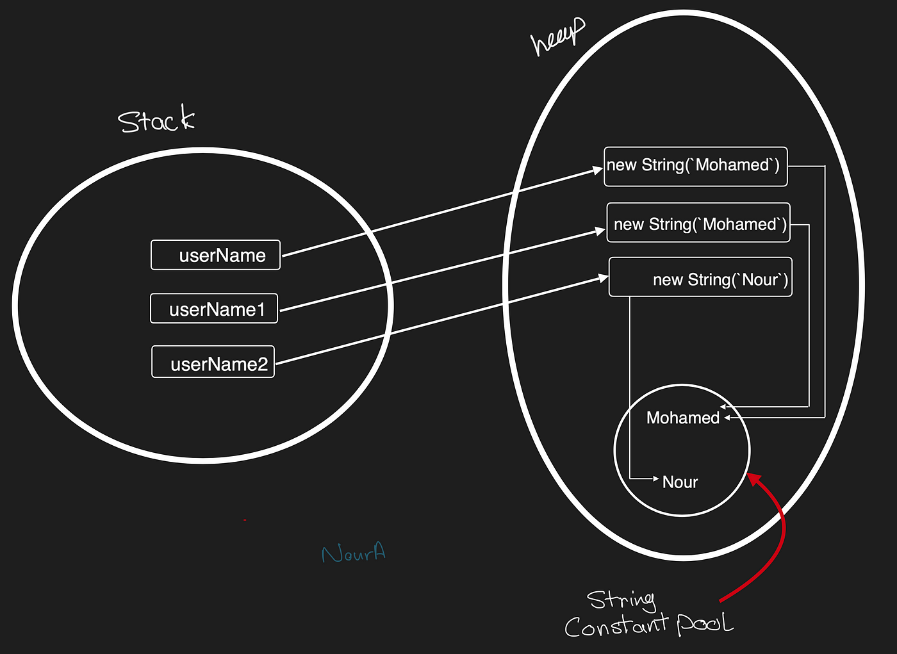

# Strings in Java

`String` deserves its own page because it behaves unlike anything else in Java: it's an object that *looks* like a primitive, it's immutable, and the JVM keeps a special memory pool just for it.

---

## 1. What is a String in Java?

A **String** in Java is a sequence of characters. It's a **class** in the `java.lang` package and is **immutable** by design.

```java
String name = "Tejas";

// Since String is a class, it can also be declared like this:
String homeName = new String("Happy");
```

This creates a `String` object with the value `"Tejas"`.

Notice that `String` is the only class in Java with **literal syntax** (`"..."`) and an **overloaded operator** (`+`). That's special-casing baked into the language, not something you can do for your own classes.

---

## 2. Immutability of Strings

**Immutable** means **once a `String` object is created, it cannot be changed**.

### ✅ Why is String immutable?

- Security (used in network connections, file paths)
- Thread-safe
- HashCode caching
- Efficient memory management using String Pool

### 🧪 Example:

```java
String str = "Hello";
str.concat(" World");
System.out.println(str);   // Hello
```

### `.concat()` does not modify the original string; it returns a new one. To store the change:

```java
str = str.concat(" World");
System.out.println(str);   // Hello World
```

**Every single `String` method returns a new `String`.** `toUpperCase()`, `trim()`, `replace()`, `substring()` — none of them touch the original.

```java
String s = "  hello  ";
s.trim();
System.out.println("[" + s + "]");        // [  hello  ]  ← unchanged

s = s.trim();
System.out.println("[" + s + "]");        // [hello]      ✅
```

---

## 3. String Constant Pool (SCP)

Java stores string literals in a special memory area called **String Constant Pool** to **optimize memory**.

```java
String a = "Java";
String b = "Java";
System.out.println(a == b);   // true
```

### 🔸 Explanation:

Both `a` and `b` point to the same object in SCP.

But if we use `new`:

```java
String x = new String("Java");
String y = new String("Java");
System.out.println(x == y);   // false
```

> `new String("Java")` creates a new object in heap, even if "Java" already exists in SCP.



Read that diagram carefully — it's the whole model in one picture:

- The **stack** holds the variables (`userName`, `userName1`, `userName2`) — each is just a reference.
- The **heap** holds the actual `String` objects created with `new`.
- Inside the heap sits the **String Constant Pool**, a small dedicated region holding one copy of each distinct *literal*.
- Two `new String("Mohamed")` calls produce **two separate heap objects**, both of which internally point at the single pooled `"Mohamed"` value.

So the mental rule is:

| Written as | Where the object lives | Reused? |
| :-- | :-- | :-- |
| `String s = "Java";` | String Constant Pool | ✅ yes — same literal, same object |
| `String s = new String("Java");` | Heap (outside the pool) | ❌ no — a fresh object every time |

Which is why:

```java
String literal1 = "Java";
String literal2 = "Java";
String object1  = new String("Java");
String object2  = new String("Java");

System.out.println(literal1 == literal2);        // true   same pooled object
System.out.println(object1  == object2);         // false  two heap objects
System.out.println(literal1 == object1);         // false  pool vs heap
System.out.println(literal1.equals(object1));    // true   same CONTENT
```

> **Practical advice:** never write `new String("...")`. It only wastes memory. Use the literal.

### Compile-time constant folding

```java
String a = "Java";
String b = "Ja" + "va";          // folded by the compiler into "Java"
System.out.println(a == b);      // true

String part = "Ja";
String c = part + "va";          // computed at RUNTIME → new heap object
System.out.println(a == c);      // false
System.out.println(a.equals(c)); // true
```

---

## 4. Mutable Strings: StringBuilder & StringBuffer

### ✅ Why use mutable strings?

To avoid the creation of multiple objects when modifying strings repeatedly (e.g., in loops).

---

### 🔸 4.1. `StringBuilder` (Not Thread-Safe, Faster)

```java
StringBuilder sb = new StringBuilder("Hello");
sb.append(" World");
System.out.println(sb); // Hello World
```

---

### 🔸 4.2. `StringBuffer` (Thread-Safe, Slower)

```java
StringBuffer sb = new StringBuffer("Hello");
sb.append(" Java");
System.out.println(sb); // Hello Java
```

### 4.3 Why this actually matters

```java
// 😱 O(n²) — creates 10,000 throwaway String objects
String result = "";
for (int i = 0; i < 10_000; i++) {
    result += i;          // each += builds a whole new String
}

// ✅ O(n) — one buffer, resized occasionally
StringBuilder sb = new StringBuilder();
for (int i = 0; i < 10_000; i++) {
    sb.append(i);
}
String result = sb.toString();
```

On a typical machine the first version takes hundreds of milliseconds; the second takes under a millisecond. This is one of the most common real performance bugs in Java code.

### 4.4 Useful `StringBuilder` methods

```java
StringBuilder sb = new StringBuilder("Hello");

sb.append(" World");            // Hello World
sb.insert(0, ">> ");            // >> Hello World
sb.replace(0, 2, "**");         // ** Hello World
sb.delete(0, 3);                // Hello World
sb.reverse();                   // dlroW olleH
sb.setCharAt(0, 'D');           // DlroW olleH
System.out.println(sb.length());
System.out.println(sb.toString());
```

Note that `StringBuilder` methods return `this`, so they chain:

```java
String s = new StringBuilder().append("a").append(1).append(true).toString();  // "a1true"
```

---

## 5. String Comparison

### 🔸 5.1. `==` (Reference comparison)

```java
String a = "Test";
String b = "Test";
System.out.println(a == b); // true (same SCP object)
```

```java
String x = new String("Test");
System.out.println(a == x); // false (different memory)
```

### 🔸 5.2. `.equals()` (Content comparison)

```java
System.out.println(a.equals(x)); // true
```

### 5.3 The full comparison toolkit

```java
String a = "Hello";
String b = "hello";

a.equals(b);                  // false — case-sensitive content comparison
a.equalsIgnoreCase(b);        // true
a.compareTo(b);               // negative — lexicographic ordering ('H' < 'h')
a.contentEquals(new StringBuilder("Hello"));  // true

// Null-safe comparison — put the literal first, or use Objects.equals
String maybeNull = null;
"Hello".equals(maybeNull);            // false, no exception ✅
maybeNull.equals("Hello");            // 💥 NullPointerException
java.util.Objects.equals(maybeNull, "Hello");  // false ✅
```

`compareTo` returns a negative number, zero, or a positive number — the same contract used by [`Comparable`](./28-comparable-and-comparator.md).

---

## 6. Common String Methods

| Method | Description | Example |
| --- | --- | --- |
| `length()` | Returns string length | `"Java".length()` → `4` |
| `charAt(index)` | Character at given index | `"Java".charAt(2)` → `'v'` |
| `substring()` | Substring from index or range | `"Java".substring(1,3)` → `"av"` |
| `toLowerCase()` | Converts to lowercase | `"JAVA".toLowerCase()` → `"java"` |
| `toUpperCase()` | Converts to uppercase | `"java".toUpperCase()` → `"JAVA"` |
| `trim()` | Removes whitespace | `" Java ".trim()` → `"Java"` |
| `replace(a, b)` | Replaces character or substring | `"ball".replace('l', 't')` → `"batt"` |
| `split()` | Splits into array by delimiter | `"a,b,c".split(",")` → `["a", "b", "c"]` |
| `equalsIgnoreCase()` | Ignores case during comparison | `"Hello".equalsIgnoreCase("hello")` → `true` |

### More you'll reach for constantly

| Method | Description | Example |
| :-- | :-- | :-- |
| `isEmpty()` | Length is 0 | `"".isEmpty()` → `true` |
| `isBlank()` (Java 11) | Empty or only whitespace | `"  ".isBlank()` → `true` |
| `strip()` (Java 11) | Unicode-aware `trim()` | `" a ".strip()` → `"a"` |
| `contains(cs)` | Substring present? | `"Java".contains("av")` → `true` |
| `indexOf(s)` | First index, or `-1` | `"Java".indexOf("a")` → `1` |
| `lastIndexOf(s)` | Last index, or `-1` | `"Java".lastIndexOf("a")` → `3` |
| `startsWith` / `endsWith` | Prefix / suffix test | `"Java".endsWith("va")` → `true` |
| `repeat(n)` (Java 11) | Repeat the string | `"ab".repeat(3)` → `"ababab"` |
| `chars()` | `IntStream` of code points | `"abc".chars().count()` → `3` |
| `toCharArray()` | Convert to `char[]` | `"abc".toCharArray()` |
| `String.join(sep, …)` | Join pieces | `String.join("-", "a","b")` → `"a-b"` |
| `String.format(fmt, …)` | Printf-style formatting | see below |
| `String.valueOf(x)` | Anything → String | `String.valueOf(42)` → `"42"` |

```java
// Formatting
String s = String.format("%s is %d years old and scored %.2f", "Tejas", 25, 91.456);
// "Tejas is 25 years old and scored 91.46"

System.out.printf("%-10s|%5d%n", "left", 42);   // "left      |   42"
```

Common format specifiers: `%s` string, `%d` integer, `%f` float, `%.2f` 2 decimal places, `%n` newline, `%-10s` left-aligned in width 10.

### `substring` boundaries

```java
String s = "Programming";
s.substring(3);      // "gramming"   — from index 3 to the end
s.substring(3, 7);   // "gram"       — [3, 7): start inclusive, end EXCLUSIVE
```

The end index being exclusive means `s.substring(a, b).length() == b - a`. That's a handy sanity check.

---

## 7. String Interning

Using `.intern()` you can manually move a string to the SCP:

```java
String a = new String("Java");
String b = a.intern(); // Now b refers to SCP
String c = "Java";
System.out.println(b == c); // true
```

`intern()` says: "look up my content in the pool; if it's there return the pooled object, otherwise add me and return me." You rarely need it in application code, but it explains exactly what the pool *is*.

---

## 8. String Memory Model

| Type | Memory Location | Mutable | Thread-Safe | Performance |
| --- | --- | --- | --- | --- |
| `String` | SCP or Heap | ❌ No | ✅ Yes | ✅ Fast (SCP) |
| `StringBuilder` | Heap | ✅ Yes | ❌ No | ✅ Faster |
| `StringBuffer` | Heap | ✅ Yes | ✅ Yes | ❌ Slower |

**Which to use, decided in one line:** `String` unless you're building in a loop; `StringBuilder` when you are; `StringBuffer` only in the rare case a single builder is shared across threads (usually a design smell — give each thread its own builder instead).

---

## 9. Best Practices

- Use `String` for fixed/constant text.
- Use `StringBuilder` for performance in loops.
- Avoid `==` for string comparison, use `.equals()`.
- Prefer `.intern()` when manually managing SCP usage.
- Put the literal on the left of `.equals()` to avoid `NullPointerException`.
- Never store passwords in a `String` — use `char[]`, which you can zero out. Strings sit in memory (possibly the pool) until GC decides otherwise.

---

## 🧠 Logical Insight: Why Not Make String Mutable?

If `String` were mutable:

```java
String password = "admin123";
```

Imagine another thread modifies it:

```java
password.setValue("hacked123");  // 🙅‍♂️ Unsafe!
```

This is why immutability is a key design choice — especially for secure, cacheable values like class names, URLs, DB connections, etc.

The deeper consequences of immutability are worth spelling out:

1. **Safe sharing / caching.** Since nobody can change it, the pool can hand the same object to every caller. That's only sound because it's immutable.
2. **Safe as a `HashMap` key.** A key's `hashCode()` must never change while it's in the map. Immutability guarantees that — and `String` even caches its hash code after first computing it.
3. **Thread safety for free.** No mutation means no race conditions, no synchronization needed.
4. **Security.** A file path or SQL string validated by a security check can't be swapped out between the check and the use.

---

## 10. Text Blocks (Java 15+)

Multi-line strings without escape soup:

```java
String json = """
        {
          "name": "Tejas",
          "role": "developer"
        }
        """;

String sql = """
        SELECT id, name
        FROM users
        WHERE active = true
        """;
```

The closing `"""` sets the indentation baseline — everything is stripped back to it, so the block lines up nicely in your source without leading spaces in the value.

---

## 11. Worked example

```java
public class StringDemo {
    public static void main(String[] args) {
        String sentence = "  The Quick Brown Fox Jumps  ";

        System.out.println("[" + sentence.strip() + "]");
        System.out.println(sentence.strip().toLowerCase());
        System.out.println(sentence.strip().split("\\s+").length);   // 5 words

        // Reverse the words
        String[] words = sentence.strip().split("\\s+");
        StringBuilder sb = new StringBuilder();
        for (int i = words.length - 1; i >= 0; i--) {
            sb.append(words[i]);
            if (i > 0) sb.append(" ");
        }
        System.out.println(sb);       // Jumps Fox Brown Quick The

        // Palindrome check
        String word = "Racecar";
        String clean = word.toLowerCase();
        boolean isPalindrome = clean.equals(new StringBuilder(clean).reverse().toString());
        System.out.println(isPalindrome);   // true

        // Counting characters
        String text = "hello";
        java.util.Map<Character, Integer> counts = new java.util.HashMap<>();
        for (char c : text.toCharArray()) {
            counts.merge(c, 1, Integer::sum);
        }
        System.out.println(counts);   // {r=..., e=1, h=1, l=2, o=1}
    }
}
```

---

## 🧠 Rapid-fire recall

1. Why does `str.concat(" World")` on its own leave `str` unchanged?
2. What's the difference between `"Java"` and `new String("Java")` in memory?
3. Give three concrete benefits Java gets from `String` being immutable.
4. Why is `result += i` in a 10,000-iteration loop a performance bug?
5. When would you use `StringBuffer` over `StringBuilder`?
6. What does `"Programming".substring(3, 7)` return, and why is the length 4?
7. Why write `"yes".equals(input)` rather than `input.equals("yes")`?

<details>
<summary>Answers</summary>

1. Strings are immutable; every method returns a *new* String. You must reassign.
2. The literal is interned in the String Constant Pool and reused; `new String(...)` always allocates a fresh object on the heap outside the pool.
3. Safe sharing/pooling, safe use as a `HashMap` key (stable hash code), automatic thread safety, and security guarantees against time-of-check/time-of-use swaps.
4. Each `+=` allocates a whole new String and copies the old contents — O(n²) total work and 10,000 garbage objects.
5. Only when a single builder instance is genuinely shared across threads; `StringBuffer`'s synchronization costs otherwise.
6. `"gram"` — the end index is exclusive, so the length is `7 - 3 = 4`.
7. It's null-safe: if `input` is `null`, the literal-first form returns `false` instead of throwing `NullPointerException`.

</details>
