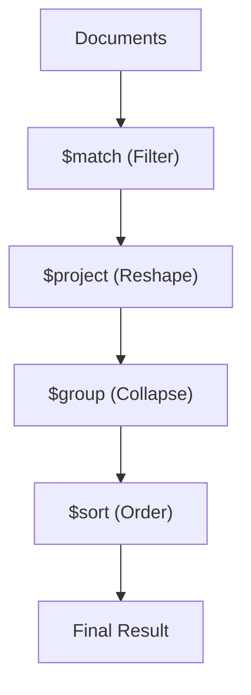

# MongoDB Aggregation Concepts & Architecture

> **Purpose**:
>
> - Revise MongoDB aggregation concepts quickly
> - Recall _why_ each stage exists
> - Avoid common logical bugs (not just syntax)
> - Understand the "Mental Model" of the pipeline

---

## 1. What is Aggregation?

Aggregation in MongoDB is a **pipeline-based data transformation system**.

- Documents flow **stage by stage**
- Each stage:
  - Takes input documents
  - Transforms / filters / reshapes them
  - Passes output to the next stage
- Stages are executed **in order**

### Mental Model



<!--  -->

> **Key Insight**: Aggregation is **streaming** — MongoDB does not "look ahead" or "remember intent". It processes what it sees in the current stage.

---

## 2. Core Aggregation Stages

### `$match` (Filter)

Filters documents to pass only those that match the specified condition(s) to the next pipeline stage.

```js
{
  $match: {
    status: "DELIVERED";
  }
}
```

- **Analogy**: Works like `WHERE` in SQL.
- **Performance**: Reduces data early. Always filter **as early as possible**.
- **Usage**: Can appear multiple times. Filter early for performance, filter later for aggregated results.

### `$project` (Reshape)

Passes along the documents with the requested fields to the next stage.

```js
{
  $project: {
    _id: 0,
    orderId: "$_id",
    amount: 1,
    month: { $month: "$createdAt" }
  }
}
```

- Used for renaming, computing new fields, or removing unwanted fields.

### `$sort` (Order)

Reorders the document stream by a specified sort key.

```js
{
  $sort: {
    createdAt: -1;
  }
}
```

- **Critical**: `$sort` defines which document is "first" for subsequent stages.
- **Dependency**: Extremely important before `$group` if using `$first`.

---

## 3. The `$group` Stage

### What `$group` does

- Collapses **many documents into fewer documents**.
- **Destroys original document shape**.
- Everything you want after `$group` must be **explicitly reconstructed**.

```js
{
  $group: {
    _id: "$userId",
    totalAmount: { $sum: "$amount" }
  }
}
```

### Key Accumulators

| Operator        | Purpose                                        |
| :-------------- | :--------------------------------------------- |
| `$sum`          | Totals / Counts                                |
| `$avg`          | Averages                                       |
| `$min` / `$max` | Extremes                                       |
| `$first`        | Representative value (based on incoming order) |
| `$push`         | Preserves values in an array                   |
| `$addToSet`     | Preserves unique values in an array            |

---

## 4. Common Patterns & Traps

### The `$first` Trap

> **Concept**: `$first` simply takes the value from the **first document that enters the group**. It has no business meaning by itself (it doesn't mean "earliest date" automatically).

**Correct Pattern ("Latest X"):**

1. **Sort** first (Define order)
2. **Group** next (Pick first)

```js
[
  { $sort: { createdAt: -1 } }, // 1. Order by date desc
  {
    $group: {
      _id: "$userId",
      latestDate: { $first: "$createdAt" }, // 2. Pick the top one
    },
  },
];
```

### The `$unwind` Placeholder Trap

When using `$unwind` with `preserveNullAndEmptyArrays: true`, a user with **no orders** still produces **ONE document** where the `orders` field is `null`.

**The Trap**:
If you just count rows (`$sum: 1`), you will count this "null" row as 1 order.

**The Fix (Conditional Counting)**:

```js
totalOrders: {
  $sum: {
    $cond: [{ $ne: ["$orders", null] }, 1, 0]; // Only count if not null
  }
}
```

### `$$REMOVE` Variable

Tells MongoDB to "add nothing" in a `$push` or `$project` expression.

**Usage**: Cleanly pushing only existing items.

```js
orders: {
  $push: {
    $cond: [
      { $ne: ["$orders", null] },
      { orderId: "$orders._id" },
      "$$REMOVE", // Don't push nulls!
    ];
  }
}
```

---

## 5. Advanced Concepts

### Root Preservation

Since `$group` destroys the document, how do you keep the whole original document?
**Technique**: Save `$$ROOT` and restore it.

```js
$group: {
  _id: "$userId",
  doc: { $first: "$$ROOT" } // Save entire object
},
{
  $replaceRoot: { newRoot: "$doc" } // Restore it
}
```

### Pipeline `$lookup` vs Simple `$lookup`

**Simple**: Brute force left join.
**Pipeline**: "Correlated Subquery". Allows specific filtering on the joined collection _before_ joining.

**Why Pipeline?**

- Production-grade joins.
- Filter early (performance).
- Avoid massive memory use from joining unnecessary data.

---

## Final Mental Checklist

1. `$group` destroys shape — you must rebuild what you need.
2. `$first` depends on pipeline order — always `$sort` before.
3. `$match` before `$group` filters **source documents**.
4. `$match` after `$group` filters **results**.
5. Use `$$REMOVE` to avoid "null" pollution in arrays.
6. Pipeline `$lookup` is safer and faster for complex conditions.
