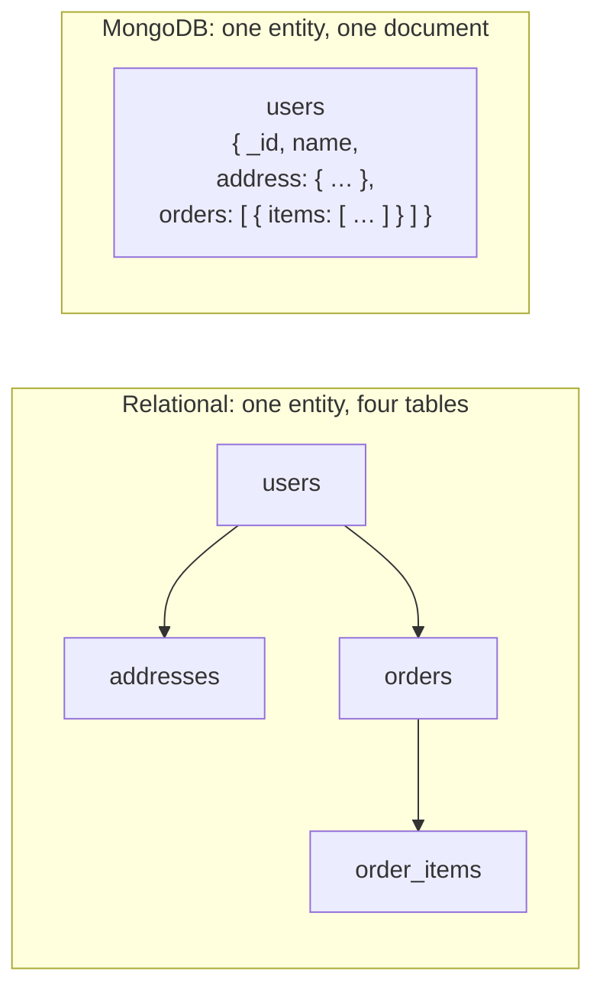
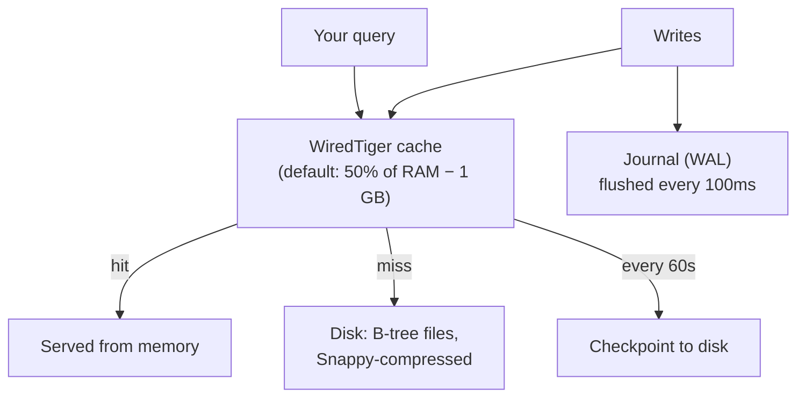

# The Document Model & BSON

> **What you will be able to do after this page**
>
> - Explain *precisely* what a document is, how MongoDB stores it on disk, and why that matters for performance.
> - Read a BSON type table and know why `1`, `1.0`, and `NumberDecimal("1")` are three different things.
> - Answer "why did MongoDB choose documents over rows?" without hand-waving.
> - Avoid the three bugs every MERN developer hits in year one: implicit type mismatch, `_id` string-vs-ObjectId, and the 16 MB ceiling.

---

## 1. The unit of storage is a document, not a row

A relational database stores a **row**: a flat, fixed-width tuple whose shape is fixed by the table's schema. Anything nested has to live in another table and be re-assembled with a `JOIN` at read time.

MongoDB stores a **document**: a self-describing, ordered set of field/value pairs where a value may itself be a document or an array of documents.



The consequence is the single most important sentence in MongoDB:

:::tip[The core design principle]
**Data that is accessed together should be stored together.**

A relational schema is designed around *the shape of the data*. A MongoDB schema is designed around *the shape of your queries*. Every modeling decision in [Data Modeling & Schema Design](./03-data-modeling.md) follows from this one line.
:::

### Vocabulary mapping

| Relational | MongoDB | Note |
| :--- | :--- | :--- |
| Database | Database | Same idea |
| Table | Collection | Collections do **not** enforce a shape by default |
| Row | Document | Self-describing; each doc carries its own field names |
| Column | Field | Two docs in one collection may have different fields |
| Index | Index | Same B-tree idea, same rules |
| `JOIN` | `$lookup` / embedding | Embedding is the *preferred* answer; `$lookup` is the fallback |
| `GROUP BY` | `$group` | Inside the aggregation pipeline |
| Foreign key constraint | *(none)* | MongoDB does not enforce referential integrity — your app does |
| Transaction | Multi-document transaction | Supported since 4.0, but see [Transactions](./13-transactions-and-concerns.md) for why you usually don't need it |

:::warning[Interview trap]
"MongoDB is schemaless" is **wrong**, and saying it will cost you points. MongoDB has a **flexible schema**: every document has a schema, it just lives in your application rather than in a `CREATE TABLE`. MongoDB can also enforce one server-side with **JSON Schema validation** (§6). The correct phrase is *"dynamic schema"* or *"schema-on-read"*.
:::

---

## 2. What BSON actually is

You write JSON. MongoDB stores **BSON** — Binary JSON. BSON exists because JSON is missing three things a database needs: **types**, **length prefixes**, and **byte-order determinism**.

### The wire format, concretely

Take the tiny document `{ "a": 1 }` where `1` is a 32-bit int. BSON encodes it as:

```text
\x0e\x00\x00\x00   ← total document size in bytes (14), int32 little-endian
\x10               ← type byte: 0x10 = int32
a\x00              ← field name, C-string (NUL-terminated)
\x01\x00\x00\x00   ← the value: int32 1
\x00               ← terminating null byte for the document
```

Three properties fall out of this layout, and every one of them is an interview answer:

1. **Length-prefixed → traversable without parsing.** The driver can *skip* a 4 MB sub-array by reading its 4-byte length and jumping the pointer. JSON would have to scan character-by-character counting braces.
2. **Typed.** `1` (int32), `1.0` (double), and `NumberDecimal("1")` are three distinct BSON types with three distinct byte layouts. JSON has one `number`.
3. **Field order is preserved.** BSON is an *ordered* list of pairs. This matters more than people expect — see the exact-match trap in §5.

### BSON type table

| Type | Alias | Number | When you actually use it |
| :--- | :--- | :--- | :--- |
| Double | `"double"` | 1 | Default for any JS number that isn't explicitly an int |
| String | `"string"` | 2 | UTF-8 always |
| Object | `"object"` | 3 | Embedded document |
| Array | `"array"` | 4 | Stored as a document with `"0"`, `"1"`, … keys |
| Binary | `"binData"` | 5 | Files, UUIDs, hashes |
| ObjectId | `"objectId"` | 7 | Default `_id` |
| Boolean | `"bool"` | 8 | |
| Date | `"date"` | 9 | int64 ms since Unix epoch, **UTC, no timezone stored** |
| Null | `"null"` | 10 | Field present, value null — *different from missing* |
| Regex | `"regex"` | 11 | |
| 32-bit int | `"int"` | 16 | `NumberInt` |
| Timestamp | `"timestamp"` | 17 | **Internal / oplog use.** Not for your app data |
| 64-bit int | `"long"` | 18 | `NumberLong` — counters, IDs beyond 2³¹ |
| Decimal128 | `"decimal"` | 19 | **Money.** 34 decimal digits, no binary rounding |
| Min/Max key | `"minKey"`/`"maxKey"` | -1 / 127 | Internal sort sentinels |

:::danger[The money bug]
`0.1 + 0.2` in IEEE-754 double is `0.30000000000000004`. If you store prices as doubles and `$sum` a million of them, your total will drift. Store currency as **`Decimal128`** or as an **integer count of the smallest unit** (paise/cents). Both are defensible in an interview; picking `double` is not.

```js
// ❌ drifts
{ price: 19.99 }
// ✅ exact decimal arithmetic
{ price: NumberDecimal("19.99") }
// ✅ integer paise — fastest, needs a display-layer divide
{ priceInPaise: NumberLong(1999) }
```
:::

### The BSON comparison order

When MongoDB has to compare values of *different* types (sorting a field that holds mixed types, or range queries), it uses this fixed total order — lowest to highest:

```text
MinKey < Null < Numbers (int/long/double/decimal, compared numerically)
       < String < Object < Array < BinData < ObjectId < Boolean
       < Date < Timestamp < Regex < MaxKey
```

Two facts worth memorising:

- **All numeric types compare numerically across types.** `NumberInt(5) == NumberLong(5) == 5.0` for query matching and sorting. This is why `{ age: 30 }` finds a document that stored `30.0`.
- **`Null` sorts below everything except MinKey**, so an ascending sort puts missing/null values first.

---

## 3. `_id` and ObjectId

Every document has an `_id`. It is unique within the collection, immutable, and **automatically indexed** — you cannot drop that index.

If you don't supply one, the driver (not the server) generates an **ObjectId**: 12 bytes.

```text
┌────────────────┬──────────────────────┬───────────────┐
│  4 bytes       │  5 bytes             │  3 bytes      │
│  Unix seconds  │  random per-process  │  counter      │
└────────────────┴──────────────────────┴───────────────┘
     ↑ timestamp       ↑ machine+pid          ↑ increments
```

Consequences you should be able to state:

- **ObjectIds are roughly time-ordered.** Sorting by `_id` ≈ sorting by insertion time, to the second. You get a free "created at" for nothing: `ObjectId("...").getTimestamp()`.
- **They are generated client-side**, so inserting doesn't need a server round-trip to allocate an ID, and they're collision-safe across many app servers. This is why MongoDB has no `AUTO_INCREMENT` — a monotonic global counter cannot scale across shards.
- **They are monotonically increasing**, which makes them a *bad* shard key (all new writes hit one shard — see [Sharding](./12-sharding.md)) but a *good* clustered-ish insert pattern on a single node.

### The `_id` bug that hits every MERN developer

An `ObjectId` is **not** a string. The 24-character hex you see in Compass is a *rendering* of 12 bytes.

```js
// req.params.id is the string "652f1c1a9b3e4a0012ab34cd"
await db.collection("users").findOne({ _id: req.params.id });   // ❌ always null
await db.collection("users").findOne({ _id: new ObjectId(req.params.id) }); // ✅
```

There is no implicit cast. MongoDB compares an `objectId`-typed stored value against a `string`-typed query value, the BSON types differ, and it returns nothing — silently, with no error. Mongoose hides this by casting via the schema, which is exactly why developers who only ever used Mongoose get caught the first time they touch the native driver.

---

## 4. Missing vs `null` vs `undefined`

Three distinct states, three distinct query behaviours. This is asked constantly.

| Document | `{ a: null }` matches? | `{ a: { $exists: true } }` matches? | `{ a: { $type: "null" } }` matches? |
| :--- | :--- | :--- | :--- |
| `{ _id: 1, a: 5 }` | no | yes | no |
| `{ _id: 2, a: null }` | **yes** | **yes** | **yes** |
| `{ _id: 3 }` *(field absent)* | **yes** | no | no |

The rule: **`{ a: null }` matches both "explicitly null" and "field missing."** That is almost never what you meant.

```js
// "users who have no phone number recorded at all"
{ phone: null }                                  // null OR missing — usually right
// "users where we explicitly recorded 'no phone'"
{ phone: { $type: "null" } }                     // only explicit null
// "users where the field was never set"
{ phone: { $exists: false } }                    // only missing
```

Inside the aggregation pipeline, referencing a missing field yields the **`$$REMOVE`-like "missing" value**, which most operators coerce to `null`. That is why `$ifNull` is the workhorse of defensive pipelines:

```js
{ $project: { phone: { $ifNull: ["$phone", "N/A"] } } }
```

---

## 5. Ordering, dotted paths, and the exact-match trap

### Dot notation reaches into nested structures

```js
{ _id: 1, address: { city: "Pune", pin: "411001" }, tags: ["a", "b"] }
```

| Query | Matches? | Why |
| :--- | :--- | :--- |
| `{ "address.city": "Pune" }` | ✅ | Dotted path — reaches one field |
| `{ address: { city: "Pune" } }` | ❌ | **Exact document match**, field-for-field, *in order* |
| `{ address: { city: "Pune", pin: "411001" } }` | ✅ | Exact match, all fields, correct order |
| `{ address: { pin: "411001", city: "Pune" } }` | ❌ | Same fields, **wrong order** — BSON is ordered |
| `{ tags: "a" }` | ✅ | Array match is "contains" — see below |
| `{ tags: ["a", "b"] }` | ✅ | Exact array match, order-sensitive |
| `{ tags: ["b", "a"] }` | ❌ | Wrong order |

:::warning
Passing a whole sub-document as a query value means **exact equality including key order**. Nine times out of ten you wanted dot notation. This is the single most common silent "why does my query return nothing" in code review.
:::

### Arrays match "any element"

```js
{ scores: [70, 85, 92] }
```

- `{ scores: 85 }` → matches. A scalar compared against an array means *"any element equals"*.
- `{ scores: { $gt: 80, $lt: 90 } }` → **matches**, and this surprises people: it means "some element > 80 AND some element < 90" — 92 satisfies the first, 70 the second. No single element satisfies both.
- `{ scores: { $elemMatch: { $gt: 80, $lt: 90 } } }` → matches only if **one** element satisfies both. `85` does. This is the operator you actually wanted.

That distinction is worth memorising verbatim; it is a favourite interview question and a real production bug class.

---

## 6. Limits you must know

| Limit | Value | What it forces you to do |
| :--- | :--- | :--- |
| Max BSON document size | **16 MB** | Never model unbounded arrays — bucket them or reference out |
| Max nesting depth | 100 levels | Rarely hit; a sign of bad modeling if you do |
| Index key size | 1024 bytes | Can't index a long free-text field directly |
| Indexes per collection | 64 | Every index costs write throughput |
| Fields in a compound index | 32 | |
| `$group` / `$sort` memory | 100 MB per stage | Use an index for `$sort`, or `allowDiskUse: true` |
| Collection namespace length | 255 bytes | |

:::danger[The 16 MB ceiling is a modeling constraint, not a trivia fact]
The classic failure: `{ _id: postId, comments: [ … ] }`. It works beautifully for 50 comments and dies on a viral post. Worse, long before it hits 16 MB, every single comment insert rewrites the whole growing document and every read pulls all of it over the wire.

The rule: **an array is safe to embed only if it is bounded and you know the bound.** Unbounded → reference out, or use the [bucket pattern](./03-data-modeling.md#the-bucket-pattern). Files over 16 MB → GridFS, or (better in 2024+) object storage with the URL in the document.
:::

---

## 7. Schema validation — flexible ≠ unguarded

You can enforce a schema server-side. Do this on any collection that matters.

```js
db.createCollection("orders", {
  validator: {
    $jsonSchema: {
      bsonType: "object",
      required: ["userId", "amount", "status", "createdAt"],
      properties: {
        userId:    { bsonType: "objectId" },
        amount:    { bsonType: "decimal", minimum: 0 },
        status:    { enum: ["PENDING", "PAID", "SHIPPED", "DELIVERED", "CANCELLED"] },
        createdAt: { bsonType: "date" },
        items: {
          bsonType: "array",
          minItems: 1,
          items: {
            bsonType: "object",
            required: ["sku", "qty"],
            properties: { sku: { bsonType: "string" }, qty: { bsonType: "int", minimum: 1 } },
          },
        },
      },
    },
  },
  validationLevel: "strict",   // "strict" = all inserts+updates | "moderate" = only docs that already pass
  validationAction: "error",   // "error" = reject | "warn" = log and accept
});
```

Two knobs, and the combination is the interesting part:

- `validationLevel: "moderate"` + `validationAction: "warn"` is how you **retrofit a schema onto a live collection** — existing bad documents keep working, new writes get logged, and you migrate at your own pace.
- `"strict"` + `"error"` is the end state once the data is clean.

---

## 8. Where the bytes actually live: WiredTiger

MongoDB's default storage engine since 3.2.



The five facts that matter in practice:

1. **Document-level concurrency control.** Two writers touching two different documents in the same collection do not block each other. (Pre-3.0 MMAPv1 had collection-level locks — this is *the* reason the engine changed.)
2. **MVCC, not read locks.** Readers see a consistent snapshot; they never block writers. This is also the machinery that makes multi-document transactions possible.
3. **Compression on by default.** Snappy for collections (fast, ~2–4×), prefix compression for indexes. Zstd is available and compresses harder for archival data.
4. **The cache is the performance story.** If your **working set** (hot documents + hot index pages) fits in the WiredTiger cache, you're doing memory-speed lookups. When it doesn't, every query becomes a disk read and latency falls off a cliff. "Add RAM" is a legitimate first answer to "the database got slow."
5. **Durability = journal.** A write is acknowledged from memory; the journal (write-ahead log) is flushed every ~100 ms, and a full checkpoint happens every 60 s. `writeConcern: { j: true }` forces the journal flush before acknowledging — see [Write Concern](./13-transactions-and-concerns.md#write-concern).

---

## 9. Rapid-fire recall

<details>
<summary>**Why is BSON used instead of JSON?**</summary>

Three reasons: **types** (JSON has one number type; a database needs int32/int64/double/decimal/date/binary/ObjectId), **length prefixes** (documents and sub-documents are size-prefixed so the engine can skip regions without parsing them, making field access fast), and **round-trip fidelity** (a date stays a date instead of becoming a string). The cost is that BSON is usually slightly *larger* than the equivalent JSON — it trades space for traversal speed and type safety.
</details>

<details>
<summary>**Is MongoDB schemaless?**</summary>

No. It has a **flexible/dynamic schema**. Every document has a structure; MongoDB just doesn't require all documents in a collection to share it, and doesn't require you to declare it up front. You can enforce structure server-side with `$jsonSchema` validators, and in practice production collections should. The benefit of flexibility is painless schema evolution (add a field, backfill lazily); the cost is that the application becomes responsible for consistency.
</details>

<details>
<summary>**Why is the document limit 16 MB?**</summary>

To stop a single document from consuming excessive RAM and network bandwidth on every read, and to force a modeling discipline: unbounded growth belongs in its own collection. It's a guardrail against the "embed everything" anti-pattern rather than a technical hard wall.
</details>

<details>
<summary>**What is an ObjectId made of, and why 12 bytes?**</summary>

4-byte Unix timestamp in seconds, 5 bytes of per-process randomness (machine + process identity), 3-byte incrementing counter. Twelve bytes buys global uniqueness without any coordination between application servers, and being timestamp-prefixed makes it roughly sortable by creation time. Generated by the driver, not the server — so inserts need no round-trip to allocate an ID.
</details>

<details>
<summary>**`{ a: null }` vs `{ a: { $exists: false } }` — difference?**</summary>

`{ a: null }` matches documents where `a` is explicitly null **and** documents where `a` is absent. `{ a: { $exists: false } }` matches only the absent case. To match only explicit nulls, use `{ a: { $type: "null" } }`. Getting this wrong is how "count users with no email" quietly returns the wrong number.
</details>

<details>
<summary>**Why does `{ scores: { $gt: 80, $lt: 90 } }` behave oddly on arrays?**</summary>

Because each condition is evaluated against the array independently: the document matches if *some* element is > 80 and *some* element is < 90 — not necessarily the same element. `[70, 92]` matches. To require one element to satisfy all conditions, use `$elemMatch`.
</details>

---

**Next:** [CRUD Deep Dive →](./02-crud-deep-dive.md) — how reads and writes actually execute, and every update operator worth knowing.
