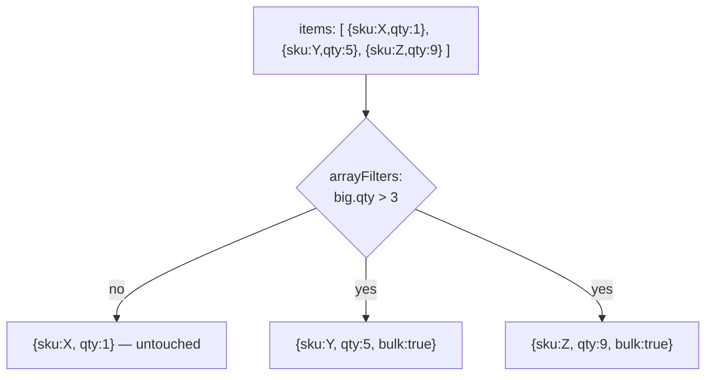

# CRUD Deep Dive

> **What you will be able to do after this page**
>
> - Choose the right write method (`updateOne` vs `findOneAndUpdate` vs `bulkWrite`) for a given requirement, and defend it.
> - Use every update operator that matters, including the array positional operators that most developers never learn.
> - Explain what a cursor is, why `find()` doesn't hit the database, and how batching works.
> - Write **atomic, race-free** updates instead of read-modify-write code.

---

## 1. The shape of a query

Every read is `filter → projection → cursor modifiers`.

```js
db.orders.find(
  { status: "PAID", amount: { $gte: 500 } },     // 1. filter  — which documents
  { _id: 0, orderId: 1, amount: 1 }              // 2. projection — which fields
)
.sort({ amount: -1 })                            // 3. cursor modifiers
.skip(20)
.limit(10);
```

The server applies these in a fixed order regardless of how you chain them:


Two things fall out of that diagram:

- **`sort` happens before `skip`/`limit`.** So `.limit(10)` does *not* mean "only sort 10 documents" — the server must order the whole matched set first, unless an index already provides that order.
- **Projection happens last**, on the server, before the bytes go on the wire. Projecting fewer fields saves network and deserialization cost but does *not* save the index/collection work.

### Projection forms

```js
{ name: 1, email: 1 }            // inclusion — _id comes along unless excluded
{ name: 1, email: 1, _id: 0 }    // inclusion, drop _id
{ password: 0, ssn: 0 }          // exclusion — everything else comes along
{ name: 1, password: 0 }         // ❌ ERROR: cannot mix (except for _id)
```

Array projection operators (in `find`, not aggregation):

| Operator | Meaning |
| :--- | :--- |
| `{ tags: { $slice: 3 } }` | First 3 elements |
| `{ tags: { $slice: -3 } }` | Last 3 elements |
| `{ tags: { $slice: [10, 5] } }` | Skip 10, take 5 |
| `{ "items.$": 1 }` | Only the **first array element that matched the filter** |
| `{ items: { $elemMatch: { qty: { $gt: 5 } } } }` | First element matching an independent condition |

---

## 2. Cursors — `find()` does not run your query

`db.c.find(...)` returns a **cursor object**. Nothing has been executed yet. The query runs when you first iterate it.

```js
const cursor = db.orders.find({ status: "PAID" });  // no network call yet
for await (const doc of cursor) { … }               // NOW it executes
```

How the batching works:

1. First `next()` sends the query; the server returns the **first batch** (101 documents *or* 16 MB, whichever comes first) plus a cursor ID.
2. Subsequent batches are fetched with `getMore` as you keep iterating (default batch: up to 16 MB).
3. The cursor is destroyed when exhausted, when you call `close()`, or after **10 minutes** of inactivity (`cursorTimeoutMillis`). `noCursorTimeout: true` disables that — and leaks server resources if you forget to close.

:::warning[The `toArray()` trap]
`await cursor.toArray()` drains every batch into application memory. On a 2-million-document result set that is an OOM crash, not a slow query. Stream instead:

```js
// ❌ loads everything
const all = await db.orders.find({}).toArray();

// ✅ constant memory
for await (const order of db.orders.find({})) { process(order); }
```
:::

`countDocuments()` vs `estimatedDocumentCount()`:

| Method | How it works | Accuracy | Cost |
| :--- | :--- | :--- | :--- |
| `estimatedDocumentCount()` | Reads collection metadata | Approximate; ignores filters entirely | O(1) |
| `countDocuments(filter)` | Runs a real `$group`-style count | Exact, transaction-safe | O(matched) |

Use `estimatedDocumentCount()` for a dashboard "total records" tile. Use `countDocuments()` when the number is used in logic. `count()` is deprecated — never mention it approvingly in an interview.

---

## 3. Writes

### Insert

```js
await db.users.insertOne({ name: "Asha", email: "a@x.com" });
await db.users.insertMany([{ … }, { … }], { ordered: false });
```

`ordered` is the flag people miss:

| `ordered` | Behaviour on error at document #3 of 10 |
| :--- | :--- |
| `true` (default) | Inserts 1–2, **stops**. Documents 4–10 never attempted. |
| `false` | Attempts all 10, reports the failures at the end, keeps the 9 that worked. Also allows the server to parallelise. |

For bulk ingestion where a few duplicate keys are expected and tolerable, `ordered: false` is both faster and more useful.

### Update — the anatomy

```js
db.collection.updateOne(
  <filter>,          // which document
  <update document>, // what to change — MUST use operators
  <options>          // upsert, arrayFilters, collation, hint
);
```

```js
// ❌ This REPLACES the whole document — name and email are gone.
db.users.updateOne({ _id: id }, { age: 31 });   // actually errors in modern drivers

// ✅ This modifies one field.
db.users.updateOne({ _id: id }, { $set: { age: 31 } });
```

### Field update operators

| Operator | Effect | Example |
| :--- | :--- | :--- |
| `$set` | Set/create a field | `{ $set: { status: "PAID" } }` |
| `$unset` | Remove a field | `{ $unset: { tempToken: "" } }` |
| `$inc` | Add (negative to subtract) | `{ $inc: { views: 1, stock: -1 } }` |
| `$mul` | Multiply | `{ $mul: { price: 1.18 } }` |
| `$min` / `$max` | Set only if new value is lower/higher | `{ $max: { highScore: 900 } }` |
| `$rename` | Rename a field | `{ $rename: { "fname": "firstName" } }` |
| `$currentDate` | Set to now | `{ $currentDate: { updatedAt: true } }` |
| `$setOnInsert` | Apply **only when an upsert inserts** | `{ $setOnInsert: { createdAt: new Date() } }` |

:::tip[`$inc` is the atomicity lesson]
```js
// ❌ Race condition. Two concurrent requests both read 10, both write 11. One purchase is lost.
const p = await db.products.findOne({ _id: id });
await db.products.updateOne({ _id: id }, { $set: { stock: p.stock - 1 } });

// ✅ Atomic. The server does the arithmetic under a document-level lock.
await db.products.updateOne({ _id: id }, { $inc: { stock: -1 } });

// ✅✅ Atomic AND correct — won't oversell past zero.
const r = await db.products.updateOne(
  { _id: id, stock: { $gte: 1 } },      // the guard lives in the FILTER
  { $inc: { stock: -1 } }
);
if (r.modifiedCount === 0) throw new Error("Out of stock");
```
**Put the precondition in the filter, not in an `if` in your Node code.** A single-document update is always atomic, so filter+update executes as one indivisible operation. This pattern removes the need for a transaction in a huge number of real cases — and saying that in an interview shows you understand *why* MongoDB got away without transactions for years.
:::

### Array update operators

Given `{ _id: 1, tags: ["a", "b"], items: [{ sku: "X", qty: 1 }, { sku: "Y", qty: 5 }] }`:

| Operator | Effect |
| :--- | :--- |
| `{ $push: { tags: "c" } }` | Append one |
| `{ $push: { tags: { $each: ["c","d"] } } }` | Append many |
| `{ $push: { top: { $each: [s], $sort: { score: -1 }, $slice: 10 } } }` | **Push, re-sort, keep top 10** — a leaderboard in one operation |
| `{ $addToSet: { tags: "a" } }` | Append only if not present (set semantics) |
| `{ $pull: { tags: "a" } }` | Remove all elements matching a condition |
| `{ $pullAll: { tags: ["a","b"] } }` | Remove these exact values |
| `{ $pop: { tags: 1 } }` / `{ $pop: { tags: -1 } }` | Remove last / first |

### Updating elements *inside* an array — the three positional operators

This is the part most developers never learn, and it separates 2-years-experience from 5.

**`$` — the first matching element.**

```js
// Set qty to 10 on the item whose sku is "X"
db.orders.updateOne(
  { _id: 1, "items.sku": "X" },          // the array condition MUST be in the filter
  { $set: { "items.$.qty": 10 } }        // $ = index of that match
);
```
The `$` placeholder is bound by the filter. No array condition in the filter → error. Only ever updates **one** element.

**`$[]` — all elements.**

```js
// 10% off every item
db.orders.updateOne({ _id: 1 }, { $mul: { "items.$[].price": 0.9 } });
```

**`$[<identifier>]` — all elements matching a condition (arrayFilters).** The most powerful one.

```js
// Flag every item with qty over 3, regardless of position
db.orders.updateOne(
  { _id: 1 },
  { $set: { "items.$[big].bulk": true } },
  { arrayFilters: [{ "big.qty": { $gt: 3 } }] }
);
```



Nested arrays work too: `"items.$[i].variants.$[v].stock"` with two `arrayFilters` entries.

### Aggregation-pipeline updates (MongoDB 4.2+)

An update can be an **array** — a mini aggregation pipeline — which lets the new value depend on the existing document.

```js
// Set a discountedPrice that depends on the document's own price and tier
db.products.updateMany({}, [
  {
    $set: {
      discountedPrice: {
        $switch: {
          branches: [
            { case: { $eq: ["$tier", "gold"] },   then: { $multiply: ["$price", 0.8] } },
            { case: { $eq: ["$tier", "silver"] }, then: { $multiply: ["$price", 0.9] } },
          ],
          default: "$price",
        },
      },
      updatedAt: "$$NOW",
    },
  },
]);
```

Only `$addFields`/`$set`, `$project`/`$unset`, `$replaceRoot`/`$replaceWith` are allowed here. This is how you do a data migration without pulling a million documents into Node.

### Upsert

```js
db.counters.updateOne(
  { _id: "invoice" },
  { $inc: { seq: 1 }, $setOnInsert: { createdAt: new Date() } },
  { upsert: true }
);
```

Semantics: if the filter matches, update it; if not, **create a document from the filter's equality fields plus the update operators**. `$setOnInsert` fields apply only in the insert case — that's how you get a `createdAt` that never changes on subsequent updates.

:::warning
Concurrent upserts on a filter with **no unique index** can both insert, producing duplicates. Upsert is only safe as an "insert-if-missing" primitive when a unique index backs the filter.
:::

### `findOneAndUpdate` — when you need the document back

```js
const doc = await db.tasks.findOneAndUpdate(
  { status: "QUEUED" },
  { $set: { status: "PROCESSING", workerId: me } },
  { sort: { priority: -1, createdAt: 1 }, returnDocument: "after" }
);
```

This is an **atomic claim**: find, modify, and return in one server operation, so two workers can never grab the same task. It's the canonical way to build a job queue on MongoDB, and a great answer to "how would you implement a work queue without Redis?"

`returnDocument: "before" | "after"` (older drivers: `returnNewDocument: true/false`).

### Delete

```js
db.logs.deleteOne({ _id: id });
db.logs.deleteMany({ createdAt: { $lt: cutoff } });
db.logs.drop();  // drops the whole collection + its indexes — instant, not a per-doc delete
```

`deleteMany({})` walks and removes every document individually and is slow on large collections. If you want an empty collection, `drop()` and recreate the indexes.

### `bulkWrite` — many different operations, one round trip

```js
await db.inventory.bulkWrite([
  { insertOne:  { document: { sku: "A", qty: 5 } } },
  { updateOne:  { filter: { sku: "B" }, update: { $inc: { qty: -1 } } } },
  { updateMany: { filter: { qty: 0 }, update: { $set: { status: "OUT" } } } },
  { deleteOne:  { filter: { sku: "C" } } },
  { replaceOne: { filter: { sku: "D" }, replacement: { sku: "D", qty: 9 }, upsert: true } },
], { ordered: false });
```

One network round trip instead of five. For batch jobs this is often a 10× throughput difference — and `ordered: false` lets the server parallelise. Reach for `bulkWrite` any time you find yourself writing `for (const x of items) await db.c.updateOne(...)`.

---

## 4. Method selection cheat sheet

| You need to… | Use | Why not the other one |
| :--- | :--- | :--- |
| Change a field | `updateOne` + `$set` | Passing a bare object replaces the doc |
| Change a field **and read the result** | `findOneAndUpdate` | `updateOne` returns counts, not the document |
| Change a counter safely | `$inc` (never read-modify-write) | Read-modify-write races |
| Insert-or-update | `updateOne` + `upsert: true` | Check-then-insert races |
| Apply many different writes | `bulkWrite` | A loop of awaits = N round trips |
| Replace a document wholesale | `replaceOne` | `$set` would leave stale fields behind |
| Compute a new value from the old one | Pipeline update `[{ $set: … }]` | Otherwise you must read into the app first |
| Delete everything | `drop()` | `deleteMany({})` is O(n) |

### Interpreting the write result

```js
{ acknowledged: true, matchedCount: 1, modifiedCount: 0, upsertedId: null }
```

`matchedCount: 1, modifiedCount: 0` means **the document was found but the update was a no-op** — you set a field to the value it already had. Idempotent retries look like this, and it is not an error. Checking `modifiedCount > 0` as a success test is a bug in retry-heavy code; check `matchedCount` instead.

---

## 5. Rapid-fire recall

<details>
<summary>**Is a MongoDB write atomic?**</summary>

**A single-document operation is always atomic**, no matter how many fields or nested arrays it touches — including `updateOne` with several operators and `findOneAndUpdate`. Atomicity across *multiple* documents requires a multi-document transaction. The practical implication: model so that everything that must change together lives in one document, and you rarely need transactions at all.
</details>

<details>
<summary>**`updateOne` vs `findOneAndUpdate`?**</summary>

`updateOne` returns counts. `findOneAndUpdate` atomically returns the document (before or after, your choice) and accepts a `sort` to pick *which* document to modify. Use `findOneAndUpdate` when the returned document is part of the logic — atomic claim/queue patterns being the classic case.
</details>

<details>
<summary>**How do you update a specific object inside an array?**</summary>

Three options. `$` updates the first element matched by the query filter (`{"items.sku": "X"}` in the filter, `"items.$.qty"` in the update). `$[]` updates all elements. `$[id]` with `arrayFilters` updates every element matching a named condition, and is the only one that handles "all elements where qty > 3" or nested arrays.
</details>

<details>
<summary>**Why is `find()` returning a cursor important?**</summary>

Because it makes results lazy and streamable. The query executes on first iteration, results arrive in batches (101 docs or 16 MB first, then up to 16 MB per `getMore`), and memory stays constant if you iterate instead of calling `toArray()`. It also means the cursor holds server resources and times out after 10 minutes idle.
</details>

<details>
<summary>**How would you implement a job queue?**</summary>

`findOneAndUpdate` with a filter of `{ status: "QUEUED" }`, an update setting `status: "PROCESSING"` and a worker ID, `sort` by priority, and `returnDocument: "after"`. The operation is atomic on a single document, so N workers polling concurrently can never claim the same job. Add a `claimedAt` timestamp plus a sweeper that resets stale `PROCESSING` jobs to handle worker crashes.
</details>

---

**Next:** [Data Modeling & Schema Design →](./03-data-modeling.md) — the decision that determines whether everything else is easy or impossible.
