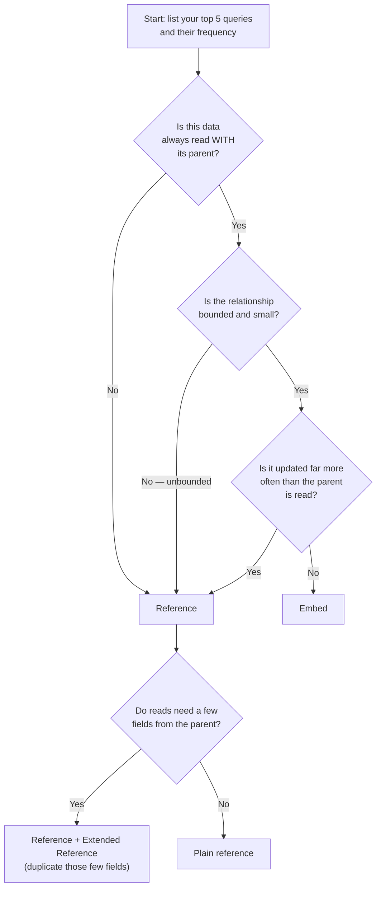

# Data Modeling & Schema Design

> **What you will be able to do after this page**
>
> - Answer "embed or reference?" with a rule, not a feeling.
> - Name and apply the six schema design patterns that cover ~90 % of real systems.
> - Recognise the anti-patterns in an existing schema during a design interview.
> - Explain *why* denormalisation is correct here and wrong in Postgres.

This is the highest-leverage page in these notes. In a MERN interview, schema design is where a 3-year candidate and a 6-year candidate diverge most visibly — because query syntax can be looked up, and modeling judgment cannot.

---

## 1. The governing question

Relational modeling asks: *what is the data?* Then it normalises to eliminate redundancy, and reassembles with joins at read time.

MongoDB modeling asks: **what does my application read, how often, and together?** Then it stores those things together so the common read is a single document fetch.



Print that flowchart on the inside of your eyelids. It answers most schema questions asked in interviews.

---

## 2. Embed vs Reference

### Embed when…

```js
// One user, one address. Always read together. Never grows.
{
  _id: ObjectId("..."),
  name: "Asha Rao",
  address: { line1: "12 MG Road", city: "Pune", pin: "411001" },
  preferences: { theme: "dark", newsletter: true }
}
```

- The child has **no independent identity** (nobody queries addresses on their own).
- The relationship is **one-to-one** or **one-to-few** with a known bound.
- The data is **read together** with the parent.
- ✅ Payoff: one round trip, no join, and the whole update is **atomic** because it's one document.

### Reference when…

```js
// orders collection
{ _id: ObjectId("o1"), userId: ObjectId("u1"), amount: 1200, status: "PAID" }
```

- The child set is **unbounded** (orders, comments, events, logs, messages).
- The child is **queried independently** ("all orders over ₹5000 this month").
- The child **changes much more often** than the parent is read.
- The child is **large** and usually not needed (a 2 MB document body on a listing page).

### The one-to-N sizing rule (Mongo's own heuristic)

| Cardinality | Name | Model |
| :--- | :--- | :--- |
| 1 → few (≤ ~100, bounded) | one-to-few | **Embed** the array of sub-documents |
| 1 → many (hundreds–thousands) | one-to-many | **Reference**: child stores `parentId`, indexed |
| 1 → squillions (unbounded) | one-to-squillions | **Reference from the child**, and consider [bucketing](#4-the-six-patterns-you-must-know) |

:::tip[The one-line version for an interview]
"I embed when the data is bounded and read together, and I reference when it's unbounded or independently queried. Then I selectively duplicate a few hot fields back onto the parent — the extended reference pattern — to avoid the join on the read path."
:::

### Worked example: a blog

```js
// posts — comments referenced (unbounded), author extended-referenced (read on every render)
{
  _id: ObjectId("p1"),
  title: "Understanding $lookup",
  body: "…",
  tags: ["mongodb", "aggregation"],          // embedded: bounded, read together
  author: {                                   // extended reference: duplicated hot fields
    _id: ObjectId("u1"),
    name: "Asha Rao",
    avatarUrl: "/a/u1.png"
  },
  commentCount: 342,                          // computed pattern: precomputed, not counted at read
  latestComments: [ /* last 3, for the preview card */ ],  // subset pattern
  createdAt: ISODate("2026-03-01T…")
}

// comments — its own collection, unbounded
{ _id: ObjectId("c1"), postId: ObjectId("p1"), userId: ObjectId("u2"), body: "…", createdAt: … }
```

One `findOne` renders the entire post page above the fold. Comments paginate from their own collection with an index on `{ postId: 1, createdAt: -1 }`. That is a production schema, and being able to draw it *and justify each choice* is the interview answer.

---

## 3. Denormalisation: the trade you are actually making

Duplicating `author.name` into every post is heresy in Postgres and correct in MongoDB. Here's the honest accounting:

| | Normalised (reference only) | Denormalised (extended reference) |
| :--- | :--- | :--- |
| Read a post page | 2 queries (`post` + `user`) or a `$lookup` | **1 query** |
| Author renames themselves | 1 update | 1 update **+ a background job** to fan out to N posts |
| Storage | Minimal | Slightly more |
| Consistency | Always correct | **Eventually** correct |

The decision rule: **duplicate fields that are read constantly and change rarely.** A user's display name changes maybe twice a lifetime and is read on every page view — perfect candidate. A user's `lastSeenAt` changes every minute — never duplicate it.

When you do duplicate, you own the fan-out. The two mechanisms:

1. **Change Streams** — watch `users` for `name` updates and push the new value into `posts`. Reactive, near-real-time, no extra infrastructure.
2. **Accept staleness with a TTL** — for things like a cached follower count, recompute nightly.

:::warning[Say this out loud in the interview]
"Denormalisation trades write complexity and eventual consistency for read latency. I only do it for fields that are read-heavy and change-light, and I handle the fan-out explicitly — usually with a change stream — rather than pretending it stays in sync by magic."
:::

---

## 4. The six patterns you must know

### The Extended Reference Pattern

**Problem:** you reference `users` from `orders`, but every order listing needs the customer's name and city — so every page does a `$lookup`.

**Fix:** copy the *few* fields you display into the child.

```js
{
  _id: ObjectId("o1"),
  customer: { _id: ObjectId("u1"), name: "Asha Rao", city: "Pune" },  // snapshot
  amount: 1200
}
```

**Bonus insight:** for orders specifically, the duplicated data is not a cache — it's a **historical snapshot**. The shipping address on an order *should not* change when the user later moves house. Recognising that some duplication is semantically required is a strong signal in an interview.

### The Computed Pattern

**Problem:** every product page runs an aggregation to compute the average rating over 40,000 reviews.

**Fix:** compute on write, store on the document.

```js
{ _id: "prod1", name: "…", ratingAvg: 4.37, ratingCount: 40213, ratingSum: 175_731 }
```

Update it incrementally when a review lands:

```js
db.products.updateOne(
  { _id: "prod1" },
  [{ $set: {
      ratingCount: { $add: ["$ratingCount", 1] },
      ratingSum:   { $add: ["$ratingSum", newRating] },
      ratingAvg:   { $divide: [{ $add: ["$ratingSum", newRating] },
                               { $add: ["$ratingCount", 1] }] }
  }}]
);
```

Reads go from an aggregation over 40k documents to a single field read. **Read-heavy systems should compute at write time.**

### The Bucket Pattern

**Problem:** IoT/time-series/log data. One document per reading means a billion tiny documents, a billion index entries, and terrible locality.

**Fix:** bucket N readings into one document.

```js
{
  sensorId: "s1",
  bucketStart: ISODate("2026-03-01T10:00:00Z"),
  bucketEnd:   ISODate("2026-03-01T11:00:00Z"),
  count: 60,
  sumTemp: 1342.5,          // pre-aggregated
  readings: [
    { t: ISODate("…10:00:00Z"), temp: 22.1 },
    { t: ISODate("…10:01:00Z"), temp: 22.3 },
    // … 60 entries
  ]
}
```

Written with a single upsert per reading:

```js
db.readings.updateOne(
  { sensorId: "s1", bucketStart: hourStart, count: { $lt: 60 } },
  { $push: { readings: { t: now, temp: 22.1 } },
    $inc: { count: 1, sumTemp: 22.1 },
    $setOnInsert: { bucketEnd: hourEnd } },
  { upsert: true }
);
```

The `count: { $lt: 60 }` guard is the trick: when the bucket is full the filter stops matching and the upsert **creates the next bucket automatically**. Result: ~60× fewer documents, ~60× fewer index entries, and dramatically better compression.

*(MongoDB 5.0+ ships native **time-series collections** which do this for you — mention both.)*

### The Subset Pattern

**Problem:** a product document with 8,000 reviews embedded is 14 MB and every product page load transfers all of it, blowing out the WiredTiger cache.

**Fix:** keep the *hot subset* embedded, the rest in another collection.

```js
// products
{ _id: "p1", name: "…", topReviews: [ /* 10 most helpful */ ], reviewCount: 8000 }
// reviews — everything, queried only when the user clicks "see all"
```

Maintained with the leaderboard idiom from [CRUD](./02-crud-deep-dive.md#array-update-operators):

```js
{ $push: { topReviews: { $each: [newReview], $sort: { helpful: -1 }, $slice: 10 } } }
```

The working set shrinks to what the common query actually needs — which is the entire point of the pattern.

### The Schema Versioning Pattern

**Problem:** you need to change the shape of documents in a live 500 GB collection. A big-bang migration means downtime.

**Fix:** stamp a version on every document and let old and new coexist.

```js
{ _id: …, schemaVersion: 2, fullName: "Asha Rao" }   // new
{ _id: …, schemaVersion: 1, fname: "Asha", lname: "Rao" }  // old, still readable
```

The application reads both and **lazily migrates on write**. A background job cleans up the tail. Zero downtime, no migration window. This is *the* answer to "how do you do a schema migration in MongoDB?" and it's a genuinely different answer from the relational one.

### The Outlier Pattern

**Problem:** 99.9 % of users have < 100 followers; @celebrity has 30 million. Embedding works for everyone except the outlier, who breaks the 16 MB limit.

**Fix:** model for the common case, flag the exceptions.

```js
{ _id: "u1", followers: [ /* up to 1000 */ ] }
{ _id: "celeb", followers: [ /* first 1000 */ ], hasOverflow: true }
// overflow docs live in a followers_overflow collection
```

The application checks `hasOverflow` and only takes the expensive path for the 0.1 %. **Don't punish the common case to accommodate the rare one** — that sentence alone will land well in a design discussion.

---

## 5. Anti-patterns — recognise these in code review

| Anti-pattern | Why it hurts | Fix |
| :--- | :--- | :--- |
| **Unbounded arrays** | Approaches 16 MB; every push rewrites the whole doc; every read transfers it all | Reference out, or Bucket / Subset |
| **Massive number of collections** | Each collection + index has metadata overhead; thousands of them slows startup and eats cache | One collection with a `type` field |
| **Bloated documents** | Whole document must be loaded even to read one field; destroys working-set fit | Subset pattern; split cold fields out |
| **Case-insensitive queries via regex** | `$regex: /^asha$/i` cannot use an index efficiently | A **collation** with `strength: 2`, backed by a matching index |
| **Separate collection per tenant/user** | The "massive collections" problem, plus impossible cross-tenant analytics | Single collection, `tenantId` field, compound index leading with `tenantId` |
| **Using MongoDB like a relational DB** | Five collections and four `$lookup`s to render one page | Embed what's read together |
| **Indexing everything** | Every index taxes every write and consumes cache | Index for your actual query shapes; drop unused ones |

---

## 6. A design interview, worked end to end

> *"Design the schema for a food delivery app — users, restaurants, menus, orders, live tracking."*

**Step 1 — enumerate the access patterns first.** (Always do this out loud. It's half the grade.)

1. Show restaurants near me, filtered by cuisine — very frequent.
2. Show one restaurant's full menu — very frequent.
3. Place an order — frequent, must be atomic.
4. Show a user's order history — frequent.
5. Live-track one active order — very frequent, high write rate.
6. Restaurant revenue analytics — rare, can be slow.

**Step 2 — map each to a decision.**

```js
// restaurants — menu EMBEDDED: bounded (~200 items), always read with the restaurant
{
  _id: ObjectId("r1"),
  name: "Spice Route",
  cuisines: ["North Indian", "Mughlai"],
  location: { type: "Point", coordinates: [73.85, 18.52] },  // GeoJSON → 2dsphere index
  rating: { avg: 4.3, count: 1204 },                          // computed pattern
  menu: [ { itemId: "m1", name: "Paneer Tikka", price: NumberDecimal("249"), veg: true } ]
}

// orders — REFERENCED from user & restaurant; line items are a SNAPSHOT, not a reference
{
  _id: ObjectId("o1"),
  userId: ObjectId("u1"),
  restaurant: { _id: ObjectId("r1"), name: "Spice Route" },   // extended reference
  items: [ { itemId: "m1", name: "Paneer Tikka", qty: 2, price: NumberDecimal("249") } ],
  total: NumberDecimal("498"),
  status: "OUT_FOR_DELIVERY",
  deliveryAddress: { /* snapshot at order time */ },
  createdAt: ISODate("…")
}

// order_tracking — SEPARATE: written every 5s, read by one client. Bucketed + TTL.
{ orderId: ObjectId("o1"), bucketStart: …, pings: [ { t: …, loc: [ … ] } ],
  expiresAt: ISODate("…") }   // TTL index cleans it up after delivery + 7 days
```

**Step 3 — justify the three non-obvious calls.**

- **Menu embedded**: bounded and never read without the restaurant. One query renders the menu page.
- **Order items snapshotted, not referenced**: if the restaurant raises the price tomorrow, last week's invoice must not change. Duplication here is *correctness*, not caching.
- **Tracking split out with a TTL**: it's a firehose with a completely different lifecycle from the order. Embedding it would grow the order document without bound (anti-pattern #1) and slow down every order read.

**Step 4 — name the indexes.** `{ location: "2dsphere", cuisines: 1 }`, `{ userId: 1, createdAt: -1 }` for history, `{ "restaurant._id": 1, createdAt: -1 }` for the restaurant dashboard. Why those field orders? See [Indexes — the ESR rule](./04-indexes-and-performance.md#the-esr-rule).

---

## 7. Rapid-fire recall

<details>
<summary>**When do you embed vs reference?**</summary>

Embed when the child is bounded, has no independent identity, and is read together with the parent — you get a single-round-trip read and atomic updates for free. Reference when the child set is unbounded, is queried on its own, or churns far faster than the parent is read. Then selectively apply the extended reference pattern: copy the two or three fields the read path actually displays back onto the parent, so the common query needs no join.
</details>

<details>
<summary>**Isn't duplicating data bad?**</summary>

In a normalised relational model, yes — because there the goal is a single source of truth and joins are cheap. In MongoDB, joins are the expensive operation and reads dominate, so duplicating fields that are read-heavy and change-light is a deliberate trade: faster reads and simpler queries, paid for with write-side fan-out and eventual consistency. You manage the fan-out explicitly, usually with change streams. And some duplication isn't a cache at all — an order's line-item prices must be a historical snapshot.
</details>

<details>
<summary>**How do you handle a schema migration with zero downtime?**</summary>

The schema versioning pattern: add a `schemaVersion` field, teach the application to read every supported version, and migrate documents lazily as they're written. A low-priority background job sweeps the remainder. No migration window, no downtime, and a rollback is just deploying the previous application version — the data still reads.
</details>

<details>
<summary>**How would you model a 30-million-follower account?**</summary>

The outlier pattern. Model for the common case — an embedded array works for the 99.9 % of users with a few hundred followers — and flag the exceptions with `hasOverflow: true`, spilling their followers into a separate collection that the application only touches when the flag is set. Don't degrade the schema for everyone to accommodate a handful of accounts.
</details>

<details>
<summary>**How do you store time-series / IoT data?**</summary>

Either a native time-series collection (5.0+), or the bucket pattern manually: one document per sensor per time window holding an array of readings plus pre-aggregated `count`/`sum` fields. The upsert filter includes `count: { $lt: N }` so a full bucket automatically rolls over to a new one. This cuts document count and index entries by the bucket factor and massively improves compression and locality. Pair it with a TTL index for retention.
</details>

---

**Next:** [Indexes & Query Performance →](./04-indexes-and-performance.md) — the other half of "why is this slow?"
