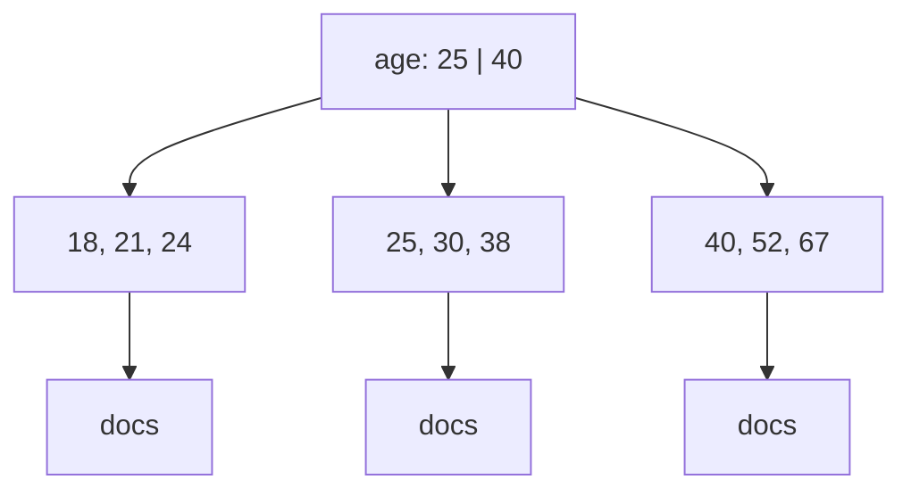
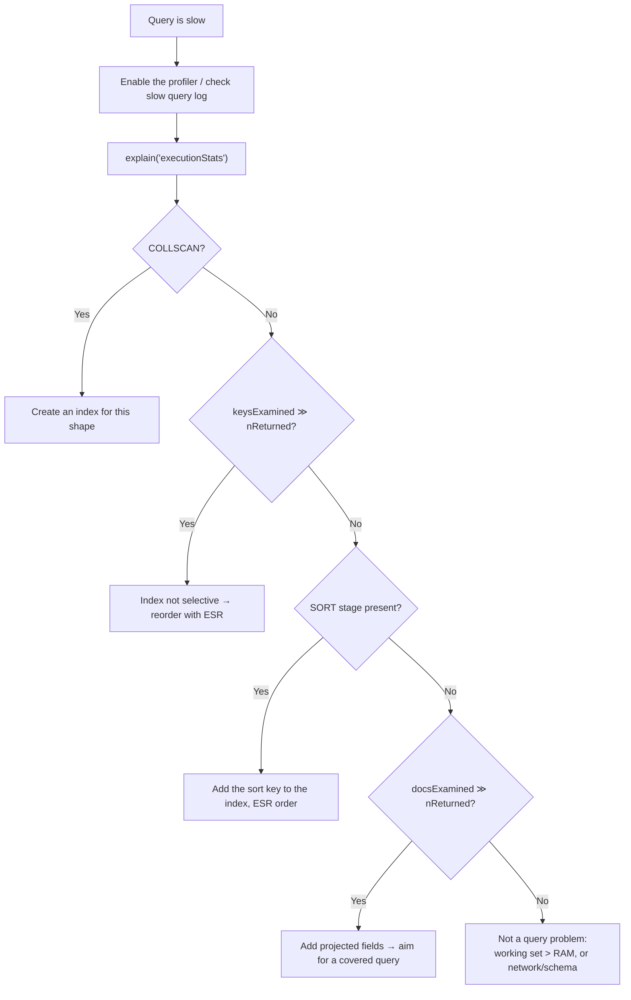

# Indexes & Query Performance

> **What you will be able to do after this page**
>
> - Read an `explain()` plan and say exactly why a query is slow.
> - Design a compound index using the **ESR rule** and justify the field order.
> - Explain what a covered query is and produce one on demand.
> - Know when *not* to add an index — the answer most candidates never give.

---

## 1. What an index actually is

A **B-tree** whose keys are the indexed field values, sorted, each pointing at the location of a document.



Three consequences, and each is a separate interview point:

1. **Lookups become O(log n) instead of O(n).** Without an index, MongoDB does a `COLLSCAN` — reads every document.
2. **The index is sorted**, so it can also satisfy a `sort()` for free, and answer range queries by walking a contiguous region.
3. **Indexes cost writes.** Every insert/update/delete must also update every affected index. An 8-index collection does 9 B-tree writes per insert. This is why "just add an index" is not always the right answer.

And the one people forget: **indexes consume RAM.** They live in the WiredTiger cache alongside your hot documents. An index that doesn't fit in memory is an index that causes disk reads.

---

## 2. Index types

| Type | Create | Use it for |
| :--- | :--- | :--- |
| Single field | `{ email: 1 }` | Equality/range on one field |
| Compound | `{ status: 1, createdAt: -1 }` | Multi-field filters + sorts (see ESR) |
| Multikey | `{ tags: 1 }` on an array field | Automatic when the field is an array — one index entry **per element** |
| Text | `{ title: "text", body: "text" }` | Language-aware keyword search. One per collection |
| Wildcard | `{ "attrs.$**": 1 }` | Unpredictable/user-defined field names |
| Hashed | `{ userId: "hashed" }` | Even shard distribution. **Cannot serve range queries or sorts** |
| Geospatial | `{ location: "2dsphere" }` | `$near`, `$geoWithin` on GeoJSON |
| TTL | `{ expiresAt: 1 }, { expireAfterSeconds: 0 }` | Auto-delete sessions, OTPs, logs |
| Unique | `{ email: 1 }, { unique: true }` | Enforce uniqueness (a constraint *and* an index) |
| Partial | `{ … }, { partialFilterExpression: { … } }` | Index only the subset you query |
| Sparse | `{ … }, { sparse: true }` | Skip documents missing the field |

### Multikey — the one with sharp edges

```js
{ _id: 1, tags: ["mongo", "db", "nosql"] }   // → 3 index entries, all pointing at doc 1
```

Rules worth memorising:

- MongoDB creates a multikey index automatically; there is no `multikey: true` option.
- **A compound index can contain at most one array field.** `{ tags: 1, comments: 1 }` where both are arrays is rejected — the Cartesian product would explode.
- Multikey indexes **cannot support a covered query**, because the index entry doesn't record the full array.

### TTL — the free janitor

```js
db.sessions.createIndex({ createdAt: 1 }, { expireAfterSeconds: 3600 });
// or, for per-document expiry:
db.otps.createIndex({ expiresAt: 1 }, { expireAfterSeconds: 0 });
```

A background thread sweeps **every 60 seconds**, so deletion is *approximate*, not instant — don't build security guarantees on the exact moment. Only works on a `Date` field (or an array of dates, using the earliest).

### Partial vs Sparse — know the difference

```js
// Sparse: skip documents where the field is missing
db.users.createIndex({ phone: 1 }, { sparse: true });

// Partial: skip documents that fail an arbitrary condition — strictly more powerful
db.orders.createIndex(
  { createdAt: -1 },
  { partialFilterExpression: { status: "ACTIVE" } }
);
```

If 2 % of a billion orders are `ACTIVE`, the partial index is 50× smaller — which usually means it fits in RAM when the full index doesn't. **Partial supersedes sparse; prefer it in new code.**

The catch: MongoDB uses a partial index **only if the query is provably a subset of the filter expression.** `find({ status: "ACTIVE", … })` uses it; `find({ … })` without the status predicate does not.

:::tip[Unique + partial: the "unique among active" trick]
```js
// Only one ACTIVE subscription per user, but unlimited cancelled ones
db.subs.createIndex(
  { userId: 1 },
  { unique: true, partialFilterExpression: { status: "ACTIVE" } }
);
```
A plain unique index would block the second subscription forever. This combination is a very strong answer when the interviewer asks about soft deletes.
:::

:::warning[Unique index + nulls]
A unique index treats *missing* as a value: two documents both lacking `email` collide on `null`. Fix it with `partialFilterExpression: { email: { $exists: true, $type: "string" } }`.
:::

---

## 3. The ESR rule — compound index field order

**The single most quotable index fact in MongoDB.** Order the keys of a compound index as:

> **E**quality → **S**ort → **R**ange

Given this query:

```js
db.orders
  .find({ status: "PAID", amount: { $gte: 500 } })   // equality + range
  .sort({ createdAt: -1 });                          // sort
```

| Candidate index | Verdict |
| :--- | :--- |
| `{ status: 1, createdAt: -1, amount: 1 }` | ✅ **ESR.** Equality narrows to a contiguous block, that block is already in `createdAt` order (no in-memory sort), then the range filters within it |
| `{ status: 1, amount: 1, createdAt: -1 }` | ❌ ESR violated. The range scatters `createdAt`, so the server must do an in-memory `SORT` stage |
| `{ createdAt: -1, status: 1, amount: 1 }` | ❌ Sort is free, but no equality narrowing — the scan touches far more index entries |

**Why it works:** an equality predicate pins the leading key to one value, so everything below it in the tree is a contiguous range already sorted by the next key. A *range* predicate matches many leading values, so the next key's ordering is interleaved across them and can no longer be read in order.

### The prefix rule

A compound index `{ a: 1, b: 1, c: 1 }` can serve queries on:

- `a` ✅
- `a, b` ✅
- `a, b, c` ✅
- `b` ❌ | `c` ❌ | `b, c` ❌

**Left-to-right prefixes only.** Corollary: `{ a: 1, b: 1 }` makes a separate `{ a: 1 }` index redundant — drop it. That's a real, checkable win in most production clusters.

### Sort direction

An index can be walked in either direction, so `{ a: 1, b: -1 }` serves both `sort({a:1, b:-1})` and `sort({a:-1, b:1})` — the exact reverse. It does **not** serve `sort({a:1, b:1})`. Direction only matters for *multi-key* sorts.

---

## 4. Reading `explain()`

```js
db.orders.find({ status: "PAID" }).sort({ createdAt: -1 }).explain("executionStats");
```

Three verbosity levels: `"queryPlanner"` (plan only, doesn't run), `"executionStats"` (runs it, gives counts — **use this one**), `"allPlansExecution"` (also shows rejected plans).

### The four numbers that matter

```js
{
  executionStats: {
    nReturned: 10,                 // documents returned
    totalKeysExamined: 10,         // index entries read
    totalDocsExamined: 10,         // documents fetched from disk/cache
    executionTimeMillis: 2,
  }
}
```

**The health ratio you want is `totalKeysExamined ≈ totalDocsExamined ≈ nReturned`.**

| Symptom | Diagnosis |
| :--- | :--- |
| `keys = 0`, `docs = 1_000_000`, `returned = 10` | **No index at all** → `COLLSCAN`. Add one |
| `keys = 1_000_000`, `docs = 1_000_000`, `returned = 10` | Index exists but is **not selective** — wrong leading field, or a low-cardinality field like `isDeleted` |
| `keys = 10`, `docs = 10`, `returned = 10` | ✅ Optimal |
| `keys = 10`, `docs = 0`, `returned = 10` | ✅✅ **Covered query** — never touched the collection |
| `docs > keys` | Multikey expansion, or an unindexed predicate applied after the fetch |

### Stage names decoded

| Stage | Meaning |
| :--- | :--- |
| `COLLSCAN` | Full collection scan. Almost always a bug on a large collection |
| `IXSCAN` | Index scan ✅ |
| `FETCH` | Went to the collection to get the full document (index alone was insufficient) |
| `SORT` | **In-memory sort** — no index provided the order. Capped at 100 MB, then it fails |
| `SORT_MERGE` | Sorted results merged from several index scans |
| `PROJECTION_COVERED` | ✅ Covered query — answered entirely from the index |
| `IDHACK` | The `_id` fast path |
| `SHARDING_FILTER` | Filtering out orphaned documents on a sharded cluster |

Read the plan **inside out**: the innermost stage runs first.

```text
FETCH                       ← 3. fetch full documents
  └── IXSCAN (status_1)     ← 1. walk the index
```
vs.
```text
SORT                        ← 3. sort in memory (BAD)
  └── FETCH
        └── IXSCAN
```

:::danger[The 100 MB sort wall]
An in-memory `SORT` stage aborts with `Sort exceeded memory limit of 104857600 bytes` once the sorted set exceeds 100 MB. The fix is **not** `allowDiskUse` — that's a band-aid that makes it slow instead of broken. The fix is an index that already provides the sort order. This is exactly what ESR buys you.
:::

---

## 5. Covered queries

A query is **covered** when every field it needs — filter *and* projection — lives in the index, so MongoDB never touches the collection.

```js
db.users.createIndex({ email: 1, name: 1 });

db.users.find(
  { email: "a@x.com" },
  { _id: 0, email: 1, name: 1 }     // _id MUST be excluded — it isn't in the index
);
// → PROJECTION_COVERED, totalDocsExamined: 0
```

Requirements, all four:

1. All filter fields are in the index.
2. All projected fields are in the index.
3. `_id` is explicitly excluded (unless it's part of the index).
4. The index is **not multikey**.

Payoff: the index is compact and usually cache-resident, so a covered query is often an order of magnitude faster than the same query with a `FETCH`. Great for autocomplete, existence checks, and ID lists.

---

## 6. When *not* to index

This is the answer that distinguishes a senior candidate, because everyone else only knows how to add indexes.

- **Low-cardinality fields alone.** An index on `{ isActive: 1 }` where 95 % of documents are `true` reads nearly the whole collection *plus* the index — slower than a `COLLSCAN`. Only useful as a *leading* field when combined with a selective one, or as a `partialFilterExpression`.
- **Small collections.** Under a few thousand documents, a scan from cache beats index overhead.
- **Write-heavy, rarely-queried collections.** Audit logs, event ingestion. Every index taxes every insert.
- **Redundant prefixes.** `{ a: 1 }` alongside `{ a: 1, b: 1 }` — drop the first.
- **Indexes nothing uses.** Check `db.collection.aggregate([{ $indexStats: {} }])`; anything with `accesses.ops: 0` after a full business cycle is pure write tax. Dropping dead indexes is one of the highest-ROI production wins available.

---

## 7. The diagnostic workflow



### The profiler

```js
db.setProfilingLevel(1, { slowms: 100 });   // log operations slower than 100 ms
db.system.profile.find().sort({ ts: -1 }).limit(10);
db.setProfilingLevel(0);                    // turn it off when done
```

Levels: `0` off, `1` slow ops only, `2` everything (**never on in production** — it writes a profile document for every operation).

Also useful: `db.currentOp()` to see what's running right now, and `db.killOp(opid)` to stop a runaway query.

### Index build strategy

Since 4.2, index builds are hybrid and take only a brief exclusive lock at the start and end — no more `background: true` option, it's the default behaviour. On a replica set, the safe production pattern is still **rolling**: build on each secondary in turn, then step down the primary and build there. And build indexes **before** bulk-loading data only if the load is small; for very large loads, insert first and index after — it's substantially faster.

---

## 8. Rapid-fire recall

<details>
<summary>**Explain the ESR rule.**</summary>

For a compound index, order the fields **Equality, then Sort, then Range**. Equality predicates pin the leading keys to a single value, which makes everything beneath them a contiguous, already-sorted region — so the sort key placed next can be read straight off the index with no in-memory sort. A range predicate spans many values of its key, which interleaves the ordering of everything after it, so ranges must come last. Violating ESR typically shows up as a `SORT` stage in the explain plan.
</details>

<details>
<summary>**What is a covered query?**</summary>

One where every field the query touches — filter and projection — is present in the index, so the plan never does a `FETCH` and `totalDocsExamined` is 0. It requires excluding `_id` unless `_id` is in the index, and it doesn't work with multikey indexes. It's typically an order of magnitude faster because the index is compact and usually cache-resident.
</details>

<details>
<summary>**My query is slow. Walk me through debugging it.**</summary>

Run `explain("executionStats")` and compare three numbers: `nReturned`, `totalKeysExamined`, `totalDocsExamined`. If `keysExamined` is 0 and `docsExamined` is huge, there's no usable index — a `COLLSCAN`. If keys examined vastly exceeds documents returned, the index exists but isn't selective enough, so reorder it per ESR. A `SORT` stage means no index supplies the requested order. If all three numbers are close and it's still slow, it isn't a query-plan problem — look at working-set-versus-RAM, document size, or the network.
</details>

<details>
<summary>**Does an index always make things faster?**</summary>

No. Indexes tax every write, occupy RAM that competes with your working set, and on low-cardinality fields can be slower than a collection scan because you pay for both the index walk and the document fetches. Redundant prefix indexes and indexes with zero `$indexStats` accesses are pure cost. Index for the query shapes you actually run, and periodically drop the ones nothing uses.
</details>

<details>
<summary>**Partial vs sparse index?**</summary>

Sparse skips documents where the indexed field is missing. Partial skips documents that don't match an arbitrary filter expression, so it's strictly more powerful — and it can dramatically shrink the index when you only ever query a small subset, like active records. The trade-off is that the planner only uses a partial index when the query is provably a subset of its filter. Partial supersedes sparse; use it in new code.
</details>

<details>
<summary>**Can a compound index have two array fields?**</summary>

No. At most one indexed field may be an array, because indexing two would require the Cartesian product of their elements and the index size would explode. This is also why multikey indexes can't cover a query.
</details>

---

**Next:** [Aggregation Fundamentals →](./05-aggregation-fundamentals.md) — the pipeline, traced document by document.
