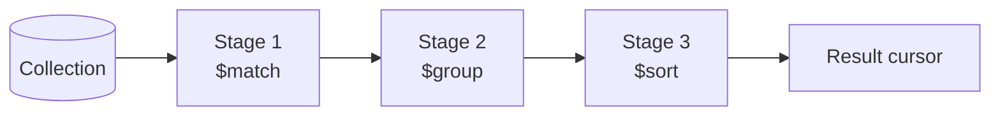

# Aggregation Fundamentals

> **What you will be able to do after this page**
>
> - Trace a pipeline in your head, document by document, and predict the exact output of every stage.
> - Explain the difference between a **stage** and an **expression** — the distinction that unlocks everything else.
> - Know what `$$ROOT`, `$$REMOVE`, `$$NOW` and `$$this` are, and when each is the right tool.
> - Understand what the query optimiser silently rewrites, and why stage *order* is a performance decision.

---

## 1. The mental model

An aggregation pipeline is a **stream of documents flowing through an ordered list of transformations.**



Four properties define the whole system:

1. **Each stage's input is the previous stage's output.** Not the original collection. After `$group`, the fields of the original documents *no longer exist* unless you rebuilt them.
2. **Stages are ordered and order is semantic.** `$sort` then `$limit` gives the top N. `$limit` then `$sort` gives a random N, sorted. Different answers, both valid pipelines, no error.
3. **It streams.** Most stages process one document at a time and pass it on immediately. But some stages are **blocking** — they must consume the *entire* input before emitting anything.
4. **It's a Unix pipe for documents.** `$match` is `grep`, `$project` is `cut`/`awk`, `$sort` is `sort`, `$group` is `uniq -c` on steroids.

### Streaming vs blocking stages

| Streaming (pass through immediately) | Blocking (must buffer everything) |
| :--- | :--- |
| `$match`, `$project`, `$addFields`/`$set`, `$unset` | `$group` |
| `$limit`, `$skip`, `$unwind` | `$sort` (unless an index provides the order) |
| `$lookup`, `$replaceRoot`, `$redact` | `$bucket`, `$bucketAuto`, `$facet` |
| | `$setWindowFields`, `$sortByCount`, `$count` |

**Why you care:** blocking stages have a **100 MB memory limit** each. They're also where latency comes from — a pipeline that is all streaming stages returns its first document almost immediately, while one starting with `$group` returns nothing until it has read the entire input.

---

## 2. Stage vs Expression — the distinction everything rests on

This trips up nearly everyone, and once it clicks the rest of aggregation becomes mechanical.

| | **Stage** | **Expression** |
| :--- | :--- | :--- |
| Where it lives | Top level of the pipeline array | *Inside* a stage |
| What it operates on | The whole document stream | One document's values |
| Returns | Documents | A value |
| Examples | `$match`, `$group`, `$sort`, `$lookup` | `$sum`, `$concat`, `$cond`, `$multiply` |

```js
db.orders.aggregate([
  { $match: { status: "PAID" } },          // ← $match is a STAGE
  { $project: {
      total: { $multiply: ["$price", "$qty"] }   // ← $multiply is an EXPRESSION
  }}
]);
```

Some names exist in both worlds and mean different things. `$sum` as an accumulator inside `$group` sums *across documents*; `$sum` inside `$project` sums *values within one document*. Same name, different context:

```js
{ $group:   { _id: "$region", total: { $sum: "$amount" } } }  // across documents
{ $project: { total: { $sum: ["$a", "$b", "$c"] } } }         // within one document
{ $project: { total: { $sum: "$scores" } } }                  // sums one array field
```

### Field paths: `"$field"` vs `"field"` vs `"$$var"`

| Syntax | Meaning |
| :--- | :--- |
| `"amount"` | The literal **string** `"amount"` |
| `"$amount"` | The **value** of the field `amount` in the current document |
| `"$user.city"` | A nested field's value |
| `"$$ROOT"` | The entire current document |
| `"$$NOW"` | Current server timestamp (4.2+) |
| `"$$REMOVE"` | A sentinel meaning "produce nothing here" |
| `"$$this"` / `"$$value"` | The loop variable inside `$map`, `$filter`, `$reduce` |

:::warning[The classic beginner bug]
```js
{ $group: { _id: "region", total: { $sum: "$amount" } } }   // ❌ one group, _id = "region"
{ $group: { _id: "$region", total: { $sum: "$amount" } } }  // ✅ one group per region value
```
The first one groups everything into a single bucket whose `_id` is the literal string `"region"`. It runs without error and silently returns garbage. Missing `$` is the most common aggregation typo in existence.
:::

---

## 3. Every core stage, traced

For all examples below, this is our input collection:

```js
// db.sales
{ _id: 1, item: "laptop", region: "North", qty: 3, price: 1000, tags: ["tech", "premium"] }
{ _id: 2, item: "phone",  region: "South", qty: 5, price: 500,  tags: ["tech"] }
{ _id: 3, item: "tablet", region: "North", qty: 2, price: 300,  tags: ["tech", "budget"] }
{ _id: 4, item: "laptop", region: "East",  qty: 1, price: 1000, tags: ["premium"] }
{ _id: 5, item: "phone",  region: "South", qty: 4, price: 500,  tags: [] }
```

### `$match` — filter

Same syntax as `find()`. Uses indexes **only if it's the first stage** (or the optimiser can move it there).

```js
{ $match: { region: "North" } }
```

```text
IN                                          OUT
┌─────────────────────────────┐            ┌─────────────────────────────┐
│ _id:1  region:North  qty:3  │ ──keep──▶  │ _id:1  region:North  qty:3  │
│ _id:2  region:South  qty:5  │ ──drop──✗  │ _id:3  region:North  qty:2  │
│ _id:3  region:North  qty:2  │ ──keep──▶  └─────────────────────────────┘
│ _id:4  region:East   qty:1  │ ──drop──✗   2 documents
│ _id:5  region:South  qty:4  │ ──drop──✗
└─────────────────────────────┘
```

**Cardinality: N → ≤ N. Shape: unchanged.**

### `$project` — reshape

```js
{ $project: { _id: 0, item: 1, revenue: { $multiply: ["$qty", "$price"] } } }
```

```text
IN                                    OUT
_id:1 item:laptop qty:3 price:1000 ▶  { item: "laptop", revenue: 3000 }
_id:2 item:phone  qty:5 price:500  ▶  { item: "phone",  revenue: 2500 }
_id:3 item:tablet qty:2 price:300  ▶  { item: "tablet", revenue: 600  }
_id:4 item:laptop qty:1 price:1000 ▶  { item: "laptop", revenue: 1000 }
_id:5 item:phone  qty:4 price:500  ▶  { item: "phone",  revenue: 2000 }
```

**Cardinality: N → N (1:1). Shape: replaced.**

`$project` is **exclusive by default** — fields you don't mention are dropped (except `_id`, which you must exclude explicitly). That's the key difference from:

### `$addFields` / `$set` — reshape, additively

`$set` is an alias for `$addFields` (4.2+). Identical behaviour, pick whichever reads better.

```js
{ $addFields: { revenue: { $multiply: ["$qty", "$price"] } } }
```

```text
IN                                    OUT
_id:1 item:laptop qty:3 price:1000 ▶  _id:1 item:laptop qty:3 price:1000 revenue:3000
                                       ^^^^^^^^^^^^^^^^^^^^^^^^^^^^^^^^^ everything kept
```

:::tip[When to use which]
- `$addFields`/`$set` → "add a computed field, keep everything else." **This is what you want 80 % of the time.**
- `$project` → "I want exactly these fields and nothing else." Use at the *end* of a pipeline to shape the API response.
- `$unset` → "drop these fields, keep everything else."

Reaching for `$project` mid-pipeline and then discovering a later stage needs a field you dropped is a very common self-inflicted wound.
:::

### `$sort` — order

```js
{ $sort: { price: -1, qty: 1 } }   // price desc, then qty asc as a tiebreaker
```

```text
IN (by _id)                      OUT (by price desc, qty asc)
_id:1 price:1000 qty:3      ▶    _id:4 price:1000 qty:1
_id:2 price:500  qty:5           _id:1 price:1000 qty:3
_id:3 price:300  qty:2           _id:5 price:500  qty:4
_id:4 price:1000 qty:1           _id:2 price:500  qty:5
_id:5 price:500  qty:4           _id:3 price:300  qty:2
```

**Cardinality: N → N. Shape: unchanged. Order: redefined.**

:::warning[Add a tiebreaker]
Sort keys that aren't unique give **non-deterministic order among ties**, and that order can change between runs. With `$skip`/`$limit` pagination this produces duplicated and missing rows. Always append a unique tiebreaker: `{ createdAt: -1, _id: -1 }`.
:::

### `$group` — collapse

The most important stage, and the one that causes the most confusion.

```js
{ $group: {
    _id: "$region",
    totalQty: { $sum: "$qty" },
    avgPrice: { $avg: "$price" },
    items: { $push: "$item" },
    count: { $sum: 1 }
}}
```

Trace it group by group:

```text
IN                                     GROUPING            OUT
_id:1 region:North qty:3 price:1000 ┐
                                    ├─▶ "North" ──▶ { _id:"North", totalQty:5,
_id:3 region:North qty:2 price:300  ┘                 avgPrice:650, items:["laptop","tablet"], count:2 }

_id:2 region:South qty:5 price:500  ┐
                                    ├─▶ "South" ──▶ { _id:"South", totalQty:9,
_id:5 region:South qty:4 price:500  ┘                 avgPrice:500, items:["phone","phone"], count:2 }

_id:4 region:East  qty:1 price:1000 ──▶ "East"  ──▶ { _id:"East", totalQty:1,
                                                      avgPrice:1000, items:["laptop"], count:1 }
```

**Cardinality: N → (number of distinct `_id` values). Shape: completely destroyed and rebuilt.**

:::danger[The single most important rule in aggregation]
**`$group` destroys the document.** After it, the only fields that exist are `_id` and the accumulators you explicitly declared. `item`, `price`, `tags` — gone. If a later stage needs them, you must carry them through: `{ $first: "$item" }`, `{ $push: "$$ROOT" }`, or re-`$lookup` them.

Every "why is my field undefined after `$group`?" question has this one answer.
:::

Notes on `_id`:

- `_id: null` → **one single group** containing everything. This is how you compute a grand total.
- `_id: { region: "$region", item: "$item" }` → **composite key**, one group per unique combination.
- `_id: "$region"` → one group per distinct region.

### The accumulators

| Accumulator | Produces | Note |
| :--- | :--- | :--- |
| `$sum` | Total. `$sum: 1` counts | Ignores non-numeric values |
| `$avg` | Mean | **Ignores nulls and missing** — the denominator shrinks |
| `$min` / `$max` | Extremes | Works on any BSON type, using BSON comparison order |
| `$first` / `$last` | Value from the first/last document **in the incoming order** | Meaningless without a preceding `$sort` |
| `$push` | Array of all values | Duplicates kept, order preserved |
| `$addToSet` | Array of **unique** values | **Order not guaranteed** |
| `$count` | Number of documents (5.0+) | Cleaner than `$sum: 1` |
| `$top` / `$topN` / `$bottom` / `$bottomN` | Top N by a sort spec (5.2+) | Sorts *within* the group — no global `$sort` needed |
| `$stdDevPop` / `$stdDevSamp` | Standard deviation | |
| `$mergeObjects` | Merges documents field by field | |

:::warning[The `$avg` trap]
```js
// scores: [90, null, 80]  → 3 documents, one with a null score
{ $group: { _id: null, avg: { $avg: "$score" } } }   // → 85, not 56.67
```
`$avg` skips nulls entirely, so the divisor is 2, not 3. If nulls should count as zero, coerce first: `{ $avg: { $ifNull: ["$score", 0] } }`. Which one is correct depends on the business question — and *noticing that it's a question* is the point.
:::

### `$unwind` — explode arrays

```js
{ $unwind: "$tags" }
```

```text
IN                                        OUT (one document per array element)
_id:1 item:laptop tags:["tech","premium"] ▶ _id:1 item:laptop tags:"tech"
                                            _id:1 item:laptop tags:"premium"
_id:2 item:phone  tags:["tech"]           ▶ _id:2 item:phone  tags:"tech"
_id:3 item:tablet tags:["tech","budget"]  ▶ _id:3 item:tablet tags:"tech"
                                            _id:3 item:tablet tags:"budget"
_id:4 item:laptop tags:["premium"]        ▶ _id:4 item:laptop tags:"premium"
_id:5 item:phone  tags:[]                 ▶ ✗ DROPPED — empty array produces nothing
```

**5 documents in → 6 documents out.** Note two things:

1. `_id` is **no longer unique** in the stream. That's fine — the pipeline doesn't care — but it means you'll usually `$group` back by `_id` afterwards.
2. **An empty array, a missing field, or `null` makes the document vanish.** Document 5 is gone. This silently deletes data and is the single most common `$unwind` bug.

The fix:

```js
{ $unwind: { path: "$tags", preserveNullAndEmptyArrays: true } }
```

Now `_id: 5` survives, with `tags` **absent** from the output document (not `null`, not `[]` — absent). That distinction matters for the `$sum: 1` counting trap below.

`includeArrayIndex` gives you the original position:

```js
{ $unwind: { path: "$tags", includeArrayIndex: "tagIdx" } }
// → { _id:1, tags:"tech", tagIdx: NumberLong(0) }
```

:::danger[The `preserveNullAndEmptyArrays` counting trap]
After a `$lookup` + `$unwind` with `preserveNullAndEmptyArrays: true`, a user with **zero orders** still produces **one** document. Counting rows counts that phantom:

```js
// ❌ every user gets at least 1 — users with no orders report totalOrders: 1
{ $group: { _id: "$_id", totalOrders: { $sum: 1 } } }

// ✅ count only real matches
{ $group: { _id: "$_id",
    totalOrders: { $sum: { $cond: [{ $ne: ["$orders", null] }, 1, 0] } } } }
```
Note `$ne: null` catches both the missing field *and* an explicit null. This exact bug appears in production dashboards constantly, and it's a favourite interview question.
:::

### `$lookup` — join

**Simple form (equality join):**

```js
{ $lookup: {
    from: "orders",
    localField: "_id",        // field on THIS collection
    foreignField: "userId",   // field on the OTHER collection
    as: "orders"              // always an ARRAY, even for one match
}}
```

```text
IN (users)                      OUT
{ _id:"u1", name:"Asha" }  ▶   { _id:"u1", name:"Asha", orders: [ {…}, {…} ] }
{ _id:"u2", name:"Ravi" }  ▶   { _id:"u2", name:"Ravi", orders: [ ] }
                                                          ^^^ LEFT OUTER JOIN:
                                                          no match → empty array, doc kept
```

**Cardinality: N → N.** `$lookup` is always a **left outer join**; it never drops a document.

**Pipeline form (correlated subquery) — the production pattern:**

```js
{ $lookup: {
    from: "orders",
    let: { uid: "$_id" },                       // export local fields into variables
    pipeline: [
      { $match: { $expr: { $and: [
          { $eq: ["$userId", "$$uid"] },        // $$uid = the let variable
          { $eq: ["$status", "PAID"] },         // filter BEFORE joining
      ]}}},
      { $sort: { createdAt: -1 } },
      { $limit: 5 },                            // only pull what you need
      { $project: { _id: 1, amount: 1 } },      // only the fields you need
    ],
    as: "recentPaidOrders"
}}
```

Why the pipeline form is better in almost every real case:

| | Simple | Pipeline |
| :--- | :--- | :--- |
| Filter the foreign side | ❌ join everything, filter after | ✅ filter inside the join |
| Limit matches | ❌ | ✅ |
| Project fields | ❌ pulls whole documents | ✅ |
| Multiple join conditions | ❌ one field pair only | ✅ any `$expr` |
| Memory | Can pull thousands of docs per input row | Bounded |

:::tip[Inside `pipeline`, you need `$expr`]
`localField/foreignField` do the correlation implicitly. In the pipeline form you correlate manually with `let` + `$expr`, because a plain `$match` compares against literals, not against variables. `{ $match: { userId: "$$uid" } }` would look for the literal string.
:::

:::danger[`$lookup` is not a database join]
Under the hood it executes roughly one query against the foreign collection **per input document**. With 10,000 input documents that's 10,000 lookups. Two non-negotiables:

1. **Index the `foreignField`.** Without it, every one of those is a `COLLSCAN`. This alone is the difference between 40 ms and 40 seconds.
2. **`$match` before the `$lookup`**, never after. Reduce the input set first.

When you find yourself writing four `$lookup`s to render one page, the real problem is upstream in [data modeling](./03-data-modeling.md).
:::

### `$unionWith`, `$facet`, `$bucket` and friends

Covered with worked traces on the [Stages Reference](./06-aggregation-stages.md) page.

---

## 4. The special variables

### `$$ROOT` — the whole current document

```js
[
  { $sort: { createdAt: -1 } },
  { $group: { _id: "$userId", latest: { $first: "$$ROOT" } } },
  { $replaceRoot: { newRoot: "$latest" } },
]
```

This is the **"latest document per group"** idiom. Read it as: order the stream, take the first whole document of each group, then promote it back to being the document. Memorise this three-stage shape — it answers a huge family of interview questions ("most recent order per customer", "current status per device").

### `$$REMOVE` — conditionally omit a field

```js
{ $project: {
    name: 1,
    discount: { $cond: [{ $gt: ["$total", 1000] }, "$discount", "$$REMOVE"] }
}}
```

The field is **absent** when the condition fails — not `null`. Also the clean way to avoid pushing nulls into an array:

```js
orders: { $push: { $cond: [{ $ne: ["$orders", null] }, "$orders", "$$REMOVE"] } }
// → [] instead of [null] for users with no orders
```

### `$$NOW`, `$$CLUSTER_TIME`

`$$NOW` is the current server time, evaluated **once per pipeline** so every document sees the same value. Useful for computing ages:

```js
{ $addFields: { ageInDays: { $dateDiff: { startDate: "$createdAt", endDate: "$$NOW", unit: "day" } } } }
```

### `$$this` / `$$value` — array iteration

```js
{ $filter: { input: "$items", as: "i", cond: { $gt: ["$$i.qty", 2] } } }
{ $map:    { input: "$items", as: "i", in: { $multiply: ["$$i.price", 1.18] } } }
{ $reduce: { input: "$nums", initialValue: 0, in: { $add: ["$$value", "$$this"] } } }
```

Without `as`, the default variable name is `$$this`. `$reduce` additionally exposes `$$value` — the accumulator so far.

---

## 5. What the optimiser does behind your back

MongoDB rewrites your pipeline before executing it. Knowing these rewrites is a strong senior signal.

| Rewrite | Effect |
| :--- | :--- |
| **`$match` coalescing / pushdown** | A `$match` after `$project`/`$addFields` is moved *before* it when the fields it references weren't created there — so it can use an index |
| **`$sort` + `$limit` coalescing** | Becomes a **top-K** algorithm: only K documents are kept in memory, not the whole sorted set. This is why `$sort` immediately followed by `$limit` avoids the 100 MB wall |
| **`$limit` pushdown** | Moved earlier when provably safe |
| **`$project` pruning** | Unused fields are dropped early to reduce bytes carried |
| **`$lookup` + `$unwind` coalescing** | An `$unwind` directly after `$lookup` is folded into the lookup, so the array is never fully materialised |

Inspect it with:

```js
db.orders.aggregate([...], { explain: true });
```

:::tip[The rules the optimiser can't apply for you]
1. **`$match` as early as possible** — ideally stage 1, so it uses an index.
2. **`$project`/`$unset` early** to shed large unused fields (big `body` blobs) before `$group` or `$sort`.
3. **`$sort` immediately before `$limit`**, never separated, so top-K kicks in.
4. **`$sort` before `$group`** only when you need `$first`/`$last`. Otherwise it's wasted work — and `$topN`/`$bottomN` (5.2+) often removes the need entirely.
5. **`$lookup` late**, after filtering, and always on an indexed `foreignField`.
:::

---

## 6. Memory limits and `allowDiskUse`

Each blocking stage gets **100 MB**. Exceed it and the pipeline errors out.

```js
db.orders.aggregate(pipeline, { allowDiskUse: true });
```

This spills to temporary files on disk. It makes the query *work*, but it's an order of magnitude slower.

:::warning
`allowDiskUse: true` is a safety net, not a solution. If you need it routinely, the real fix is one of: `$match` harder, an index that provides the `$sort` order, a `$project` that sheds fields before the blocking stage, or a schema that pre-computes the number. Say that in an interview rather than "I'd just enable disk use."

(In MongoDB 6.0+, `allowDiskUse` defaults to on for most aggregations via `allowDiskUseByDefault`, but the performance argument is unchanged.)
:::

Also note: the aggregation **result** is a cursor and is not size-limited, but a single output *document* still cannot exceed 16 MB. A `$group` with `_id: null` and a giant `$push` will hit that ceiling.

---

## 7. `find()` or `aggregate()`?

| Use `find()` | Use `aggregate()` |
| :--- | :--- |
| Simple filter + projection + sort | Anything involving grouping or computed aggregates |
| Single collection | Joins across collections |
| No computed fields | Reshaping, conditionals, array transformation |
| Lowest latency | Multi-step transformations |

`find()` is not "faster" in some mystical way — a single-stage `$match` pipeline is essentially the same execution. `find()` is just simpler to read, and simpler is better when it suffices.

---

## 8. The complete worked example

**Question:** for each region, find total revenue and the single best-selling item, considering only paid orders from 2026, and return only regions with revenue above 1000 — sorted highest first.

```js
db.sales.aggregate([
  // 1️⃣ Filter FIRST — uses an index on { status: 1, createdAt: 1 }
  { $match: {
      status: "PAID",
      createdAt: { $gte: ISODate("2026-01-01"), $lt: ISODate("2027-01-01") }
  }},

  // 2️⃣ Compute per-document revenue while documents still have their shape
  { $addFields: { revenue: { $multiply: ["$qty", "$price"] } } },

  // 3️⃣ Collapse to one document per (region, item)
  { $group: { _id: { region: "$region", item: "$item" }, itemRevenue: { $sum: "$revenue" } } },

  // 4️⃣ Order so that $first means "highest earning item"
  { $sort: { "_id.region": 1, itemRevenue: -1 } },

  // 5️⃣ Collapse again to one document per region
  { $group: {
      _id: "$_id.region",
      totalRevenue: { $sum: "$itemRevenue" },
      bestItem:     { $first: "$_id.item" },      // valid ONLY because of stage 4
      bestItemRevenue: { $first: "$itemRevenue" }
  }},

  // 6️⃣ Filter on the AGGREGATE — this could not have been done in stage 1
  { $match: { totalRevenue: { $gt: 1000 } } },

  // 7️⃣ Order the final report
  { $sort: { totalRevenue: -1 } },

  // 8️⃣ Shape the API response
  { $project: { _id: 0, region: "$_id", totalRevenue: 1, bestItem: 1, bestItemRevenue: 1 } },
]);
```

The two ideas this pipeline is built to teach:

- **Two `$match` stages, two different jobs.** Stage 1 filters *source documents* and uses an index. Stage 6 filters *computed aggregates* and cannot possibly run earlier, because `totalRevenue` doesn't exist yet. "`$match` before `$group` = `WHERE`, `$match` after `$group` = `HAVING`" is the one-line version.
- **Double grouping with a sort in between** is the standard "top item per group" shape. `$first` has no meaning of its own — stage 4 is what gives it the meaning "highest earning."

---

## 9. Rapid-fire recall

<details>
<summary>**Explain the aggregation pipeline in one paragraph.**</summary>

It's an ordered sequence of stages, where each stage transforms a stream of documents and passes its output to the next — conceptually a Unix pipe for BSON. Most stages stream one document at a time, but blocking stages like `$group` and `$sort` must buffer their entire input and are capped at 100 MB each. Because each stage sees only the previous stage's output, order is semantic as well as a performance decision: filtering first lets `$match` use an index and shrinks everything downstream.
</details>

<details>
<summary>**What's the difference between `$match` before and after `$group`?**</summary>

Before `$group`, `$match` filters the source documents — the SQL `WHERE` — and if it's the first stage it can use an index. After `$group`, it filters the computed aggregates — the SQL `HAVING` — and cannot use an index because those values didn't exist until the group ran. You often want both in one pipeline.
</details>

<details>
<summary>**Why is `$first` dangerous?**</summary>

Because it means "the value from whichever document happened to arrive first," not "the earliest" or "the best." Without a preceding `$sort` the incoming order is unspecified, so the result is arbitrary and — worse — may look correct in testing and change in production. The correct idiom is always `$sort` then `$group` with `$first`. On 5.2+, `$top`/`$topN` express the intent directly and sort within the group instead.
</details>

<details>
<summary>**What happens to a document whose array is empty during `$unwind`?**</summary>

It is dropped entirely. Same for a missing field or a null. Add `preserveNullAndEmptyArrays: true` to keep it — the path field will then be absent from the output document. But that creates a second trap: after a `$lookup` + preserving `$unwind`, a parent with zero matches still yields one row, so `$sum: 1` over-counts. Count conditionally with `$cond` on `$ne: [..., null]`.
</details>

<details>
<summary>**`$project` vs `$addFields`?**</summary>

`$project` is exclusive — it outputs only the fields you name, dropping everything else, so it fully redefines the document's shape. `$addFields` (and its alias `$set`) is additive — it adds or overwrites the fields you name and passes everything else through. Use `$addFields` mid-pipeline for computed values, and `$project` at the end to shape the response.
</details>

<details>
<summary>**How does `$lookup` perform, and how do you make it fast?**</summary>

It behaves like a correlated subquery: roughly one lookup against the foreign collection per input document. So the two levers are reducing the input — `$match` before the lookup, never after — and making each lookup cheap by indexing the `foreignField`. Prefer the `let` + `pipeline` form so you can filter, sort, limit and project *inside* the join instead of pulling whole documents and discarding them afterwards. And if a page needs four `$lookup`s, the schema is the actual problem.
</details>

<details>
<summary>**What does the optimiser do automatically?**</summary>

Notably: it pushes `$match` earlier when the referenced fields weren't created by intervening stages, so it can use an index; it coalesces `$sort` + `$limit` into a top-K algorithm that only holds K documents in memory; it folds an `$unwind` that immediately follows a `$lookup` into the lookup itself so the array is never materialised; and it prunes fields nothing downstream uses. You can see the rewritten plan with `{ explain: true }`.
</details>

---

**Next:** [Aggregation Stages Reference →](./06-aggregation-stages.md) — every remaining stage, each with a worked trace.
