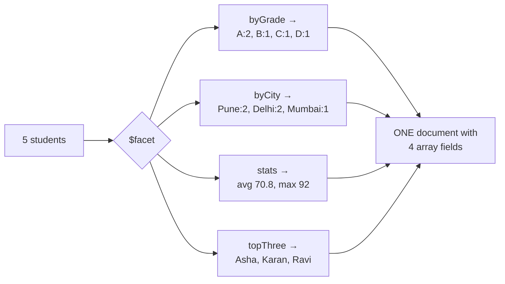
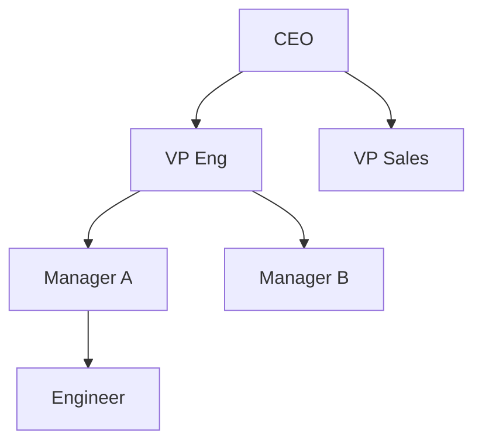

# Aggregation Stages Reference

> Every stage worth knowing, each with a **worked trace** showing the documents going in and coming out.
> The five core stages (`$match`, `$project`, `$group`, `$sort`, `$unwind`, `$lookup`) are traced in detail on [Aggregation Fundamentals](./05-aggregation-fundamentals.md). This page covers everything else.

Sample collection used throughout:

```js
// db.students
{ _id: 1, name: "Asha",  score: 92, grade: "A", subject: "Math",    city: "Pune"   }
{ _id: 2, name: "Ravi",  score: 78, grade: "B", subject: "Math",    city: "Delhi"  }
{ _id: 3, name: "Meera", score: 55, grade: "C", subject: "Science", city: "Pune"   }
{ _id: 4, name: "Karan", score: 88, grade: "A", subject: "Science", city: "Mumbai" }
{ _id: 5, name: "Nisha", score: 41, grade: "D", subject: "Math",    city: "Delhi"  }
```

---

## Reshaping stages

### `$replaceRoot` / `$replaceWith`

Promotes a sub-document to be the top-level document. `$replaceWith` (4.2+) is the shorthand.

```js
{ $replaceRoot: { newRoot: "$address" } }
{ $replaceWith: "$address" }              // identical
```

```text
IN                                              OUT
{ _id:1, name:"Asha",                      ▶    { city:"Pune", pin:"411001" }
  address:{ city:"Pune", pin:"411001" } }        ^^^ name and _id are GONE
```

The common production form merges the nested document with fields from the parent, so nothing is lost:

```js
{ $replaceRoot: { newRoot: { $mergeObjects: ["$address", { name: "$name" }] } } }
// → { city:"Pune", pin:"411001", name:"Asha" }
```

This is the second half of the `$$ROOT` idiom: `$group` captures the whole document into a field, `$replaceRoot` promotes it back.

### `$unset`

Removes fields. The inverse of an inclusion `$project`, and clearer than `{ $project: { x: 0 } }`.

```js
{ $unset: ["password", "internal.debugFlag"] }
```

### `$documents`

Generates a document stream from literals — no collection needed. Great for testing an expression in isolation.

```js
db.aggregate([
  { $documents: [{ x: 5 }, { x: 12 }] },
  { $addFields: { doubled: { $multiply: ["$x", 2] } } },
]);
// → [{ x:5, doubled:10 }, { x:12, doubled:24 }]
```

Use this to debug a gnarly expression without touching real data. It's also how you build a lookup table inline.

---

## Counting & bucketing stages

### `$count`

```js
{ $count: "totalStudents" }
// IN: 5 documents  →  OUT: [ { totalStudents: 5 } ]
```

Shorthand for `{ $group: { _id: null, n: { $sum: 1 } } }, { $project: { _id: 0, n: 1 } }`.

### `$sortByCount`

"Group by this, count, sort descending" in one stage — the single most common analytics shape.

```js
{ $sortByCount: "$subject" }
```

```text
IN                          OUT
subject: Math    (×3)  ▶    { _id: "Math",    count: 3 }
subject: Science (×2)       { _id: "Science", count: 2 }
```

Equivalent to `{ $group: { _id: "$subject", count: { $sum: 1 } } }, { $sort: { count: -1 } }`.

### `$bucket` — fixed boundaries

You define the edges. Every input document must fall into one, or you must supply `default`.

```js
{ $bucket: {
    groupBy: "$score",
    boundaries: [0, 50, 70, 90, 100],     // [0,50) [50,70) [70,90) [90,100)
    default: "Other",
    output: { count: { $sum: 1 }, names: { $push: "$name" } }
}}
```

```text
scores: 92, 78, 55, 88, 41

  0 ─────── 50 ─────── 70 ─────── 90 ─────── 100
  │  41     │   55     │  78, 88  │   92     │
  └─────────┴──────────┴──────────┴──────────┘

OUT:
{ _id: 0,  count: 1, names: ["Nisha"] }
{ _id: 50, count: 1, names: ["Meera"] }
{ _id: 70, count: 2, names: ["Ravi","Karan"] }
{ _id: 90, count: 1, names: ["Asha"] }
```

Rules: boundaries must be sorted ascending and all the same type; `_id` is the **lower** bound of the bucket; intervals are **`[inclusive, exclusive)`**; a value outside all boundaries errors unless `default` is set.

:::warning
`$bucket` emits **no document for an empty bucket**. If your histogram needs a zero bar for the 70–90 range, you must add it yourself in the application or with `$densify`.
:::

### `$bucketAuto` — automatic boundaries

You say how many buckets you want; MongoDB distributes documents as evenly as it can.

```js
{ $bucketAuto: { groupBy: "$score", buckets: 3, output: { count: { $sum: 1 } } } }
// → { _id: { min: 41, max: 78 }, count: 2 }
//   { _id: { min: 78, max: 90 }, count: 2 }
//   { _id: { min: 90, max: 92 }, count: 1 }
```

`_id` here is a `{ min, max }` document, not a scalar. Optional `granularity` (`"R5"`, `"E12"`, `"POWERSOF2"`, …) snaps the boundaries to a preferred number series so the chart axis reads nicely.

**Choosing between them:** `$bucket` when the boundaries carry business meaning (age brackets, price tiers, SLA thresholds). `$bucketAuto` when you're exploring an unknown distribution or drawing a histogram.

### `$facet` — many pipelines, one pass

Runs several independent sub-pipelines over **the same input** and returns all their results in one document.

```js
{ $facet: {
    byGrade:   [ { $sortByCount: "$grade" } ],
    byCity:    [ { $sortByCount: "$city" } ],
    stats:     [ { $group: { _id: null, avg: { $avg: "$score" }, max: { $max: "$score" } } } ],
    topThree:  [ { $sort: { score: -1 } }, { $limit: 3 }, { $project: { name: 1, score: 1 } } ],
}}
```



Output is **exactly one document**, each key holding an array.

**The killer use case is paginated search:** total count *and* the current page, from one scan of the data.

```js
{ $facet: {
    metadata: [ { $count: "total" } ],
    data:     [ { $skip: 20 }, { $limit: 10 } ],
}},
{ $addFields: { total: { $ifNull: [{ $arrayElemAt: ["$metadata.total", 0] }, 0] } } }
```

Without `$facet` that's two round trips and two scans, and they can disagree if data changes in between.

Restrictions: sub-pipelines cannot contain `$out`, `$merge`, `$geoNear`, or another `$facet`. `$facet` is blocking, and the 16 MB document limit applies to its combined output — so don't put an unbounded `data` facet in it.

---

## Multi-collection stages

### `$unionWith`

Concatenates another collection's documents into the stream — the SQL `UNION ALL`.

```js
db.sales_2025.aggregate([
  { $addFields: { year: 2025 } },
  { $unionWith: {
      coll: "sales_2026",
      pipeline: [ { $addFields: { year: 2026 } } ]   // optional, runs on the other collection
  }},
  { $group: { _id: "$year", total: { $sum: "$amount" } } },
]);
```

```text
sales_2025 (3 docs) ──┐
                      ├──▶ 8 documents in one stream ──▶ $group
sales_2026 (5 docs) ──┘
```

- It is `UNION ALL`, **not `UNION`** — duplicates are kept. Add a `$group` on the identity fields to deduplicate.
- Documents don't need matching shapes.
- Cannot be used inside `$facet`, and on a sharded cluster it can't be nested arbitrarily.

Typical uses: querying across time-partitioned collections, merging a "current" and "archive" collection, or comparing two datasets in one pipeline.

### `$graphLookup` — recursive joins

Follows a self-referencing relationship to arbitrary depth. This is how you do org charts, category trees, comment threads, and social graphs.

```js
// db.employees: { _id, name, reportsTo }
db.employees.aggregate([
  { $match: { name: "CEO" } },
  { $graphLookup: {
      from: "employees",
      startWith: "$_id",             // seed value(s)
      connectFromField: "_id",       // take this field from each found doc…
      connectToField: "reportsTo",   // …and match it against this field to recurse
      as: "allReports",
      maxDepth: 5,                   // optional — 0 means "direct matches only"
      depthField: "level",           // optional — annotate each result with its depth
  }},
]);
```



Starting from CEO, `allReports` contains VP Eng (level 0), VP Sales (0), Manager A (1), Manager B (1), Engineer (2) — the entire subtree flattened into one array.

Notes: it's breadth-first, it handles cycles safely (each document is visited once), the result array counts against the 16 MB limit, and it has its **own 100 MB** memory cap. Index `connectToField` or it will be slow.

### `$out` and `$merge` — writing results back

```js
{ $out: "monthly_report" }                     // REPLACES the entire target collection
```

```js
{ $merge: {
    into: "monthly_report",
    on: "_id",                                  // match key (needs a unique index if not _id)
    whenMatched: "merge",                       // merge | replace | keepExisting | fail | <pipeline>
    whenNotMatched: "insert",                   // insert | discard | fail
}}
```

| | `$out` | `$merge` |
| :--- | :--- | :--- |
| Effect on target | Drops and recreates it | Inserts/updates matching documents |
| Position | Must be the **last** stage | Must be the last stage |
| Incremental updates | ❌ | ✅ |
| Sharded output collection | ❌ | ✅ |
| Existing indexes | Preserved (4.2+) | Preserved |

`$merge` is what makes **materialised views** possible: run a heavy aggregation on a schedule, merge the results into a summary collection, and serve dashboards from a plain `find()`. That's the standard answer to "how do you serve an expensive analytics query at page-load latency?"

---

## Analytics stages

### `$setWindowFields` — window functions (5.0+)

Compute a value for each document **relative to a window of neighbouring documents**, without collapsing the stream. This is SQL's `OVER (PARTITION BY … ORDER BY …)`.

```js
{ $setWindowFields: {
    partitionBy: "$subject",             // like GROUP BY, but nothing collapses
    sortBy: { score: -1 },
    output: {
      rank:        { $rank: {} },
      denseRank:   { $denseRank: {} },
      rowNumber:   { $documentNumber: {} },
      runningTotal:{ $sum: "$score", window: { documents: ["unbounded", "current"] } },
      movingAvg:   { $avg: "$score", window: { documents: [-1, 1] } },
      pctOfSubject:{ $sum: "$score", window: { documents: ["unbounded", "unbounded"] } },
    }
}}
```

Traced on the Math partition (`Asha 92, Ravi 78, Nisha 41`):

```text
name    score   rank   runningTotal   movingAvg(prev,cur,next)
Asha     92      1         92          (92+78)/2      = 85
Ravi     78      2        170          (92+78+41)/3   = 70.33
Nisha    41      3        211          (78+41)/2      = 59.5
```

**Nothing was collapsed** — five documents in, five documents out, each enriched. That is the entire point, and it's the difference between `$setWindowFields` and `$group`.

Window bounds come in two flavours:

- `documents: [-1, 1]` — positional: previous, current, next.
- `range: [-7, 0], unit: "day"` — value-based on the `sortBy` field. This is how you do a true trailing-7-day average, correctly handling missing days.

Ranking operators: `$rank` (ties share a rank, then it skips — 1,2,2,4), `$denseRank` (ties share, no skip — 1,2,2,3), `$documentNumber` (always unique — 1,2,3,4).

Also available: `$shift` (peek at another row — the previous day's value, for period-over-period deltas), `$derivative`, `$integral`, `$expMovingAvg`, `$linearFill`, `$locf`.

:::tip[Before 5.0]
The same result needed `$group` + `$push` + `$unwind` with `includeArrayIndex`, or a self-`$lookup`. If an interviewer asks how you'd rank rows in MongoDB, lead with `$setWindowFields` and mention the old workaround — it shows you know the version history.
:::

### `$densify` and `$fill` (5.1+ / 5.3+)

`$densify` inserts the **missing** documents in a sequence — the "no sales on Tuesday means no bar in my chart" problem.

```js
{ $densify: {
    field: "date",
    range: { step: 1, unit: "day", bounds: "full" },
    partitionByFields: ["region"],
}}
```

`$fill` then populates the gaps:

```js
{ $fill: {
    sortBy: { date: 1 },
    partitionByFields: ["region"],
    output: {
      revenue: { value: 0 },            // constant
      price:   { method: "locf" },      // last observation carried forward
      temp:    { method: "linear" },    // linear interpolation
    }
}}
```

Together they turn a sparse event log into a dense, chartable time series — entirely server-side.

### `$geoNear`

```js
{ $geoNear: {
    near: { type: "Point", coordinates: [73.85, 18.52] },
    distanceField: "distanceMeters",
    maxDistance: 5000,
    query: { cuisine: "Indian" },
    spherical: true,
}}
```

Must be the **first** stage, and requires a geospatial index. It outputs documents sorted nearest-first with the computed distance added.

### `$sample`

```js
{ $sample: { size: 100 } }
```

Random documents. If it's the first stage, `size` is small, and it's under 5 % of the collection, it uses an efficient random-cursor strategy; otherwise it degrades to a full scan with a random sort.

### `$redact`

Field-level access control evaluated per sub-document, descending recursively.

```js
{ $redact: {
    $cond: {
      if: { $in: ["$level", userClearances] },
      then: "$$DESCEND",     // keep this level, examine children
      else: "$$PRUNE",       // remove this sub-document entirely
    }
}}
```

Third option: `$$KEEP` — keep this sub-document and everything under it without further checks. Niche, but it's the right answer for multi-level document redaction.

---

## Stage selection cheat sheet

| You want to… | Stage |
| :--- | :--- |
| Filter documents | `$match` |
| Add computed fields, keep the rest | `$addFields` / `$set` |
| Output only specific fields | `$project` |
| Drop fields | `$unset` |
| Collapse and aggregate | `$group` |
| Aggregate **without** collapsing | `$setWindowFields` |
| Count | `$count` |
| Group + count + sort desc | `$sortByCount` |
| Histogram with my own edges | `$bucket` |
| Histogram, edges chosen for me | `$bucketAuto` |
| Several different summaries in one pass | `$facet` |
| Total count + a page of results | `$facet` with `metadata` and `data` |
| Join another collection | `$lookup` (prefer the `let`+`pipeline` form) |
| Follow a hierarchy recursively | `$graphLookup` |
| Concatenate another collection | `$unionWith` |
| Flatten an array into rows | `$unwind` |
| Promote a sub-document to root | `$replaceRoot` / `$replaceWith` |
| Rank rows | `$setWindowFields` + `$rank` |
| Running total / moving average | `$setWindowFields` with a `window` |
| Fill gaps in a time series | `$densify` + `$fill` |
| Save results to a collection | `$merge` (incremental) or `$out` (replace) |
| Nearest by location | `$geoNear` (must be first) |
| Random sample | `$sample` |

---

**Next:** [Operators Reference →](./07-operators-reference.md) — every expression operator, with examples you can copy.
