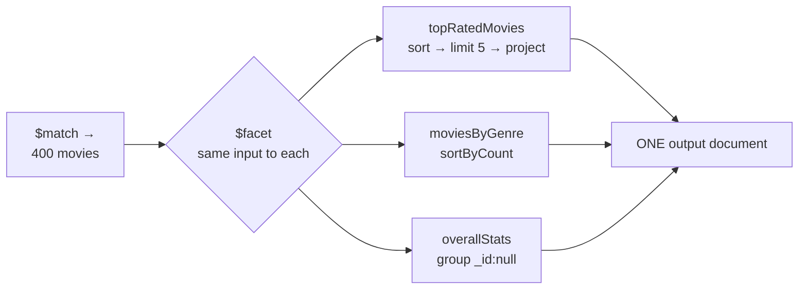

# Intermediate Practice — Questions 9–20

> **Focus**: post-group filtering, `$bucket`, `$facet`, `$size`, `$filter`, `$map`, date grouping.
>
> Every solution includes a **stage-by-stage trace**. Where two approaches exist, both are shown with the trade-off spelled out — that comparison is usually the real interview question.

---

## Topic: Filtering Aggregates

### Question 9: `$match` after `$group` (the `HAVING` clause)

Calculate the average salary per department, and return only departments whose average exceeds 50,000.

```js
// db.employees
{ _id: 1, name: "Asha",  department: "Eng",     salary: 90000 }
{ _id: 2, name: "Ravi",  department: "Eng",     salary: 70000 }
{ _id: 3, name: "Meera", department: "Sales",   salary: 40000 }
{ _id: 4, name: "Karan", department: "Sales",   salary: 45000 }
{ _id: 5, name: "Nisha", department: "Support", salary: 30000 }
```

<details>
<summary>**Solution & Trace**</summary>

```js
db.employees.aggregate([
  { $group: { _id: "$department", avgSalary: { $avg: "$salary" }, headcount: { $sum: 1 } } },
  { $match: { avgSalary: { $gt: 50000 } } },
  { $project: { _id: 0, department: "$_id", avgSalary: { $round: ["$avgSalary", 2] }, headcount: 1 } },
]);
```

**Trace:**

```text
INPUT (5 docs)

── $group by department ─────────── 5 → 3 docs
  { _id:"Eng",     avgSalary: (90000+70000)/2 = 80000,  headcount: 2 }
  { _id:"Sales",   avgSalary: (40000+45000)/2 = 42500,  headcount: 2 }
  { _id:"Support", avgSalary: 30000,                    headcount: 1 }
  ⚠️  name and salary no longer exist on these documents

── $match: avgSalary > 50000 ────── 3 → 1 doc
  Eng     80000  ✓
  Sales   42500  ✗
  Support 30000  ✗

── $project ─────────────────────── 1 → 1 doc
  { department: "Eng", avgSalary: 80000, headcount: 2 }
```

**Answering the bonus — "why does `$match` after `$group` differ from filtering before?"**

This is the whole point of the question. The two filter *different things*:

```js
// A) FILTER FIRST — WHERE semantics. Changes which employees are averaged.
[
  { $match: { salary: { $gt: 50000 } } },      // drops Meera, Karan, Nisha
  { $group: { _id: "$department", avgSalary: { $avg: "$salary" } } },
]
// → Eng: 80000 only. Sales appears with NO employees... actually Sales vanishes entirely,
//   because no Sales employee survived the filter. Support vanishes too.

// B) FILTER AFTER — HAVING semantics. Averages everyone, then drops weak departments.
[
  { $group: { … } },
  { $match: { avgSalary: { $gt: 50000 } } },
]
// → Eng: 80000. Sales and Support computed (42500, 30000) then discarded.
```

Now make the difference concrete with a department where it actually diverges. Add `{ name: "Dev", department: "Sales", salary: 200000 }`:

| | Sales average | Sales in output? |
| :--- | :--- | :--- |
| **A) filter first** | only Dev qualifies → **200,000** | ✅ Yes |
| **B) filter after** | (40000+45000+200000)/3 = **95,000** | ✅ Yes |

Two different numbers, both from valid pipelines. **(A) answers "average of high earners per department." (B) answers "departments whose average is high."** Completely different business questions.

:::tip[The one-liner]
`$match` before `$group` = SQL `WHERE` (filters rows, uses an index).
`$match` after `$group` = SQL `HAVING` (filters aggregates, cannot use an index).
Production pipelines usually want **both**: a `$match` first for the date range and status, and a `$match` after for the threshold.
:::

</details>

---

## Topic: Bucketing

### Question 10: `$bucket`

Group transactions into amount ranges and report the count plus the transactions in each range.

```js
// db.transactions
{ transactionId: 1, amount: 50   }
{ transactionId: 2, amount: 120  }
{ transactionId: 3, amount: 350  }
{ transactionId: 4, amount: 600  }
{ transactionId: 5, amount: 950  }
{ transactionId: 6, amount: 1500 }
```

<details>
<summary>**Solution & Trace**</summary>

```js
db.transactions.aggregate([
  {
    $bucket: {
      groupBy: "$amount",
      boundaries: [0, 100, 500, 1000],
      default: "1000+",
      output: {
        totalTransactions: { $sum: 1 },
        transactions: { $push: "$$ROOT" },
        avgAmount: { $avg: "$amount" },
      },
    },
  },
]);
```

**Trace — visualise the number line:**

```text
   0 ────────── 100 ────────── 500 ────────── 1000 ────────── ∞
   │    [0,100)  │   [100,500)  │  [500,1000)  │   "1000+"    │
   │             │              │              │  (default)   │
   │     50      │   120, 350   │   600, 950   │    1500      │
   └─────────────┴──────────────┴──────────────┴──────────────┘
        1 txn        2 txns        2 txns          1 txn

OUTPUT — _id is the LOWER boundary of each bucket
  { _id: 0,       totalTransactions: 1, avgAmount: 50,  transactions: [ {1, 50} ] }
  { _id: 100,     totalTransactions: 2, avgAmount: 235, transactions: [ {2,120}, {3,350} ] }
  { _id: 500,     totalTransactions: 2, avgAmount: 775, transactions: [ {4,600}, {5,950} ] }
  { _id: "1000+", totalTransactions: 1, avgAmount: 1500,transactions: [ {6,1500} ] }
```

**The rules to state:**

1. Intervals are **`[inclusive, exclusive)`**. An amount of exactly 100 goes into the `[100, 500)` bucket, not `[0, 100)`.
2. `_id` is the **lower** boundary — a number, except for the `default` bucket where it's whatever you named.
3. Without `default`, an amount outside all boundaries **throws an error and kills the pipeline**. With six-figure transactions in production data, omitting `default` is a time bomb.
4. Boundaries must be sorted ascending and of a single type.
5. **Empty buckets emit nothing.** If no transaction were between 100 and 500, that bucket would simply be absent from the output — your histogram silently loses a bar. Fix it client-side, or with `$densify`.

:::warning[`$push: "$$ROOT"` and the 16 MB limit]
Pushing whole documents into a bucket is fine for six transactions and fatal for six million — a single output document cannot exceed 16 MB. In production, push only what you need (`{ $push: { id: "$transactionId", amt: "$amount" } }`) or just accumulate counts and sums.
:::

**Bonus — "what if the ranges aren't predefined?"** Use `$bucketAuto`, which chooses boundaries to distribute documents evenly:

```js
{ $bucketAuto: { groupBy: "$amount", buckets: 4, output: { count: { $sum: 1 } } } }
// → { _id: { min: 50,  max: 350 },  count: 2 }
//   { _id: { min: 350, max: 600 },  count: 1 }
//   { _id: { min: 600, max: 1500 }, count: 2 }
//   { _id: { min: 1500,max: 1500 }, count: 1 }
```

Note `_id` becomes a `{ min, max }` document instead of a scalar. Add `granularity: "R10"` or `"POWERSOF2"` to snap the boundaries to round numbers for charting.

**Choosing between them:** `$bucket` when the boundaries carry business meaning (regulatory reporting thresholds, pricing tiers). `$bucketAuto` when exploring an unknown distribution.

</details>

---

### Question 11: `$facet` — parallel analysis

In **one** query, return the top 5 highest-rated movies *and* a count of movies per genre.

<details>
<summary>**Solution & Trace**</summary>

```js
db.movies.aggregate([
  { $match: { releaseYear: { $gte: 2000 } } },      // shared prefix — runs ONCE
  {
    $facet: {
      topRatedMovies: [
        { $sort: { rating: -1 } },
        { $limit: 5 },
        { $project: { _id: 0, title: 1, rating: 1 } },
      ],
      moviesByGenre: [
        { $sortByCount: "$genre" },
      ],
      overallStats: [
        { $group: { _id: null, avgRating: { $avg: "$rating" }, total: { $sum: 1 } } },
      ],
    },
  },
]);
```

**Trace:**



```text
OUTPUT — exactly ONE document, each key an array
{
  topRatedMovies: [ {title:"The Dark Knight", rating:9.0}, {title:"Inception", rating:8.8}, … ],
  moviesByGenre:  [ {_id:"Drama", count:120}, {_id:"Action", count:95}, … ],
  overallStats:   [ {_id:null, avgRating:7.1, total:400} ]
}
```

**Answering both bonus questions properly:**

*"Why prefer `$facet` over two separate queries?"* — Three reasons, and the third is the one candidates miss:

1. **One round trip** instead of two.
2. **The shared prefix runs once.** Everything before `$facet` (here the `$match`) is executed a single time and its output feeds every sub-pipeline. Two separate queries would scan and filter twice.
3. **Consistency.** Both results come from the *same snapshot* of the data. Run two queries and a write in between can make your "total: 400" disagree with a 401-row list — the classic pagination off-by-one that's impossible to reproduce.

*"When does `$facet` get expensive?"* —

- It is **blocking**: nothing is emitted until every sub-pipeline finishes.
- The combined output is **one document, capped at 16 MB**. A facet returning thousands of full documents will hit it.
- **Sub-pipelines cannot use indexes.** Only the shared prefix before `$facet` can. So `{ $facet: { a: [{ $match: … }] } }` scans everything — always push filters *before* the `$facet`.
- Cannot contain `$out`, `$merge`, `$geoNear`, or a nested `$facet`.

**The most valuable real-world use — paginated results with a total count:**

```js
[
  { $match: query },
  { $facet: {
      metadata: [ { $count: "total" } ],
      data:     [ { $sort: { createdAt: -1 } }, { $skip: skip }, { $limit: limit } ],
  }},
  { $project: {
      data: 1,
      total: { $ifNull: [{ $arrayElemAt: ["$metadata.total", 0] }, 0] },
  }},
]
```

The `$ifNull` matters: when nothing matches, `metadata` is an **empty array**, `$arrayElemAt` returns missing, and `total` would be absent instead of `0`. That's a real bug your front-end will notice.

</details>

---

### Question 12: Category insights

For each product category, compute the average price (rounded to 2 dp) and total stock. Sort by total stock descending.

```js
// db.products
{ productId: "P1", category: "Electronics", price: 1200, stock: 30  }
{ productId: "P2", category: "Electronics", price: 800,  stock: 50  }
{ productId: "P3", category: "Furniture",   price: 350,  stock: 15  }
{ productId: "P4", category: "Furniture",   price: 700,  stock: 20  }
{ productId: "P5", category: "Books",       price: 25,   stock: 100 }
{ productId: "P6", category: "Books",       price: 40,   stock: 60  }
```

<details>
<summary>**Solution & Trace**</summary>

```js
db.products.aggregate([
  { $group: { _id: "$category", avgPrice: { $avg: "$price" }, totalStock: { $sum: "$stock" } } },
  { $sort: { totalStock: -1 } },
  { $project: { _id: 0, categoryName: "$_id", avgPrice: { $round: ["$avgPrice", 2] }, totalStock: 1 } },
]);
```

**Trace:**

```text
── $group ─────────────────────── 6 → 3 docs
  Electronics: avgPrice (1200+800)/2 = 1000,  totalStock 30+50  = 80
  Furniture:   avgPrice (350+700)/2  = 525,   totalStock 15+20  = 35
  Books:       avgPrice (25+40)/2    = 32.5,  totalStock 100+60 = 160

── $sort: totalStock desc ─────── 3 → 3 docs
  Books 160 → Electronics 80 → Furniture 35

── $project ───────────────────── 3 → 3 docs
  { categoryName:"Books",       avgPrice: 32.5, totalStock: 160 }
  { categoryName:"Electronics", avgPrice: 1000, totalStock: 80  }
  { categoryName:"Furniture",   avgPrice: 525,  totalStock: 35  }
```

**Two details worth defending:**

1. **`$sort` before `$project`, not after.** Here it works either way, but if `$project` had renamed `totalStock`, a later `$sort` on the old name would silently sort nothing. Sorting on fields that still exist is the safer habit. (The optimiser can often reorder these itself — but don't rely on it.)

2. **`$round` at the end, not inside `$group`.** Rounding each value before averaging would compound error. Compute at full precision, round once for presentation.

:::warning[If price were money]
`$avg` on doubles gives `32.5` here, but `(0.1+0.2)/2` on doubles is not exactly `0.15`. For currency, store `Decimal128` — `$avg` and `$sum` handle it exactly. See [BSON types](./01-document-model.md#bson-type-table).
:::

</details>

---

## Topic: Joins & Relationships

### Question 13: Derived counts with `$size`

For each post, return the title and the total number of comments. **All** posts must appear, including those with none.

```js
// db.posts
{ postId: 1, title: "MongoDB Basics",        author: "Alice"   }
{ postId: 2, title: "Advanced Aggregations", author: "Bob"     }
{ postId: 3, title: "Indexing Deep Dive",    author: "Charlie" }

// db.comments
{ commentId: 101, postId: 1, commenter: "Tom",   content: "Great explanation!" }
{ commentId: 102, postId: 1, commenter: "Jerry", content: "Very helpful."      }
{ commentId: 103, postId: 2, commenter: "Anna",  content: "Nice examples."     }
```

<details>
<summary>**Solution & Trace**</summary>

```js
db.posts.aggregate([
  { $lookup: { from: "comments", localField: "postId", foreignField: "postId", as: "postComments" } },
  { $project: { _id: 0, title: 1, totalComments: { $size: "$postComments" } } },
]);
```

**Trace:**

```text
── $lookup ────────────────────── 3 → 3 docs (count NEVER changes)
  postId 1  postComments: [ {101,…}, {102,…} ]     ← 2 elements
  postId 2  postComments: [ {103,…} ]              ← 1 element
  postId 3  postComments: [ ]                      ← EMPTY ARRAY (left outer join)

── $project with $size ────────── 3 → 3 docs
  { title:"MongoDB Basics",        totalComments: 2 }
  { title:"Advanced Aggregations", totalComments: 1 }
  { title:"Indexing Deep Dive",    totalComments: 0 }   ← $size of [] = 0 ✓
```

:::tip[Why this beats `$unwind` + `$group` — the key insight]
`$size` counts the array **in place**. No `$unwind`, so:

- No cardinality explosion (3 documents in, 3 documents out).
- **Posts with zero comments come out as `0` for free**, because `$size` of an empty array is `0`. With `$unwind` you'd need `preserveNullAndEmptyArrays` *and* conditional counting to get the same result.
- No regrouping stage, so it's faster.

**Rule: if you only need a count or a simple aggregate of a joined array, use `$size`/`$sum`/`$avg` directly on the array. Reach for `$unwind` only when you need to aggregate *across* documents.**
:::

**Bonus — "only posts with at least one comment?"**

```js
{ $match: { totalComments: { $gt: 0 } } }         // after the $project
// or, more efficiently, before the $project:
{ $match: { "postComments.0": { $exists: true } } }   // "array has an index 0" = non-empty
```

The `"postComments.0"` trick is the idiomatic non-empty-array test and is worth knowing.

**Production note:** `$size` on the result of a `$lookup` still pulls **every matching comment document over from the other collection** just to count them. On a post with 50,000 comments that's wasteful. Two better answers:

```js
// A) Count inside the join — nothing is materialised
{ $lookup: {
    from: "comments",
    let: { pid: "$postId" },
    pipeline: [ { $match: { $expr: { $eq: ["$postId", "$$pid"] } } }, { $count: "n" } ],
    as: "c",
}},
{ $addFields: { totalComments: { $ifNull: [{ $arrayElemAt: ["$c.n", 0] }, 0] } } }

// B) Best of all — maintain commentCount on the post (the computed pattern).
//    No join at any read. See Data Modeling.
```

</details>

---

### Question 14: The same result via `$unwind` + `$group`

Produce the identical post-comment summary using `$lookup` → `$unwind` → `$group`, and compare it with Question 13.

<details>
<summary>**Solution & Trace**</summary>

```js
db.posts.aggregate([
  { $lookup: { from: "comments", localField: "postId", foreignField: "postId", as: "postComments" } },
  { $unwind: { path: "$postComments", preserveNullAndEmptyArrays: true } },
  {
    $group: {
      _id: "$postId",
      title: { $first: "$title" },                        // carry the title through
      totalComments: {
        $sum: { $cond: [{ $ne: ["$postComments", null] }, 1, 0] },   // ← conditional count
      },
    },
  },
  { $project: { _id: 0, title: 1, totalComments: 1 } },
]);
```

**Trace — note how the document count moves:**

```text
── $lookup ─────────────────────────────── 3 → 3 docs
  1 "MongoDB Basics"        postComments: [c101, c102]
  2 "Advanced Aggregations" postComments: [c103]
  3 "Indexing Deep Dive"    postComments: []

── $unwind (preserveNullAndEmptyArrays) ── 3 → 4 docs  ⚠️ EXPLOSION
  1 "MongoDB Basics"        postComments: c101
  1 "MongoDB Basics"        postComments: c102     ← post 1 duplicated
  2 "Advanced Aggregations" postComments: c103
  3 "Indexing Deep Dive"    <postComments ABSENT>  ← preserved as a PHANTOM row

── $group by postId ────────────────────── 4 → 3 docs
  post 1: $cond(c101 ≠ null)=1, $cond(c102 ≠ null)=1  → 2 ✓
  post 2: $cond(c103 ≠ null)=1                        → 1 ✓
  post 3: $cond(missing ≠ null)=0                     → 0 ✓
```

:::danger[The phantom row — the trap this question exists to teach]
Write `{ $sum: 1 }` instead of the `$cond`, and the trace becomes:

```text
  post 3: $sum 1 over its ONE phantom row  →  1     ❌ WRONG
```

**"Indexing Deep Dive" reports 1 comment when it has zero.** No error, no warning — and the number looks plausible enough to ship. Every user with no orders shows 1 order. Every post with no comments shows 1 comment.

`$ne: [..., null]` catches both an absent field and an explicit null, which is exactly what `preserveNullAndEmptyArrays` leaves behind.
:::

**Q13 vs Q14 — the comparison the interviewer wants:**

| | Q13: `$size` | Q14: `$unwind` + `$group` |
| :--- | :--- | :--- |
| Stages | 2 | 4 |
| Peak document count | 3 | 4 (grows with total comments) |
| Zero-comment posts | Free (`$size` of `[]` = 0) | Needs `preserve` **and** `$cond` |
| Fields survive automatically | ✅ | ❌ must `$first` each one |
| Blocking stages | none | `$group` |
| Correct answer here | **Yes — use this** | Overkill |

**So when *is* `$unwind` + `$group` right?** When you must aggregate **across** documents on the exploded elements — "total quantity sold per product across all orders" (Question 15) genuinely requires it, because the grouping key lives *inside* the array and spans documents. Counting elements within one document never does.

</details>

---

### Question 15: `$unwind` + `$group` — total quantity per product

Each order has an `items` array. Compute total quantity sold per product, most-sold first.

```js
// db.orders
{ orderId: "O1", customerId: "C1", items: [ { productId: "P1", quantity: 2, price: 100 },
                                            { productId: "P2", quantity: 1, price: 250 } ] }
{ orderId: "O2", customerId: "C2", items: [ { productId: "P1", quantity: 3, price: 100 } ] }
{ orderId: "O3", customerId: "C1", items: [ { productId: "P3", quantity: 5, price: 50  },
                                            { productId: "P1", quantity: 1, price: 100 } ] }
```

<details>
<summary>**Solution & Trace**</summary>

```js
db.orders.aggregate([
  { $unwind: "$items" },
  { $group: { _id: "$items.productId", totalQuantitySold: { $sum: "$items.quantity" } } },
  { $sort: { totalQuantitySold: -1 } },
  { $project: { _id: 0, productId: "$_id", totalQuantitySold: 1 } },
]);
```

**Trace — the classic explode-then-collapse shape:**

```text
INPUT: 3 orders containing 5 line items total

── $unwind: "$items" ───────────── 3 → 5 docs
  O1  items: {P1, qty 2, 100}
  O1  items: {P2, qty 1, 250}      ← O1 appears twice now
  O2  items: {P1, qty 3, 100}
  O3  items: {P3, qty 5, 50}
  O3  items: {P1, qty 1, 100}      ← O3 appears twice
  ⚠️ orderId is no longer unique — that's expected and fine

── $group by items.productId ───── 5 → 3 docs
  P1: 2 + 3 + 1 = 6      ← contributions from THREE different orders
  P2: 1
  P3: 5

── $sort desc ──────────────────── 3 docs reordered
── $project ───────────────────────
  { productId: "P1", totalQuantitySold: 6 }
  { productId: "P3", totalQuantitySold: 5 }
  { productId: "P2", totalQuantitySold: 1 }
```

**Why `$unwind` is genuinely required here** (unlike Q14): the grouping key `productId` lives *inside* the array, and P1's total is assembled from three different parent documents. You cannot compute a cross-document group without first putting each array element on its own row. That's the test for whether `$unwind` is justified.

**Bonus — "top 3 best sellers?"**

```js
{ $sort: { totalQuantitySold: -1 } },
{ $limit: 3 },
```

`$sort` immediately followed by `$limit` triggers the optimiser's **top-K** rewrite: only 3 documents are held in memory instead of the whole sorted set. Never separate those two stages.

**Production form** — filter and shrink before exploding:

```js
[
  { $match: { orderDate: { $gte: since }, status: "PAID" } },   // ① index-backed, first
  { $project: { items: 1 } },                                   // ② drop unused fields
  { $unwind: "$items" },                                        // ③ explode the small set
  { $group: { _id: "$items.productId", qty: { $sum: "$items.quantity" } } },
  { $sort: { qty: -1 } }, { $limit: 3 },
]
```

Filtering *before* `$unwind` is the single biggest performance lever in this shape — the explosion multiplies whatever you feed it.

</details>

---

### Question 16: Top 3 borrowed authors

Each `library` document is a book with an `author` and a `borrowedCount`. Find the top 3 authors by total borrows.

<details>
<summary>**Solution & Trace**</summary>

```js
db.library.aggregate([
  { $group: { _id: "$author", borrowedTotal: { $sum: "$borrowedCount" }, books: { $sum: 1 } } },
  { $sort: { borrowedTotal: -1 } },
  { $limit: 3 },
  { $project: { _id: 0, author: "$_id", borrowedTotal: 1, books: 1 } },
]);
```

**Trace:**

```text
INPUT
  {author:"Tolkien", title:"LOTR",     borrowedCount: 120}
  {author:"Tolkien", title:"Hobbit",   borrowedCount: 90 }
  {author:"Austen",  title:"Emma",     borrowedCount: 60 }
  {author:"Orwell",  title:"1984",     borrowedCount: 200}
  {author:"Orwell",  title:"Animal F", borrowedCount: 45 }
  {author:"Dickens", title:"Oliver",   borrowedCount: 30 }

── $group ─────────  6 → 4 docs
  Tolkien 210 (2 books) | Orwell 245 (2) | Austen 60 (1) | Dickens 30 (1)

── $sort desc ─────  Orwell 245, Tolkien 210, Austen 60, Dickens 30
── $limit 3 ───────  Orwell, Tolkien, Austen        ← Dickens dropped
── $project ───────  { author:"Orwell",  borrowedTotal:245, books:2 }
                     { author:"Tolkien", borrowedTotal:210, books:2 }
                     { author:"Austen",  borrowedTotal:60,  books:1 }
```

**Bonus — "top 3 authors *per genre*?"** This is a real step up: **top-N-per-group**. Two approaches.

```js
// A) Classic: double $group with a $sort in between (works on every version)
[
  { $group: { _id: { genre: "$genre", author: "$author" }, total: { $sum: "$borrowedCount" } } },
  { $sort: { "_id.genre": 1, total: -1 } },                  // ← this sort gives $push its meaning
  { $group: { _id: "$_id.genre",
              top: { $push: { author: "$_id.author", total: "$total" } } } },
  { $project: { genre: "$_id", _id: 0, top: { $slice: ["$top", 3] } } },   // keep first 3
]

// B) MongoDB 5.2+: $topN says exactly what you mean
[
  { $group: { _id: { genre: "$genre", author: "$author" }, total: { $sum: "$borrowedCount" } } },
  { $group: { _id: "$_id.genre",
              top: { $topN: { n: 3, sortBy: { total: -1 },
                              output: { author: "$_id.author", total: "$total" } } } } },
]
```

**The mechanism in (A):** the middle `$sort` orders authors within each genre by total descending. `$push` preserves incoming order, so `top` arrives pre-sorted and `$slice: 3` takes the winners. Remove that `$sort` and `$slice` returns three arbitrary authors — a bug that looks fine in a small test data set.

**(B) is better** because the intent is explicit, no global sort is required, and it can't silently break if a stage moves. Version-gate your answer: lead with `$topN`, mention (A) for pre-5.2.

</details>

---

### Question 17: Customer total revenue

Each order has `items` with `quantity` and `price`. Compute total revenue per customer as the sum of `quantity × price`.

<details>
<summary>**Solution & Trace**</summary>

```js
db.orders.aggregate([
  { $unwind: "$items" },
  {
    $group: {
      _id: "$customerId",
      totalRevenue: { $sum: { $multiply: ["$items.quantity", "$items.price"] } },
    },
  },
  { $sort: { totalRevenue: -1 } },
  { $project: { _id: 0, customerId: "$_id", totalRevenue: 1 } },
]);
```

**Trace** (same orders as Q15):

```text
── $unwind ─────────────────────── 3 → 5 docs
  O1 C1  {P1, 2×100}
  O1 C1  {P2, 1×250}
  O2 C2  {P1, 3×100}
  O3 C1  {P3, 5×50}
  O3 C1  {P1, 1×100}

── $group by customerId ────────── 5 → 2 docs
  C1: (2×100) + (1×250) + (5×50) + (1×100)
    =   200   +    250   +   250  +   100   = 800
  C2: (3×100)                               = 300

── $sort ──────────────────────────
  { customerId: "C1", totalRevenue: 800 }
  { customerId: "C2", totalRevenue: 300 }
```

Note the multiplication happens **inside `$sum`**, evaluated per document *after* the unwind — so each line item contributes its own subtotal.

:::tip[The better answer — no `$unwind` at all]
`$reduce` computes each order's total **inside the document**, so the stream never explodes:

```js
db.orders.aggregate([
  { $addFields: {
      orderTotal: { $reduce: {
        input: "$items",
        initialValue: 0,
        in: { $add: ["$$value", { $multiply: ["$$this.quantity", "$$this.price"] }] },
      }},
  }},
  { $group: { _id: "$customerId", totalRevenue: { $sum: "$orderTotal" } } },
]);
```

**3 documents stay 3 documents.** With 100,000 orders averaging 5 items, `$unwind` creates 500,000 intermediate documents; `$reduce` creates zero. Same answer, a fraction of the work.

Offering this after giving the `$unwind` answer is a strong close — it shows you know both and can pick on performance grounds. And there's an even better production answer: store `orderTotal` on the order at write time (the [computed pattern](./03-data-modeling.md#the-computed-pattern)) and the pipeline collapses to a single `$group`.
:::

**Bonus — "revenue for a specific date range?"** `$match` **first**, before any unwinding:

```js
{ $match: { orderDate: { $gte: ISODate("2026-01-01"), $lt: ISODate("2026-04-01") } } }
```

</details>

---

## Topic: Array Filtering

### Question 18: `$filter`

For each order, return `orderId` and **only** the items with `quantity > 2`, preserving the document structure.

<details>
<summary>**Solution & Trace**</summary>

```js
db.orders.aggregate([
  {
    $project: {
      _id: 0,
      orderId: 1,
      items: { $filter: { input: "$items", as: "item", cond: { $gt: ["$$item.quantity", 2] } } },
    },
  },
]);
```

**Trace — the document count never changes:**

```text
── $filter ─────────────────────── 3 → 3 docs (each array shrinks in place)

O1  items: [ {P1,qty 2}, {P2,qty 1} ]
      P1: 2 > 2? NO  ✗
      P2: 1 > 2? NO  ✗
    ▶ { orderId:"O1", items: [] }              ← EMPTY, but the order remains

O2  items: [ {P1,qty 3} ]
      P1: 3 > 2? YES ✓
    ▶ { orderId:"O2", items: [ {P1,qty 3} ] }

O3  items: [ {P3,qty 5}, {P1,qty 1} ]
      P3: 5 > 2? YES ✓
      P1: 1 > 2? NO  ✗
    ▶ { orderId:"O3", items: [ {P3,qty 5} ] }
```

**The critical distinction to state:**

```js
{ $match: { "items.quantity": { $gt: 2 } } }   // filters DOCUMENTS — keeps whole orders
                                               // that contain at least one such item,
                                               // with ALL their items intact
{ $filter: { … } }                             // filters ARRAY ELEMENTS within each document
```

`$match` decides *which orders you see*. `$filter` decides *which items you see inside them*. Conflating the two is a genuinely common bug: an "orders with bulk items" report that shows the bulk orders but still lists their single-unit items.

**Bonus — "remove orders where nothing matched?"** Add a `$match` **after** the `$filter`:

```js
{ $match: { "items.0": { $exists: true } } }        // non-empty array
// or equivalently
{ $match: { $expr: { $gt: [{ $size: "$items" }, 0] } } }
```

O1 (empty after filtering) is dropped; O2 and O3 survive. Note `$size` in the query language can't do ranges — that's why this needs `$expr`, or the `"items.0"` existence trick.

**Related array operators worth naming:**

```js
{ $filter: { input: "$items", cond: …, limit: 3 } }    // 5.2+: stop after 3 matches
{ $firstN: { input: "$items", n: 2 } }                  // 5.2+
{ $sortArray: { input: "$items", sortBy: { quantity: -1 } } }   // 5.2+: sort in place
```

</details>

---

## Topic: Array Transformation

### Question 19: `$map`

For each order, transform `items` into `{ productId, totalItemPrice }` where `totalItemPrice = quantity × price`.

<details>
<summary>**Solution & Trace**</summary>

```js
db.orders.aggregate([
  {
    $project: {
      _id: 0,
      orderId: 1,
      items: {
        $map: {
          input: "$items",
          as: "item",
          in: {
            productId: "$$item.productId",
            totalItemPrice: { $multiply: ["$$item.quantity", "$$item.price"] },
          },
        },
      },
    },
  },
]);
```

**Trace:**

```text
── $map ────────────────────────── 3 → 3 docs, arrays same LENGTH, new SHAPE

O1  [ {P1, qty2, price100}, {P2, qty1, price250} ]
    ▶ [ {productId:"P1", totalItemPrice:200}, {productId:"P2", totalItemPrice:250} ]

O2  [ {P1, qty3, price100} ]
    ▶ [ {productId:"P1", totalItemPrice:300} ]

O3  [ {P3, qty5, price50}, {P1, qty1, price100} ]
    ▶ [ {productId:"P3", totalItemPrice:250}, {productId:"P1", totalItemPrice:100} ]
```

**The three array operators, side by side** — memorise this table:

| Operator | Array length out | Analogy | Use for |
| :--- | :--- | :--- | :--- |
| `$filter` | **Smaller** | `Array.filter` | Keep matching elements |
| `$map` | **Same** | `Array.map` | Transform each element |
| `$reduce` | **Scalar** (1 value) | `Array.reduce` | Collapse to a total |

They compose exactly like their JavaScript counterparts:

```js
// Total revenue of bulk items only, computed inside one document
{ $addFields: {
    bulkRevenue: {
      $reduce: {
        input: {
          $map: {
            input: { $filter: { input: "$items", as: "i", cond: { $gt: ["$$i.quantity", 2] } } },
            as: "i",
            in: { $multiply: ["$$i.quantity", "$$i.price"] },
          },
        },
        initialValue: 0,
        in: { $add: ["$$value", "$$this"] },
      },
    },
}}
```

filter → map → reduce, no `$unwind`, no `$group`, no cardinality change. That composition is a genuinely strong thing to be able to write on a whiteboard.

**`$map` with `$mergeObjects`** — to *add* a field to each element rather than replace the shape:

```js
items: { $map: { input: "$items", as: "i",
  in: { $mergeObjects: ["$$i", { total: { $multiply: ["$$i.quantity", "$$i.price"] } }] } } }
// → { productId:"P1", quantity:2, price:100, total:200 }  ← original fields preserved
```

Without `$mergeObjects`, `$map` replaces each element entirely — a frequent surprise.

</details>

---

## Topic: Date-based Aggregation

### Question 20: Monthly revenue report

From `orders` with `orderDate` and `totalAmount`, produce year, month, and total revenue — chronologically.

<details>
<summary>**Solution & Trace**</summary>

```js
db.orders.aggregate([
  { $match: { status: "PAID" } },
  {
    $group: {
      _id: { year: { $year: "$orderDate" }, month: { $month: "$orderDate" } },
      monthlyRevenue: { $sum: "$totalAmount" },
      orderCount: { $sum: 1 },
    },
  },
  { $sort: { "_id.year": 1, "_id.month": 1 } },
  {
    $project: {
      _id: 0,
      year: "$_id.year",
      month: "$_id.month",
      monthlyRevenue: 1,
      orderCount: 1,
      avgOrderValue: { $round: [{ $divide: ["$monthlyRevenue", "$orderCount"] }, 2] },
    },
  },
]);
```

**Trace:**

```text
INPUT
  { orderDate: 2025-11-15, totalAmount: 500 }
  { orderDate: 2025-11-28, totalAmount: 300 }
  { orderDate: 2025-12-02, totalAmount: 700 }
  { orderDate: 2026-11-05, totalAmount: 900 }     ← same MONTH, different YEAR

── $group by {year, month} ─────── 4 → 3 docs
  { _id:{year:2025, month:11}, monthlyRevenue: 800, orderCount: 2 }
  { _id:{year:2025, month:12}, monthlyRevenue: 700, orderCount: 1 }
  { _id:{year:2026, month:11}, monthlyRevenue: 900, orderCount: 1 }

── $sort by _id.year, _id.month ──
  2025-11 → 2025-12 → 2026-11
```

:::danger[Two bugs this question is designed to catch]

**1. Grouping by month alone.**
```js
{ $group: { _id: { $month: "$orderDate" }, … } }   // ❌
```
November 2025 and November 2026 merge into one bucket of 1700. Your year-over-year chart becomes nonsense. **Always include the year** (or use `$dateTrunc`).

**2. Sorting after renaming.** The `$sort` uses `_id.year`/`_id.month` because at that point the fields are still nested under `_id`. Move the `$sort` after the `$project` and it must use `year`/`month` instead — sorting on a field that no longer exists silently does nothing.
:::

**Bonus — "sort chronologically" — three ways, and the modern one is better:**

```js
// A) Composite _id (above) — sorts correctly, client must format
{ $sort: { "_id.year": 1, "_id.month": 1 } }

// B) String key — readable AND lexicographically sortable, because %m is zero-padded
{ $group: { _id: { $dateToString: { format: "%Y-%m", date: "$orderDate" } }, … } },
{ $sort: { _id: 1 } }        // "2025-11" < "2025-12" < "2026-11" ✓

// C) $dateTrunc (5.0+) — BEST: the key stays a real Date
{ $group: { _id: { $dateTrunc: { date: "$orderDate", unit: "month" } }, … } },
{ $sort: { _id: 1 } }
```

**(C) wins** because the key remains a `Date`: downstream range filters work, charting libraries accept it directly, and `$densify` can fill in months with no sales.

:::warning[The timezone bug — mention this unprompted]
MongoDB stores every date in **UTC**. An order placed at 00:30 IST on 1 March is `2026-02-28T19:00Z` — `$month` reports **February**. Your Indian monthly report is wrong at every month boundary.

```js
{ $month: { date: "$orderDate", timezone: "Asia/Kolkata" } }
{ $dateTrunc: { date: "$orderDate", unit: "month", timezone: "Asia/Kolkata" } }
```

Every date operator takes a `timezone`. Any report scoped to a local business day or month needs it. This is a genuine production bug that ships constantly, and naming it is a strong senior signal.
:::

**Filling in months with zero revenue** (a chart with no gaps) — `$densify` + `$fill`:

```js
{ $densify: { field: "_id", range: { step: 1, unit: "month", bounds: "full" } } },
{ $fill: { sortBy: { _id: 1 }, output: { monthlyRevenue: { value: 0 } } } },
```

</details>

---

## What you should now be able to do

- [ ] Explain `WHERE` vs `HAVING` semantics with a worked example where the numbers differ.
- [ ] Choose `$bucket` vs `$bucketAuto`, and know that empty buckets vanish.
- [ ] Use `$facet` for count-plus-page, and explain why the shared prefix runs only once.
- [ ] Reach for `$size`/`$filter`/`$map`/`$reduce` before `$unwind`, and justify when `$unwind` is genuinely required.
- [ ] Write a top-N-per-group pipeline both the classic way and with `$topN`.
- [ ] Never group by month without the year, and never write a local-time report without a `timezone`.

**Next:** [Advanced Practice →](./10-advanced-aggregation.md)
