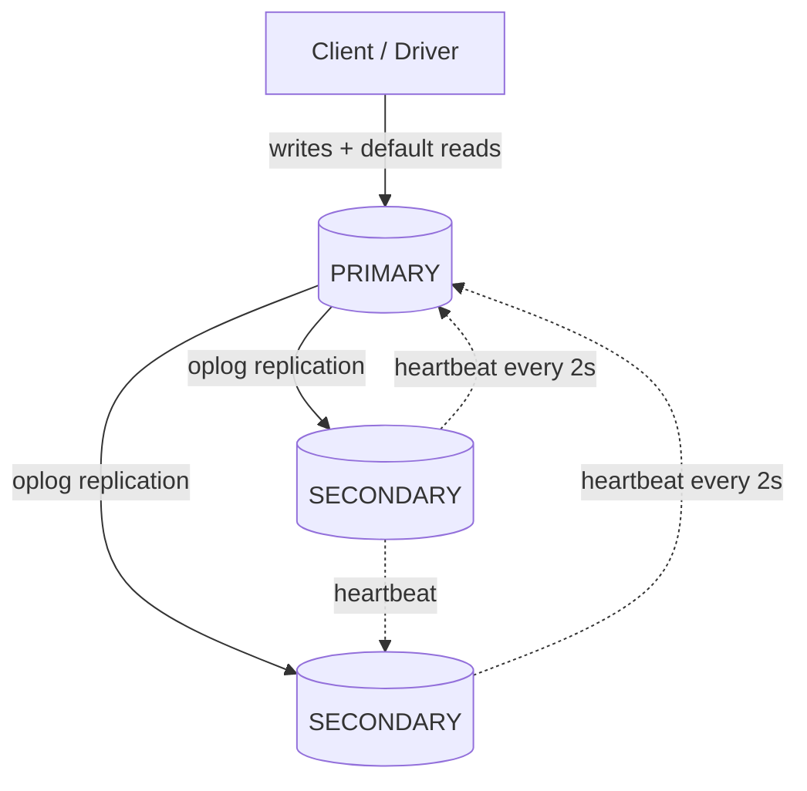
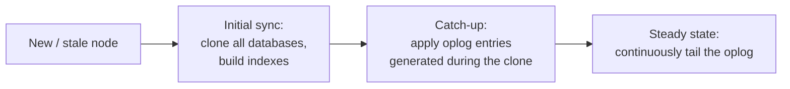
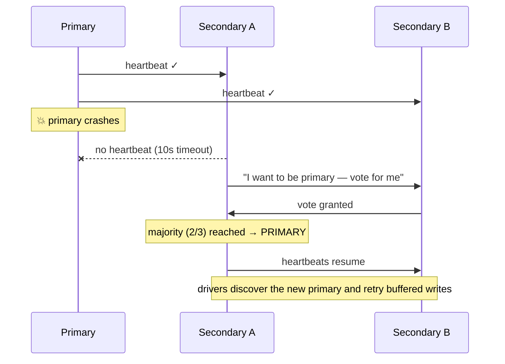

# Replication & Replica Sets

> **What you will be able to do after this page**
>
> - Explain how MongoDB achieves high availability, and what happens during those ~12 seconds of a failover.
> - Choose a read preference and defend the consistency trade-off.
> - Read an oplog entry and explain why the oplog is idempotent.
> - Answer "is MongoDB CP or AP?" correctly — with the nuance that gets you the point.

---

## 1. What a replica set is

A group of `mongod` processes maintaining **the same data set**. One is the **primary** (accepts all writes); the rest are **secondaries** (replicate asynchronously).



**Minimum production topology: 3 nodes.** Not two — with two nodes, losing one leaves a single node that cannot win a majority vote (1 of 2 is not a strict majority), so it steps down to secondary and the set becomes read-only. Three nodes tolerate one failure.

Odd numbers matter for the same reason. If cost forbids a third data-bearing node, add an **arbiter**: a voting member that holds no data. Use it sparingly — an arbiter can't serve reads and can't be promoted, so a 2+arbiter set has no redundancy left after one failure, and it interacts badly with `writeConcern: "majority"`.

---

## 2. The oplog — how replication actually works

The **oplog** (`local.oplog.rs`) is a capped collection on the primary recording every write operation. Secondaries tail it and apply the entries.

```js
// A user runs: db.users.updateOne({_id: 1}, {$inc: {visits: 1}})
// The oplog records the RESOLVED result, not the operation:
{
  ts: Timestamp(1740000000, 1),
  op: "u",                              // i=insert, u=update, d=delete, n=noop, c=command
  ns: "app.users",
  o2: { _id: 1 },
  o: { $v: 2, diff: { u: { visits: 43 } } }   // ← the literal new value: 43
}
```

:::tip[Why the oplog is idempotent — a favourite interview question]
It records **results, not instructions.** The operation was `$inc: 1`, but the oplog stores "set visits to 43." Applying that entry twice yields 43 both times. If it stored `$inc`, a replay during recovery would double-count.

The same principle applies to `$push` (records the resulting array), `$currentDate` (records the resolved timestamp — otherwise every replica would compute a different "now"), and multi-document updates (`updateMany` becomes N separate single-document oplog entries).

Idempotency is what makes crash recovery, initial sync, and rollback safe.
:::

The oplog is **capped** — fixed size, oldest entries drop off. Its size determines the **oplog window**: how far behind a secondary can fall and still catch up incrementally. If a secondary is down longer than the window, it must do a full **initial sync** (copy everything), which on a large data set can take many hours. Monitor `rs.printReplicationInfo()` and size the oplog for at least your worst realistic maintenance window — 24–72 hours is a common target.

### Initial sync vs steady state



---

## 3. Elections and failover

Members exchange heartbeats every **2 seconds**. If a secondary hears nothing from the primary for **10 seconds** (`electionTimeoutMillis`), it calls an election.



The mechanics worth knowing:

- **Raft-like protocol** (protocol version 1). A candidate needs a **strict majority** of votes.
- **Total failover time is typically ~12 seconds**: 10s to detect, ~1–2s to elect and step up.
- **Priority** (`priority: 0` means "never become primary") is how you keep a specific node — say, a cross-region analytics replica — from ever taking writes.
- The candidate with the **most recent oplog** wins; a node that's too far behind can't win.
- During the election window there is **no primary**, so writes fail. Modern drivers buffer and **automatically retry** them (`retryWrites: true`, the default), so a well-configured application sees a latency blip rather than errors.

### Rollback

If the old primary accepted writes that never replicated to a majority, and it rejoins after a new primary has moved on, those writes are **rolled back** — written to a rollback file on disk and removed from the collection.

**How you prevent this:** `writeConcern: { w: "majority" }`. A write acknowledged by a majority of nodes cannot be rolled back, because any new primary must contain it. This is precisely the durability guarantee `w: "majority"` buys, and the reason it's the right default for anything that matters.

---

## 4. Read Preference — where your reads go

Set per-operation, per-collection, or per-connection.

| Mode | Reads from | Use when |
| :--- | :--- | :--- |
| `primary` **(default)** | Primary only | You need read-your-own-writes. **The safe default** |
| `primaryPreferred` | Primary; secondaries if it's down | Availability over consistency during failover |
| `secondary` | Secondaries only | Analytics/reporting that must never touch the primary |
| `secondaryPreferred` | Secondaries; primary if none available | Reporting with a fallback |
| `nearest` | Lowest network latency, either role | Geo-distributed reads where staleness is fine |

```js
db.collection("orders").find(q, { readPreference: "secondaryPreferred" });
```

:::danger[Reading from secondaries is eventually consistent]
Replication is **asynchronous**. A secondary may lag by milliseconds — or by minutes under load. So:

```js
await db.orders.insertOne({ _id: 1, … });                     // goes to primary
await db.orders.findOne({ _id: 1 }, { readPreference: "secondary" });  // may return null
```

This is the classic "I created it and the next page says it doesn't exist" bug. Never point a read-after-write path at a secondary. Use `maxStalenessSeconds` (minimum 90) to at least bound the damage, and use **causal consistency sessions** when you need read-your-writes with secondary reads.
:::

:::warning[The secondary-reads myth]
"Read from secondaries to scale reads" is only half true. Every secondary applies **the same write load** as the primary, so replication does not scale writes at all, and it only adds read capacity if the extra replication overhead is worth it. Replication is fundamentally about **availability and durability**. To scale *throughput*, you shard — see [Sharding](./12-sharding.md).

Saying this unprompted separates a candidate who's read the docs from one who's only read a blog post.
:::

### Tag sets

Route reads by node attributes — geography, hardware class, workload:

```js
// members tagged { dc: "mumbai" }, { dc: "singapore" }, { use: "analytics" }
{ readPreference: { mode: "secondary", tags: [{ use: "analytics" }] } }
```

This is how you isolate a heavy BI workload onto a dedicated node so it can't degrade the transactional path.

---

## 5. Causal consistency

A **session** gives you causal guarantees even when reading from secondaries: reads observe writes that causally preceded them.

```js
const session = client.startSession({ causalConsistency: true });
const orders = client.db("app").collection("orders");

await orders.insertOne({ _id: 1 }, { session });
const doc = await orders.findOne({ _id: 1 }, { session, readPreference: "secondary" });
// ✅ guaranteed to see the insert — the session carries a cluster time the
//    secondary must have caught up to before answering
```

Four guarantees: read-your-writes, monotonic reads, monotonic writes, and writes-follow-reads. The cost is that the secondary may have to wait until it has replicated far enough — so you trade a little latency for correctness.

---

## 6. Special member types

| Type | Config | Purpose |
| :--- | :--- | :--- |
| **Arbiter** | `arbiterOnly: true` | Votes only, stores no data. Breaks ties on a budget |
| **Hidden** | `hidden: true, priority: 0` | Invisible to the driver — dedicated backups/analytics |
| **Delayed** | `secondaryDelaySecs: 3600` | Lags deliberately — a live "undo" for a bad deploy or a `deleteMany` accident |
| **Priority 0** | `priority: 0` | Replicates and serves reads, can never be elected |
| **Non-voting** | `votes: 0` | Beyond the 7-voter limit (max 50 members, max 7 voters) |

The **delayed member** is worth calling out in an interview: it's the only thing that saves you from an application bug that deletes production data, because the deletion hasn't reached it yet.

---

## 7. Rapid-fire recall

<details>
<summary>**How does MongoDB achieve high availability?**</summary>

Through replica sets: multiple `mongod` processes holding the same data, with one primary taking writes and secondaries replicating asynchronously by tailing the primary's oplog. Members heartbeat every two seconds; if the primary is unreachable for ten seconds, the secondaries hold a Raft-like election and the most up-to-date one that can win a strict majority becomes primary — typically about twelve seconds end to end. Drivers discover the topology change and retry buffered writes automatically, so the application usually sees a latency spike rather than errors.
</details>

<details>
<summary>**Why must the oplog be idempotent, and how is it made so?**</summary>

Because entries may be applied more than once — during crash recovery, catch-up after a failover, or when a secondary re-applies from a checkpoint. MongoDB guarantees idempotency by recording *resolved results* rather than operations: an `$inc` is stored as the literal resulting value, `$currentDate` as the resolved timestamp, and an `updateMany` as N separate single-document entries. Replaying any entry produces the same state.
</details>

<details>
<summary>**Is MongoDB CP or AP?**</summary>

By default it's **CP**: during a network partition the minority side has no primary and refuses writes, preserving consistency at the cost of availability. But it's tunable. With `w: 1` and `readPreference: secondaryPreferred` you shift toward AP — writes acknowledge before replicating and reads may return stale data. With `w: "majority"` and `readConcern: "majority"` you get strong, rollback-proof guarantees. The honest answer is "CP by default, with per-operation knobs that let you trade consistency for availability."
</details>

<details>
<summary>**Should you read from secondaries to scale reads?**</summary>

Usually not as a first move. Every secondary applies the same write workload as the primary, so replication adds no write capacity and only limited read capacity. It's really an availability and durability mechanism. Secondary reads make sense for workloads that tolerate staleness and should be isolated from the transactional path — analytics and reporting, ideally routed with tag sets to a dedicated node. To scale genuine throughput, shard.
</details>

<details>
<summary>**What is a rollback and how do you avoid it?**</summary>

If a primary accepts writes that haven't reached a majority and then fails, a new primary is elected without them; when the old primary rejoins, those writes are removed from the collection and saved to a rollback file. Using `writeConcern: { w: "majority" }` prevents it: any write acknowledged by a majority must be present on any node that can win an election, so it can never be rolled back.
</details>

---

**Next:** [Sharding →](./12-sharding.md) — how MongoDB scales past one machine.
