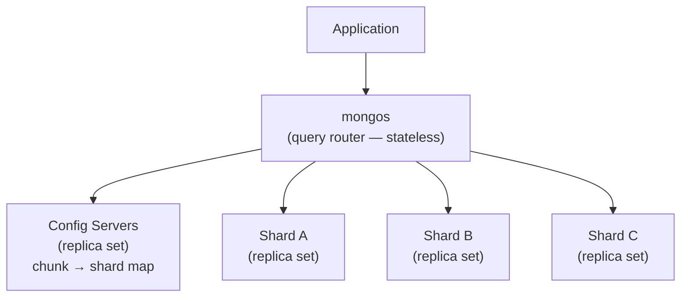
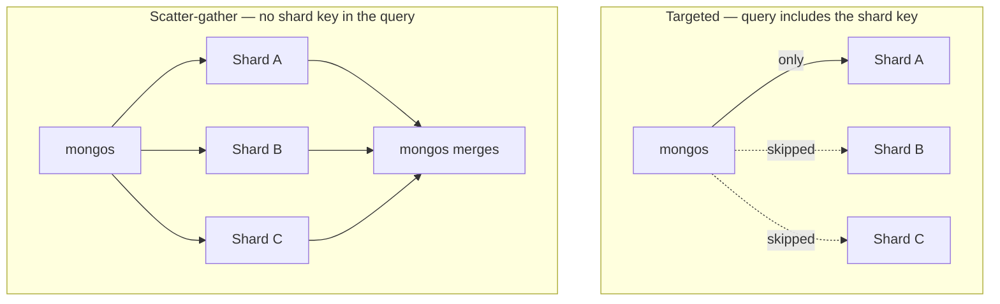

# Sharding & Horizontal Scaling

> **What you will be able to do after this page**
>
> - Explain the three components of a sharded cluster and what each one does.
> - Choose a shard key using the three criteria — and explain why the obvious key is usually wrong.
> - Distinguish a targeted query from a scatter-gather one, and say why it matters.
> - Answer "when should you shard?" with the senior answer: *later than you think*.

---

## 1. Architecture



| Component | Role |
| :--- | :--- |
| **`mongos`** | Stateless router. Caches cluster metadata, targets queries to the right shard(s), merges results. Applications connect *only* here |
| **Config servers** | A replica set (`csrs`) holding the authoritative chunk-to-shard map. Small, but if they're all down the cluster can't route |
| **Shards** | Each is itself a **replica set**. Holds a subset of the data |

The key insight: **sharding and replication are orthogonal.** Replication gives you availability (copies of the same data). Sharding gives you capacity (different data on different machines). Production clusters use both — each shard is a replica set.

---

## 2. How data is distributed

Documents are grouped into **chunks** — contiguous ranges of shard-key values, default max size **128 MB**.

```text
Shard key: { userId: 1 }

  Chunk 1: userId  MinKey → "c"     → Shard A
  Chunk 2: userId  "c"    → "m"     → Shard B
  Chunk 3: userId  "m"    → "t"     → Shard A
  Chunk 4: userId  "t"    → MaxKey  → Shard C
```

When a chunk exceeds the max size it **splits**. The **balancer** (running on the config server primary) then migrates chunks between shards to keep counts roughly even. Migrations are online and throttled, but they do consume I/O — which is why you schedule a balancer window for write-heavy clusters.

### Ranged vs hashed sharding

```js
sh.shardCollection("app.users", { userId: 1 })          // ranged
sh.shardCollection("app.users", { userId: "hashed" })   // hashed
```

| | Ranged | Hashed |
| :--- | :--- | :--- |
| Distribution | Depends on the key; can be very uneven | Near-perfectly even |
| Range queries | ✅ Targeted to a few shards | ❌ Always scatter-gather |
| Monotonic keys | ❌ **All writes hit one shard** | ✅ Spread evenly |
| Sorting by the key | ✅ | ❌ |

**The monotonic key problem** is the classic sharding failure. With ranged sharding on `_id` (an ObjectId) or `createdAt`, every new document has a higher key than the last, so every insert lands in the single chunk holding `MaxKey` — on one shard. You've built a distributed system where one machine does all the writing, plus you pay for constant chunk splits and migrations. This is called a **hot shard**.

---

## 3. Choosing a shard key

**This is the most consequential decision in a sharded cluster.** Three criteria — a good key satisfies all three:

| Criterion | Meaning | Failure mode if violated |
| :--- | :--- | :--- |
| **High cardinality** | Many distinct values | Few possible chunks → can't split further → jumbo chunks that can't migrate |
| **Low frequency** | Values evenly distributed | One popular value ("US", `null`) puts a huge share of data on one shard |
| **Non-monotonic** | Not steadily increasing | Hot shard on inserts |

### Worked evaluation

| Candidate key | Cardinality | Frequency | Monotonic | Verdict |
| :--- | :--- | :--- | :--- | :--- |
| `{ country: 1 }` | ~200 ❌ | Very skewed ❌ | ✅ | **Bad** — jumbo chunks, one shard holds all US data |
| `{ createdAt: 1 }` | High ✅ | Even ✅ | **Yes ❌** | **Bad** — hot shard on every insert |
| `{ _id: 1 }` (ObjectId) | High ✅ | Even ✅ | **Yes ❌** | **Bad** for the same reason |
| `{ _id: "hashed" }` | High ✅ | Even ✅ | ✅ | **OK** — but every query is scatter-gather |
| `{ userId: 1, createdAt: 1 }` | High ✅ | Even ✅ | ✅ (compound) | **Good** — targeted per-user queries, even distribution |

:::tip[The compound-key insight]
`{ userId: 1, createdAt: 1 }` is monotonic only *within* a user. Across the cluster, inserts for thousands of users land all over the key space. And because `userId` is the prefix, the extremely common query "this user's recent orders" is **targeted to one shard** and comes back already sorted.

That combination — even writes plus targeted reads — is why compound shard keys beginning with the natural access-pattern field are the standard production answer.
:::

### Targeted vs scatter-gather



A scatter-gather query is as slow as the **slowest shard**, and its cost grows with cluster size — so adding shards can make it *worse*. Sorted scatter-gather queries additionally force `mongos` to merge results in memory.

**Practical rule: include the shard key in your high-frequency queries.** If your hottest query can't include it, you picked the wrong key. That's not a tuning problem — it's a redesign.

Since MongoDB 5.0 you can **reshard** a live collection (`sh.reshardCollection`), which was previously impossible. It's an expensive online rewrite, but the existence of an escape hatch is worth mentioning.

### Zone sharding

Pin key ranges to specific shards — for data residency or tiered storage:

```js
sh.addShardToZone("shard-mumbai", "IN");
sh.updateZoneKeyRange("app.users", { country: "IN", userId: MinKey },
                                   { country: "IN", userId: MaxKey }, "IN");
```

This is the GDPR / data-sovereignty answer: EU customer data physically stays on EU-hosted shards.

---

## 4. When to shard

:::warning[The senior answer is "later than you think"]
Sharding adds a router tier, config servers, a balancer, cross-shard query semantics, backup complexity, and an irreversible-ish schema decision. Before sharding, exhaust these:

1. **Add RAM** so the working set fits in the WiredTiger cache. Usually the single biggest win.
2. **Fix indexes** — most "we need to scale" problems are a missing compound index.
3. **Fix the schema** — bloated documents and unbounded arrays destroy cache efficiency.
4. **Offload reads** to secondaries with tag sets for analytics.
5. **Archive cold data** to a separate collection or tier.
6. **Vertical scaling** — modern instances go a very long way.

Shard when you genuinely exceed what one machine can do: the data set exceeds the largest practical disk, the *write* throughput exceeds one primary, or the working set can no longer fit in any single machine's RAM.
:::

Note the middle one especially: **replication cannot scale writes** — every secondary applies the same write load. Sharding is the *only* mechanism MongoDB has for horizontal write scaling.

---

## 5. Operational facts worth knowing

- **The shard key is (mostly) immutable.** You can update a document's shard key value since 4.2, but you can't change *which fields* the key uses without resharding.
- **The shard key must be indexed**, and that index must exist before sharding the collection.
- **Unique indexes** on a sharded collection are only enforceable if they include the shard key as a prefix — uniqueness cannot be checked globally otherwise.
- **Orphaned documents** can linger after a failed migration; the `SHARDING_FILTER` stage in an explain plan is `mongos` filtering them out.
- **`$lookup` across shards** works but is expensive; the joined collection is often better kept unsharded so it can live on every shard.
- **Jumbo chunks** are chunks that grew past the max size but can't be split because all their documents share one shard-key value. They can't migrate, so they permanently unbalance the cluster. This is the direct consequence of a low-cardinality key.

---

## 6. Rapid-fire recall

<details>
<summary>**What makes a good shard key?**</summary>

Three properties together: high cardinality so the key space can be split into many chunks; low frequency so no single value holds a disproportionate share of documents; and non-monotonic growth so inserts don't all land on the shard owning the top of the range. On top of those, the key should appear in your highest-frequency queries so those queries are targeted to one shard rather than scatter-gathered. A compound key like `{ userId: 1, createdAt: 1 }` typically satisfies all four where a single natural field does not.
</details>

<details>
<summary>**Why is `{ createdAt: 1 }` a bad shard key?**</summary>

It's monotonically increasing, so every new document has a key greater than every existing one and lands in the single chunk that owns the top of the range. All inserts hit one shard — a hot shard — while the others sit idle, and the cluster burns I/O constantly splitting and migrating that chunk. The same reasoning applies to a raw ObjectId `_id`, since ObjectIds are timestamp-prefixed. Hashing it fixes distribution but destroys range queries and sorting.
</details>

<details>
<summary>**Difference between replication and sharding?**</summary>

Replication keeps multiple copies of the *same* data for availability and durability; it doesn't increase capacity, because every secondary carries the full data set and applies the full write load. Sharding splits *different* data across machines for capacity and write throughput. They're complementary and used together: every shard in a production cluster is itself a replica set.
</details>

<details>
<summary>**Targeted vs scatter-gather query?**</summary>

If the query includes the shard key, `mongos` consults the config metadata, identifies the one shard (or few) that can hold matching documents, and queries only those — a targeted query that scales with cluster size. Without the shard key, `mongos` must broadcast to every shard and merge the results, so latency is bounded by the slowest shard and gets worse as you add shards. Designing so that hot queries carry the shard key is the whole point of shard key selection.
</details>

<details>
<summary>**When should you shard?**</summary>

Last, not first. Sharding adds routers, config servers, a balancer, cross-shard query semantics and a hard-to-change key decision. Before it, add RAM so the working set fits in cache, fix missing or badly ordered indexes, fix schemas with bloated documents or unbounded arrays, move analytics to tagged secondaries, and archive cold data. Shard when you genuinely exceed one machine: data larger than a practical single disk, write throughput beyond one primary, or a working set that no single machine's RAM can hold — because replication cannot scale writes, only sharding can.
</details>

---

**Next:** [Transactions, Read & Write Concerns →](./13-transactions-and-concerns.md)
