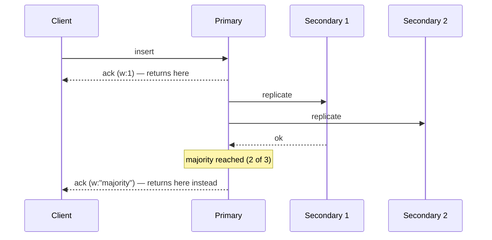

# Transactions, Read & Write Concerns

> **What you will be able to do after this page**
>
> - Tune the durability/latency trade-off per operation with `w`, `j`, and `readConcern`.
> - Write a correct multi-document transaction — including the retry loop most examples omit.
> - Explain why "MongoDB doesn't support transactions" is outdated, and why you still shouldn't reach for them first.

---

## 1. Write Concern — how durable is "done"?

`writeConcern` decides **when the server acknowledges your write.**

```js
db.orders.insertOne(doc, { writeConcern: { w: "majority", j: true, wtimeout: 5000 } });
```

| Setting | Acknowledged when… | Durability | Latency |
| :--- | :--- | :--- | :--- |
| `w: 0` | Never — fire and forget | ❌ You won't even learn about errors | Lowest |
| `w: 1` | The primary has it **in memory** | Lost if the primary crashes before journaling | Low |
| `w: 1, j: true` | The primary has journaled it to disk | Survives a primary crash; **lost in a failover** | Medium |
| `w: "majority"` **(default since 5.0)** | A majority of nodes have it | **Cannot be rolled back** | Higher |
| `w: "majority", j: true` | Majority, journaled | Maximum | Highest |
| `w: 3` | 3 specific nodes | Explicit count; risky if nodes are down | — |



:::danger[Why `w: "majority"` matters — the rollback link]
With `w: 1`, a write acknowledged by the primary that hasn't replicated anywhere is **lost** if that primary fails and a new one is elected. It comes back as a rollback file, not as data. `w: "majority"` guarantees the write exists on enough nodes that any node capable of winning an election must have it.

**Always set `wtimeout` with `w: "majority"`.** Without it, if a majority is unreachable, the operation blocks indefinitely.
:::

**Practical policy:** `w: "majority"` for anything with business meaning (orders, payments, user records); `w: 1` for high-volume, low-value writes (analytics events, metrics, logs) where throughput matters and losing a few is acceptable. Be able to name that trade-off — it's a real engineering judgment, not a config default.

---

## 2. Read Concern — how consistent is what you read?

| Level | Returns | Guarantee |
| :--- | :--- | :--- |
| `"local"` (default) | Most recent data on **this node** | May include writes that later get rolled back |
| `"available"` | Like local, but on a sharded cluster skips the orphan filter | Fastest, weakest — may return orphans |
| `"majority"` | Only data acknowledged by a majority | **Never rolled back** |
| `"linearizable"` | Reflects all majority-acknowledged writes before it started | Strongest. Primary only, single-document reads only, **always pair with `maxTimeMS`** |
| `"snapshot"` | A consistent snapshot across the whole operation | Used inside transactions |

The combination is what you actually tune:

```js
// Financial read — must never see data that might vanish
{ readConcern: { level: "majority" }, readPreference: "primary" }

// Dashboard — staleness is fine, keep it off the primary
{ readConcern: { level: "local" }, readPreference: "secondaryPreferred" }
```

:::warning
`readConcern: "majority"` is **not** the same as `readPreference: "primary"`. Read preference chooses *which node* answers; read concern chooses *which version of the data* is visible. You can read `"majority"` from a secondary, and you can read `"local"` (potentially rollback-able) from the primary.

Getting this distinction right in an interview is a clear seniority marker.
:::

---

## 3. Multi-document transactions

Available since **4.0** on replica sets and **4.2** across shards. Full ACID.

### The correct shape — with the retry loop

```js
const session = client.startSession();
try {
  await session.withTransaction(async () => {
    const accounts = client.db("bank").collection("accounts");

    const debit = await accounts.updateOne(
      { _id: "A", balance: { $gte: 100 } },       // precondition in the filter
      { $inc: { balance: -100 } },
      { session }                                  // ← every operation MUST pass the session
    );
    if (debit.modifiedCount === 0) throw new Error("Insufficient funds");  // aborts

    await accounts.updateOne({ _id: "B" }, { $inc: { balance: 100 } }, { session });

    await client.db("bank").collection("ledger").insertOne(
      { from: "A", to: "B", amount: 100, at: new Date() },
      { session }
    );
  }, {
    readConcern:  { level: "snapshot" },
    writeConcern: { w: "majority" },
    readPreference: "primary",
  });
} finally {
  await session.endSession();
}
```

Three things most tutorials get wrong:

1. **`withTransaction` handles retries for you.** It automatically retries on `TransientTransactionError` and `UnknownTransactionCommitResult`. Hand-rolling `startTransaction`/`commitTransaction` without that retry loop produces code that fails under contention. Use `withTransaction`.
2. **Every operation must receive `{ session }`.** Forget it on one call and that operation silently executes *outside* the transaction — no error, and a data-integrity bug you'll find months later.
3. **Your callback must be idempotent**, because it can be retried.

### Constraints and costs

| Constraint | Detail |
| :--- | :--- |
| Default time limit | **60 seconds** (`transactionLifetimeLimitSeconds`) |
| Oplog entry | The whole transaction is one entry — subject to the **16 MB** limit |
| Collection creation | Implicit creation inside a transaction is allowed from 4.4, but avoid it |
| Isolation | **Snapshot isolation.** No dirty reads; writes conflict rather than block |
| Write conflicts | Two transactions touching the same document → one aborts with a transient error and is retried |
| Performance | Meaningfully slower than single-document writes; holds resources for the duration |

:::danger[The design point, not just the syntax]
**A single-document write is already atomic** — however many fields, arrays, or nested sub-documents it touches. So the first question is never "how do I write a transaction?" but **"why does this need to span two documents?"**

Often the answer is that the schema is wrong: data that must change together should live together. The order and its line items in one document need no transaction. Modeling well eliminates most transactions, and *saying that before writing the transaction* is exactly what an interviewer is listening for.

Transactions are the right answer when the entities genuinely are separate: money moving between two accounts, inventory in one collection and orders in another, cross-collection referential updates.
:::

### Cheaper alternatives, worth naming

| Instead of a transaction | Use |
| :--- | :--- |
| Guarding a balance/stock check | Precondition **in the update filter** + `$inc` (see [CRUD](./02-crud-deep-dive.md)) |
| Claiming a work item | `findOneAndUpdate` — atomic on one document |
| Keeping a denormalised copy in sync | **Change streams** + eventual consistency |
| A long multi-service workflow | The **saga pattern** with compensating actions |
| Two collections that always change together | **Merge them into one document** |

---

## 4. Retryable writes and reads

On by default in modern drivers (`retryWrites: true`).

The driver attaches a unique transaction ID to each write. If the operation fails with a retryable network or failover error, the driver resends it once; the server recognises the ID and applies it **exactly once**, never twice. That's what makes an election survivable for the application.

Caveats: only *single*-document writes are retryable — `updateMany` and `deleteMany` are not, because they can't be made exactly-once cheaply. Retryable reads (`retryReads: true`) are also on by default.

---

## 5. Change streams

A supported, resumable way to subscribe to data changes — built on the oplog, but without you tailing it yourself.

```js
const stream = db.collection("orders").watch(
  [{ $match: { "fullDocument.status": "PAID", operationType: { $in: ["insert", "update"] } } }],
  { fullDocument: "updateLookup", resumeAfter: savedToken }
);

for await (const change of stream) {
  console.log(change.operationType, change.documentKey, change.fullDocument);
  await saveResumeToken(change._id);     // ← persist this
}
```

Why it matters:

- **Resumable.** Every event carries a `_id` resume token. Persist it, and after a crash you restart exactly where you stopped — no lost or duplicated events.
- **Requires `w: "majority"`-durable data**, so you only ever see changes that can't be rolled back.
- Works on a collection, a database, or the whole deployment; works across shards.
- `fullDocument: "updateLookup"` fetches the current document for update events (which otherwise carry only the delta). Note it looks up the *current* state, so under rapid updates it may not match the delta exactly.

This is the mechanism behind the denormalisation fan-out in [Data Modeling](./03-data-modeling.md), cache invalidation, search-index syncing, and real-time notifications. It replaces the old, fragile practice of tailing the oplog directly.

---

## 6. Rapid-fire recall

<details>
<summary>**Does MongoDB support ACID transactions?**</summary>

Yes — multi-document ACID transactions since 4.0 on replica sets and 4.2 across shards, with snapshot isolation. But the more useful answer is that a single-document write has always been atomic regardless of how many fields or nested arrays it modifies, so a well-designed schema — where data that changes together lives together — rarely needs a multi-document transaction. Transactions are the right tool for genuinely separate entities, like transferring money between two accounts, and they carry real costs: a 60-second default limit, a 16 MB oplog entry cap, and lower throughput.
</details>

<details>
<summary>**`w: 1` vs `w: "majority"`?**</summary>

`w: 1` acknowledges as soon as the primary has the write in memory — fast, but if that primary fails before replicating, the write is rolled back and lost. `w: "majority"` waits until a majority of replica set members have it, which guarantees it survives any election, because any node that can become primary must contain it. The cost is latency. Use majority for anything with business meaning and `w: 1` for high-volume low-value writes like metrics — and always pair majority with a `wtimeout` so you don't block forever when a majority is unavailable.
</details>

<details>
<summary>**Read concern vs read preference?**</summary>

Read preference selects *which node* serves the read — primary, secondary, nearest. Read concern selects *which version of the data* is visible — `local` may include writes that could still be rolled back, while `majority` returns only writes acknowledged by a majority and therefore durable. They're independent: you can read majority-concern data from a secondary, or local-concern data from the primary.
</details>

<details>
<summary>**How do you avoid needing a transaction?**</summary>

Model so that everything which must change atomically lives in one document — an order with its line items, for instance. Put preconditions in the update filter rather than in application code, so `{ _id, stock: { $gte: 1 } }` with `$inc: { stock: -1 }` is a race-free conditional decrement. Use `findOneAndUpdate` for atomic claim patterns. For cross-collection consistency that can tolerate a short delay, use change streams and accept eventual consistency; for long multi-service workflows, use a saga with compensating actions.
</details>

<details>
<summary>**What is a change stream and why not just tail the oplog?**</summary>

A change stream is a supported, resumable subscription to data changes, exposed as an aggregation pipeline you can filter. Unlike direct oplog tailing it's driver-supported, works across shards, presents a stable event format rather than internal oplog structure, only surfaces majority-committed changes so you never act on data that gets rolled back, and gives you a resume token to restart exactly where you left off after a crash. Tailing the oplog gives you none of those guarantees.
</details>

---

**Next:** [Production Playbook →](./14-production-playbook.md)
