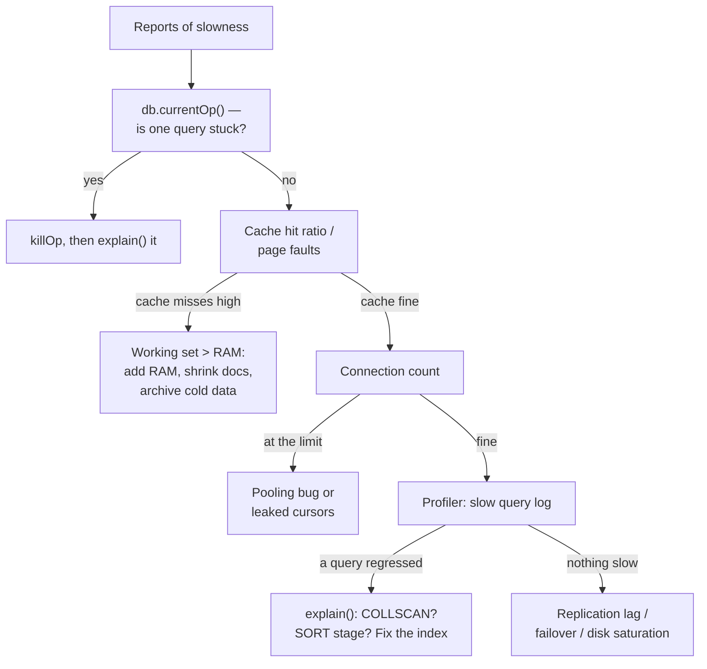

# Production Playbook

> The things that don't appear in tutorials but do appear in incidents — and in senior interviews.
> Connection management, security, backups, monitoring, and how to answer "the database is slow" under pressure.

---

## 1. Connection pooling — the #1 Node.js MongoDB bug

```js
// ❌ Connects on every request. Under load: connection storm, then refusal.
app.get("/users", async (req, res) => {
  const client = await MongoClient.connect(uri);
  const users = await client.db().collection("users").find().toArray();
  await client.close();
  res.json(users);
});

// ✅ ONE client for the process lifetime. It pools internally.
const client = new MongoClient(uri, { maxPoolSize: 50, minPoolSize: 5 });
await client.connect();
const db = client.db("app");
app.get("/users", async (req, res) => res.json(await db.collection("users").find().toArray()));
```

`MongoClient` **is** the pool. Creating one per request defeats the entire design and is the most common performance bug in MERN codebases.

| Option | Default | Notes |
| :--- | :--- | :--- |
| `maxPoolSize` | 100 | Per `mongos`/host. Total across app instances must stay under the server's connection limit |
| `minPoolSize` | 0 | Keep a few warm to avoid cold-start latency |
| `maxIdleTimeMS` | ∞ | Close idle connections |
| `waitQueueTimeoutMS` | ∞ | **Set this** — otherwise requests queue forever when the pool is saturated |
| `serverSelectionTimeoutMS` | 30000 | How long to look for a suitable server before failing |
| `socketTimeoutMS` | ∞ | Guard against a hung operation holding a connection |

:::warning[Serverless changes the math]
Each Lambda/Vercel function instance holds its own pool. 200 concurrent instances × `maxPoolSize: 10` = 2000 connections. Set `maxPoolSize: 1–5` in serverless, cache the client in module scope so warm invocations reuse it, and consider a proxy (Atlas Data API / a connection proxy) at high concurrency.
:::

Also always set `maxTimeMS` on expensive reads so one pathological query can't hold a connection indefinitely:

```js
db.orders.find(q).maxTimeMS(5000);
db.orders.aggregate(pipeline, { maxTimeMS: 10000 });
```

---

## 2. Security checklist

| Control | Do this |
| :--- | :--- |
| **Authentication** | Always on (`--auth`). SCRAM-SHA-256 default; x.509 or LDAP in enterprise |
| **Authorisation** | Role-based. Give the app a role scoped to its database — **never `root`** |
| **Network** | Bind to private interfaces, IP allow-list, VPC peering. Never `0.0.0.0` on a public IP |
| **TLS** | On for client↔server *and* intra-cluster |
| **Encryption at rest** | WiredTiger encrypted storage engine, or encrypted volumes |
| **Field-level encryption** | CSFLE / Queryable Encryption for PII — encrypted client-side, so the server never sees plaintext |
| **Auditing** | Enterprise/Atlas audit log for compliance |
| **Injection** | See below |

### NoSQL injection — the interview question

MongoDB has no SQL string parsing, so classic SQL injection doesn't apply. But **operator injection** absolutely does:

```js
// Client posts: { "email": "a@x.com", "password": { "$ne": null } }
db.users.findOne({ email: req.body.email, password: req.body.password });
// → password matches ANY non-null value. Authentication bypassed.
```

Fixes, in order of importance:

1. **Validate and coerce types at the boundary** — Zod/Joi/`express-validator`. If `password` must be a string, `typeof x === "string"` blocks the whole attack class.
2. Reject keys starting with `$` in user-supplied objects (`express-mongo-sanitize`).
3. Never pass `req.body` straight into a filter.
4. Never use `$where` or `$expr` built from user input — `$where` executes JavaScript server-side.

---

## 3. Backups & disaster recovery

| Method | Consistency | Downtime | Use for |
| :--- | :--- | :--- | :--- |
| `mongodump` / `mongorestore` | Per-collection unless `--oplog` | None | Small data sets, single collections |
| Filesystem/volume snapshot | Point-in-time if journal is on the same volume | None | Standard for large deployments |
| Atlas continuous backup | Point-in-time restore to any second | None | Managed clusters |
| Delayed replica member | Live, lagging by N hours | None | **Recovering from application bugs** |

For anything beyond small data, `mongodump` is too slow to restore. Volume snapshots plus oplog replay give you point-in-time recovery.

The delayed member deserves emphasis: snapshots protect you from hardware failure, but a bad deploy that runs `deleteMany({})` replicates to every node *immediately*. A member delayed by an hour still has the data. Pair it with `w: "majority"` and you have answers for both failure classes.

**Test your restores.** An untested backup is not a backup — say this in an interview; it lands.

---

## 4. Monitoring — what to watch

| Metric | Where | Alarm when |
| :--- | :--- | :--- |
| Replication lag | `rs.printSecondaryReplicationInfo()` | > a few seconds sustained |
| Cache hit ratio | `serverStatus().wiredTiger.cache` | Working set no longer fits RAM |
| Page faults / disk read IOPS | OS + server status | Spiking → working set exceeded memory |
| Connection count | `serverStatus().connections` | Approaching the limit → pooling bug |
| Queue depth | `globalLock.currentQueue` | Sustained > 0 → contention |
| Slow queries | Profiler / Atlas Performance Advisor | Any regression |
| Index usage | `$indexStats` | `ops: 0` → dead index, drop it |
| Oplog window | `rs.printReplicationInfo()` | Shrinking below your maintenance window |

```js
db.serverStatus().connections
db.currentOp({ secs_running: { $gt: 5 } })     // what's slow right now
db.killOp(opid)                                 // stop it
db.collection.aggregate([{ $indexStats: {} }])  // which indexes earn their keep
```

---

## 5. "The database is slow" — the incident runbook



Nine times out of ten it lands in one of three buckets: **a missing or wrong index**, **the working set no longer fits in RAM**, or **a connection-pool misconfiguration**. Naming those three buckets *before* diving into details is a strong way to answer the question in an interview.

---

## 6. Schema and query hygiene that pays off

- **Set `maxTimeMS` on every user-facing query.** A single unbounded query can saturate the pool.
- **Never paginate deep with `skip`.** `skip(100000)` walks and discards 100,000 documents. Use **range pagination** on an indexed, unique sort key:
  ```js
  // page 1
  db.orders.find({}).sort({ _id: -1 }).limit(20);
  // next page — no skip at all
  db.orders.find({ _id: { $lt: lastSeenId } }).sort({ _id: -1 }).limit(20);
  ```
  This is O(1) per page instead of O(offset), and it's the standard answer to "how do you paginate a million rows?"
- **Precompute expensive aggregations** into a summary collection with `$merge` on a schedule — serve dashboards from a `find()`.
- **Use projections.** Don't ship a 200 KB document to render a name.
- **Bulk write** instead of loops of `await`.
- **TTL indexes** for anything with a natural lifespan — sessions, OTPs, tracking pings, soft-deleted records.
- **Drop unused indexes.** `$indexStats` with `ops: 0` after a full business cycle is pure write tax.

---

## 7. Version cheat sheet

Knowing when features landed lets you answer "how would you do this in 4.0?" — a common follow-up.

| Version | Landed |
| :--- | :--- |
| 3.2 | WiredTiger becomes the default engine |
| 3.6 | **Change streams**, `$expr`, array `arrayFilters`, sessions |
| 4.0 | **Multi-document transactions** (replica sets), `$convert` |
| 4.2 | Transactions across shards, **pipeline updates**, `$merge`, wildcard indexes, on-demand materialised views |
| 4.4 | `$unionWith`, union/`$function`, hidden indexes, refinable shard keys |
| 5.0 | **`$setWindowFields`**, time-series collections, `$dateTrunc`, live resharding, `w: "majority"` default |
| 6.0 | `$lookup`/`$graphLookup` on sharded collections, Queryable Encryption, cluster-wide `allowDiskUseByDefault` |
| 7.0/8.0 | Queryable Encryption GA, query-engine performance work, improved bulk-write API |

---

## 8. Rapid-fire recall

<details>
<summary>**How do you configure connection pooling in Node.js?**</summary>

Create exactly one `MongoClient` for the process lifetime and reuse it — the client *is* the pool. Creating a client per request is the classic bug and causes connection storms under load. Tune `maxPoolSize` against the server's connection limit divided by the number of application instances, set `minPoolSize` to keep a few warm, and always set `waitQueueTimeoutMS` and `serverSelectionTimeoutMS` so saturation surfaces as a fast error instead of an indefinite hang. In serverless, drop `maxPoolSize` to a handful and cache the client in module scope, because every function instance holds its own pool.
</details>

<details>
<summary>**Is NoSQL injection real?**</summary>

Yes — not string injection, but operator injection. If user input is passed straight into a filter, posting `{"$ne": null}` as a password makes the query match any non-null value and bypasses authentication. The primary defence is type validation at the request boundary, so a field declared as a string can never arrive as an object. Secondarily, strip keys beginning with `$` from user-supplied objects, and never build `$where` or `$expr` from user input, since `$where` executes JavaScript on the server.
</details>

<details>
<summary>**How do you paginate efficiently?**</summary>

Not with `skip`. `skip(n)` makes the server walk and discard n documents, so cost grows linearly with page depth and deep pages become unusable. Use range-based pagination instead: sort by an indexed, unique key and filter on the last value from the previous page — `{ _id: { $lt: lastSeenId } }` with a limit. That's constant cost per page and it's also immune to the duplicate/skipped-row problem you get when data changes between page loads.
</details>

<details>
<summary>**Users report the app is slow. What do you check?**</summary>

I'd triage into three buckets. First, `db.currentOp()` for a single stuck or runaway operation — kill it and explain it. Second, the WiredTiger cache hit ratio and page-fault rate; if those spiked, the working set no longer fits in RAM, and the fixes are more memory, smaller documents, or archiving cold data. Third, the connection count against the pool limit, which usually points at a pooling bug or leaked cursors. If none of those, I'd check the slow query log for a regressed query and read its explain plan for a `COLLSCAN` or an in-memory `SORT`, then check replication lag and disk saturation.
</details>

<details>
<summary>**How would you serve an expensive analytics query at page-load latency?**</summary>

Precompute it. Run the heavy aggregation on a schedule and write the results into a summary collection with `$merge`, which updates incrementally rather than rebuilding — an on-demand materialised view. The dashboard then serves a plain indexed `find()`. If the numbers must be closer to real time, maintain them incrementally on write using the computed pattern, or drive updates from a change stream.
</details>

---

**Next:** [Interview Q&A →](./15-interview-qa.md) — rapid-fire, with model answers.
