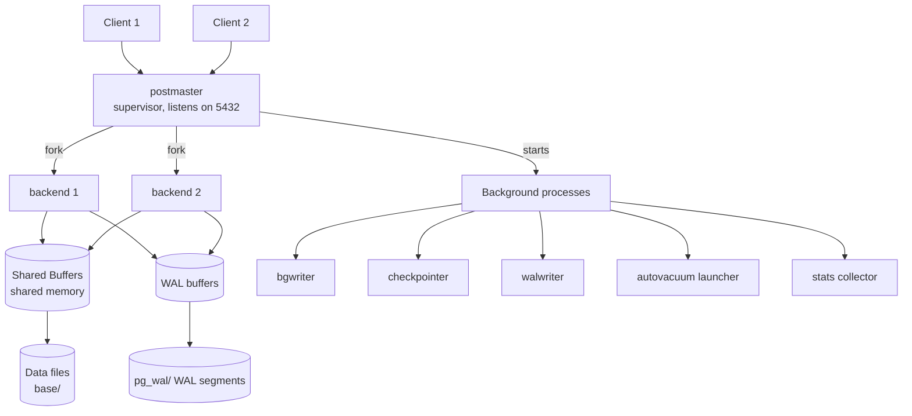
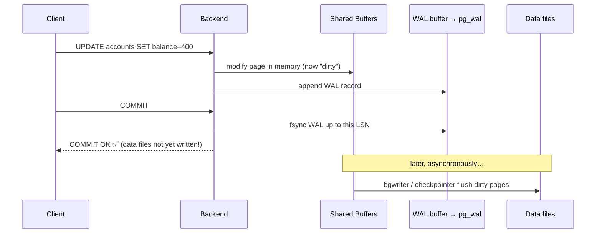
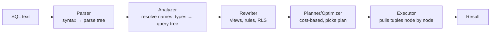

# Architecture & Internals

> **What you will be able to do after this page**
>
> - Draw the PostgreSQL process model from memory and explain what each process does.
> - Explain MVCC in terms of `xmin`/`xmax` and dead tuples — and why Postgres needs `VACUUM` while MySQL does not.
> - Trace a single `UPDATE` from client socket to durable disk, through WAL and shared buffers.
> - Explain TOAST, the visibility map, HOT updates, and transaction ID wraparound well enough to answer follow-ups.

---

## 1. The process model

PostgreSQL is **process-per-connection**, not thread-per-connection. When a client connects, the supervisor process (`postmaster`) forks a brand-new OS process dedicated to that session.



| Process | Job |
| :--- | :--- |
| **postmaster** | Listens on the port, authenticates, forks a backend per connection, restarts crashed children |
| **backend** | Executes *your* SQL. One per connection. Has its own memory (`work_mem`, `temp_buffers`) |
| **bgwriter** | Trickles dirty pages from shared buffers to disk so backends rarely have to write |
| **checkpointer** | Periodically flushes *all* dirty buffers and writes a checkpoint record to WAL |
| **walwriter** | Flushes WAL buffers to disk asynchronously |
| **autovacuum launcher/workers** | Reclaim dead tuples, refresh statistics, prevent XID wraparound |
| **archiver** | Copies completed WAL segments somewhere safe (for PITR) |
| **WAL sender / receiver** | Streaming replication |

The consequence you must internalise: **a connection is an OS process**, costing roughly 5–10 MB of RSS plus fork time. 500 idle connections is 500 processes. This is *the* reason PgBouncer exists and why "just raise `max_connections`" is the wrong answer.

:::info[PostgreSQL vs MySQL]
| PostgreSQL | MySQL |
| :--- | :--- |
| **Process** per connection (fork) | **Thread** per connection |
| Connection is expensive → external pooler (PgBouncer) is standard | Connection is cheap-ish; MySQL has a built-in thread pool (Enterprise) / thread cache |
| Strong isolation between sessions; one backend crashing forces a full restart for safety | Cheaper connections, but a bad thread can affect the whole server |

Practically: on Postgres you cap `max_connections` at a few hundred and pool in front. On MySQL a few thousand connections is survivable. Same advice applies to both though — pooling is good hygiene either way.
:::

---

## 2. Memory: shared vs per-backend

```text
┌──────────────────────── SHARED MEMORY (all backends) ────────────────────────┐
│  shared_buffers      ← page cache for table/index pages   (25% of RAM)       │
│  wal_buffers         ← WAL records not yet flushed        (16MB default)     │
│  lock tables, predicate locks, replication slots, stats                      │
└──────────────────────────────────────────────────────────────────────────────┘

┌──────────── PER BACKEND (private, multiplied by connections!) ───────────────┐
│  work_mem            ← per sort / hash / node — NOT per query!               │
│  maintenance_work_mem← CREATE INDEX, VACUUM                                  │
│  temp_buffers        ← temp tables                                           │
└──────────────────────────────────────────────────────────────────────────────┘
```

:::danger[`work_mem` is the classic OOM footgun]
`work_mem` is allocated **per sort/hash node, per parallel worker, per connection** — not once per query. A query with 3 hash joins and 2 sorts, running with 4 parallel workers, on 100 connections, at `work_mem = 64MB` can theoretically demand `64MB × 5 × 4 × 100 = 128 GB`.

Set it low globally (4–16 MB) and raise it per-session for the one reporting query that needs it:
```sql
SET LOCAL work_mem = '256MB';   -- LOCAL = reverts at COMMIT
```
:::

Postgres deliberately relies on the **OS page cache** as a second tier. That's why `shared_buffers` is advised at ~25 % of RAM rather than 80 % — you'd just be double-caching. `effective_cache_size` is not an allocation at all; it's a *hint to the planner* about how much total cache (shared buffers + OS) is likely available, and it influences whether index scans look cheap.

:::info[PostgreSQL vs MySQL]
| PostgreSQL | MySQL (InnoDB) |
| :--- | :--- |
| `shared_buffers` ≈ 25 % RAM, leans on OS page cache | `innodb_buffer_pool_size` ≈ 70–80 % RAM, uses `O_DIRECT` and bypasses OS cache |
| Double-buffering is intentional | Double-buffering is avoided deliberately |

So a "give the database most of the RAM" instinct from MySQL is actively wrong on Postgres.
:::

---

## 3. MVCC — the heart of everything

PostgreSQL never updates a row in place. **Every `UPDATE` is an insert of a new row version plus a mark on the old one.** Every row on a heap page carries hidden system columns:

| Hidden column | Meaning |
| :--- | :--- |
| `xmin` | The transaction ID that **created** this row version |
| `xmax` | The transaction ID that **deleted/superseded** it (0 if still live) |
| `ctid` | Physical location: `(page, offset within page)` |

You can select them:

```sql
SELECT ctid, xmin, xmax, id, balance FROM accounts;
```

### Trace: an UPDATE under MVCC

```text
Start: txid 100 inserted the row.

 ┌── page 0 ──────────────────────────────────────────┐
 │ item 1: xmin=100  xmax=0    id=1  balance=500      │  ← live
 └────────────────────────────────────────────────────┘

Session A (txid 105):  UPDATE accounts SET balance = 400 WHERE id = 1;

 ┌── page 0 ──────────────────────────────────────────┐
 │ item 1: xmin=100  xmax=105  id=1  balance=500      │  ← old version, now DEAD to
 │                                                       anyone starting after 105 commits
 │ item 2: xmin=105  xmax=0    id=1  balance=400      │  ← new version
 └────────────────────────────────────────────────────┘

Session B (txid 104, started BEFORE 105):  SELECT balance FROM accounts WHERE id = 1;
   → sees item 1 (500), because 105 is not visible in B's snapshot.
   → No lock was taken. No waiting happened.

After 105 commits AND no snapshot older than 105 exists:
   item 1 becomes garbage → VACUUM reclaims its space.
```

**The two consequences that define Postgres operations:**

1. **Readers never block writers, writers never block readers.** A `SELECT` takes no row locks at all. This is why long analytical queries don't stall an OLTP workload — and why a long-running transaction is dangerous for a different reason (below).
2. **Dead tuples accumulate.** Space is not returned automatically. `VACUUM` is not a bug or an oversight; it is the price of storing old versions *in the table itself*.

:::info[PostgreSQL vs MySQL — MVCC implementation]
| PostgreSQL | MySQL (InnoDB) |
| :--- | :--- |
| Old row versions live **in the heap** alongside live rows | Old versions live in the **undo log** (rollback segments), separate from the table |
| Cleanup = `VACUUM` (autovacuum), reclaims in-place | Cleanup = **purge thread**, truncates undo log |
| Table **bloat** is the failure mode | Undo log **growth** / history list length is the failure mode |
| `UPDATE` writes a whole new tuple → indexes may all need updating | `UPDATE` modifies in place, only affected indexes touched |
| Sequential scan of a bloated table reads dead tuples | Table stays compact |
| Rollback is instant (just don't commit the xid) | Rollback must **undo** each change — a huge rolled-back transaction is slow |

The two most quotable lines: **"Postgres makes commit cheap and rollback free, at the cost of VACUUM."** and **"InnoDB keeps the table compact, at the cost of a slow rollback and an undo log that can explode."**
:::

### HOT updates — the optimisation that saves you

If (a) no **indexed** column changed and (b) there is free space **on the same page**, Postgres performs a **Heap-Only Tuple** update: the new version goes on the same page, chained from the old via `ctid`, and **no index entry is written at all**.

```text
Normal update            HOT update
─────────────            ──────────
heap: new tuple          heap: new tuple on SAME page, chained
idx1: new entry          idx1: untouched  ✅
idx2: new entry          idx2: untouched  ✅
idx3: new entry          idx3: untouched  ✅
```

This is why `fillfactor` matters on update-heavy tables — leaving 10–20 % of each page free keeps HOT updates possible:

```sql
ALTER TABLE sessions SET (fillfactor = 80);
```

And it is why **an index on a frequently updated column is far more expensive on Postgres than on MySQL**: it disqualifies HOT.

---

## 4. WAL — Write-Ahead Log

The durability rule: **the log record describing a change must reach disk before the data page does.**



The commit returns as soon as the **WAL** is fsynced. The actual table pages get written later. If the server loses power in between, recovery replays WAL from the last checkpoint and the change is restored.

Key concepts:

- **LSN (Log Sequence Number)** — a monotonically increasing byte offset into the WAL stream, e.g. `0/16B3748`. Every replication lag metric is an LSN difference.
- **Checkpoint** — flush all dirty buffers, record "everything up to LSN X is on disk." Recovery starts from the last checkpoint. Controlled by `checkpoint_timeout` (default 5 min) and `max_wal_size`.
- **Full page writes** — the first change to a page after a checkpoint writes the *entire page* to WAL, protecting against torn pages. This is why WAL volume spikes right after a checkpoint.

WAL is the single mechanism behind: crash recovery, streaming replication, logical replication, and point-in-time recovery. Learn it once, get four features.

:::info[PostgreSQL vs MySQL]
| PostgreSQL | MySQL (InnoDB) |
| :--- | :--- |
| One WAL stream (`pg_wal/`), used for recovery **and** replication | **Two** logs: InnoDB redo log (recovery, physical) + **binlog** (replication, logical/row-based) |
| No dual-write problem | Redo log and binlog must be kept consistent → two-phase commit between them (`binlog_group_commit`) |
| `synchronous_commit = off` = fast, may lose recent commits, never corrupts | `innodb_flush_log_at_trx_commit = 2` is the rough equivalent |
| Replication is physical (byte-level) by default | Replication is logical (row/statement events) by default |

That single-log design is a genuine architectural simplification in Postgres' favour; MySQL's binlog is also genuinely more flexible for cross-version replication and CDC.
:::

---

## 5. Page layout, TOAST, and the visibility map

Every table and index is stored as **8 KB pages**.

```text
┌──────────────── 8 KB page ────────────────┐
│ PageHeader (24 bytes)                     │
│ ItemId array →→→→ (pointers, grow down)   │
│                                           │
│            FREE SPACE                     │
│                                           │
│ ←←←← Tuples (actual rows, grow up)        │
│ Special space (index metadata)            │
└───────────────────────────────────────────┘
```

A tuple cannot span pages. So what happens to a 2 MB text value?

### TOAST — The Oversized-Attribute Storage Technique

When a row exceeds ~2 KB (`TOAST_TUPLE_THRESHOLD`), Postgres compresses large variable-length columns and, if still too big, moves them to a side table `pg_toast.pg_toast_<oid>`, leaving an 18-byte pointer in the main row.

| Storage strategy | Behaviour |
| :--- | :--- |
| `PLAIN` | No compression, no out-of-line (fixed-size types only) |
| `EXTENDED` | Compress, then move out-of-line if needed — **default for `text`, `jsonb`, arrays** |
| `EXTERNAL` | Move out-of-line but **don't compress** — faster substring/`->` access |
| `MAIN` | Compress, avoid out-of-line if possible |

```sql
ALTER TABLE docs ALTER COLUMN body SET STORAGE EXTERNAL;
```

**Why it matters in practice:** a `SELECT id, name FROM docs` on a table with a huge TOASTed `body` is fast, because TOAST is only read when you actually reference that column. But `SELECT *` in an ORM is a hidden de-TOAST for every row. Also: a `jsonb` column that is TOASTed must be fully fetched and decompressed to read *one key* out of it.

:::info[PostgreSQL vs MySQL]
Postgres: TOAST is transparent and automatic; a `text` column can hold 1 GB with no declaration.
MySQL: `TEXT`/`BLOB` types have declared size classes (`TINYTEXT` → `LONGTEXT`), and InnoDB stores overflow pages with a 20-byte in-row pointer under `DYNAMIC` row format. Different mechanism, similar spirit. The MySQL 8 KB… actually InnoDB's 16 KB page and the "row size too large" error has no Postgres equivalent — Postgres just TOASTs it.
:::

### Visibility map & free space map

Every table has two auxiliary forks:

- **Visibility Map (VM)** — 2 bits per page: "all tuples on this page are visible to everyone" and "all frozen." This is what makes **index-only scans** possible: if the page is all-visible, the planner can trust the index without visiting the heap to check visibility. `VACUUM` maintains it. **A table that never gets vacuumed gets no index-only scans.**
- **Free Space Map (FSM)** — where there's room for new tuples.

---

## 6. VACUUM and transaction ID wraparound

`VACUUM` does four jobs:

1. Mark dead tuple space reusable (does **not** return disk to the OS).
2. Update the visibility map → enables index-only scans.
3. Update the free space map.
4. **Freeze** old tuples to prevent transaction ID wraparound.

`VACUUM FULL` rewrites the whole table compactly and *does* return disk — but takes an `ACCESS EXCLUSIVE` lock, blocking everything. Never run it on a live production table; use `pg_repack` instead.

### Transaction ID wraparound

Transaction IDs are **32-bit**. About 4 billion. Visibility is determined by comparing XIDs *modulo* 2^31 — so an XID more than 2 billion in the past would suddenly appear to be in the *future*, and rows would vanish.

Postgres prevents this by **freezing**: marking very old tuples with a special "always visible" flag. Autovacuum forces an anti-wraparound vacuum when a table's oldest XID exceeds `autovacuum_freeze_max_age` (200 M by default).

```sql
-- The query to run when someone says "wraparound"
SELECT relname,
       age(relfrozenxid) AS xid_age,
       pg_size_pretty(pg_total_relation_size(oid)) AS size
FROM pg_class
WHERE relkind = 'r'
ORDER BY age(relfrozenxid) DESC
LIMIT 10;
```

At ~2 billion the database **refuses new write transactions** and demands a single-user-mode vacuum. Outages from this are famous (Sentry, Mailchimp). The causes are always one of: autovacuum turned off, a long-running transaction pinning the horizon, an abandoned replication slot, or an orphaned prepared transaction.

:::warning[The long-running transaction problem]
An idle-in-transaction session holds back the **xmin horizon**: VACUUM cannot remove *any* tuple newer than the oldest running snapshot, database-wide. One forgotten `BEGIN;` in a psql window can bloat every table in the cluster.

```sql
SELECT pid, state, age(clock_timestamp(), xact_start) AS xact_age, query
FROM pg_stat_activity
WHERE state <> 'idle' OR state = 'idle in transaction'
ORDER BY xact_start;
```
Set `idle_in_transaction_session_timeout = '5min'` in production. This is a top-5 real-world Postgres incident cause.
:::

:::info[PostgreSQL vs MySQL]
MySQL/InnoDB has **no equivalent of XID wraparound** — it uses 64-bit transaction IDs and a separate undo log. The analogous failure is a long-running transaction growing the **history list length** so purge can't keep up. Same root cause (a long transaction), different symptom (undo bloat vs table bloat + wraparound risk). If asked "what's a Postgres-specific operational risk MySQL doesn't have," wraparound is the correct answer.
:::

---

## 7. How a query actually executes



The **planner** is cost-based: it enumerates plans (which index, which join order, which join algorithm) and estimates each using statistics from `pg_statistic`, gathered by `ANALYZE`. It picks the lowest estimated cost. There are no hints in core PostgreSQL — deliberately. You influence the planner with statistics, indexes, and configuration, not directives.

The **executor** is a demand-driven pipeline ("Volcano" model): the top node calls `next()` on its child, which calls `next()` on *its* child. That's why `EXPLAIN` output is a tree read inside-out.

:::info[PostgreSQL vs MySQL]
| PostgreSQL | MySQL |
| :--- | :--- |
| **No optimizer hints** in core. Use `pg_hint_plan` extension or fix statistics | Has hints: `USE INDEX`, `FORCE INDEX`, `/*+ ... */` optimizer hints |
| Rich plan node set: Hash Join, Merge Join, Bitmap Heap Scan, parallel workers | Historically nested-loop only; **hash join added in 8.0.18**, still no merge join |
| Full parallel query execution | Limited parallelism (parallel reads for some cases in 8.0) |

MySQL's hints are genuinely useful when the optimizer is wrong. Postgres' position is "if the plan is wrong, the statistics are wrong" — usually true, occasionally infuriating.
:::

---

## 8. Physical layout on disk

```text
$PGDATA/
├── base/                ← one directory per database (by OID)
│   └── 16384/
│       ├── 24576        ← a table's main fork (8 KB pages)
│       ├── 24576_fsm    ← free space map
│       ├── 24576_vm     ← visibility map
│       └── 24576.1      ← segment 2 (files split every 1 GB)
├── global/              ← cluster-wide catalogs (pg_database, roles)
├── pg_wal/              ← WAL segments (16 MB each)
├── pg_xact/             ← transaction commit status
└── postgresql.conf
```

Vocabulary that trips people up:

- A **cluster** in PostgreSQL means "one `$PGDATA` directory, one postmaster, many databases." It does **not** mean a group of servers.
- A **database** contains **schemas**, which contain tables. You cannot query across databases in one statement (without `dblink`/`postgres_fdw`).

:::info[PostgreSQL vs MySQL — the naming trap]
| PostgreSQL | MySQL |
| :--- | :--- |
| `database` → `schema` → `table` (three levels) | `database` == `schema` (synonyms!) → `table` (two levels) |
| Cross-database queries **not** possible in one statement | `SELECT * FROM db1.t1 JOIN db2.t2` works fine |
| A Postgres **schema** is what a MySQL **database** is | — |

**Migration rule of thumb: a MySQL "database" maps to a PostgreSQL "schema", not a PostgreSQL "database."** Getting this backwards is the single most common structural mistake when porting.
:::

---

## 9. Rapid-fire recall

<details>
<summary>**Explain MVCC in PostgreSQL in one paragraph.**</summary>

Every row version carries `xmin` (the transaction that created it) and `xmax` (the transaction that superseded it). A transaction takes a snapshot at its start, and a row version is visible to it if `xmin` is committed and visible in that snapshot and `xmax` is either zero or not visible. An `UPDATE` therefore never modifies in place — it writes a new tuple and stamps `xmax` on the old one. The payoff is that readers never block writers and writers never block readers; the cost is that dead tuples accumulate in the heap and must be reclaimed by `VACUUM`.
</details>

<details>
<summary>**Why does PostgreSQL need VACUUM and MySQL doesn't?**</summary>

Because of *where* old row versions live. Postgres keeps them in the table heap itself, so obsolete versions become dead tuples occupying space in the table and its indexes — something must sweep them up, and that's VACUUM. InnoDB keeps old versions in a separate undo log, so the table stays compact and a background purge thread truncates the undo log instead. It's the same problem solved in two places: Postgres pays with bloat and VACUUM tuning, InnoDB pays with undo log growth and slow rollbacks of large transactions.
</details>

<details>
<summary>**What is transaction ID wraparound and how do you prevent it?**</summary>

Transaction IDs are 32-bit and visibility is a modulo comparison, so an XID more than about 2 billion transactions old would wrap around and appear to be in the future, making committed rows invisible. Postgres prevents it by freezing old tuples — marking them unconditionally visible — during vacuum, and autovacuum forces an anti-wraparound vacuum once a table's `relfrozenxid` age exceeds `autovacuum_freeze_max_age`. Prevention in practice is: don't disable autovacuum, don't leave transactions idle-in-transaction, drop inactive replication slots, and monitor `age(relfrozenxid)` per table. If it's ignored long enough the cluster stops accepting writes.
</details>

<details>
<summary>**What is a HOT update and why should I care?**</summary>

A Heap-Only Tuple update writes the new row version on the same page as the old one and chains them, which lets Postgres skip writing new index entries entirely. It requires that no indexed column changed and that the page has free space. It's a large win on update-heavy tables, so you reserve space with a lower `fillfactor` and you think twice before indexing a hot, frequently-updated column — that index doesn't just cost write amplification, it disqualifies HOT for every update.
</details>

<details>
<summary>**What is TOAST?**</summary>

The mechanism for storing values too large for an 8 KB page. When a row exceeds about 2 KB, Postgres compresses large varlena columns and, if still too large, moves them into a hidden side table, keeping only a pointer in the main tuple. It's transparent, and it means a `text` or `jsonb` column can hold up to 1 GB. The performance consequence is that a query which doesn't reference the TOASTed column never pays for it — so `SELECT *` on a table with big JSONB blobs is much more expensive than selecting the columns you need.
</details>

<details>
<summary>**Why is `work_mem` dangerous?**</summary>

Because it's per sort or hash node, per parallel worker, per connection — not per query. One query can allocate several multiples of it, and hundreds of connections multiply that again. So you set it conservatively at the cluster level and raise it with `SET LOCAL` inside the specific reporting transaction that needs it.
</details>

<details>
<summary>**What does an idle-in-transaction session actually break?**</summary>

It holds the oldest snapshot in the cluster, which pins the xmin horizon, which means VACUUM cannot remove any tuple that became dead after that snapshot — in *any* table. So one forgotten `BEGIN;` causes database-wide bloat and, if left long enough, blocks the freezing that prevents wraparound. The fix is `idle_in_transaction_session_timeout`.
</details>

---

**Next:** [Data Types →](./02-data-types.md) — including the ones MySQL simply doesn't have.
