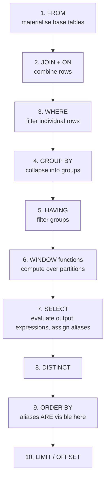

# SQL Fundamentals & CRUD

> **What you will be able to do after this page**
>
> - Recite the **logical order of query evaluation** and use it to explain every "why can't I use that alias there?" question.
> - Trace rows through `FROM → JOIN → WHERE → GROUP BY → HAVING → WINDOW → SELECT → DISTINCT → ORDER BY → LIMIT`, with row counts at each step.
> - Write `INSERT ... ON CONFLICT`, `RETURNING`, `DISTINCT ON`, and multi-table `UPDATE ... FROM` fluently.
> - Explain `NULL` semantics well enough that three-valued logic never surprises you again.

---

## 1. The single most important diagram in SQL

SQL is written in one order and **executed in a completely different one**. Everything confusing about SQL follows from this.



Three consequences you will be asked about:

1. **You cannot use a `SELECT` alias in `WHERE`, `GROUP BY` or `HAVING`** — step 7 hasn't run yet.
   ```sql
   SELECT price * qty AS revenue FROM sales WHERE revenue > 100;  -- ❌ ERROR: column "revenue" does not exist
   ```
2. **You *can* use it in `ORDER BY`** — step 9 runs after step 7. (Postgres also permits it in `GROUP BY` as a non-standard extension.)
   ```sql
   SELECT price * qty AS revenue FROM sales ORDER BY revenue DESC;  -- ✅
   ```
3. **`WHERE` filters rows, `HAVING` filters groups.** `WHERE` runs before aggregation, so it cannot see `sum()`. `HAVING` runs after, so it can — and cannot see individual rows.

:::info[PostgreSQL vs MySQL]
MySQL **does** let you reference a `SELECT` alias in `GROUP BY` and — non-standard and confusing — in `HAVING`. Postgres allows the `GROUP BY` case but rejects it in `WHERE` and `HAVING`.

Also: MySQL historically allowed `SELECT a, b, sum(c) FROM t GROUP BY a` with `b` unaggregated, returning an arbitrary `b`. Postgres has always rejected this. MySQL 5.7+ enables `ONLY_FULL_GROUP_BY` by default, aligning with Postgres — but a lot of legacy MySQL SQL still relies on the old behaviour and breaks on port.

Postgres does have one relaxation: if you group by a table's **primary key**, all other columns of that table are functionally dependent and may be selected unaggregated. That's SQL-standard and genuinely useful.
:::

---

## 2. The full trace — one query, every step

Sample data:

```sql
-- customers                      -- orders
 id | name   | city               id | customer_id | amount | status | placed_on
----+--------+-----------          ---+-------------+--------+--------+-----------
  1 | Asha   | Pune                1 |           1 |   500  | paid   | 2026-01-05
  2 | Ravi   | Pune                2 |           1 |   300  | paid   | 2026-01-09
  3 | Meera  | Mumbai              3 |           2 |   900  | paid   | 2026-02-02
  4 | Karan  | Delhi               4 |           2 |   100  | cancel | 2026-02-11
                                   5 |           3 |  1200  | paid   | 2026-02-14
                                   6 |           3 |   400  | paid   | 2026-03-01
                                   7 |           3 |   250  | paid   | 2026-03-03
                                   -- customer 4 has NO orders
```

The query:

```sql
SELECT   c.city,
         count(*)          AS order_count,
         sum(o.amount)     AS revenue
FROM     customers c
JOIN     orders    o ON o.customer_id = c.id
WHERE    o.status = 'paid'
GROUP BY c.city
HAVING   sum(o.amount) > 800
ORDER BY revenue DESC
LIMIT    2;
```

### Step 1–2 — `FROM` + `JOIN`

```text
customers (4 rows) ⋈ orders (7 rows)  ON o.customer_id = c.id

 c.id c.name c.city   │ o.id o.amount o.status
──────────────────────┼─────────────────────────
    1 Asha   Pune     │   1     500    paid       ← Asha duplicated: 2 orders
    1 Asha   Pune     │   2     300    paid       ←
    2 Ravi   Pune     │   3     900    paid       ← Ravi duplicated: 2 orders
    2 Ravi   Pune     │   4     100    cancel     ←
    3 Meera  Mumbai   │   5    1200    paid       ← Meera duplicated: 3 orders
    3 Meera  Mumbai   │   6     400    paid       ←
    3 Meera  Mumbai   │   7     250    paid       ←
    ✗ Karan Delhi     │  (no match) → DROPPED by INNER JOIN

ROWS: 7      (4 customers × their matching orders; Karan eliminated)
```

**This is the join lesson:** an inner join *duplicates* the one-side row once per matching many-side row, and *drops* one-side rows with no match.

### Step 3 — `WHERE o.status = 'paid'`

```text
    1 Asha   Pune     │   1     500    paid    ✓
    1 Asha   Pune     │   2     300    paid    ✓
    2 Ravi   Pune     │   3     900    paid    ✓
    2 Ravi   Pune     │   4     100    cancel  ✗ dropped
    3 Meera  Mumbai   │   5    1200    paid    ✓
    3 Meera  Mumbai   │   6     400    paid    ✓
    3 Meera  Mumbai   │   7     250    paid    ✓

ROWS: 7 → 6
```

### Step 4 — `GROUP BY c.city`

```text
 Pune   ┐ 500  ┐
        │ 300  ├─▶ group "Pune"    : 3 rows
        │ 900  ┘
 Mumbai ┐1200  ┐
        │ 400  ├─▶ group "Mumbai"  : 3 rows
        │ 250  ┘

ROWS: 6 → 2 groups

⚠️  After GROUP BY, c.name and o.id NO LONGER EXIST as selectable values.
    Only the grouping key and aggregates over the group are available.
    (Exactly the same rule as MongoDB's "$group destroys the document".)
```

### Step 5 — `HAVING sum(o.amount) > 800`

```text
 Pune   : count=3, sum=1700  ✓ keep
 Mumbai : count=3, sum=1850  ✓ keep

ROWS: 2 → 2
```

### Step 7 — `SELECT`

```text
 city   | order_count | revenue
--------+-------------+---------
 Pune   |      3      |  1700
 Mumbai |      3      |  1850
```

### Step 9–10 — `ORDER BY revenue DESC LIMIT 2`

```text
 city   | order_count | revenue
--------+-------------+---------
 Mumbai |      3      |  1850     ← alias `revenue` IS visible here
 Pune   |      3      |  1700

FINAL: 2 rows
```

:::warning[The `count(*)` trap]
`order_count` is 3 for Pune — but Pune has only **2 customers**. `count(*)` counts *joined rows*, not customers. To count customers you need `count(DISTINCT c.id)`. This is the single most common aggregate-after-join bug, and it produces plausible-looking wrong numbers rather than errors.
:::

---

## 3. `SELECT` essentials

```sql
SELECT DISTINCT city FROM customers;
SELECT c.*, o.amount FROM customers c JOIN orders o ON o.customer_id = c.id;
SELECT name AS customer_name, city "Home City" FROM customers;  -- AS is optional; double quotes preserve case
```

### `DISTINCT ON` — a Postgres exclusive

"Give me the most recent order per customer" — the single most common real-world query shape.

```sql
SELECT DISTINCT ON (customer_id)
       customer_id, id, amount, placed_on
FROM   orders
ORDER  BY customer_id, placed_on DESC;
```

**Trace:**

```text
Step A — ORDER BY customer_id, placed_on DESC   (mandatory: the leading ORDER BY
                                                 columns must match the DISTINCT ON list)
 cust  id  amount  placed_on
   1    2    300   2026-01-09   ← first row for customer 1
   1    1    500   2026-01-05
   2    4    100   2026-02-11   ← first row for customer 2
   2    3    900   2026-02-02
   3    7    250   2026-03-03   ← first row for customer 3
   3    6    400   2026-03-01
   3    5   1200   2026-02-14

Step B — DISTINCT ON (customer_id): keep the FIRST row of each customer_id run
 cust  id  amount  placed_on
   1    2    300   2026-01-09
   2    4    100   2026-02-11
   3    7    250   2026-03-03

7 rows → 3 rows
```

:::info[PostgreSQL vs MySQL]
`DISTINCT ON` does not exist in MySQL, nor in the SQL standard. The portable equivalent is a window function:

```sql
-- Portable (works on MySQL 8+, and on Postgres)
SELECT customer_id, id, amount, placed_on
FROM (
  SELECT *, row_number() OVER (PARTITION BY customer_id ORDER BY placed_on DESC) AS rn
  FROM orders
) t
WHERE rn = 1;
```

On MySQL 5.7 and earlier there are no window functions either, so you're stuck with a correlated subquery or a self-join against a grouped derived table — both slower and much uglier. `DISTINCT ON` is usually **faster** than the window-function version on Postgres too, because it can stop early per group when an index provides the order.
:::

---

## 4. `WHERE` — filtering rows

```sql
WHERE amount BETWEEN 100 AND 500          -- inclusive on both ends
WHERE status IN ('paid','shipped')
WHERE city IS NOT NULL
WHERE name LIKE 'A%'                      -- case-SENSITIVE
WHERE name ILIKE 'a%'                     -- case-INSENSITIVE  ← Postgres only
WHERE name ~ '^A.*a$'                     -- POSIX regex, case-sensitive
WHERE name ~* '^a'                        -- POSIX regex, case-insensitive
WHERE name !~~ 'A%'                       -- NOT LIKE (operator form)
```

:::info[PostgreSQL vs MySQL — pattern matching]
| | PostgreSQL | MySQL |
| :--- | :--- | :--- |
| Case-sensitive LIKE | `LIKE` (default) | `LIKE BINARY` or a `_bin`/`_cs` collation |
| Case-insensitive LIKE | **`ILIKE`** | `LIKE` (default, because the default collation is `_ci`) |
| Regex | `~`, `~*`, `!~`, `!~*` (POSIX) and `regexp_match`, `regexp_replace`, `regexp_matches` | `REGEXP` / `RLIKE`, `REGEXP_LIKE()` (8.0+, ICU) |
| Trigram fuzzy search | `pg_trgm` + GIN/GiST → indexed `LIKE '%foo%'` | No equivalent; `LIKE '%x%'` is always a full scan |
| Escape wildcards | `LIKE 'a\_b'` or `LIKE 'a!_b' ESCAPE '!'` | same |

**The key inversion to remember:** Postgres is case-sensitive by default and gives you `ILIKE` to opt out. MySQL is case-*insensitive* by default and you opt *in* to sensitivity with a collation. Neither is "more correct," but code ported in either direction silently changes meaning.

And the big one: `LIKE '%term%'` cannot use a B-tree index on either engine — but on Postgres, `CREATE INDEX ... USING GIN (name gin_trgm_ops)` makes it indexed. MySQL has no answer short of full-text search.
:::

### `NULL` — three-valued logic

```sql
SELECT NULL = NULL;             -- NULL  (not true!)
SELECT NULL <> NULL;            -- NULL
SELECT NULL IS NULL;            -- true
SELECT 1 IN (1, NULL);          -- true
SELECT 2 IN (1, NULL);          -- NULL  → row filtered out
SELECT 2 NOT IN (1, NULL);      -- NULL  → ⚠️ NEVER returns rows
SELECT NULL IS DISTINCT FROM 1; -- true  (NULL-safe comparison)
SELECT coalesce(NULL, NULL, 'x');
SELECT nullif(x, 0);            -- NULL if x = 0 — safe division denominators
```

:::danger[`NOT IN` with NULLs returns nothing]
```sql
SELECT * FROM customers WHERE id NOT IN (SELECT customer_id FROM orders);
```
If **any** row in `orders` has a NULL `customer_id`, this returns **zero rows**, silently. Because `id NOT IN (1,2,NULL)` evaluates to `NULL`, never `true`.

Use `NOT EXISTS` instead — it has correct semantics *and* usually a better plan:
```sql
SELECT * FROM customers c
WHERE NOT EXISTS (SELECT 1 FROM orders o WHERE o.customer_id = c.id);
```
This is identical on MySQL. Same trap, same fix.
:::

`WHERE` filtering is where indexes get used, so the shape matters:

```sql
WHERE date_trunc('day', placed_on) = '2026-01-05'   -- ❌ function on the column: no plain index use
WHERE placed_on >= '2026-01-05' AND placed_on < '2026-01-06'  -- ✅ sargable range
-- or index the expression:
CREATE INDEX ON orders (date_trunc('day', placed_on));        -- ✅ Postgres can do this
```

---

## 5. `INSERT`

```sql
INSERT INTO customers (name, city) VALUES ('Zoya', 'Pune');

-- multi-row
INSERT INTO customers (name, city) VALUES
  ('A','Pune'), ('B','Delhi'), ('C','Mumbai');

-- from a query
INSERT INTO archive_orders SELECT * FROM orders WHERE placed_on < '2025-01-01';

-- all defaults
INSERT INTO logs DEFAULT VALUES;
```

### `RETURNING` — Postgres-exclusive, and a big deal

```sql
INSERT INTO customers (name, city)
VALUES ('Zoya','Pune')
RETURNING id, created_at;

-- works on UPDATE and DELETE too
UPDATE orders SET status = 'shipped'
WHERE status = 'paid' AND placed_on < now() - interval '1 day'
RETURNING id, customer_id;

DELETE FROM sessions WHERE expires_at < now()
RETURNING id;
```

`RETURNING` gives you generated IDs, defaults, generated columns, and trigger-modified values in **one round trip**, for any number of rows. It composes with CTEs to make a genuinely atomic move-between-tables:

```sql
WITH archived AS (
  DELETE FROM orders WHERE placed_on < '2025-01-01'
  RETURNING *
)
INSERT INTO archived_orders SELECT * FROM archived;
```

:::info[PostgreSQL vs MySQL]
| PostgreSQL | MySQL |
| :--- | :--- |
| `RETURNING` on INSERT/UPDATE/DELETE, any number of rows, any columns | **No `RETURNING`** (MariaDB has it; MySQL does not) |
| Composable in CTEs — data-modifying CTEs | Not possible |
| Multi-row insert returns every generated id | `LAST_INSERT_ID()` returns only the **first** id of a batch, and nothing for UPDATE/DELETE |

To capture deleted rows on MySQL you `SELECT` them first, then `DELETE` — two statements, and a race unless you lock. `RETURNING` is one of the features people miss most when moving *from* Postgres.
:::

### `ON CONFLICT` — UPSERT

```sql
INSERT INTO inventory (sku, qty)
VALUES ('ABC-1', 10)
ON CONFLICT (sku)
DO UPDATE SET qty = inventory.qty + EXCLUDED.qty,
              updated_at = now();
```

- `EXCLUDED` is a pseudo-table holding **the row you tried to insert**.
- The unqualified table name (`inventory.qty`) refers to **the existing row**.
- The conflict target must match a unique index/constraint: `(sku)`, or `ON CONSTRAINT uq_sku`, or a partial index's predicate.

```sql
-- insert-if-absent, ignore otherwise
INSERT INTO tags (name) VALUES ('sql') ON CONFLICT DO NOTHING;

-- conditional upsert: only overwrite if the incoming row is newer
INSERT INTO cache (key, value, updated_at) VALUES ($1, $2, now())
ON CONFLICT (key) DO UPDATE
  SET value = EXCLUDED.value, updated_at = EXCLUDED.updated_at
  WHERE cache.updated_at < EXCLUDED.updated_at;

-- targeting a PARTIAL unique index requires repeating its predicate
INSERT INTO subs (user_id, status) VALUES (1,'active')
ON CONFLICT (user_id) WHERE status = 'active' DO NOTHING;
```

:::info[PostgreSQL vs MySQL — the UPSERT comparison you'll be asked for]
| | PostgreSQL | MySQL |
| :--- | :--- | :--- |
| Syntax | `INSERT ... ON CONFLICT (cols) DO UPDATE SET ...` | `INSERT ... ON DUPLICATE KEY UPDATE ...` |
| Which constraint | **You name it explicitly** | **Any** unique constraint — you don't control which |
| Reference incoming row | `EXCLUDED.col` | `VALUES(col)` (deprecated 8.0.20+) or `AS new` alias: `new.col` |
| Skip on conflict | `ON CONFLICT DO NOTHING` | `INSERT IGNORE` — but that **also swallows unrelated errors** (bad dates, truncation) |
| Conditional update | `... DO UPDATE ... WHERE <pred>` | No `WHERE` clause; you fake it with `IF()`/`GREATEST()` in the SET |
| `RETURNING` the result | ✅ | ❌ |
| `REPLACE INTO` | Doesn't exist (good — it's a delete+insert) | Exists; fires delete triggers, resets other columns to defaults, breaks FKs |

The two substantive advantages: **naming the conflict target** (with several unique constraints, `ON DUPLICATE KEY UPDATE` fires on whichever one happens to conflict, which can silently update the wrong row) and the **`WHERE` clause on the update**, which is how you implement "last write wins by timestamp" without a race.

`INSERT IGNORE` deserves its own warning: it downgrades *all* errors to warnings, so a truncated string or an invalid date is silently accepted. `ON CONFLICT DO NOTHING` only ignores the conflict.
:::

`MERGE` (SQL-standard) also exists in PG 15+, and is better for multi-action logic:

```sql
MERGE INTO inventory i
USING incoming n ON i.sku = n.sku
WHEN MATCHED AND n.qty = 0 THEN DELETE
WHEN MATCHED               THEN UPDATE SET qty = i.qty + n.qty
WHEN NOT MATCHED           THEN INSERT (sku, qty) VALUES (n.sku, n.qty);
```

`ON CONFLICT` is still preferred for plain upserts because it's genuinely concurrency-safe under high contention; `MERGE` can raise serialisation errors and doesn't do `RETURNING` until PG 17.

---

## 6. `UPDATE`

```sql
UPDATE orders SET status = 'shipped' WHERE id = 5;

-- update from another table (Postgres syntax)
UPDATE orders o
SET    customer_city = c.city
FROM   customers c
WHERE  c.id = o.customer_id;

-- multiple columns, single assignment from a row expression
UPDATE orders
SET (status, shipped_at) = ('shipped', now())
WHERE id = 5;

-- update from a VALUES list (bulk update, one statement)
UPDATE orders o
SET    amount = v.amount
FROM   (VALUES (1, 550.00), (2, 320.00)) AS v(id, amount)
WHERE  o.id = v.id;
```

:::info[PostgreSQL vs MySQL — multi-table UPDATE]
```sql
-- PostgreSQL
UPDATE orders o SET city = c.city FROM customers c WHERE c.id = o.customer_id;

-- MySQL
UPDATE orders o JOIN customers c ON c.id = o.customer_id SET o.city = c.city;
```
MySQL can update **multiple tables in one statement**; Postgres cannot (`UPDATE ... FROM` reads other tables but writes only the target). Conversely Postgres has `RETURNING` and CTE composition. Straight syntax difference, no winner — but it's a guaranteed porting break because the syntax isn't remotely similar.
:::

---

## 7. `DELETE` and `TRUNCATE`

```sql
DELETE FROM orders WHERE status = 'cancelled';

-- delete using another table
DELETE FROM orders o USING customers c
WHERE c.id = o.customer_id AND c.city = 'Delhi';

TRUNCATE TABLE orders;                          -- fast, but takes ACCESS EXCLUSIVE
TRUNCATE orders RESTART IDENTITY CASCADE;       -- reset sequences, follow FKs
```

| | `DELETE` | `TRUNCATE` |
| :--- | :--- | :--- |
| Speed on a full table | Slow — per-row, writes WAL per row | Fast — drops and recreates the file |
| Reclaims disk | No (dead tuples, needs VACUUM) | Yes, immediately |
| Fires row triggers | Yes | No (only statement-level truncate triggers) |
| `WHERE` clause | Yes | No |
| **Transactional / rollback-able** | Yes | **Yes in PostgreSQL** |
| Resets sequences | No | Optional (`RESTART IDENTITY`) |

:::info[PostgreSQL vs MySQL]
**`TRUNCATE` is transactional in PostgreSQL** — you can `BEGIN; TRUNCATE t; ROLLBACK;` and get your data back. In MySQL, `TRUNCATE` is DDL, so it causes an implicit commit and **cannot be rolled back**. This follows directly from Postgres' transactional DDL and is a nice concrete example of it.
:::

Also: a `DELETE` of 10 million rows doesn't free any disk. It creates 10 million dead tuples, bloats the table, and needs a `VACUUM` (or `pg_repack`) to actually shrink. For "delete most of the table," it is usually faster to `CREATE TABLE new AS SELECT ... WHERE keep`, then swap names. On a partitioned table, `DROP PARTITION` is instant and is the correct design.

---

## 8. Handy expressions you'll use constantly

```sql
-- Conditionals
SELECT CASE WHEN amount > 1000 THEN 'high'
            WHEN amount > 500  THEN 'medium'
            ELSE 'low' END AS tier
FROM orders;

SELECT coalesce(nickname, name, 'anonymous');
SELECT greatest(a, b, c), least(a, b, c);       -- ignore NULLs

-- Strings
SELECT 'Hello' || ' ' || 'World';               -- concatenation
SELECT concat('a', NULL, 'b');                  -- 'ab'   — concat ignores NULL
SELECT 'a' || NULL;                             -- NULL   — || propagates NULL ⚠️
SELECT concat_ws('-', 2026, 08, 30);            -- '2026-8-30'
SELECT format('Hi %s, you owe %s', name, amount);
SELECT split_part('a.b.c', '.', 2);             -- 'b'
SELECT left(s,3), right(s,3), substring(s from 2 for 4);
SELECT trim(both ' ' from '  x  '), btrim(s), lpad(s, 5, '0');
SELECT string_agg(name, ', ' ORDER BY name) FROM customers;

-- Rows to a set, and back
SELECT * FROM generate_series(1, 5);
SELECT * FROM unnest(ARRAY['a','b','c']) WITH ORDINALITY AS t(val, idx);
```

:::info[PostgreSQL vs MySQL — string concatenation]
| PostgreSQL | MySQL |
| :--- | :--- |
| `'a' \|\| 'b'` → `'ab'` | `'a' \|\| 'b'` → **`0`** (it's logical OR!) unless `PIPES_AS_CONCAT` sql_mode is set |
| `concat(a, b)` also works | `CONCAT(a, b)` is **the** way |
| `'a' \|\| NULL` → `NULL` | `CONCAT('a', NULL)` → `NULL` |
| `concat('a', NULL)` → `'a'` | — |

**Use `concat()` for portable code**, and remember that `||` and `concat()` differ on NULL handling *within Postgres itself* — `||` propagates NULL, `concat()` skips it. That asymmetry catches people building address strings.
:::

---

## 9. Rapid-fire recall

<details>
<summary>**Recite the logical order of SQL evaluation.**</summary>

`FROM`, then `JOIN`/`ON`, then `WHERE`, then `GROUP BY`, then `HAVING`, then window functions, then `SELECT` (where aliases are created), then `DISTINCT`, then `ORDER BY`, then `LIMIT`/`OFFSET`. Everything confusing about SQL falls out of this: you can't reference a `SELECT` alias in `WHERE` because `SELECT` hasn't run yet, you can in `ORDER BY` because it has, and a window function can't be used in `WHERE` because windows are computed after filtering — you need a subquery or CTE to filter on one.
</details>

<details>
<summary>**`WHERE` vs `HAVING`?**</summary>

`WHERE` filters individual rows before grouping, so it can use indexes and cannot reference aggregates. `HAVING` filters groups after aggregation, so it can reference `sum()` and `count()` but not individual row values. Most real queries want both: `WHERE` to narrow the date range and status, `HAVING` to keep only groups above a threshold. Putting a row-level predicate in `HAVING` still gives the right answer but aggregates rows you were going to throw away.
</details>

<details>
<summary>**Why does `NOT IN` with a subquery sometimes return nothing?**</summary>

Because of NULL. `x NOT IN (1, 2, NULL)` expands to `x <> 1 AND x <> 2 AND x <> NULL`, and the last term is `NULL`, so the whole expression is `NULL` rather than `true` — and `NULL` isn't a match, so no rows come back. If the subquery can produce a single NULL, the query silently returns zero rows. The fix is `NOT EXISTS`, which uses proper existence semantics and usually gets an anti-join plan too. Identical behaviour on MySQL.
</details>

<details>
<summary>**What is `DISTINCT ON` and what's the portable equivalent?**</summary>

A PostgreSQL extension that keeps the first row of each group defined by the listed expressions, where "first" is decided by the `ORDER BY` — whose leading columns must match the `DISTINCT ON` list. It's the cleanest way to write "latest row per customer." The portable version is `row_number() OVER (PARTITION BY ... ORDER BY ...)` in a subquery filtered to `rn = 1`, which works on MySQL 8+ but not 5.7. On Postgres, `DISTINCT ON` is often faster because with a matching index it can skip ahead rather than ranking every row.
</details>

<details>
<summary>**Explain `ON CONFLICT DO UPDATE` and how it differs from MySQL's version.**</summary>

It's PostgreSQL's atomic upsert: try the insert, and if it violates a specified unique index, run an update instead, with the proposed row available as `EXCLUDED`. Two things it has that `ON DUPLICATE KEY UPDATE` doesn't: you name *which* constraint you're handling, which matters a lot on a table with several unique keys, and you can attach a `WHERE` clause to the update so you only overwrite when, say, the incoming timestamp is newer. It also composes with `RETURNING`. MySQL's `INSERT IGNORE` is not equivalent to `ON CONFLICT DO NOTHING` — `INSERT IGNORE` downgrades every error to a warning, not just conflicts.
</details>

<details>
<summary>**What does `RETURNING` give you?**</summary>

The affected rows, from an `INSERT`, `UPDATE` or `DELETE`, in the same round trip — including generated IDs, defaults, generated columns and trigger-applied values, for any number of rows. Beyond convenience it enables genuinely atomic patterns: a data-modifying CTE that deletes rows and inserts them into an archive table in one statement, with no window where the rows exist in neither place. MySQL has no equivalent, so the same operation is two statements plus a locking strategy.
</details>

<details>
<summary>**Is `TRUNCATE` faster than `DELETE`, and can you undo it?**</summary>

Much faster — it drops and recreates the underlying files instead of marking every row dead, so it also reclaims disk immediately, whereas a large `DELETE` leaves dead tuples that only `VACUUM` reclaims. It skips row-level triggers and takes an `ACCESS EXCLUSIVE` lock. And in PostgreSQL it *is* transactional: you can roll it back, because Postgres DDL is transactional. In MySQL it's DDL with an implicit commit and cannot be undone.
</details>

<details>
<summary>**`||` or `concat()`?**</summary>

`||` is the SQL-standard concatenation operator and propagates NULL — `'a' || NULL` is NULL — while `concat()` treats NULL as an empty string. So use `||` when a NULL should poison the result and `concat()`/`concat_ws()` when you're assembling optional parts like an address. Also note `||` means logical OR in MySQL's default sql_mode, so `concat()` is the portable choice.
</details>

---

**Next:** [Joins & Set Operations →](./05-joins-and-set-operations.md)
