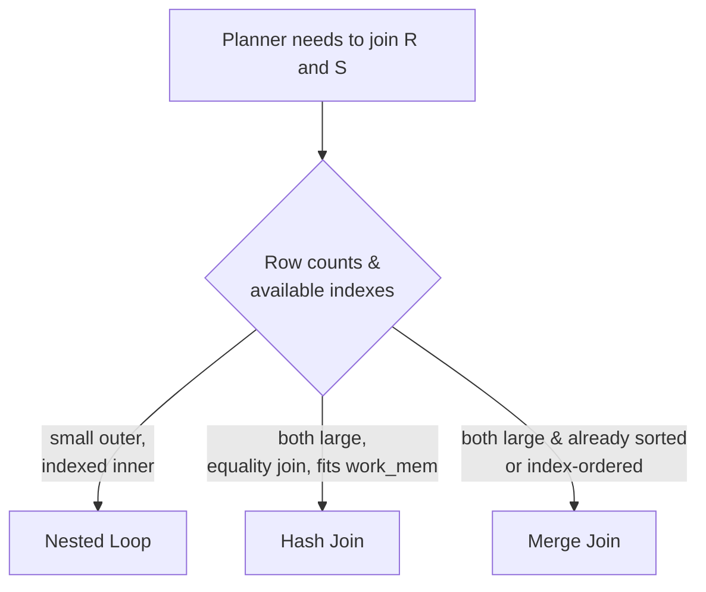

# Joins & Set Operations

> **What you will be able to do after this page**
>
> - Predict the exact row count and contents of every join type, and explain *why* rows duplicate or disappear.
> - Know the difference between a predicate in `ON` and the same predicate in `WHERE` for an outer join — the classic interview question.
> - Choose between `UNION`, `UNION ALL`, `INTERSECT`, `EXCEPT` and know which deduplicate.
> - Read the three physical join algorithms in `EXPLAIN` and say when the planner picks each.

---

## 1. The sample data (used throughout)

```sql
-- employees                          -- departments
 id | name   | dept_id                 id | name
----+--------+---------                --+---------
  1 | Asha   |    10                   10 | Engineering
  2 | Ravi   |    10                   20 | Sales
  3 | Meera  |    20                   30 | Legal        ← no employees
  4 | Karan  |  NULL   ← no dept
```

---

## 2. `INNER JOIN` — keep only matches

```sql
SELECT e.name AS emp, d.name AS dept
FROM employees e
INNER JOIN departments d ON e.dept_id = d.id;
```

```text
LEFT (employees)          RIGHT (departments)      MATCH?      OUTPUT
──────────────────────────────────────────────────────────────────────
 1 Asha   dept_id=10  ──▶  10 Engineering          ✓          Asha  | Engineering
 2 Ravi   dept_id=10  ──▶  10 Engineering          ✓          Ravi  | Engineering
 3 Meera  dept_id=20  ──▶  20 Sales                ✓          Meera | Sales
 4 Karan  dept_id=NULL ─▶  (NULL never matches)    ✗          DROPPED
                           30 Legal (unreferenced) ✗          DROPPED

4 employees + 3 departments → 3 rows
```

**Two rules:** an inner join drops any row with no match on *either* side, and `NULL = anything` is `NULL`, so `NULL` dept_id never matches — not even a department with a NULL id.

---

## 3. `LEFT JOIN` — keep all of the left

```sql
SELECT e.name AS emp, d.name AS dept
FROM employees e
LEFT JOIN departments d ON e.dept_id = d.id;
```

```text
 1 Asha   ──▶ Engineering        ✓
 2 Ravi   ──▶ Engineering        ✓
 3 Meera  ──▶ Sales              ✓
 4 Karan  ──▶ (no match)         → KEPT, right-side columns filled with NULL

4 rows out  (= left row count, since no left row matched more than once)
 emp   | dept
-------+-------------
 Asha  | Engineering
 Ravi  | Engineering
 Meera | Sales
 Karan | NULL          ← ⚠️ the NULL comes from the JOIN, not from the data
```

### The single most-asked join question: `ON` vs `WHERE` in an outer join

```sql
-- A) predicate in ON
SELECT e.name, d.name FROM employees e
LEFT JOIN departments d ON e.dept_id = d.id AND d.name = 'Engineering';

-- B) predicate in WHERE
SELECT e.name, d.name FROM employees e
LEFT JOIN departments d ON e.dept_id = d.id
WHERE d.name = 'Engineering';
```

**Trace A — `ON` filters what counts as a match; the left row survives regardless:**

```text
step 1: join, but only 'Engineering' rows are eligible partners
 Asha   ──▶ Engineering    ✓
 Ravi   ──▶ Engineering    ✓
 Meera  ──▶ Sales is not eligible → treated as NO MATCH → kept with NULL
 Karan  ──▶ no match                                   → kept with NULL

RESULT: 4 rows
 Asha  | Engineering
 Ravi  | Engineering
 Meera | NULL
 Karan | NULL
```

**Trace B — `WHERE` runs *after* the join, and NULLs fail the test:**

```text
step 1: full LEFT JOIN            step 2: WHERE d.name = 'Engineering'
 Asha  | Engineering              ✓ keep
 Ravi  | Engineering              ✓ keep
 Meera | Sales                    ✗ drop
 Karan | NULL                     ✗ drop  (NULL = 'Engineering' → NULL → not true)

RESULT: 2 rows — the LEFT JOIN has been silently converted into an INNER JOIN
```

:::danger[The rule to memorise]
**Any `WHERE` condition on the right-hand table of a `LEFT JOIN` turns it into an `INNER JOIN`** — because the NULL-filled rows can never satisfy it.

- Condition should **restrict which rows can match** → put it in `ON`.
- Condition should **filter the final result** → put it in `WHERE`.
- Want "left rows with *no* match"? → `WHERE d.id IS NULL` (an anti-join, and this is the one legitimate `WHERE` on the right side).

This is identical in MySQL. It's SQL semantics, not a dialect thing.
:::

### Anti-join: rows with no match

```sql
SELECT e.name FROM employees e
LEFT JOIN departments d ON e.dept_id = d.id
WHERE d.id IS NULL;              -- → Karan
```

```text
after LEFT JOIN:                 after WHERE d.id IS NULL:
 Asha  | 10 Engineering          ✗
 Ravi  | 10 Engineering          ✗
 Meera | 20 Sales                ✗
 Karan | NULL NULL      ────────▶ ✓  Karan
```

`NOT EXISTS` expresses the same thing and the planner usually turns both into the same Anti Join node. Prefer `NOT EXISTS` for readability and NULL-safety.

---

## 4. `RIGHT JOIN` and `FULL OUTER JOIN`

```sql
SELECT e.name AS emp, d.name AS dept
FROM employees e RIGHT JOIN departments d ON e.dept_id = d.id;
```

```text
 Asha  | Engineering
 Ravi  | Engineering
 Meera | Sales
 NULL  | Legal          ← department with no employees, kept

4 rows
```

`RIGHT JOIN` is `LEFT JOIN` with the tables swapped. Most teams standardise on `LEFT JOIN` only, because reading a query where the "kept" table isn't the first one is needlessly hard.

```sql
SELECT e.name AS emp, d.name AS dept
FROM employees e FULL OUTER JOIN departments d ON e.dept_id = d.id;
```

```text
 Asha  | Engineering
 Ravi  | Engineering
 Meera | Sales
 Karan | NULL           ← unmatched LEFT row
 NULL  | Legal          ← unmatched RIGHT row

5 rows
```

:::info[PostgreSQL vs MySQL]
**MySQL has no `FULL OUTER JOIN`.** You emulate it:

```sql
SELECT ... FROM a LEFT JOIN b ON a.id = b.a_id
UNION
SELECT ... FROM a RIGHT JOIN b ON a.id = b.a_id;
```

Which scans both tables twice and needs `UNION` (not `UNION ALL`) to dedupe the matched rows — noticeably slower. Postgres supports it natively. It's a genuine, if not everyday, gap.
:::

---

## 5. `CROSS JOIN` and self joins

```sql
SELECT e.name, d.name FROM employees e CROSS JOIN departments d;   -- 4 × 3 = 12 rows
SELECT e.name, d.name FROM employees e, departments d;             -- same thing, old syntax
```

Legitimate uses: generating a date × category spine so a report has no gaps, and pairing every row against a small config table.

```sql
-- every department × every day in a range, so missing days show as 0
SELECT d.name, s.day, coalesce(sum(o.amount), 0)
FROM departments d
CROSS JOIN generate_series(date '2026-01-01', date '2026-01-07', interval '1 day') AS s(day)
LEFT JOIN orders o ON o.dept_id = d.id AND o.placed_on::date = s.day
GROUP BY d.name, s.day;
```

**Self join** — comparing a table to itself:

```sql
-- employees and their managers
SELECT e.name AS employee, m.name AS manager
FROM employees e LEFT JOIN employees m ON e.manager_id = m.id;
```

:::warning[The accidental cross join]
Forgetting a join condition in the old comma syntax silently produces a Cartesian product. `FROM a, b, c` with only two conditions is 10,000 × 10,000 rows. Always use explicit `JOIN ... ON` — the syntax makes a missing condition a syntax error rather than a 100-million-row query.
:::

---

## 6. `USING` and `NATURAL JOIN`

```sql
SELECT * FROM orders JOIN customers USING (customer_id);  -- column merged, appears once
SELECT * FROM orders NATURAL JOIN customers;              -- joins on ALL same-named columns
```

`USING` is fine and reduces noise when the column names genuinely match. **`NATURAL JOIN` is a landmine**: adding a `created_at` column to both tables silently changes the join condition and the result set. Never use it in production code. Both behave identically in MySQL.

---

## 7. Set operations

```sql
SELECT city FROM customers
UNION            -- deduplicated
SELECT city FROM suppliers;

SELECT city FROM customers
UNION ALL        -- keeps duplicates, NO sort/hash needed → much faster
SELECT city FROM suppliers;

SELECT city FROM customers INTERSECT SELECT city FROM suppliers;  -- in both
SELECT city FROM customers EXCEPT    SELECT city FROM suppliers;  -- in first only
```

**Trace:**

```text
customers.city : Pune, Pune, Mumbai, Delhi
suppliers.city : Pune, Chennai

UNION ALL  → Pune, Pune, Mumbai, Delhi, Pune, Chennai      (6 rows, no dedup)
UNION      → Pune, Mumbai, Delhi, Chennai                  (4 rows, deduped — costs a sort or hash)
INTERSECT  → Pune                                          (1 row)
EXCEPT     → Mumbai, Delhi                                 (2 rows)
```

Rules: both sides need the same number of columns with compatible types; column names come from the first branch; `ORDER BY` and `LIMIT` apply to the whole result and go at the end (parenthesise a branch to limit it individually).

`ALL` variants exist for all three: `INTERSECT ALL`, `EXCEPT ALL` use multiset semantics (a value appearing 3 times and 2 times yields 2, or 1, respectively).

:::tip[Use `UNION ALL` unless you need dedup]
`UNION` must sort or hash the entire combined result to remove duplicates. If you know the branches are disjoint — a common case, e.g. `status = 'active'` and `status = 'archived'` — `UNION ALL` skips that entirely.
:::

:::info[PostgreSQL vs MySQL]
| PostgreSQL | MySQL |
| :--- | :--- |
| `UNION`, `UNION ALL`, `INTERSECT`, `EXCEPT` + `ALL` variants | `UNION`/`UNION ALL` always; **`INTERSECT` and `EXCEPT` added in 8.0.31** — before that, emulate with joins/`NOT EXISTS` |
| `EXCEPT` is the standard name | MySQL uses `EXCEPT` too (8.0.31+); Oracle calls it `MINUS` |
| `FULL OUTER JOIN` native | Not supported |
:::

---

## 8. The three physical join algorithms

`INNER JOIN` is *what* you want. The planner chooses *how*.



### Nested Loop

```text
for each row r in OUTER:
    for each matching row s in INNER (ideally via index lookup):
        emit (r, s)
```

Cost ≈ `rows(outer) × cost_of_index_lookup`. **Best when the outer side is small and the inner side has an index on the join key.** Without that index it degrades to O(N×M) and is catastrophic — a nested loop over two large tables in an `EXPLAIN` plan is usually the bug.

### Hash Join

```text
Phase 1 (build):  scan the SMALLER table, build a hash table on the join key in work_mem
Phase 2 (probe):  scan the larger table, hash each row's key, look it up
```

`O(N + M)`. **Equality joins only.** If the hash table exceeds `work_mem`, it spills to disk in batches — visible in `EXPLAIN (ANALYZE, BUFFERS)` as `Batches: 5  Memory Usage: ...`, which is a strong signal to raise `work_mem` for that query.

### Merge Join

```text
sort both inputs on the join key (or read them in order from an index),
then walk both in lockstep like a merge sort
```

Great for large, already-sorted inputs, and it supports range join conditions. Needs no big hash table, so it's memory-friendly.

:::info[PostgreSQL vs MySQL]
| PostgreSQL | MySQL |
| :--- | :--- |
| Nested Loop, **Hash Join**, **Merge Join**, plus parallel variants | Nested loop (Block Nested Loop), **Hash Join only since 8.0.18**, **no merge join at all** |
| Planner freely reorders joins (`join_collapse_limit`, GEQO beyond ~12 tables) | Also reorders, but with a weaker cost model historically |
| No hints | `STRAIGHT_JOIN`, `JOIN_ORDER()` hints available |

This is why big analytical joins have historically been much faster on Postgres — before 8.0.18, MySQL could only nested-loop two 10-million-row tables. Modern MySQL 8 has narrowed the gap substantially for equi-joins, but still has no merge join.
:::

---

## 9. Reading a join plan

```sql
EXPLAIN (ANALYZE, BUFFERS)
SELECT c.city, count(*)
FROM customers c JOIN orders o ON o.customer_id = c.id
WHERE o.status = 'paid'
GROUP BY c.city;
```

```text
 HashAggregate  (cost=2891.10..2891.35 rows=25 width=40)
                (actual time=41.884..41.892 rows=8 loops=1)
   Group Key: c.city
   Batches: 1  Memory Usage: 37kB
   ->  Hash Join  (cost=189.00..2641.10 rows=50000 width=32)
                  (actual time=2.412..33.116 rows=48219 loops=1)
         Hash Cond: (o.customer_id = c.id)
         ->  Seq Scan on orders o  (cost=0.00..2081.00 rows=50000 width=8)
                                   (actual time=0.011..12.884 rows=48219 loops=1)
               Filter: (status = 'paid'::text)
               Rows Removed by Filter: 51781
               Buffers: shared hit=1081
         ->  Hash  (cost=114.00..114.00 rows=6000 width=32)
                   (actual time=2.379..2.380 rows=6000 loops=1)
               Buckets: 8192  Batches: 1  Memory Usage: 449kB
               ->  Seq Scan on customers c  (cost=0.00..114.00 rows=6000 width=32)
                                            (actual time=0.008..0.910 rows=6000 loops=1)
                   Buffers: shared hit=54
 Planning Time: 0.214 ms
 Execution Time: 42.031 ms
```

How to read it:

- **Inside-out, bottom-up.** The two `Seq Scan`s run first; `Hash` builds from the smaller one (`customers`, 6000 rows); `Hash Join` probes it with `orders`.
- `rows=50000` (estimate) vs `rows=48219` (actual) — close, so statistics are healthy. A 100× gap is where bugs live.
- `Rows Removed by Filter: 51781` — half of `orders` was read and thrown away. **An index on `orders(status)` — or better, a partial index — would avoid that.**
- `Batches: 1` — the hash table fit in `work_mem`. More than 1 means it spilled.
- `Buffers: shared hit=1081` — all from cache, no disk reads. `read=` would mean misses.

Full treatment on the [EXPLAIN & the Planner](./14-explain-and-the-planner.md) page.

---

## 10. Join gotchas that produce wrong numbers

### Fan-out double counting

```sql
SELECT c.id, sum(o.amount) AS revenue, sum(p.amount) AS payments
FROM customers c
JOIN orders   o ON o.customer_id = c.id
JOIN payments p ON p.customer_id = c.id
GROUP BY c.id;
```

```text
Customer 1 has 2 orders (500, 300) and 3 payments (100, 200, 500).

The two joins MULTIPLY: 2 × 3 = 6 rows for customer 1.

 order  payment
   500     100
   500     200
   500     500
   300     100
   300     200
   300     500

sum(o.amount) = 500×3 + 300×3 = 2400   ← should be 800.  3× inflated.
sum(p.amount) = 800×2           = 1600  ← should be 800.  2× inflated.
```

**The fix** — aggregate each branch before joining, or use `LATERAL` / scalar subqueries:

```sql
SELECT c.id, o.revenue, p.payments
FROM customers c
LEFT JOIN (SELECT customer_id, sum(amount) AS revenue  FROM orders   GROUP BY 1) o ON o.customer_id = c.id
LEFT JOIN (SELECT customer_id, sum(amount) AS payments FROM payments GROUP BY 1) p ON p.customer_id = c.id;
```

**Joining two one-to-many relationships to the same parent and then aggregating is always wrong.** Recognising this instantly is a genuine seniority marker.

### `count(*)` vs `count(col)` vs `count(DISTINCT col)`

```text
after a join producing:  (1,'a'), (1,'a'), (1,NULL), (2,'b')

count(*)           = 4   -- all rows
count(col)         = 3   -- non-NULL values
count(DISTINCT col)= 2   -- 'a','b'
```

After any join to a many-side table, `count(*)` counts join output rows. If you meant "how many customers," you need `count(DISTINCT c.id)`.

---

## 11. Rapid-fire recall

<details>
<summary>**Explain every join type in one sentence each.**</summary>

`INNER JOIN` keeps only rows that match on both sides. `LEFT JOIN` keeps every left row, filling right-side columns with NULL when there's no match, and `RIGHT JOIN` is the mirror image. `FULL OUTER JOIN` keeps unmatched rows from both sides. `CROSS JOIN` produces the Cartesian product with no condition. And the two derived shapes worth naming: a *semi-join* (`EXISTS`) returns left rows that have at least one match without duplicating them, and an *anti-join* (`NOT EXISTS`, or `LEFT JOIN ... WHERE right.id IS NULL`) returns left rows that have none.
</details>

<details>
<summary>**Putting a filter in `ON` versus `WHERE` on a LEFT JOIN — what changes?**</summary>

`ON` decides which right-hand rows are eligible to match; a left row that ends up with no eligible partner is still kept with NULLs. `WHERE` runs after the join is formed, and a NULL-filled row can never satisfy a predicate on the right table, so it gets discarded — which quietly turns the outer join into an inner join. So a condition that restricts *what counts as a match* belongs in `ON`, and a condition that filters *the final result* belongs in `WHERE`. The one legitimate `WHERE` on the right side is `IS NULL`, which is how you write an anti-join.
</details>

<details>
<summary>**Why did my `sum()` triple after adding a join?**</summary>

Because the join fanned out. Joining a parent to two separate one-to-many children multiplies the row counts — two orders and three payments produce six rows — so each order amount is counted three times and each payment twice. The fix is to aggregate each child in its own subquery or `LATERAL` before joining, so each branch contributes one row per parent. It's not a Postgres quirk; it's what a join means.
</details>

<details>
<summary>**When does the planner choose a hash join over a nested loop?**</summary>

Nested loop wins when the outer side produces few rows and the inner side has an index on the join key, so each iteration is a cheap index lookup. Hash join wins when both sides are large and it's an equality join: it builds a hash table from the smaller input in `work_mem` and probes it once with the larger, giving O(N+M) instead of O(N×M). Merge join wins when both inputs are already sorted on the join key — often because indexes provide the order — or when you need a non-equality range join. If you see a nested loop over two large tables in a plan, that's usually the problem: either an index is missing or the row estimate is badly wrong.
</details>

<details>
<summary>**`UNION` vs `UNION ALL`?**</summary>

`UNION` removes duplicates across the combined result, which forces a sort or hash over everything. `UNION ALL` just concatenates. If the branches are provably disjoint — different status values, different date ranges — `UNION ALL` is strictly better and can be dramatically faster. Use `UNION` only when you actually need deduplication.
</details>

<details>
<summary>**What does MySQL not support here?**</summary>

`FULL OUTER JOIN` — you emulate it with a `LEFT JOIN` unioned to a `RIGHT JOIN`, scanning both tables twice. `INTERSECT` and `EXCEPT` only arrived in 8.0.31. And on the execution side, MySQL had no hash join until 8.0.18 and still has no merge join, so historically large equi-joins that Postgres hash-joins in seconds were nested loops in MySQL. Everything else about join *semantics* — including the `ON` vs `WHERE` outer-join rule — is identical, so don't invent differences there.
</details>

<details>
<summary>**Why avoid `NATURAL JOIN`?**</summary>

It joins on every column the two tables happen to share by name, so the join condition is invisible in the query and changes whenever someone adds a column. Adding a `created_at` to both tables silently changes the result set of every `NATURAL JOIN` in the codebase. `USING (id)` is fine — it's explicit — and `ON` is best.
</details>

---

**Next:** [Aggregation & Grouping →](./06-aggregation-and-grouping.md) — `GROUPING SETS`, `ROLLUP`, `CUBE` and the `FILTER` clause.
