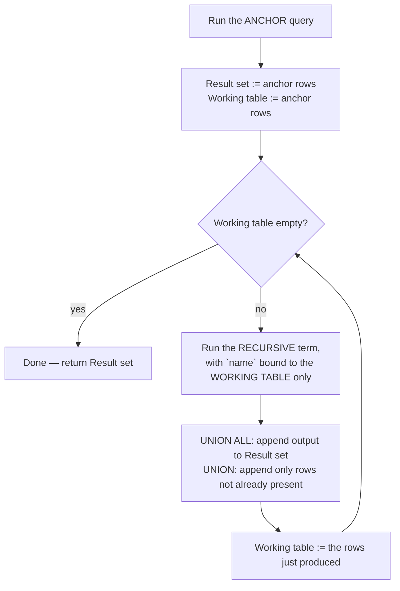

# CTEs & Recursive Queries

> **What you will be able to do after this page**
>
> - Explain CTE materialization in PostgreSQL — the optimisation fence, when it disappeared, and `MATERIALIZED` / `NOT MATERIALIZED`.
> - Trace a recursive CTE iteration by iteration, watching the working table fill and empty.
> - Write hierarchy traversal, graph search, cycle detection, and date-spine generation from memory.
> - Use data-modifying CTEs (`INSERT`/`UPDATE`/`DELETE ... RETURNING`) and know their visibility rules.

---

## 1. Basic CTEs

```sql
WITH regional AS (
    SELECT region, sum(amount) AS revenue
    FROM sales
    GROUP BY region
)
SELECT * FROM regional WHERE revenue > 1000;
```

Multiple CTEs, and later ones can reference earlier ones:

```sql
WITH
  paid AS (
      SELECT * FROM orders WHERE status = 'paid'
  ),
  per_customer AS (
      SELECT customer_id, sum(amount) AS total, count(*) AS n
      FROM paid GROUP BY customer_id
  ),
  ranked AS (
      SELECT *, rank() OVER (ORDER BY total DESC) AS r
      FROM per_customer
  )
SELECT c.name, r.total, r.n, r.r
FROM ranked r JOIN customers c ON c.id = r.customer_id
WHERE r.r <= 10
ORDER BY r.r;
```

This is the main reason to use CTEs: **a complex query reads top to bottom as a sequence of named steps** instead of as nested subqueries you have to read inside-out.

---

## 2. Materialization — the Postgres-specific thing you must know

**Before PostgreSQL 12**, every CTE was an **optimisation fence**: it was fully executed and materialised into a temporary result, and the planner could not push predicates into it.

```sql
-- PG 11 and earlier: this reads and materialises ALL 50 million orders,
-- then filters down to one customer. Disastrously slow.
WITH all_orders AS (SELECT * FROM orders)
SELECT * FROM all_orders WHERE customer_id = 42;
```

**From PostgreSQL 12**, a CTE is **inlined** (like a subquery, with predicate pushdown) when it is:

1. referenced **exactly once**, and
2. not recursive, and
3. side-effect free (no `INSERT`/`UPDATE`/`DELETE`, no volatile functions).

Otherwise it is materialised. And you can override the decision:

```sql
WITH expensive AS MATERIALIZED (          -- force it: compute once, reuse
    SELECT * FROM slow_function_call()
)
SELECT * FROM expensive a JOIN expensive b ON ...;

WITH filtered AS NOT MATERIALIZED (       -- force inlining: let predicates push down
    SELECT * FROM orders
)
SELECT * FROM filtered WHERE customer_id = 42;
```

:::tip[When to force `MATERIALIZED`]
- The CTE is expensive and referenced multiple times — materialise so it runs once.
- The CTE calls a volatile function whose results must be stable across references.
- You are deliberately fencing the optimiser because you know better than its estimate (rare, but real — e.g. a CTE that reduces 100 M rows to 50, where inlining would make the planner re-derive a bad estimate).

Force `NOT MATERIALIZED` when a single-reference CTE is being materialised because of a volatile function you don't care about, and you want the outer `WHERE` pushed inside.
:::

:::info[PostgreSQL vs MySQL — CTE materialization]
| PostgreSQL | MySQL 8 |
| :--- | :--- |
| CTE support since **8.4** | Since **8.0** (nothing in 5.7) |
| Optimisation fence pre-12; **inlined by default since 12** | Merged (inlined) or materialised, decided by the optimizer; `derived_merge` heuristics |
| Explicit `MATERIALIZED` / `NOT MATERIALIZED` control | **No such syntax** — you influence it with optimizer hints (`MERGE`/`NO_MERGE`) |
| **Data-modifying CTEs** (`WITH x AS (DELETE ... RETURNING *)`) | **Not supported** — CTEs are read-only |
| Recursive CTEs since 8.4 | Since 8.0, with `cte_max_recursion_depth` (default 1000) |

The `MATERIALIZED` keyword is a genuinely useful, Postgres-only lever, and data-modifying CTEs have no MySQL equivalent at all.
:::

---

## 3. Recursive CTEs — the mechanism

```sql
WITH RECURSIVE name (columns) AS (
    <anchor query>          -- non-recursive term: runs ONCE, seeds the result
  UNION [ALL]
    <recursive query>       -- references `name`; runs repeatedly
)
SELECT * FROM name;
```

The algorithm, precisely:



**The critical, frequently-missed detail:** inside the recursive term, the CTE name refers to **only the rows produced by the previous iteration** — not the accumulated result. That's what makes it a breadth-first traversal.

---

## 4. Trace 1 — counting to 5

```sql
WITH RECURSIVE counter AS (
    SELECT 1 AS n                       -- anchor
  UNION ALL
    SELECT n + 1 FROM counter WHERE n < 5   -- recursive
)
SELECT * FROM counter;
```

```text
ANCHOR
  working table = { 1 }
  result        = { 1 }

ITERATION 1:  SELECT n+1 FROM {1} WHERE n < 5   →  { 2 }
  result        = { 1, 2 }
  working table = { 2 }

ITERATION 2:  SELECT n+1 FROM {2} WHERE n < 5   →  { 3 }
  result        = { 1, 2, 3 }
  working table = { 3 }

ITERATION 3:  SELECT n+1 FROM {3} WHERE n < 5   →  { 4 }
  result        = { 1, 2, 3, 4 }
  working table = { 4 }

ITERATION 4:  SELECT n+1 FROM {4} WHERE n < 5   →  { 5 }
  result        = { 1, 2, 3, 4, 5 }
  working table = { 5 }

ITERATION 5:  SELECT n+1 FROM {5} WHERE n < 5   →  { }   ← WHERE fails, empty
  working table empty → STOP

OUTPUT: 1, 2, 3, 4, 5
```

:::danger[The infinite loop]
Drop the `WHERE n < 5` and the working table is never empty. Postgres will run until it exhausts disk or memory — there is **no default recursion limit**. Every recursive CTE needs either a terminating predicate or a depth guard:

```sql
SELECT n + 1, depth + 1 FROM counter WHERE depth < 100
```

MySQL 8 defaults to `cte_max_recursion_depth = 1000` and errors out, which is arguably the safer default. On Postgres you can approximate it with `statement_timeout`.
:::

---

## 5. Trace 2 — an org chart (the classic)

```sql
-- employees
 id | name   | manager_id
----+--------+------------
  1 | Asha   | NULL          ← CEO
  2 | Ravi   | 1
  3 | Meera  | 1
  4 | Karan  | 2
  5 | Nisha  | 2
  6 | Dev    | 4
```

```sql
WITH RECURSIVE org AS (
    SELECT id, name, manager_id, 1 AS level, name::text AS path
    FROM employees
    WHERE manager_id IS NULL
  UNION ALL
    SELECT e.id, e.name, e.manager_id, o.level + 1, o.path || ' > ' || e.name
    FROM employees e
    JOIN org o ON e.manager_id = o.id
)
SELECT repeat('  ', level - 1) || name AS tree, level, path
FROM org
ORDER BY path;
```

**Trace — the working table at each step:**

```text
ANCHOR (manager_id IS NULL)
  working = [ (1, Asha, lvl 1, "Asha") ]
  result  = [ Asha ]

ITERATION 1 — join employees to WORKING (= just Asha)
  Ravi.manager_id=1  matches Asha  → (2, Ravi,  lvl 2, "Asha > Ravi")
  Meera.manager_id=1 matches Asha  → (3, Meera, lvl 2, "Asha > Meera")
  working = [ Ravi, Meera ]                     ← Asha is NO LONGER in the working table
  result  = [ Asha, Ravi, Meera ]

ITERATION 2 — join employees to WORKING (= Ravi, Meera)
  Karan.manager_id=2 matches Ravi  → (4, Karan, lvl 3, "Asha > Ravi > Karan")
  Nisha.manager_id=2 matches Ravi  → (5, Nisha, lvl 3, "Asha > Ravi > Nisha")
  (nobody reports to Meera)
  working = [ Karan, Nisha ]
  result  = [ Asha, Ravi, Meera, Karan, Nisha ]

ITERATION 3 — join employees to WORKING (= Karan, Nisha)
  Dev.manager_id=4 matches Karan   → (6, Dev, lvl 4, "Asha > Ravi > Karan > Dev")
  working = [ Dev ]
  result  = [ ... , Dev ]

ITERATION 4 — nobody reports to Dev
  working = [ ]  → STOP
```

**Output:**

```text
 tree           │ level │ path
────────────────┼───────┼────────────────────────────
 Asha           │   1   │ Asha
   Meera        │   2   │ Asha > Meera
   Ravi         │   2   │ Asha > Ravi
     Karan      │   3   │ Asha > Ravi > Karan
       Dev      │   4   │ Asha > Ravi > Karan > Dev
     Nisha      │   3   │ Asha > Ravi > Nisha
```

Ordering by the accumulated `path` string is what produces correct depth-first tree ordering from a breadth-first traversal — a neat trick worth remembering. (For robustness with long names, use an **array** path and order by that: `ARRAY[id]` then `o.path || e.id`.)

### Walk the other way — ancestors of a node

```sql
WITH RECURSIVE chain AS (
    SELECT id, name, manager_id, 1 AS depth FROM employees WHERE id = 6
  UNION ALL
    SELECT e.id, e.name, e.manager_id, c.depth + 1
    FROM employees e JOIN chain c ON e.id = c.manager_id   -- ← flipped join direction
)
SELECT * FROM chain;
-- Dev → Karan → Ravi → Asha
```

Same query shape, join reversed. That's the entire difference between "descendants" and "ancestors."

---

## 6. Trace 3 — graph traversal with cycle detection

A graph, unlike a tree, can loop — and a loop means infinite recursion.

```sql
-- edges: 1→2, 2→3, 3→1  (a cycle!), 3→4
WITH RECURSIVE reachable AS (
    SELECT src, dst, ARRAY[src, dst] AS path, false AS is_cycle
    FROM edges WHERE src = 1
  UNION ALL
    SELECT e.src, e.dst, r.path || e.dst, e.dst = ANY(r.path)
    FROM edges e
    JOIN reachable r ON e.src = r.dst
    WHERE NOT r.is_cycle                    -- ← stop expanding once a cycle is seen
)
SELECT * FROM reachable;
```

```text
ANCHOR:      (1→2, path=[1,2], cycle=false)

ITER 1: from dst=2 → edge 2→3
             (2→3, path=[1,2,3], cycle = 3 ∈ [1,2]? false)

ITER 2: from dst=3 → edges 3→1 and 3→4
             (3→1, path=[1,2,3,1], cycle = 1 ∈ [1,2,3]? TRUE  ⚠️ marked, not expanded)
             (3→4, path=[1,2,3,4], cycle = 4 ∈ [1,2,3]? false)

ITER 3: from dst=4 → no outgoing edges; the cycle row is excluded by `WHERE NOT r.is_cycle`
        working table empty → STOP
```

**PG 14+ has syntax for exactly this:**

```sql
WITH RECURSIVE reachable AS (
    SELECT src, dst FROM edges WHERE src = 1
  UNION ALL
    SELECT e.src, e.dst FROM edges e JOIN reachable r ON e.src = r.dst
) CYCLE dst SET is_cycle USING path
SELECT * FROM reachable;
```

Also PG 14+: `SEARCH DEPTH FIRST BY id SET ordercol` / `SEARCH BREADTH FIRST BY id SET ordercol` produce a sort column that gives you proper DFS or BFS ordering without the string-path hack.

:::info[PostgreSQL vs MySQL]
`CYCLE ... SET ... USING ...` and `SEARCH DEPTH/BREADTH FIRST` are **PostgreSQL 14+ only** — MySQL has neither, so you hand-roll the array-path cycle check (which works on both, and is worth knowing anyway). MySQL protects you differently, with `cte_max_recursion_depth`, which stops the runaway but doesn't help you *detect* the cycle.
:::

---

## 7. Other things recursive CTEs are for

### Date spine — every day in a range, no gaps

```sql
WITH RECURSIVE days AS (
    SELECT date '2026-01-01' AS d
  UNION ALL
    SELECT d + 1 FROM days WHERE d < date '2026-01-31'
)
SELECT d FROM days;
```

On Postgres you'd just use `generate_series(date '2026-01-01', date '2026-01-31', interval '1 day')` — much simpler. **MySQL has no `generate_series`, so the recursive CTE above is the standard MySQL idiom** for a numbers/date table.

### Bill of materials — total quantity of each part

```sql
WITH RECURSIVE bom AS (
    SELECT part_id, child_id, qty FROM assembly WHERE part_id = 'BIKE'
  UNION ALL
    SELECT a.part_id, a.child_id, b.qty * a.qty
    FROM assembly a JOIN bom b ON a.part_id = b.child_id
)
SELECT child_id, sum(qty) FROM bom GROUP BY child_id;
```

### Split a delimited string into rows

```sql
-- Postgres has better tools, but this is the portable recursive shape
SELECT unnest(string_to_array('a,b,c', ','));   -- ← just use this on Postgres
SELECT * FROM regexp_split_to_table('a,b,c', ',');
```

---

## 8. `UNION` vs `UNION ALL` in a recursive CTE

```sql
UNION ALL   -- every produced row is appended. Faster. Loops forever on a cycle.
UNION       -- duplicates are removed against the ENTIRE accumulated result.
            -- Terminates naturally on cyclic graphs, at the cost of a dedup per iteration.
```

For trees (no cycles possible), use `UNION ALL`. For arbitrary graphs, `UNION` gives you free cycle protection if you only need distinct nodes and don't care about paths — but explicit array-path cycle detection is clearer and lets you keep path information.

---

## 9. Data-modifying CTEs — Postgres only

```sql
-- Atomically move rows between tables
WITH moved AS (
    DELETE FROM orders
    WHERE placed_on < date '2025-01-01'
    RETURNING *
)
INSERT INTO orders_archive SELECT * FROM moved;
```

```sql
-- Insert into a parent and its children in one statement
WITH new_order AS (
    INSERT INTO orders (customer_id, total) VALUES (7, 1500) RETURNING id
)
INSERT INTO order_items (order_id, sku, qty)
SELECT id, 'ABC-1', 2 FROM new_order;
```

```sql
-- Upsert-and-report in one round trip
WITH ins AS (
    INSERT INTO tags (name) VALUES ('sql')
    ON CONFLICT (name) DO NOTHING
    RETURNING id
)
SELECT id FROM ins
UNION ALL
SELECT id FROM tags WHERE name = 'sql' AND NOT EXISTS (SELECT 1 FROM ins);
```

:::warning[The visibility rule for data-modifying CTEs]
All sub-statements execute against the **same snapshot**, so they **cannot see each other's changes**. The `DELETE` above and a sibling `SELECT` from `orders` would both see the pre-delete state. Execution order between sibling CTEs is also unspecified.

Concretely: `WITH d AS (DELETE FROM t RETURNING *) SELECT count(*) FROM t` returns the count *before* the delete. And if two sub-statements modify the same row, the result is undefined — don't do it.
:::

---

## 10. Performance notes

```sql
EXPLAIN ANALYZE
WITH RECURSIVE org AS (...) SELECT * FROM org;
```

```text
 CTE Scan on org  (cost=... rows=101 width=...)  (actual rows=6 loops=1)
   CTE org
     ->  Recursive Union  (cost=...)  (actual time=0.015..0.089 rows=6 loops=1)
           ->  Seq Scan on employees  (actual rows=1 loops=1)          ← anchor
                 Filter: (manager_id IS NULL)
           ->  Hash Join  (actual rows=1 loops=4)                      ← 4 iterations
                 Hash Cond: (e.manager_id = o.id)
                 ->  Seq Scan on employees e
                 ->  Hash
                       ->  WorkTable Scan on org o                     ← the working table!
```

- `WorkTable Scan` is the recursive term reading the previous iteration's output.
- `loops=4` on the recursive node tells you the recursion depth.
- **`rows=101` is a hardcoded default estimate** — the planner cannot estimate recursion depth, so a recursive CTE inside a larger query often produces a bad plan for everything downstream. If the recursion returns a lot of rows and the outer query joins to it, consider materialising into a temp table with realistic statistics.
- **Index the join column** used in the recursive term (`employees(manager_id)`), or every iteration is a sequential scan.

For very deep or very wide hierarchies queried constantly, a materialised closure table or `ltree` (Postgres's hierarchical-path extension) beats recursion at read time.

---

## 11. Rapid-fire recall

<details>
<summary>**What's a CTE and why use one?**</summary>

A named temporary result set defined with `WITH` and visible to the rest of the statement. The main value is readability: a query with four transformation steps reads top to bottom as four named blocks instead of as nested subqueries you have to unpick inside-out. Secondary values are referencing the same intermediate result more than once, and enabling recursion. It's a query-scoped name, not a stored object — nothing is created in the database.
</details>

<details>
<summary>**Are CTEs slower than subqueries in PostgreSQL?**</summary>

They used to be, always. Before PostgreSQL 12 every CTE was an optimisation fence — fully materialised, with no predicate pushdown — so `WITH t AS (SELECT * FROM orders) SELECT * FROM t WHERE id = 5` read the whole table. From 12 onwards a CTE that's referenced once, isn't recursive and has no side effects is inlined like a subquery, so the performance difference is usually gone. You can still force either behaviour with `AS MATERIALIZED` or `AS NOT MATERIALIZED`, which is worth doing when an expensive CTE is referenced several times.
</details>

<details>
<summary>**Explain how a recursive CTE executes.**</summary>

The anchor term runs once and its rows become both the initial result and the initial working table. Then the recursive term runs repeatedly, and each time the CTE's name inside it refers only to the *previous iteration's* output — the working table — not the accumulated result. Rows it produces are appended to the result and become the new working table. When an iteration produces no rows, it stops. That's why it's naturally a breadth-first traversal, one level per iteration.
</details>

<details>
<summary>**How do you stop a recursive CTE from looping forever?**</summary>

Three ways, and I'd usually use two of them. A terminating predicate in the recursive term, like `WHERE depth < 100`. Cycle detection by carrying the visited path in an array and checking `NOT (next = ANY(path))` — or `CYCLE col SET is_cycle USING path` in PG 14+. And `UNION` instead of `UNION ALL`, which dedupes against the whole accumulated result and so terminates on cyclic graphs, at the cost of a dedup each iteration. PostgreSQL has no default depth limit, so this is on you; MySQL caps at `cte_max_recursion_depth = 1000`.
</details>

<details>
<summary>**Write an org-chart query in your head.**</summary>

Anchor: select the roots, where `manager_id IS NULL`, with `level = 1` and a path seeded to the id. Recursive term: join `employees` to the CTE on `employee.manager_id = cte.id`, incrementing level and appending to the path. Then order the final result by the path array so the breadth-first traversal displays as a depth-first tree. To go the other direction — a node's ancestors — flip the join to `employee.id = cte.manager_id` and seed the anchor with the specific node.
</details>

<details>
<summary>**What's a data-modifying CTE?**</summary>

A CTE whose body is an `INSERT`, `UPDATE` or `DELETE` with `RETURNING`, whose returned rows the rest of the statement can consume. It's how you atomically move rows to an archive table, or insert a parent and its children in one statement using the generated id. The key caveat is that all parts run against the same snapshot, so sub-statements can't see each other's changes and their relative execution order is unspecified. MySQL has no equivalent — CTEs there are read-only.
</details>

<details>
<summary>**Why do recursive CTEs sometimes produce terrible plans?**</summary>

Because the planner can't estimate how many rows a recursion will produce, so it uses a fixed default guess. If the real output is far off, every join above it in the plan is costed against a wrong number and you get a nested loop where you needed a hash join. The mitigations are to index the join column used in the recursive term, keep the recursion in its own statement writing to a temp table you then `ANALYZE`, or — for hierarchies read far more often than written — precompute a closure table or use `ltree` instead of recursing at query time.
</details>

---

**Next:** [Subqueries, LATERAL & EXISTS →](./09-subqueries-and-lateral.md)
