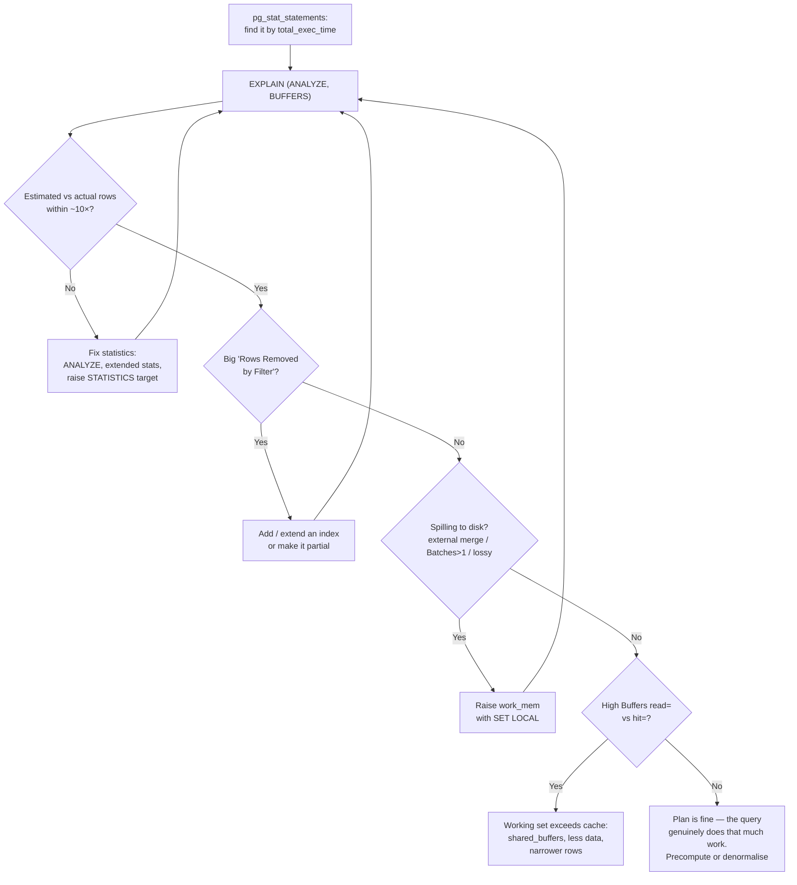

# EXPLAIN & the Query Planner

> **What you will be able to do after this page**
>
> - Read `EXPLAIN (ANALYZE, BUFFERS)` output line by line and say where the time went.
> - Spot the four diagnostic signatures: bad estimates, missing indexes, spilled sorts, and lossy bitmap scans.
> - Explain what statistics the planner uses, and fix it when the estimates are wrong.
> - Tune the cost knobs that actually matter, and know why Postgres has no hints.

---

## 1. `EXPLAIN` vs `EXPLAIN ANALYZE`

```sql
EXPLAIN SELECT ...;                          -- plan + estimates only. Does NOT run the query.
EXPLAIN ANALYZE SELECT ...;                  -- ACTUALLY RUNS IT, adds real timings and row counts.
EXPLAIN (ANALYZE, BUFFERS, VERBOSE, SETTINGS, WAL, FORMAT TEXT) SELECT ...;
```

:::danger[`EXPLAIN ANALYZE` executes the statement]
On an `UPDATE` or `DELETE`, it really updates or deletes. Wrap it:
```sql
BEGIN;
EXPLAIN (ANALYZE, BUFFERS) DELETE FROM orders WHERE ...;
ROLLBACK;
```
:::

Options worth knowing:

| Option | Adds |
| :--- | :--- |
| `ANALYZE` | Actual rows, actual time, loops |
| `BUFFERS` | Cache hits vs disk reads per node — **always turn this on** |
| `VERBOSE` | Output column lists, schema-qualified names |
| `SETTINGS` | Non-default planner settings in effect |
| `WAL` | WAL bytes generated (for write statements) |
| `FORMAT JSON` | Machine-readable, for tooling like explain.depesz.com or explain.dalibo.com |

---

## 2. Anatomy of a plan node

```text
->  Index Scan using idx_orders_customer on orders o  (cost=0.42..8.44 rows=1 width=48)
                                                      (actual time=0.023..0.031 rows=3 loops=6000)
      Index Cond: (o.customer_id = c.id)
      Filter: (o.status = 'paid'::text)
      Rows Removed by Filter: 2
      Buffers: shared hit=24012 read=118
```

| Field | Meaning |
| :--- | :--- |
| `cost=0.42..8.44` | **Startup cost .. total cost**, in arbitrary units. Startup = cost before the first row |
| `rows=1` | **Estimated** rows this node emits, **per loop** |
| `width=48` | Estimated average row size in bytes |
| `actual time=0.023..0.031` | Real ms to first row .. to last row, **per loop, averaged** |
| `rows=3` (actual) | Real rows emitted **per loop** |
| `loops=6000` | How many times this node ran |
| `Index Cond` | Applied **inside** the index — cheap, reduces what's read |
| `Filter` | Applied **after** fetching — the rows were read and discarded |
| `Rows Removed by Filter` | Wasted work. High values point at a missing index column |
| `Buffers: shared hit=... read=...` | 8 KB pages from cache vs from disk/OS |

:::warning[Multiply by `loops`]
`actual time=0.031 rows=3 loops=6000` means **6000 × 0.031 ms ≈ 186 ms** total and **18,000 rows**, not 3 rows in 0.031 ms. Every "this node looks fast" mistake comes from ignoring `loops`.
:::

**Read plans inside-out and bottom-up.** The most indented nodes execute first; each feeds its parent. Total time is the top node's `actual time` end value.

---

## 3. A full worked example

```sql
EXPLAIN (ANALYZE, BUFFERS)
SELECT c.city, count(*) AS orders, sum(o.total) AS revenue
FROM   customers c
JOIN   orders o ON o.customer_id = c.id
WHERE  o.status = 'paid'
  AND  o.placed_on >= date '2026-01-01'
GROUP  BY c.city
ORDER  BY revenue DESC
LIMIT  10;
```

```text
 Limit  (cost=18942.31..18942.34 rows=10 width=48)
        (actual time=284.117..284.121 rows=10 loops=1)
   Buffers: shared hit=8412 read=3106
   ->  Sort  (cost=18942.31..18942.93 rows=249 width=48)
             (actual time=284.115..284.117 rows=10 loops=1)
         Sort Key: (sum(o.total)) DESC
         Sort Method: top-N heapsort  Memory: 27kB
         ->  HashAggregate  (cost=18933.44..18936.93 rows=249 width=48)
                            (actual time=283.902..283.981 rows=249 loops=1)
               Group Key: c.city
               Batches: 1  Memory Usage: 61kB
               ->  Hash Join  (cost=1832.00..17061.22 rows=249629 width=44)
                              (actual time=18.114..221.407 rows=248310 loops=1)
                     Hash Cond: (o.customer_id = c.id)
                     Buffers: shared hit=8412 read=3106
                     ->  Seq Scan on orders o  (cost=0.00..14203.00 rows=249629 width=16)
                                               (actual time=0.014..118.882 rows=248310 loops=1)
                           Filter: ((status = 'paid'::text) AND (placed_on >= '2026-01-01'::date))
                           Rows Removed by Filter: 351690
                           Buffers: shared hit=6303 read=3106
                     ->  Hash  (cost=1082.00..1082.00 rows=60000 width=36)
                               (actual time=17.902..17.903 rows=60000 loops=1)
                           Buckets: 65536  Batches: 1  Memory Usage: 4589kB
                           ->  Seq Scan on customers c  (cost=0.00..1082.00 rows=60000 width=36)
                                                        (actual time=0.008..6.114 rows=60000 loops=1)
                           Buffers: shared hit=2109
 Planning Time: 0.482 ms
 Execution Time: 284.201 ms
```

**Reading it, node by node:**

```text
1. Seq Scan on customers      →  60,000 rows, 6 ms, all from cache. Fine — we need them all.
2. Hash                       →  built a 4.5 MB hash table. Batches: 1 = fit in work_mem. ✅
3. Seq Scan on orders         →  118 ms. Read 600,000 rows, THREW AWAY 351,690.  ⚠️ THE PROBLEM
4. Hash Join                  →  248,310 rows out. Estimate 249,629 — excellent. ✅
5. HashAggregate              →  249 groups, Batches: 1. ✅
6. Sort                       →  "top-N heapsort" because of the LIMIT — only 10 rows held. ✅
7. Limit                      →  10 rows.

Total 284 ms, of which ~118 ms is scanning and discarding more than half of `orders`.
```

**The fix:**

```sql
CREATE INDEX idx_orders_paid_recent ON orders (placed_on, customer_id)
INCLUDE (total)
WHERE status = 'paid';
```

```text
 ->  Bitmap Heap Scan on orders o  (actual time=12.4..48.7 rows=248310 loops=1)
       Recheck Cond: (placed_on >= '2026-01-01'::date)
       Heap Blocks: exact=4102
       ->  Bitmap Index Scan on idx_orders_paid_recent (actual time=11.9..11.9 rows=248310 loops=1)
             Index Cond: (placed_on >= '2026-01-01'::date)

Execution Time: 284 ms → 121 ms
```

Note `Rows Removed by Filter` is now zero — the partial index means only `paid` rows are in it at all.

---

## 4. The node types you must recognise

### Scans

| Node | Meaning |
| :--- | :--- |
| `Seq Scan` | Read the whole table. **Not automatically bad** — best when returning a large fraction |
| `Index Scan` | Walk the index, fetch each matching heap row. Best for few, ordered rows |
| `Index Only Scan` | Answered entirely from the index. Check `Heap Fetches` |
| `Bitmap Index Scan` + `Bitmap Heap Scan` | Collect matching `ctid`s into a bitmap, sort by physical page, then read the heap **in page order**. Chosen for medium selectivity — turns random I/O into sequential |
| `Tid Scan` | Direct `ctid` access |
| `Function Scan` | `generate_series`, `unnest`, `jsonb_array_elements` |
| `Values Scan` | An inline `VALUES` list |

:::tip[`Bitmap Heap Scan` and `lossy=`]
```text
Heap Blocks: exact=4102 lossy=39184
```
`lossy` means the bitmap exceeded `work_mem` and degraded from per-tuple to per-**page** granularity, so Postgres must recheck every tuple on those pages. Lots of lossy blocks = raise `work_mem` or narrow the query.
:::

### Joins

`Nested Loop`, `Hash Join`, `Merge Join`, and their `Semi`/`Anti` variants — covered in [Joins §8](./05-joins-and-set-operations.md).

### Aggregation and sorting

| Node | Meaning |
| :--- | :--- |
| `HashAggregate` | Hash table keyed by grouping columns. `Batches: > 1` = spilled to disk (PG 13+) |
| `GroupAggregate` | Needs sorted input, constant memory |
| `Sort` | `Sort Method: quicksort Memory: 25kB` = in memory ✅ / `external merge Disk: 24560kB` = spilled ❌ |
| `Incremental Sort` | Input is partially sorted by an index prefix; only sorts within groups (PG 13+) |
| `WindowAgg` | Window functions |
| `Unique` | `DISTINCT` over sorted input |
| `Memoize` | Caches inner results of a nested loop for repeated keys (PG 14+) — a big win for correlated joins |

### Others

| Node | Meaning |
| :--- | :--- |
| `Gather` / `Gather Merge` | Parallel workers feeding into the leader |
| `Materialize` | Buffers a subplan so it can be rescanned |
| `SubPlan` | Subquery executed per outer row — often the bug |
| `InitPlan` | Uncorrelated subquery executed once — fine |
| `CTE Scan` | Reading a materialised CTE |
| `WorkTable Scan` | The working table of a recursive CTE |
| `Append` / `Merge Append` | `UNION ALL`, or partitioned table children |

---

## 5. The four diagnostic signatures

### 1. Bad row estimates

```text
rows=1 (estimated)  ...  rows=48219 (actual)      ← 48,000× off
```

Everything above this node is planned against a wrong number, which typically produces a nested loop where a hash join was needed. Causes and fixes:

- **Stale statistics** → `ANALYZE tablename;`
- **Correlated columns** — the planner assumes independence, so `WHERE city='Pune' AND state='Maharashtra'` multiplies two selectivities and drastically under-estimates. Fix with **extended statistics**:
  ```sql
  CREATE STATISTICS stat_city_state (dependencies, ndistinct, mcv)
    ON city, state FROM addresses;
  ANALYZE addresses;
  ```
- **Skewed distribution** → raise the histogram resolution:
  ```sql
  ALTER TABLE orders ALTER COLUMN status SET STATISTICS 1000;   -- default 100, max 10000
  ANALYZE orders;
  ```
- **Expressions the planner can't reason about** — `WHERE lower(email) = x` gets a fixed guess unless there's an expression index (creating one also creates statistics for the expression).
- **JSONB predicates** — `@>` has no per-key statistics. This is a real reason to promote hot keys to generated columns.

### 2. Rows Removed by Filter

```text
Seq Scan on orders
  Filter: (status = 'paid')
  Rows Removed by Filter: 951781
```

Read a million rows to keep fifty thousand. Add an index covering that predicate, or a partial index if the value is rare.

### 3. Spilling to disk

```text
Sort Method: external merge  Disk: 124560kB
Batches: 8  Memory Usage: 4096kB          (HashAggregate or Hash Join)
Heap Blocks: exact=200 lossy=48000        (Bitmap Heap Scan)
```

All three mean `work_mem` was too small. Raise it **for that statement**:

```sql
BEGIN;
SET LOCAL work_mem = '256MB';
SELECT ...;
COMMIT;
```

### 4. Nested loop with a huge loop count

```text
->  Nested Loop  (actual rows=2400000 loops=1)
      ->  Seq Scan on a  (actual rows=200000 loops=1)
      ->  Index Scan on b  (actual rows=12 loops=200000)     ← 200,000 index lookups
```

Sometimes fine (if each lookup is cheap and cached), often not. If the row estimate that led to it was wrong, fix the statistics. `Memoize` above the inner side (PG 14+) means Postgres is already caching repeated lookups.

---

## 6. What the planner knows

```sql
-- Column statistics
SELECT attname, n_distinct, null_frac, correlation,
       most_common_vals, most_common_freqs
FROM pg_stats
WHERE tablename = 'orders';

-- Table-level
SELECT relname, reltuples, relpages FROM pg_class WHERE relname = 'orders';

-- When was it last analyzed?
SELECT relname, last_analyze, last_autoanalyze, n_live_tup, n_dead_tup, n_mod_since_analyze
FROM pg_stat_user_tables ORDER BY n_mod_since_analyze DESC;
```

| Statistic | Used for |
| :--- | :--- |
| `n_distinct` | Estimating group counts and equality selectivity. Negative = a ratio of table size |
| `null_frac` | `IS NULL` selectivity |
| `most_common_vals` / `_freqs` | Accurate estimates for skewed values (the MCV list) |
| `histogram_bounds` | Range selectivity |
| `correlation` | How well physical order matches logical order → index scan cost, and BRIN viability |

`ANALYZE` samples about `300 × default_statistics_target` rows (30,000 by default) — it does **not** read the whole table, which is why very large or very skewed tables sometimes need a higher target.

If `n_distinct` is badly wrong on a big table (a known sampling weakness), you can override it:

```sql
ALTER TABLE events ALTER COLUMN user_id SET (n_distinct = 500000);
ANALYZE events;
```

---

## 7. Cost model and the settings that matter

```text
total cost = seq_page_cost      × pages read sequentially
           + random_page_cost   × pages read randomly
           + cpu_tuple_cost     × rows processed
           + cpu_index_tuple_cost × index entries
           + cpu_operator_cost  × operators evaluated
```

| Setting | Default | Recommended |
| :--- | :--- | :--- |
| `seq_page_cost` | 1.0 | leave |
| `random_page_cost` | 4.0 | **1.1 on SSD/NVMe** — the default assumes a spinning disk seek |
| `effective_cache_size` | 4 GB | ~75 % of RAM. Not an allocation — a hint that data is likely cached |
| `work_mem` | 4 MB | 16–64 MB, raised per-session for heavy queries |
| `default_statistics_target` | 100 | 100; raise per-column where needed |
| `max_parallel_workers_per_gather` | 2 | 2–4 |
| `jit` | on | Consider `off` for OLTP — JIT compilation adds latency to short queries |

:::tip[The single highest-value tuning change]
`random_page_cost = 1.1` on SSD-backed storage. The 4.0 default systematically over-prices index scans and makes Postgres prefer sequential scans it shouldn't. Along with `effective_cache_size`, it fixes more "why isn't it using my index" reports than anything else.
:::

Diagnostic toggles — **for investigation only, never in production config**:

```sql
SET enable_seqscan = off;
SET enable_nestloop = off;
SET enable_hashjoin = off;
SET enable_indexscan = off;
```

They don't hard-disable anything; they add a huge cost penalty, so the planner picks the alternative if one exists. Comparing the two `EXPLAIN ANALYZE` runs tells you whether the planner made a mistake or was right all along.

:::info[PostgreSQL vs MySQL — the planner]
| PostgreSQL | MySQL |
| :--- | :--- |
| **No hints in core.** Philosophy: a wrong plan means wrong statistics | `USE/FORCE/IGNORE INDEX`, `STRAIGHT_JOIN`, and `/*+ ... */` optimizer hints |
| `pg_hint_plan` extension provides hints if you really need them | Built in |
| `EXPLAIN (ANALYZE, BUFFERS)` with per-node timing, rows, loops, and I/O | `EXPLAIN ANALYZE` since **8.0.18**; before that only estimates. `EXPLAIN FORMAT=JSON` for detail |
| Extended statistics for correlated columns (`CREATE STATISTICS`) | Histograms since 8.0; **no multi-column dependency statistics** |
| Cost model exposed and tunable (`random_page_cost` etc.) | Cost constants tunable since 5.7 (`mysql.server_cost`, `engine_cost`) |
| Parallel query for scans, joins, aggregates | Very limited parallelism |
| Genetic query optimisation (GEQO) beyond ~12 joined tables | Exhaustive search with a cutoff |

MySQL's hints are genuinely useful when the optimizer is stuck and you need a fix *today*. Postgres' position is more principled and usually right, but it does mean your only levers are statistics, indexes, and query rewriting — which is occasionally frustrating.
:::

---

## 8. `auto_explain` and `pg_stat_statements`

Find the slow queries before you explain them:

```sql
CREATE EXTENSION pg_stat_statements;   -- also needs shared_preload_libraries

SELECT substring(query, 1, 80) AS query,
       calls,
       round(total_exec_time::numeric, 1)   AS total_ms,
       round(mean_exec_time::numeric, 2)    AS mean_ms,
       rows,
       round(100.0 * shared_blks_hit / nullif(shared_blks_hit + shared_blks_read, 0), 1) AS hit_pct
FROM pg_stat_statements
ORDER BY total_exec_time DESC
LIMIT 20;
```

**Order by `total_exec_time`, not `mean_exec_time`.** A 5 ms query run 2 million times costs far more than a 3-second report run twice — and it's usually easier to fix.

Capture plans of slow queries automatically:

```sql
-- postgresql.conf
shared_preload_libraries = 'pg_stat_statements,auto_explain'
auto_explain.log_min_duration = '500ms'
auto_explain.log_analyze = on
auto_explain.log_buffers = on
auto_explain.log_nested_statements = on
```

:::warning
`auto_explain.log_analyze = on` instruments **every** query, which can add 10–30 % overhead on short queries because of the timing calls. Set `auto_explain.log_timing = off` to keep row counts without per-node timing, or enable it only while investigating.
:::

---

## 9. A repeatable method for "this query is slow"



---

## 10. Rapid-fire recall

<details>
<summary>**How do you read an `EXPLAIN ANALYZE` plan?**</summary>

Inside-out and bottom-up: the most indented node runs first and feeds its parent. For each node I compare estimated `rows` against actual `rows` — a large gap means the planner is misinformed and everything above it is suspect. Then I look for `Rows Removed by Filter`, which is work thrown away and usually means a missing index; for `Sort Method: external merge` or `Batches > 1`, which means it spilled because `work_mem` was too small; and at `Buffers` to see whether the I/O was cached or read from disk. The one thing you must not forget is to multiply a node's `actual time` and `rows` by `loops`.
</details>

<details>
<summary>**What's the difference between `Index Cond` and `Filter`?**</summary>

`Index Cond` is applied while traversing the index, so it limits which entries are read at all. `Filter` is applied after the row has been fetched, so those rows were read and then discarded — that's the wasted work `Rows Removed by Filter` counts. Moving a predicate from `Filter` to `Index Cond` by adding the column to the index is one of the highest-leverage single changes you can make.
</details>

<details>
<summary>**When is a `Seq Scan` the right plan?**</summary>

When the query returns a large fraction of the table — roughly above 5–10 %, depending on row width — because at that point random index lookups plus heap fetches cost more than reading the pages sequentially. Also on small tables that fit in a few pages. Seeing a `Seq Scan` isn't a problem by itself; seeing one with a large `Rows Removed by Filter` on a big table is.
</details>

<details>
<summary>**What's a Bitmap Heap Scan and why does Postgres use it?**</summary>

It's the middle ground between an index scan and a sequential scan. The `Bitmap Index Scan` collects all matching row locations into a bitmap, which is then sorted by physical page, and the `Bitmap Heap Scan` reads the heap in page order — turning scattered random I/O into something closer to sequential, and visiting each page once even if many rows on it match. It's chosen for medium selectivity, and it's also how Postgres combines several indexes with AND/OR. Watch for `lossy=` in `Heap Blocks`: that means the bitmap outgrew `work_mem` and degraded to page granularity, forcing a recheck of every tuple on those pages.
</details>

<details>
<summary>**Estimated rows is 1, actual is 50,000. What do you do?**</summary>

First `ANALYZE` the table, since stale statistics are the most common cause. If it persists, I look at why: correlated columns are the classic case, because the planner assumes independence and multiplies selectivities, so `city` and `state` together get a wildly low estimate — that's what `CREATE STATISTICS ... (dependencies, ndistinct, mcv)` is for. Skewed distributions need a higher per-column statistics target so the MCV list and histogram are finer. Expressions and JSONB predicates get fixed default guesses unless there's a matching expression index or a promoted generated column. The reason it matters is that everything above that node is costed against the wrong number, which is how you end up with a nested loop over 50,000 rows.
</details>

<details>
<summary>**Which planner settings would you change on a new SSD-backed server?**</summary>

`random_page_cost` from 4.0 to about 1.1, because the default assumes a spinning disk seek and systematically makes index scans look too expensive. `effective_cache_size` to roughly 75 % of RAM — it allocates nothing, it just tells the planner how much data is likely cached, which also encourages index use. `shared_buffers` to about 25 % of RAM. `work_mem` modestly, 16–64 MB, raised per-session for heavy queries rather than globally, since it's allocated per node per worker per connection. And on a pure OLTP workload I'd consider turning `jit` off, because JIT compilation adds fixed latency that short queries never recoup.
</details>

<details>
<summary>**Why doesn't PostgreSQL have query hints?**</summary>

It's a deliberate design position: a wrong plan is a symptom of wrong information, so the fix should be better statistics, a better index, or a rewritten query — all of which keep working as the data changes, whereas a pinned hint becomes wrong the moment the distribution shifts. In practice you can get hints from the `pg_hint_plan` extension, and you can influence plans with `enable_*` toggles for diagnosis. MySQL's hints are genuinely useful when you need a production fix in the next ten minutes, and that's the honest trade-off.
</details>

<details>
<summary>**How do you find which query to optimise in the first place?**</summary>

`pg_stat_statements`, ordered by `total_exec_time` rather than mean time — a five-millisecond query executed two million times an hour costs far more than a three-second report run twice, and it's usually the easier fix. Then `auto_explain` with `log_min_duration` set to capture the actual plans of slow executions in production, since a query that's fast on your laptop with different data and a warm cache proves nothing. I'd be careful with `auto_explain.log_analyze`, which adds measurable overhead to every query from the timing instrumentation.
</details>

---

**Next:** [Transactions, Isolation & Locking →](./15-transactions-and-locking.md)
