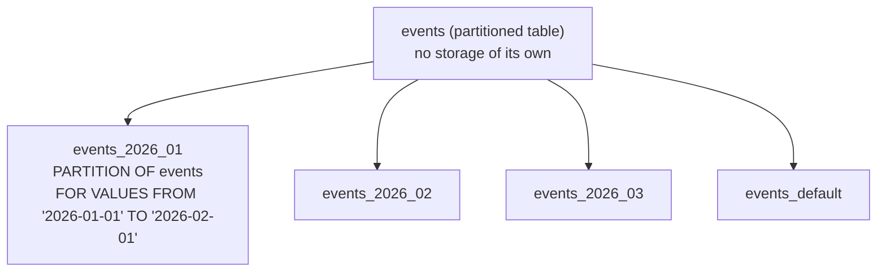

# Partitioning

> **What you will be able to do after this page**
>
> - Choose between range, list and hash partitioning, and design the partition key.
> - Explain partition pruning and prove it happened from `EXPLAIN`.
> - Know the constraints partitioning imposes — especially on unique keys and foreign keys.
> - Automate partition creation and retention, and say when *not* to partition.

---

## 1. What partitioning is, and what it isn't

A partitioned table is a **logical table** whose rows physically live in separate child tables, routed by a partition key.



**Partitioning is not a performance feature in general.** A well-indexed 500-million-row table is often *faster* than a badly partitioned one. What partitioning actually buys you:

| Real benefit | Why |
| :--- | :--- |
| **Instant data retention** | `DROP TABLE events_2025_01` is a metadata operation. Deleting 50 M rows creates 50 M dead tuples and hours of vacuum work |
| **Bounded maintenance** | `VACUUM`, `ANALYZE` and `REINDEX` run per partition, not on a 2 TB monolith |
| **Smaller indexes per partition** | Each B-tree is shallower; hot partitions stay in cache |
| **Partition pruning** | Queries filtering on the key touch only relevant partitions |
| **Cheap bulk load / detach** | `ATTACH`/`DETACH PARTITION` moves data in and out atomically |

Rule of thumb: **consider partitioning above ~100 GB per table, or when you have a time-based retention policy.** Below that it's usually complexity without payoff.

---

## 2. Range partitioning — the common case

```sql
CREATE TABLE events (
    id         bigint GENERATED ALWAYS AS IDENTITY,
    user_id    bigint NOT NULL,
    event_type text   NOT NULL,
    payload    jsonb,
    created_at timestamptz NOT NULL,
    PRIMARY KEY (id, created_at)        -- ← partition key MUST be in the PK
) PARTITION BY RANGE (created_at);

CREATE TABLE events_2026_01 PARTITION OF events
    FOR VALUES FROM ('2026-01-01') TO ('2026-02-01');
CREATE TABLE events_2026_02 PARTITION OF events
    FOR VALUES FROM ('2026-02-01') TO ('2026-03-01');

CREATE TABLE events_default PARTITION OF events DEFAULT;   -- catch-all
```

Bounds are `[FROM, TO)` — inclusive lower, exclusive upper — so consecutive months tile perfectly with no overlap and no gap.

```sql
INSERT INTO events (user_id, event_type, created_at)
VALUES (1, 'login', '2026-01-15');      -- routed to events_2026_01, automatically
```

:::warning[The DEFAULT partition is a trap]
It catches rows you forgot to make a partition for — good, no failed inserts. But: **adding a new partition requires scanning the default partition** to prove no rows belong in the new range, taking an `ACCESS EXCLUSIVE` lock while it does. On a large default partition that's an outage.

Either don't have one and let inserts fail loudly (so your monitoring catches the missing partition), or keep it empty and alert on `SELECT count(*) FROM events_default > 0`.
:::

---

## 3. List and hash partitioning

```sql
-- LIST: discrete values, e.g. multi-region or multi-tenant
CREATE TABLE orders (id bigint, region text, ...) PARTITION BY LIST (region);
CREATE TABLE orders_in PARTITION OF orders FOR VALUES IN ('IN','LK','BD');
CREATE TABLE orders_us PARTITION OF orders FOR VALUES IN ('US','CA');
CREATE TABLE orders_other PARTITION OF orders DEFAULT;

-- HASH: even distribution when there's no natural range
CREATE TABLE sessions (id bigint, user_id bigint, ...) PARTITION BY HASH (user_id);
CREATE TABLE sessions_0 PARTITION OF sessions FOR VALUES WITH (MODULUS 4, REMAINDER 0);
CREATE TABLE sessions_1 PARTITION OF sessions FOR VALUES WITH (MODULUS 4, REMAINDER 1);
CREATE TABLE sessions_2 PARTITION OF sessions FOR VALUES WITH (MODULUS 4, REMAINDER 2);
CREATE TABLE sessions_3 PARTITION OF sessions FOR VALUES WITH (MODULUS 4, REMAINDER 3);
```

| Type | Use for | Pruning works on |
| :--- | :--- | :--- |
| **RANGE** | Time series, sequential IDs, numeric bands | `=`, `<`, `>`, `BETWEEN` |
| **LIST** | Region, tenant, status, country | `=`, `IN` |
| **HASH** | Even spread with no natural key; reducing contention | `=` only |

Hash partitioning gives you no retention benefit (you can't drop "old" data) and no range pruning. Its uses are spreading write hotspots and keeping each partition's indexes small. **Changing the modulus later is painful** — it requires rewriting every partition.

### Sub-partitioning

```sql
CREATE TABLE events_2026_01 PARTITION OF events
  FOR VALUES FROM ('2026-01-01') TO ('2026-02-01')
  PARTITION BY LIST (event_type);

CREATE TABLE events_2026_01_login PARTITION OF events_2026_01 FOR VALUES IN ('login');
```

Legal, occasionally useful, usually over-engineering. Partition count multiplies fast, and planning time grows with it.

---

## 4. Partition pruning, traced

```sql
EXPLAIN (ANALYZE, BUFFERS)
SELECT count(*) FROM events WHERE created_at >= '2026-02-10' AND created_at < '2026-02-20';
```

```text
 Aggregate  (actual time=12.881..12.882 rows=1 loops=1)
   ->  Seq Scan on events_2026_02 events  (actual rows=88412 loops=1)
         Filter: ((created_at >= '2026-02-10'::timestamptz)
              AND (created_at <  '2026-02-20'::timestamptz))

 ← Only ONE partition appears in the plan.
   events_2026_01 and events_2026_03 were PRUNED at planning time.
```

Compare with a query that can't prune:

```sql
EXPLAIN SELECT count(*) FROM events WHERE user_id = 42;
```

```text
 Aggregate
   ->  Append
         ->  Seq Scan on events_2026_01 events_1     ← every partition scanned
         ->  Seq Scan on events_2026_02 events_2
         ->  Seq Scan on events_2026_03 events_3
         ->  Seq Scan on events_default events_4
```

:::danger[If your queries don't filter on the partition key, partitioning makes things worse]
You now scan N tables instead of one, with N times the planning overhead and no pruning. **The partition key must be in the `WHERE` clause of your dominant queries.** Choosing it is the whole design decision — get it wrong and you've added complexity and lost performance.
:::

### Planning-time vs run-time pruning

```sql
-- Planning-time pruning: the value is a constant, partitions are removed from the plan
WHERE created_at >= '2026-02-10'

-- Run-time pruning: the value isn't known until execution (parameters, subqueries,
-- parallel workers, nested loop parameters). PG 11+ prunes during execution.
WHERE created_at >= $1
```

Run-time pruning appears in `EXPLAIN ANALYZE` as:

```text
 ->  Append (actual rows=88412 loops=1)
       Subplans Removed: 11         ← 11 partitions pruned at run time
```

`SET enable_partition_pruning = on` is the default; it's worth knowing the toggle exists for diagnosis.

Also enable, for analytical workloads:

```sql
SET enable_partitionwise_join = on;      -- off by default: join matching partitions pairwise
SET enable_partitionwise_aggregate = on; -- off by default: aggregate per partition, then combine
```

Both are off by default because they increase planning time; on a partitioned star schema they're a large win.

---

## 5. Indexes, constraints, and the real limitations

```sql
-- Creating an index on the parent creates it on every partition, and on future ones
CREATE INDEX idx_events_user ON events (user_id);

-- Build without blocking: create per-partition CONCURRENTLY, then attach
CREATE INDEX CONCURRENTLY idx_events_2026_01_user ON events_2026_01 (user_id);
-- ... repeat for each partition ...
CREATE INDEX idx_events_user ON ONLY events (user_id);   -- parent only, INVALID at first
ALTER INDEX idx_events_user ATTACH PARTITION idx_events_2026_01_user;
-- once all partitions are attached, the parent index becomes valid
```

:::danger[The unique constraint limitation — the number one gotcha]
**A unique index or primary key on a partitioned table must include the partition key.**

```sql
PRIMARY KEY (id)                 -- ❌ ERROR: unique constraint on partitioned table
                                 --    must include all partitioning columns
PRIMARY KEY (id, created_at)     -- ✅
```

Why: uniqueness is enforced by a per-partition index, so the engine can only guarantee global uniqueness if the key determines which partition a row lives in.

The consequence is real: **you cannot have a globally unique `id` enforced by the database on a partitioned table** unless `id` is itself the partition key. In practice you rely on a sequence being unique (it is), and you accept that the constraint is `(id, created_at)`. Any foreign key pointing at this table must then reference both columns.
:::

Other limitations to have ready:

| Limitation | Detail |
| :--- | :--- |
| Unique/PK must include the partition key | As above |
| Foreign keys **referencing** a partitioned table | Supported since PG 12 — but must target a valid unique constraint, so it includes the partition key |
| Foreign keys **from** a partitioned table | Supported |
| `ON CONFLICT DO UPDATE` | Works, but the inference must resolve to a constraint including the partition key |
| Updating the partition key | Allowed since PG 11 — the row physically **moves** between partitions (a delete + insert internally) |
| Exclusion constraints across partitions | ❌ Not supported globally |
| Number of partitions | Planning time grows; thousands is workable in PG 12+ but keep it in the hundreds where you can |
| Triggers | `BEFORE ROW` triggers must be on the partitions (or use `FOR EACH ROW` on the parent, PG 13+) |

---

## 6. Retention and automation

The reason most people partition:

```sql
-- Drop a month: instant, metadata only. No dead tuples, no vacuum.
DROP TABLE events_2025_01;

-- Or detach first, to archive it elsewhere
ALTER TABLE events DETACH PARTITION events_2025_01 CONCURRENTLY;   -- PG 14+, no long lock
-- ... COPY it to cold storage ...
DROP TABLE events_2025_01;
```

Compare: `DELETE FROM events WHERE created_at < '2025-02-01'` on 50 million rows writes 50 million WAL records, creates 50 million dead tuples, bloats the table and every index, and needs hours of autovacuum to reclaim — during which the table is still large. **`DROP TABLE` is instant.** This alone justifies partitioning for time-series data.

Create partitions ahead of time:

```sql
CREATE OR REPLACE FUNCTION create_monthly_partition(tbl text, month date)
RETURNS void LANGUAGE plpgsql AS $$
DECLARE
  part_name text := format('%s_%s', tbl, to_char(month, 'YYYY_MM'));
BEGIN
  IF to_regclass(part_name) IS NOT NULL THEN RETURN; END IF;
  EXECUTE format(
    'CREATE TABLE %I PARTITION OF %I FOR VALUES FROM (%L) TO (%L)',
    part_name, tbl, month, month + interval '1 month'
  );
END $$;

SELECT create_monthly_partition('events', date_trunc('month', now() + interval '1 month')::date);
```

Run it from `pg_cron` monthly, creating **two or three months ahead** so a failed job doesn't cause insert failures at midnight on the 1st. Or use the `pg_partman` extension, which handles creation, retention and detach-and-archive properly and is what most teams end up on.

### Converting an existing table

```sql
BEGIN;
ALTER TABLE events RENAME TO events_old;
CREATE TABLE events (LIKE events_old INCLUDING ALL) PARTITION BY RANGE (created_at);
CREATE TABLE events_2026_01 PARTITION OF events FOR VALUES FROM ('2026-01-01') TO ('2026-02-01');
-- ...
ALTER TABLE events_old ADD CONSTRAINT ck CHECK (created_at < '2026-01-01');  -- prove the bound
ALTER TABLE events ATTACH PARTITION events_old FOR VALUES FROM (MINVALUE) TO ('2026-01-01');
COMMIT;
```

`ATTACH PARTITION` normally scans the table to verify every row fits the bound. **A matching `CHECK` constraint added beforehand lets it skip the scan** and attach almost instantly — the key trick for converting a large existing table with minimal downtime.

---

## 7. PostgreSQL vs MySQL partitioning

:::info[PostgreSQL vs MySQL]
| | PostgreSQL (11+) | MySQL 8 |
| :--- | :--- | :--- |
| Syntax | Declarative `PARTITION BY RANGE/LIST/HASH`, separate child tables | `PARTITION BY RANGE/LIST/HASH/KEY` inline in `CREATE TABLE` |
| Implementation | Real tables you can index, `ATTACH`/`DETACH`, query directly | Internal partitions, not separately addressable as tables |
| Unique key rule | Must include the partition key | **Same rule** — every unique key must include all partitioning columns |
| Range on expressions | `PARTITION BY RANGE (created_at)`; expressions allowed | `PARTITION BY RANGE (YEAR(created_at))` — expression-based is idiomatic |
| Foreign keys | ✅ Supported (PG 12+) both directions | ❌ **Partitioned tables cannot have foreign keys at all** |
| `DETACH CONCURRENTLY` | ✅ PG 14+ | `ALTER TABLE ... EXCHANGE PARTITION`-style operations exist but lock |
| Pruning | Planning-time and run-time | Partition pruning, planning-time |
| Sub-partitioning | ✅ | ✅ (limited to RANGE/LIST then HASH/KEY) |
| Automation | `pg_partman` / `pg_cron` extensions | Manual or external scheduler |
| Partitionwise join/aggregate | ✅ (opt-in) | ❌ |

The two substantive differences: **MySQL partitioned tables cannot participate in foreign keys in either direction**, which is a hard blocker for many schemas; and Postgres partitions are ordinary tables, so you can index, query, `ANALYZE` and archive them individually.
:::

---

## 8. When *not* to partition

- **Under ~100 GB.** Indexes handle it. You're adding operational complexity for nothing.
- **When queries don't filter on the partition key.** You've made every query scan N tables.
- **When you need a globally unique key that isn't the partition key.** The constraint can't be expressed.
- **When you need exclusion constraints across the whole table.**
- **As a substitute for indexing.** Partitioning reduces the *size* of what you scan; an index avoids scanning. They solve different problems, and you almost always want indexes inside the partitions too.

---

## 9. Rapid-fire recall

<details>
<summary>**Why partition a table?**</summary>

Overwhelmingly for data lifecycle management: dropping a partition is a metadata operation, whereas deleting fifty million rows creates fifty million dead tuples and hours of vacuum work while the table stays bloated. Secondary benefits are bounded maintenance — vacuum and reindex run per partition rather than on a two-terabyte monolith — smaller per-partition indexes that stay cache-resident, and partition pruning so queries filtering on the key touch only the relevant partitions. What partitioning is *not* is a general performance feature: a well-indexed large table often beats a badly partitioned one.
</details>

<details>
<summary>**How do you choose the partition key?**</summary>

It has to be the column your dominant queries filter on, because pruning is the only thing that stops partitioning from making queries slower — without it you scan every partition and pay extra planning time. It also has to be the axis of your retention policy, since you drop whole partitions. For time-series that's almost always the timestamp. And it has to be acceptable inside every unique constraint, because Postgres requires the partition key to be part of any unique index on the table.
</details>

<details>
<summary>**What's the unique constraint limitation?**</summary>

A unique index or primary key on a partitioned table must include all the partition key columns, because uniqueness is enforced by per-partition indexes and the engine can only guarantee it globally if the key determines the partition. So on an events table partitioned by `created_at`, you can't have `PRIMARY KEY (id)` — it has to be `PRIMARY KEY (id, created_at)`. In practice the sequence still generates unique ids, you just can't have the database enforce that, and any foreign key referencing the table must reference both columns. MySQL has exactly the same rule.
</details>

<details>
<summary>**Prove partition pruning happened.**</summary>

Run `EXPLAIN` and look at which partitions appear in the plan. If only `events_2026_02` shows up for a February date range, the others were pruned at planning time. For parameterised queries the value isn't known when planning, so pruning happens at execution and shows as `Subplans Removed: N` under the `Append` node. If you see every partition scanned for a query you expected to prune, the `WHERE` clause probably doesn't reference the partition key in a form the planner can use — a function wrapped around it, or a join condition rather than a constant.
</details>

<details>
<summary>**How do you convert a big existing table to a partitioned one?**</summary>

Rename the original out of the way, create a new partitioned parent with `LIKE ... INCLUDING ALL`, create the forward partitions, and then attach the old table as the historical partition. The trick that makes it fast is adding a `CHECK` constraint on the old table matching the bound *before* attaching — `ATTACH PARTITION` normally scans every row to verify it fits, and a matching check constraint lets it skip that scan and attach almost instantly. Everything can be wrapped in a transaction because Postgres DDL is transactional.
</details>

<details>
<summary>**What can't MySQL do here?**</summary>

Partitioned tables in MySQL cannot participate in foreign keys in either direction, which rules out partitioning for a lot of normalised schemas. MySQL also has no partitionwise joins or aggregates, and its partitions aren't independently addressable tables, so you can't index, query, analyse or archive one individually the way you can in Postgres. The unique-key rule is identical in both, and both do pruning.
</details>

<details>
<summary>**Why is the DEFAULT partition risky?**</summary>

Because adding a new partition afterwards requires scanning the default partition to prove none of its rows belong in the new range, and it holds an `ACCESS EXCLUSIVE` lock while doing so. On a default partition that has accumulated a lot of rows, that's an outage during a routine monthly maintenance job. Either omit it so a missing partition fails loudly and your monitoring catches it, or keep one and alert whenever it's non-empty.
</details>

---

**Next:** [VACUUM & the Performance Playbook →](./17-vacuum-and-performance.md)
