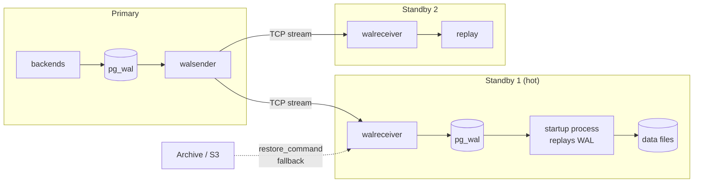

# Replication & High Availability

> **What you will be able to do after this page**
>
> - Explain streaming (physical) replication end to end, including slots and lag.
> - Choose between physical and logical replication, and say exactly what each can't do.
> - Configure synchronous replication and reason about the availability trade-off.
> - Handle failover, replication lag in application code, and the read-your-writes problem.

---

## 1. Physical (streaming) replication

The primary ships its **WAL** to standbys, which replay it byte for byte. The standby is a **block-level identical copy**.



### Setting it up

On the primary:

```ini
wal_level = replica                 # default
max_wal_senders = 10
wal_keep_size = 1GB                 # fallback if no slot
archive_mode = on
archive_command = 'test ! -f /archive/%f && cp %p /archive/%f'
```

```sql
CREATE ROLE replicator WITH REPLICATION LOGIN PASSWORD '...';
SELECT * FROM pg_create_physical_replication_slot('standby1');
```

```conf
# pg_hba.conf
hostssl  replication  replicator  10.0.0.0/8  scram-sha-256
```

Build the standby:

```bash
pg_basebackup -h primary -U replicator -D /var/lib/postgresql/data \
  -Fp -Xs -P -R --slot=standby1
```

`-R` writes `postgresql.auto.conf` with the `primary_conninfo` and creates `standby.signal`. Since PG 12 there is no `recovery.conf` — the presence of an empty `standby.signal` file is what makes a data directory a standby.

### Replication slots

```sql
SELECT slot_name, slot_type, active, restart_lsn,
       pg_size_pretty(pg_wal_lsn_diff(pg_current_wal_lsn(), restart_lsn)) AS retained_wal
FROM pg_replication_slots;
```

A slot makes the primary **retain WAL until the standby confirms it**, so a standby that's offline for an hour can catch up rather than needing a rebuild.

:::danger[An abandoned replication slot will fill your disk]
The primary retains WAL **forever** for an inactive slot. This is one of the top causes of Postgres outages: a standby is decommissioned, nobody drops its slot, and `pg_wal` grows until the disk is full and the primary stops accepting writes. It **also holds back the xmin horizon**, so VACUUM stops reclaiming and tables bloat cluster-wide.

```sql
SELECT slot_name, active,
       pg_size_pretty(pg_wal_lsn_diff(pg_current_wal_lsn(), restart_lsn)) AS retained
FROM pg_replication_slots WHERE NOT active;
SELECT pg_drop_replication_slot('dead_slot');
```
Set `max_slot_wal_keep_size = '100GB'` (PG 13+) so a runaway slot is invalidated instead of killing the primary. Alert on any inactive slot.
:::

### Monitoring lag

```sql
-- on the primary
SELECT client_addr, application_name, state, sync_state,
       pg_wal_lsn_diff(pg_current_wal_lsn(), sent_lsn)   AS pending_bytes,
       pg_wal_lsn_diff(sent_lsn,  write_lsn)             AS write_lag_bytes,
       pg_wal_lsn_diff(write_lsn, flush_lsn)             AS flush_lag_bytes,
       pg_wal_lsn_diff(flush_lsn, replay_lsn)            AS replay_lag_bytes,
       write_lag, flush_lag, replay_lag                   -- as intervals
FROM pg_stat_replication;

-- on the standby
SELECT now() - pg_last_xact_replay_timestamp() AS replication_delay,
       pg_is_in_recovery();
```

Four LSNs, four stages: `sent` → `write` (received into the OS) → `flush` (fsynced) → `replay` (applied and visible to queries). **Replay lag is the one users feel.**

Replay can lag even when the network is fine — a single startup process replays WAL serially, so a huge `UPDATE` or index build on the primary takes just as long to replay. Query conflicts also pause replay (below).

---

## 2. Hot standby and query conflicts

A standby with `hot_standby = on` (the default) serves read-only queries.

:::warning[The conflict between long read queries and WAL replay]
Replaying a `VACUUM` record that removes a row version a standby query still needs creates a conflict. Postgres resolves it by **cancelling the query** after `max_standby_streaming_delay` (30 s default):

```text
ERROR: canceling statement due to conflict with recovery
DETAIL: User query might have needed to see row versions that must be removed.
```

Three ways to handle it, each with a cost:

| Setting | Effect | Cost |
| :--- | :--- | :--- |
| `max_standby_streaming_delay = 300s` | Pause replay for up to 5 min to let queries finish | **Replication lag grows** during long reports |
| `hot_standby_feedback = on` | Standby tells the primary its oldest snapshot, so the primary doesn't vacuum those rows away | **Bloat on the PRIMARY** caused by a query on the standby |
| Neither | Long analytical queries get cancelled | Reports fail |

There's no free option. The usual choice is `hot_standby_feedback = on` on a dedicated reporting replica, accepting some primary bloat, and off on replicas that exist purely for HA.
:::

---

## 3. Synchronous replication

```ini
synchronous_standby_names = 'ANY 1 (standby1, standby2)'
# or: 'FIRST 2 (s1, s2, s3)'   — priority-based
# or: '*'                       — any one
synchronous_commit = on         # per-transaction, can be overridden
```

```text
synchronous_commit values, weakest to strongest:

 off            commit returns before local WAL fsync   → may lose recent commits on crash
 local          wait for LOCAL fsync only               → no replica guarantee
 remote_write   wait until the replica has WRITTEN it   → survives replica process crash
 on             wait until the replica has FLUSHED it   → survives replica OS crash  [default]
 remote_apply   wait until the replica has APPLIED it   → read-your-writes on replicas
```

:::danger[Synchronous replication with one standby is an availability *reduction*]
If the single synchronous standby goes down, **the primary blocks on every commit** — it's waiting for an acknowledgement that will never come. It looks exactly like a total outage.

So: use `ANY 1 (s1, s2)` with **at least two** candidate standbys, or accept asynchronous replication. The rule of thumb is that synchronous replication needs `N+1` standbys for `N` required acknowledgements.
:::

Per-transaction control lets you be selective — the correct pattern in practice:

```sql
BEGIN;
SET LOCAL synchronous_commit = 'remote_apply';   -- financial transaction: zero loss
INSERT INTO payments ...;
COMMIT;

BEGIN;
SET LOCAL synchronous_commit = off;              -- analytics event: loss acceptable
INSERT INTO page_views ...;
COMMIT;
```

---

## 4. Logical replication

Instead of shipping WAL blocks, the primary **decodes** WAL into logical row changes and publishes them.

```sql
-- Publisher
ALTER SYSTEM SET wal_level = 'logical';    -- requires a restart
CREATE PUBLICATION orders_pub FOR TABLE orders, order_items;
CREATE PUBLICATION all_pub FOR ALL TABLES;

-- Subscriber (a completely separate, writable cluster)
CREATE SUBSCRIPTION orders_sub
  CONNECTION 'host=primary dbname=shop user=replicator password=...'
  PUBLICATION orders_pub;
```

```sql
SELECT * FROM pg_publication;
SELECT * FROM pg_stat_subscription;
SELECT * FROM pg_replication_slots;   -- a logical slot is created on the publisher
```

### Physical vs logical — the comparison table

| | Physical (streaming) | Logical |
| :--- | :--- | :--- |
| Unit | WAL blocks (byte-identical) | Row changes (INSERT/UPDATE/DELETE) |
| Scope | **Whole cluster**, all databases | **Selected tables** in one database |
| Standby writable | ❌ read-only | ✅ **fully writable** |
| Cross-version | ❌ must match major version | ✅ **replicate 14 → 17** |
| Cross-platform / architecture | ❌ | ✅ |
| Different schema on target | ❌ | ✅ (extra columns, different indexes) |
| DDL replicated | ✅ automatically | ❌ **you must apply DDL manually on both sides** |
| Sequences replicated | ✅ | ❌ **not replicated** — a huge failover gotcha |
| Large objects | ✅ | ❌ |
| Overhead | Lower | Higher (decoding cost) |
| Requires | `wal_level = replica` | `wal_level = logical` + a **replica identity** |
| Primary use | HA, read replicas, PITR base | **Zero-downtime major upgrades**, CDC, selective/multi-source replication |

:::warning[Logical replication requires a replica identity]
To replicate an `UPDATE` or `DELETE`, the subscriber needs to identify the row. By default that's the primary key. A table with **no primary key** silently fails to replicate updates and deletes:

```sql
ALTER TABLE t REPLICA IDENTITY FULL;    -- use the whole row as the identity (expensive)
ALTER TABLE t REPLICA IDENTITY USING INDEX some_unique_idx;
```
`REPLICA IDENTITY FULL` writes the entire old row to WAL on every update and forces a sequential scan per change on the subscriber. It works; it does not scale.
:::

### The killer use case: near-zero-downtime major upgrades

```text
1. Stand up a PG 17 cluster alongside the PG 14 primary.
2. CREATE SUBSCRIPTION on 17 → it copies the initial data, then streams changes.
3. Wait for lag ≈ 0.
4. Stop writes for a few seconds.
5. Advance all sequences manually (they are NOT replicated).
6. Repoint the application at the new cluster.

Downtime: seconds. pg_upgrade requires minutes-to-hours of downtime,
and a dump/restore requires hours-to-days.
```

Step 5 is the one people forget, and the symptom is duplicate key errors on the new primary immediately after cutover.

---

## 5. Failover and HA

Manual promotion:

```bash
pg_ctl promote -D /var/lib/postgresql/data
# or
psql -c "SELECT pg_promote();"
```

A promoted standby starts a new **timeline**; other standbys must be re-pointed (`pg_rewind` can often avoid a full rebuild).

Automated HA tools:

| Tool | Approach |
| :--- | :--- |
| **Patroni** | The de facto standard. Uses etcd/Consul/ZooKeeper for leader election and distributed consensus |
| **repmgr** | Simpler, fewer moving parts, less robust against split-brain |
| **pg_auto_failover** | Microsoft's, with a monitor node |
| **Managed** (RDS, Cloud SQL, Aurora, Crunchy) | Someone else's problem — usually the right answer |

The hard part is never the promotion; it's **avoiding split-brain** (two primaries accepting writes) and **redirecting clients**. Client redirection options: a VIP, HAProxy in front of Patroni's REST health endpoints, DNS with a short TTL, or the libpq multi-host connection string:

```text
postgresql://host1:5432,host2:5432/shop?target_session_attrs=read-write
```

`target_session_attrs=read-write` makes the driver try each host and pick the writable one — simple, built-in failover with no proxy.

:::info[PostgreSQL vs MySQL — replication]
| | PostgreSQL | MySQL |
| :--- | :--- | :--- |
| Default mechanism | **Physical**, WAL block shipping | **Logical**, binlog row/statement events |
| Replica writable | ❌ (physical), ✅ (logical) | ✅ **always** — replicas are writable by default |
| Multi-source | Via multiple logical subscriptions | ✅ native multi-source replication |
| Circular / multi-primary | ❌ (needs BDR/pgEdge/Citus) | ✅ **Group Replication / InnoDB Cluster** — genuine multi-primary |
| Replica lag semantics | Byte-level, `pg_stat_replication` LSNs | `Seconds_Behind_Master`, plus GTID-based tracking |
| Failover automation | External (Patroni) | **Built-in** with InnoDB Cluster + MySQL Router |
| Cross-version replication | Logical only | ✅ Binlog replication works across versions natively |
| Parallel apply on replica | Limited (`max_parallel_apply_workers`, PG 16, logical only) | ✅ Multi-threaded applier, mature |
| Filtering by table/database | Logical publications | `replicate-do-table` etc., long supported |
| Consistency | Physical replication is exact | Statement-based replication can **diverge** (non-deterministic functions); row-based fixed this |

**Be honest about this one.** MySQL's replication and HA story is more mature in several respects: writable replicas by default, native multi-source and multi-primary via Group Replication, built-in failover orchestration with InnoDB Cluster and MySQL Router, and a mature multi-threaded applier. PostgreSQL's answer to HA is Patroni — excellent, but a separate component you have to run.

PostgreSQL's advantages are that physical replication is byte-exact and cannot diverge, and that logical replication cleanly enables near-zero-downtime major version upgrades. MySQL's binlog is also more flexible for CDC pipelines, though `wal2json` and Debezium's Postgres connector have closed most of that gap.
:::

---

## 6. Read replicas in application code

```javascript
const primary = new Pool({ host: 'primary.db' });
const replica = new Pool({ host: 'replica.db' });

const db = {
  read:  (sql, params) => replica.query(sql, params),
  write: (sql, params) => primary.query(sql, params),
};
```

:::danger[Read-your-writes]
```javascript
await db.write('INSERT INTO orders ... RETURNING id');
const order = await db.read('SELECT * FROM orders WHERE id = $1', [id]);
// → possibly NOT FOUND. The replica is 50 ms behind.
```

Four fixes, in order of preference:
1. **Read from the primary within the same request** after a write. Simplest, correct, and usually sufficient.
2. **`RETURNING`** — you already have the row, don't re-read it.
3. **LSN tracking:** capture `pg_current_wal_lsn()` after the write and have the replica `SELECT pg_wal_replay_wait()` / poll `pg_last_wal_replay_lsn()` until it has caught up. Correct but fiddly.
4. **`synchronous_commit = remote_apply`** for that transaction — guarantees the replica has applied it before commit returns, at a latency cost on every such write.

Route reports, search and dashboards to replicas; route anything a user just wrote to the primary.
:::

Also remember: **replication is for availability and read scaling. It does not scale writes.** Every replica applies every write. To scale writes you need sharding (Citus, or application-level partitioning), and that's a much bigger commitment.

---

## 7. Rapid-fire recall

<details>
<summary>**Explain streaming replication.**</summary>

The primary writes WAL for every change, and a walsender process streams those WAL records over TCP to each standby's walreceiver, which writes them locally and hands them to a startup process that replays them into the data files. The standby is a byte-identical copy, so it can serve read-only queries but can't be written to. A replication slot makes the primary retain the WAL a given standby hasn't confirmed yet, so a standby can go offline and catch up rather than needing a rebuild — which is also the mechanism that fills your disk if you forget to drop a slot for a decommissioned replica.
</details>

<details>
<summary>**Physical vs logical replication?**</summary>

Physical ships WAL blocks and produces an exact copy of the whole cluster; it's read-only, must run the same major version and architecture, and replicates DDL automatically. Logical decodes WAL into row-level changes for selected tables, so the target is a separate writable cluster that can be on a different major version with a different schema and different indexes. The two things logical does *not* carry are DDL and sequence values, both of which you must handle manually — forgetting the sequences is why a cutover immediately produces duplicate key errors. Physical is for HA and read replicas; logical is for near-zero-downtime major upgrades, CDC, and selective replication.
</details>

<details>
<summary>**What's the risk of synchronous replication?**</summary>

That it converts a replica failure into a primary outage. With a single synchronous standby, if that standby goes away the primary blocks on every commit waiting for an acknowledgement that never arrives — indistinguishable from a total outage. So you configure `ANY 1 (s1, s2)` with at least two candidates, giving you N+1 standbys for N required acknowledgements. It's also worth remembering that `synchronous_commit` is per-transaction, so you can demand `remote_apply` for payments and turn it off entirely for analytics events in the same application.
</details>

<details>
<summary>**How do you handle replication lag in the application?**</summary>

The core problem is read-your-writes: you insert on the primary and immediately read from a replica that's fifty milliseconds behind, and the row isn't there. The simplest correct fix is to route reads to the primary for the remainder of a request that performed a write. Better still, use `RETURNING` so you never need to re-read. If you need something more precise, capture the primary's LSN after the write and wait until the replica's replay LSN has passed it. And `synchronous_commit = remote_apply` on that specific transaction guarantees it at a latency cost. In general, reports and dashboards go to replicas, anything a user just modified goes to the primary.
</details>

<details>
<summary>**Why do queries get cancelled on a standby?**</summary>

Because replaying a vacuum or a page cleanup record can remove row versions that a long-running query on the standby still needs to see. Postgres resolves the conflict by cancelling the query after `max_standby_streaming_delay`. You can raise that delay, which lets queries finish but grows replication lag, or turn on `hot_standby_feedback`, which tells the primary not to vacuum away rows the standby still needs — at the cost of bloat on the primary caused by a query on the replica. There's no free option; the usual compromise is feedback on for a dedicated reporting replica and off for HA replicas.
</details>

<details>
<summary>**Where is MySQL's replication story better?**</summary>

Several places, honestly. Replicas are writable by default; multi-source replication is native; Group Replication and InnoDB Cluster give genuine multi-primary and built-in automated failover with MySQL Router, whereas Postgres needs Patroni as a separate component; and MySQL's multi-threaded applier is more mature than Postgres's parallel apply. Binlog replication also works across major versions natively, where Postgres needs logical replication for that. Postgres's counter-arguments are that physical replication is byte-exact and cannot diverge — MySQL's statement-based replication historically could — and that logical replication makes near-zero-downtime major upgrades straightforward.
</details>

<details>
<summary>**Does replication scale writes?**</summary>

No. Every replica must apply every write, so adding replicas adds read capacity and availability but nothing on the write side — in fact it adds a little load on the primary for the WAL senders. Scaling writes means sharding: Citus for a Postgres-native distributed setup, or application-level partitioning across clusters. That's a much larger architectural commitment, and the honest first answers are usually vertical scaling, better indexing, batching, and moving high-volume append-only data somewhere it belongs.
</details>

---

**Next:** [Backup, PITR & Operations →](./22-backup-and-operations.md)
