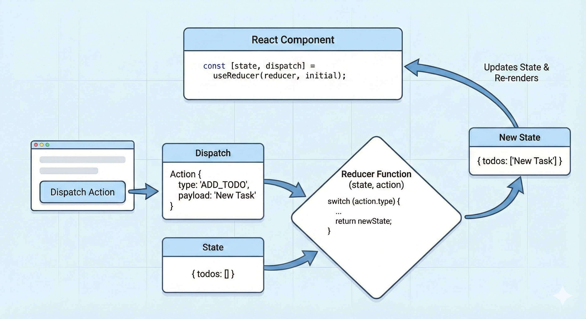

# `useReducer` Hook

## What is `useReducer`?

`useReducer` is a React Hook used for **managing complex state logic** in a more structured and predictable way.

It is an alternative to `useState`, especially when:

* State has **multiple sub-values**
* State transitions are **complex**
* Next state depends on the **previous state**
* You want **centralized state logic**

---

## Basic Syntax

```jsx
const [state, dispatch] = useReducer(reducerFunction, initialState);
```

---

## Syntax Breakdown

| Part              | Meaning                                 |
| ----------------- | --------------------------------------- |
| `state`           | Current state value                     |
| `dispatch`        | Function used to send actions           |
| `reducerFunction` | Function that decides how state changes |
| `initialState`    | Starting state value                    |

---

## Core Concept: The Reducer Pattern

`useReducer` follows a **three-part pattern**:

### 1. State

The current data.

### 2. Action

An object that describes **what happened**.

Example:

```js
{ type: "increment" }
```

### 3. Reducer

A function that:

* Receives current state + action
* Returns new state

---

## Step-by-Step Flow (Very Important)

Let’s say user clicks **increment** button.

### Step 1: User action

```jsx
dispatch({ type: "increment" });
```

### Step 2: React calls reducer

```jsx
reducer(currentState, action);
```

Example:

```jsx
reducer({ count: 0 }, { type: "increment" });
```

### Step 3: Reducer returns new state

```jsx
return { count: 1 };
```

### Step 4: React updates state

```jsx
state = { count: 1 };
```

### Step 5: Component re-renders

UI shows updated count.



---

## Example 1: (Counter)

```jsx
import { useReducer } from "react";

const initialState = { count: 0 };

function reducer(state, action) {
    switch (action.type) {
        case "increment":
            return { count: state.count + 1 };

        case "decrement":
            return { count: state.count - 1 };

        default:
            return state;
    }
}

function Counter() {
    const [state, dispatch] = useReducer(reducer, initialState);

    return (
        <div>
            <p>Count: {state.count}</p>
            <button onClick={() => dispatch({ type: "increment" })}>
                +
            </button>
            <button onClick={() => dispatch({ type: "decrement" })}>
                -
            </button>
        </div>
    );
}
```

---

### Step-by-Step Execution of the Example

**Initial render**

```js
state = { count: 0 }
```

**UI:** Count: 0


**User clicks “+”**

```jsx
dispatch({ type: "increment" });
```

**Reducer runs:**

```jsx
state = { count: 0 }
action = { type: "increment" }

return { count: 1 }
```


**React updates state**

```js
state = { count: 1 }
```

**Component re-renders:**

**UI:** Count: 1

---

### Why not just use `useState`?

You could write this with `useState`:

```jsx
const [count, setCount] = useState(0);
```

But imagine more complex state:

```js
{
  name: "",
  email: "",
  password: "",
  isLoading: false,
  error: null
}
```

With `useState`, logic becomes scattered.

With `useReducer`, all logic stays **in one place**.

---

## Example 2: Form State (Real-world use case)

### Initial state

```jsx
const initialState = {
    name: "",
    email: "",
};
```


### Reducer

```jsx
function reducer(state, action) {
    switch (action.type) {
        case "SET_NAME":
            return { ...state, name: action.payload };

        case "SET_EMAIL":
            return { ...state, email: action.payload };

        default:
            return state;
    }
}
```


### Component

```jsx
function Form() {
    const [state, dispatch] = useReducer(reducer, initialState);

    return (
        <div>
            <input
                placeholder="Name"
                value={state.name}
                onChange={(e) =>
                    dispatch({
                        type: "SET_NAME",
                        payload: e.target.value,
                    })
                }
            />

            <input
                placeholder="Email"
                value={state.email}
                onChange={(e) =>
                    dispatch({
                        type: "SET_EMAIL",
                        payload: e.target.value,
                    })
                }
            />
        </div>
    );
}
```

---

## Example 3: Complex Async State

```jsx
const initialState = {
    loading: false,
    data: null,
    error: null,
};
```

### Reducer

```jsx
function reducer(state, action) {
    switch (action.type) {
        case "FETCH_START":
            return { ...state, loading: true, error: null };

        case "FETCH_SUCCESS":
            return { loading: false, data: action.payload, error: null };

        case "FETCH_ERROR":
            return { loading: false, data: null, error: action.payload };

        default:
            return state;
    }
}
```


### Component

```jsx
function DataFetcher() {
    const [state, dispatch] = useReducer(reducer, initialState);

    const fetchData = async () => {
        dispatch({ type: "FETCH_START" });

        try {
            const res = await fetch("https://api.example.com/data");
            const data = await res.json();

            dispatch({ type: "FETCH_SUCCESS", payload: data });
        } catch (error) {
            dispatch({ type: "FETCH_ERROR", payload: error });
        }
    };

    return (
        <div>
            <button onClick={fetchData}>Fetch</button>

            {state.loading && <p>Loading...</p>}
            {state.error && <p>Error occurred</p>}
            {state.data && <p>Data loaded</p>}
        </div>
    );
}
```

---

## `useReducer` vs `useState` (Interview Favorite)

| Feature                       | useState         | useReducer    |
| ----------------------------- | ---------------- | ------------- |
| Simple state                  | ✅ Best choice    | ❌ Overkill    |
| Complex state logic           | ❌ Hard to manage | ✅ Ideal       |
| Multiple sub-values           | ❌ Messy          | ✅ Clean       |
| Predictable state transitions | ❌ Scattered      | ✅ Centralized |
| Similar to Redux              | ❌ No             | ✅ Yes         |

---

## When to Use `useReducer`

Use it when:

1. State has multiple related values
2. Logic depends on previous state
3. Multiple actions modify state
4. You want predictable transitions
5. Preparing for Redux-like architecture

---

## Lazy Initialization (Advanced)

`useReducer` supports lazy initialization.

### Syntax

```jsx
const [state, dispatch] = useReducer(reducer, initialArg, initFunction);
```

---

### Example

```jsx
function init(initialCount) {
    return { count: initialCount };
}

const [state, dispatch] = useReducer(reducer, 5, init);
```

Here:

* `init(5)` runs only once
* Used for expensive initial logic

---

## Common Mistakes

---

### 1. Mutating state directly ❌

```jsx
state.count += 1;
return state;
```

Wrong because:

* React expects a **new object**

Correct:

```jsx
return { count: state.count + 1 };
```

---

### 2. Forgetting default case

```jsx
switch (action.type) {
    // cases...
}
```

Always include:

```jsx
default:
    return state;
```

---

### 3. Dispatching wrong action shape

```jsx
dispatch("increment"); // ❌ wrong
```

Correct:

```jsx
dispatch({ type: "increment" });
```

---

## Mental Model

Think of `useReducer` as:

> “A central machine that updates state based on actions.”

Or:

> **Action → Reducer → New State → Re-render**

---

## Interview-Ready Explanation (Short Version)

**Definition:**

`useReducer` is a React Hook used to manage complex state logic using a reducer function and dispatched actions.

**Key points to mention:**

* Alternative to `useState`.
* Uses reducer pattern: state + action → new state.
* Centralizes state logic.
* Ideal for complex or related state values.
* Similar to Redux.
