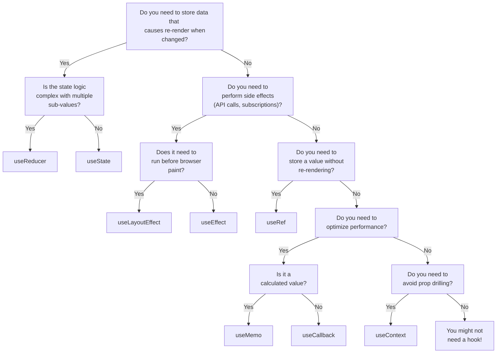

# 🪝 React Hooks

## 📌 What are Hooks?

**Hooks** are special functions provided by React that allow you to "hook into" React features like **state** and **lifecycle methods** from within **functional components**. Before Hooks, these features were only available in class components.

> **Official Definition:** Hooks are functions that let you use React state and lifecycle features without writing a class.

### Why Were Hooks Introduced?

Before React 16.8 (February 2019), if you wanted to use state or lifecycle methods, you **had to** use class components:

```jsx
// ❌ The old way - Class Component (verbose and complex)
class Counter extends React.Component {
  constructor(props) {
    super(props);
    this.state = { count: 0 };
    this.increment = this.increment.bind(this);
  }

  increment() {
    this.setState({ count: this.state.count + 1 });
  }

  componentDidMount() {
    document.title = `Count: ${this.state.count}`;
  }

  componentDidUpdate() {
    document.title = `Count: ${this.state.count}`;
  }

  render() {
    return (
      <div>
        <p>Count: {this.state.count}</p>
        <button onClick={this.increment}>Increment</button>
      </div>
    );
  }
}
```

With Hooks, the same component becomes:

```jsx
// ✅ The new way - Functional Component with Hooks (clean and simple)
import { useState, useEffect } from "react";

function Counter() {
  const [count, setCount] = useState(0);

  useEffect(() => {
    document.title = `Count: ${count}`;
  }, [count]);

  return (
    <div>
      <p>Count: {count}</p>
      <button onClick={() => setCount(count + 1)}>Increment</button>
    </div>
  );
}
```

---

## 🎯 Problems Hooks Solve

### 1. **Complex Components Become Hard to Understand**

- Class components mixed unrelated logic in lifecycle methods
- `componentDidMount` might contain setup for timers, subscriptions, AND data fetching
- Hooks let you split code based on what it's doing, not when it runs

### 2. **Reusing Stateful Logic is Difficult**

- With classes, you needed HOCs (Higher-Order Components) or Render Props
- These patterns resulted in "wrapper hell" with deeply nested components
- **Custom Hooks** allow easy extraction and sharing of logic

### 3. **Classes Confuse Both People and Machines**

- `this` keyword is confusing and requires binding
- Classes don't minify well and make hot reloading unreliable
- Hooks use plain JavaScript functions

---

## ⚙️ How Hooks Work Internally (High-Level)

Understanding how Hooks work under the hood helps you use them correctly.

### The Linked List Pattern

React maintains a **linked list** of hooks for each component. Every time your component renders:

1. React looks at the first hook call → gets/sets the first node in the list
2. React looks at the second hook call → gets/sets the second node
3. And so on...

```
Component renders:
┌─────────────────────────────────────────────────────────┐
│  const [name, setName] = useState("John")   → Node 1    │
│  const [age, setAge] = useState(25)         → Node 2    │
│  useEffect(() => {...}, [])                 → Node 3    │
└─────────────────────────────────────────────────────────┘

Internal Hook List:
[useState: "John"] → [useState: 25] → [useEffect: {...}]
```

### Why Order Matters

Since React relies on the **order** of hook calls (not names), calling hooks conditionally would break this mapping:

```jsx
// ❌ WRONG - This breaks React!
function MyComponent({ isLoggedIn }) {
  if (isLoggedIn) {
    const [user, setUser] = useState(null); // Sometimes first, sometimes skipped
  }
  const [count, setCount] = useState(0); // Position changes!
}

// On render 1 (isLoggedIn = true):
// Hook 1: user state
// Hook 2: count state

// On render 2 (isLoggedIn = false):
// Hook 1: count state ← React thinks this is user state! 💥
```

---

## 📜 Rules of Hooks

These rules are **mandatory** for Hooks to work correctly.

### Rule 1: Only Call Hooks at the Top Level

**Don't call Hooks inside loops, conditions, or nested functions.**

```jsx
// ❌ BAD - Hook inside condition
function Form() {
  if (someCondition) {
    const [name, setName] = useState(""); // Breaks hook order!
  }
}

// ✅ GOOD - Condition inside hook
function Form() {
  const [name, setName] = useState("");

  useEffect(() => {
    if (someCondition) {
      // Do something conditionally here
    }
  }, [someCondition]);
}
```

### Rule 2: Only Call Hooks from React Functions

**Call Hooks from:**

- ✅ React functional components
- ✅ Custom Hooks (functions starting with `use`)

**Don't call from:**

- ❌ Regular JavaScript functions
- ❌ Class components

```jsx
// ❌ BAD - Regular function
function helperFunction() {
  const [data, setData] = useState(null); // Not a React component!
}

// ✅ GOOD - Custom Hook
function useCustomData() {
  const [data, setData] = useState(null);
  return data;
}

// ✅ GOOD - React Component
function MyComponent() {
  const data = useCustomData();
  return <div>{data}</div>;
}
```

### Enforcing Rules with ESLint

Install the official ESLint plugin to catch rule violations:

```bash
npm install eslint-plugin-react-hooks --save-dev
```

Add to your ESLint config:

```json
{
  "plugins": ["react-hooks"],
  "rules": {
    "react-hooks/rules-of-hooks": "error",
    "react-hooks/exhaustive-deps": "warn"
  }
}
```

---

## 🔖 Built-in Hooks Reference

React provides several built-in Hooks, each serving a specific purpose:

### State Hooks

| Hook                               | Purpose                                   | When to Use                                    |
| ---------------------------------- | ----------------------------------------- | ---------------------------------------------- |
| [`useState`](./01-useState.md)     | Add state to functional components        | Simple state (strings, numbers, booleans)      |
| [`useReducer`](./06-useReducer.md) | Manage complex state with reducer pattern | Complex state objects, multiple related values |

### Effect Hooks

| Hook                                         | Purpose                                | When to Use                               |
| -------------------------------------------- | -------------------------------------- | ----------------------------------------- |
| [`useEffect`](./02-useEffect.md)             | Perform side effects after render      | Data fetching, subscriptions, DOM changes |
| [`useLayoutEffect`](./08-useLayoutEffect.md) | Like useEffect but fires synchronously | DOM measurements, prevent visual flicker  |

### Context Hook

| Hook                               | Purpose               | When to Use                       |
| ---------------------------------- | --------------------- | --------------------------------- |
| [`useContext`](./07-useContext.md) | Access context values | Avoid prop drilling, global state |

### Performance Hooks

| Hook                                 | Purpose                        | When to Use                                     |
| ------------------------------------ | ------------------------------ | ----------------------------------------------- |
| [`useMemo`](./03-useMemo.md)         | Memoize expensive calculations | Prevent recomputation on every render           |
| [`useCallback`](./04-useCallback.md) | Memoize function references    | Prevent child re-renders from new function refs |

### Ref Hook

| Hook                       | Purpose                                   | When to Use                         |
| -------------------------- | ----------------------------------------- | ----------------------------------- |
| [`useRef`](./05-useRef.md) | Persist values across renders, access DOM | DOM access, storing previous values |

### React 18+ Hooks (Advanced)

| Hook                   | Purpose                                          |
| ---------------------- | ------------------------------------------------ |
| `useId`                | Generate unique IDs for accessibility            |
| `useTransition`        | Mark updates as non-urgent (concurrent features) |
| `useDeferredValue`     | Defer updating parts of the UI                   |
| `useSyncExternalStore` | Subscribe to external stores                     |

---

## 🔄 When to Use Which Hook?

Use this decision flowchart:



---

## 🆚 Hooks vs Class Components

| Aspect             | Class Components              | Hooks                    |
| ------------------ | ----------------------------- | ------------------------ |
| **Syntax**         | Verbose, needs `this` binding | Clean, just functions    |
| **State**          | `this.state` and `setState`   | `useState`               |
| **Lifecycle**      | Split across methods          | Unified in `useEffect`   |
| **Logic Reuse**    | HOCs, Render Props            | Custom Hooks             |
| **Bundle Size**    | Larger                        | Smaller                  |
| **Learning Curve** | Steeper (OOP concepts)        | Gentler (just functions) |
| **Future**         | Legacy (still supported)      | Recommended approach     |

---

## 📚 Topics in This Section

Explore each hook in detail:

1. [useState](./01-useState.md) - Managing component state
2. [useEffect](./02-useEffect.md) - Handling side effects
3. [useMemo](./03-useMemo.md) - Memoizing computed values
4. [useCallback](./04-useCallback.md) - Memoizing functions
5. [useRef](./05-useRef.md) - Refs and mutable values
6. [useReducer](./06-useReducer.md) - Complex state management
7. [useContext](./07-useContext.md) - Context consumption
8. [useLayoutEffect](./08-useLayoutEffect.md) - Synchronous DOM effects
9. [Custom Hooks](./09-custom-hooks.md) - Creating reusable hooks
10. [Common Mistakes](./10-common-mistakes.md) - Best practices and pitfalls

---

## 🚀 Next Steps

After understanding the basics of Hooks:

1. **Practice** - Build small projects using only functional components with hooks
2. **Create custom hooks** - Extract common patterns from your components
3. **Learn advanced patterns** - Combine hooks for complex state management
4. **Explore React 18+ hooks** - `useTransition`, `useDeferredValue`, etc.

---

## 📖 Further Reading

- [Official React Hooks Documentation](https://react.dev/reference/react/hooks)
- [Rules of Hooks](https://react.dev/reference/rules/rules-of-hooks)
- [Building Your Own Hooks](https://react.dev/learn/reusing-logic-with-custom-hooks)
