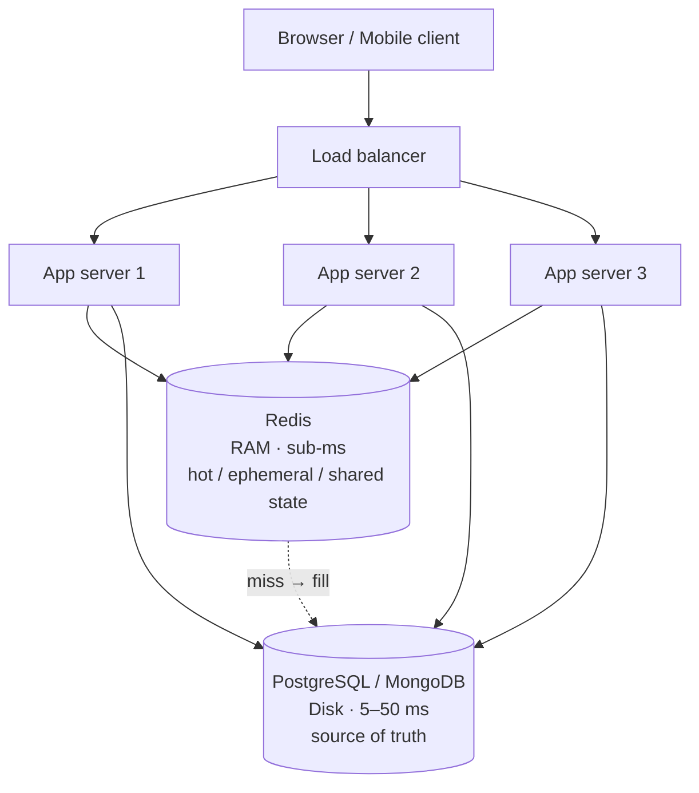

# What Is Redis?

> **What you will be able to do after this page**
>
> - Explain what Redis is to a colleague in three sentences, without saying "it's a cache".
> - Draw the picture of where Redis sits in a real application and why it is there.
> - Say precisely *why* it is fast — and know that "because it's in RAM" is only half the answer.
> - Decide when Redis is the right tool and, just as importantly, when it is the wrong one.

If you have never heard of Redis before, start here and read every word. If you have used Redis by copy-pasting a `SET`/`GET` from an AI answer, start here too — this page is the model that everything else hangs off.

---

## 1. The one-sentence definition, unpacked

> **Redis is an in-memory data structure server.**

Five words, three of which are doing real work. Take them one at a time.

### "Server"

Redis is a **separate process**, usually on a separate machine, that you talk to over a TCP socket. It is not a library you `import`. It is not embedded in your app. Your application is a **client**; Redis is a **server**.

```
        your app process                          the redis-server process
   ┌───────────────────────────┐             ┌───────────────────────────────┐
   │                           │   TCP :6379 │                               │
   │   redis.set("k", "v") ────┼────────────►│  parse → execute → reply      │
   │                           │             │                               │
   │   ◄───────────────────────┼─────────────┼──── "+OK\r\n"                 │
   └───────────────────────────┘             └───────────────────────────────┘
```

This matters more than it sounds. Because Redis is a server:

- **Many clients share the same data.** Ten application instances behind a load balancer all see the same counter. That is the entire reason distributed caches, locks, and rate limiters work.
- **Every command costs a network round trip.** A single `GET` on a LAN is ~0.1–0.5 ms. Redis itself may take 1 *microsecond* to execute it. **The network, not Redis, is almost always your bottleneck.** This one fact drives [pipelining](./18-pipelining-and-performance.md) and Lua [scripting](./17-transactions-and-scripting.md).

### "In-memory"

The dataset lives in **RAM**, not on disk. A traditional database keeps data on disk and caches hot pages in RAM; Redis inverts this — data lives in RAM and is *optionally* written to disk so it survives a restart.

| | Typical latency | Relative |
| :--- | :--- | :--- |
| L1 CPU cache | ~1 ns | 1× |
| Main memory (RAM) | ~100 ns | 100× |
| SSD random read | ~100 µs | 100,000× |
| Spinning disk seek | ~10 ms | 10,000,000× |
| Network round trip (same DC) | ~500 µs | 500,000× |

RAM is roughly **1,000× faster than an SSD** for random access. That is where the headline speed comes from. It also implies the two constraints you will live with forever:

1. **RAM is small and expensive.** A machine with 1 TB of SSD is cheap; 1 TB of RAM is not. Your Redis dataset must fit in memory. This is why [eviction policies](./15-expiration-and-eviction.md) exist.
2. **RAM is volatile.** Power off, data gone — unless you configured [persistence](./16-persistence.md). And even then, persistence is asynchronous, so a crash can lose the last fraction of a second of writes.

### "Data structure"

**This is the word people miss, and it is the one that makes Redis interesting.**

Memcached is an in-memory key-value store: keys map to opaque blobs of bytes. If you store a list in Memcached, you store a *serialized* list — and to append one element, you must `GET` the whole list, deserialize it, append, re-serialize, and `SET` it back. That is three network trips, full transfer of the data both ways, and a **race condition** if two clients do it at once.

In Redis the *value itself* is a real data structure the server understands:

```
  key                       value (a live server-side structure)
  ─────────────────────     ───────────────────────────────────────────
  "user:1042:name"      →   String    "Ada Lovelace"
  "user:1042:visits"    →   String    42                (integer-encoded)
  "queue:emails"        →   List      [job9, job8, job7]
  "user:1042"           →   Hash      {name: "Ada", age: 36, city: "London"}
  "post:88:tags"        →   Set       {redis, database, memory}
  "leaderboard"         →   SortedSet {alice:100, bob:250, carol:400}
  "events"              →   Stream    [1698-0: {...}, 1699-0: {...}]
```

So appending to a list is **one command**, executed atomically inside the server, transferring only the new element:

```bash
LPUSH queue:emails job10
```

:::tip[The reframe that makes Redis click]
Stop thinking *"Redis is a fast key-value cache."*

Start thinking *"Redis is the data structure library of my programming language — lists, hashes, sets, sorted sets — but shared over the network between every process in my system, and every operation on them is atomic."*

Every advanced use of Redis (rate limiters, leaderboards, job queues, distributed locks, session stores, streams) is just a clever application of that one sentence.
:::

---

## 2. Where Redis actually sits

Redis is almost never your *only* datastore. It sits beside one.



Two jobs, and it is worth naming them separately because they are genuinely different:

**Job 1 — Redis as a cache in front of the database.**
The data's *home* is Postgres. Redis holds a fast copy. If Redis loses it, you re-read from Postgres and everything is fine — just slower for a moment. Losing this data is **acceptable**.

**Job 2 — Redis as shared state that has no other home.**
A rate-limiter counter, a distributed lock, a live leaderboard, a WebSocket presence set, a job queue. There is no Postgres row backing this. Losing it is **not** acceptable in the same casual way, which is why [persistence](./16-persistence.md) and [replication](./20-replication.md) matter even for a "cache".

Knowing which job a given key is doing tells you how much you should care about durability for it. Most production incidents involving Redis come from someone treating a Job-2 key as if it were Job-1.

---

## 3. Why it is fast — the full answer

"It's in RAM" is the answer people give. Here is the complete list, because interviewers ask for exactly this.

```
 1. In-memory              → no disk seek on the read path (~100 ns vs ~100 µs)
 2. Single-threaded core   → no locks, no mutex contention, no context switching,
                             no cache-line ping-pong between cores
 3. Optimized structures   → each type has multiple encodings; small objects use
                             compact, cache-friendly layouts (listpack, intset)
 4. I/O multiplexing       → one thread + epoll/kqueue handles 10,000+ sockets
 5. Simple wire protocol   → RESP parses with a pointer scan; no JSON, no XML,
                             no schema negotiation
 6. Everything is O(1)/O(log N) → the API is designed so you cannot
                             accidentally ask for a table scan (mostly)
```

### The single-thread point is the counterintuitive one

Redis executes commands **one at a time, in a single thread**. Not one thread per connection. Not a thread pool. One.

Newcomers assume this is a limitation. It is a *design choice*, and it buys three things:

- **Atomicity for free.** While `INCR` runs, nothing else in the entire server runs. There is no interleaving, so there is no lost update. Every single Redis command is atomic without you doing anything, and *that* is why Redis is the right tool for counters and locks.
- **No synchronization cost.** Multi-threaded stores burn a large fraction of their CPU on locks and atomics. Redis burns none.
- **Predictable behaviour.** Commands run in the order they arrive. There is one timeline.

The bottleneck for Redis is memory and network, not CPU — so paying for extra cores you cannot use is usually irrelevant. (Modern Redis does use extra threads for network I/O reads/writes and for background deletes; the *command execution* is still one at a time. Full detail in [The Single-Threaded Event Loop](./14-single-threaded-event-loop.md).)

:::danger[The flip side, and the #1 cause of Redis outages]
Because there is one thread, **one slow command blocks every other client.**

```bash
KEYS *                          # O(N) over the whole keyspace
SMEMBERS a-set-with-5-million    # builds a 5M-element reply
FLUSHALL                        # on a huge dataset, synchronously
```

Run `KEYS *` on a 10-million-key production database and your entire application stalls for seconds. Nothing is "slow" — everything is *stopped*. Learn `SCAN` on [Keys & The Keyspace](./03-keys-and-the-keyspace.md) before you touch production.
:::

### What "fast" means numerically

A single modest Redis instance handles roughly **100,000 operations per second** on one core, and a well-tuned one on good hardware can exceed 1,000,000 with pipelining. Latency is typically **sub-millisecond at the p99**, and the variance mostly comes from the network and from `fork()` during persistence.

For context: a well-indexed Postgres primary-key lookup is ~1 ms and tops out in the low tens of thousands of QPS per core. Redis is roughly 10–100× more operations per second at roughly 1/10th the latency — *for the operations it supports*.

---

## 4. A worked example: the same feature, with and without Redis

**Feature:** show a "🔥 trending posts" list on the homepage. Computing it requires an expensive aggregation over the last 24 hours of views.

### Without Redis

```
   request →  app  →  Postgres: 400 ms aggregation query
                          ↓
                     render, respond

   1,000 requests/second × 400 ms of database work each
   = your database is on fire, your homepage times out
```

### With Redis (cache-aside)

```
   request →  app  →  Redis GET trending:posts
                          │
              ┌───────────┴─────────────┐
              │ HIT (99.9% of requests) │  0.3 ms  → respond
              └─────────────────────────┘
              ┌─────────────────────────┐
              │ MISS (once per minute)  │  → Postgres 400 ms
              │                         │  → Redis SETEX trending:posts 60 <json>
              └─────────────────────────┘  → respond
```

```ts
async function getTrending(): Promise<Post[]> {
  const cached = await redis.get('trending:posts');
  if (cached !== null) return JSON.parse(cached) as Post[];   // ~0.3 ms

  const rows = await db.query<Post>(EXPENSIVE_SQL);           // ~400 ms, rare
  await redis.set('trending:posts', JSON.stringify(rows), 'EX', 60);
  return rows;
}
```

The database now runs that query **once per minute** instead of 1,000 times per second — a 60,000× reduction in load — and the p99 latency of the endpoint drops from 400 ms to under a millisecond. That is the whole value proposition in one code block. The subtleties (what happens when 1,000 requests miss simultaneously? what if the data changes?) are the subject of [Caching Patterns](./25-caching-patterns.md).

---

## 5. What Redis is used for, concretely

| Use case | Type used | Why Redis and not something else |
| :--- | :--- | :--- |
| **Caching** query results, rendered pages, API responses | String / Hash | Sub-ms reads, TTL built in |
| **Session store** | Hash + TTL | Shared across app servers; auto-expiry |
| **Rate limiting** | String `INCR` / Sorted Set | Atomic counters, no race conditions |
| **Leaderboards & rankings** | Sorted Set | `ZADD` + `ZRANGE` is O(log N); rank queries are free |
| **Job / task queues** | List (`BLPOP`) or Stream | Blocking pop means no polling |
| **Distributed locks** | String `SET NX PX` | Atomic set-if-not-exists with expiry |
| **Pub/Sub & real-time fan-out** | Pub/Sub or Stream | Push to N subscribers in one operation |
| **Counters & analytics** | String / HyperLogLog / Bitmap | `INCR` is atomic; HLL counts millions of uniques in 12 KB |
| **Deduplication / "seen?" checks** | Set / Bitmap | O(1) membership |
| **Autocomplete & search prefixes** | Sorted Set | Lexicographic range queries |
| **Geospatial "near me"** | Geo (sorted set) | Radius queries built in |
| **Event streaming with consumer groups** | Stream | Kafka-like semantics without Kafka |
| **Feature flags, config, service registry** | Hash + Pub/Sub | Fast reads, push invalidation |

Notice that only the first row is "a cache". Redis is a cache the way a Swiss Army knife is a screwdriver.

---

## 6. When *not* to use Redis

An honest engineer knows the boundaries of their tool. Not using Redis is often the right call.

**❌ As your only database for data you cannot lose.**
Persistence is asynchronous by default. A hard crash loses up to a second (AOF `everysec`) or minutes (RDB) of writes. Fully synchronous persistence exists (`appendfsync always`) but costs most of the performance you came for. Money, orders, and user accounts belong in a database with real durability guarantees. *(There are Redis-derived products marketed for durable primary storage; the vanilla open-source server is not that.)*

**❌ When your dataset does not fit in RAM.**
Redis is not designed to page to disk. If you have 5 TB of data, that is 5 TB of RAM, and the bill will change your mind. Store the 5 TB in Postgres/S3 and cache the hot 20 GB in Redis.

**❌ For complex relational queries.**
There are no joins, no `WHERE age > 30 AND city = 'London' ORDER BY signup_date`, no ad-hoc query planner. You can only look data up the way you explicitly indexed it *when you wrote it*. If you need flexible querying, you need a query engine.

**❌ For very large individual values.**
A 200 MB string is legal (the limit is 512 MB) and a catastrophe: it blocks the single thread while it is copied to the output buffer, it inflates replication traffic, and it makes memory fragmentation ugly. Keep values small — kilobytes, not megabytes.

**❌ For full-text search or analytics scans.**
Use Elasticsearch/OpenSearch, or a columnar store. (Redis *modules* like RediSearch add these capabilities, but that is a different product surface with different operational costs.)

**❌ When you have not measured a problem.**
Adding Redis adds a network hop, a new failure mode, a cache-invalidation bug class, and a service to operate and pay for. If your endpoint is 20 ms and your users are happy, adding Redis is a downgrade. **Cache invalidation is genuinely one of the hardest problems in software** — do not opt into it for fun.

---

## 7. Redis vs. the alternatives

| | Redis | Memcached | PostgreSQL | Kafka |
| :--- | :--- | :--- | :--- | :--- |
| **Model** | Data structure server | Key → blob | Relational tables | Distributed log |
| **Value types** | 10+ rich types | Bytes only | Typed columns, JSON | Bytes |
| **Persistence** | Optional (RDB/AOF) | None | Full ACID durability | Full, on disk |
| **Threading** | Single-threaded core | Multi-threaded | Process per connection | Multi-threaded |
| **Replication** | Yes (async) | No (client-side sharding) | Yes | Yes (core design) |
| **Server-side scripting** | Lua / Functions | No | PL/pgSQL | Streams API |
| **Pub/Sub & streams** | Yes | No | `LISTEN/NOTIFY` | The whole point |
| **Best at** | Everything ephemeral, hot, shared | Pure LRU caching, huge fleets | Source of truth | Durable, replayable event log |

The honest short version: **Memcached** is simpler and marginally better at raw multi-core caching throughput; Redis wins the moment you need anything more than "get this blob back". **Kafka** wins when you need durable, replayable, high-volume event streams with long retention; [Redis Streams](./11-streams.md) covers the same shape at a much smaller scale with far less operational weight.

---

## 8. A little history and the naming

Redis was written in 2009 by **Salvatore Sanfilippo** (antirez) in C, because the analytics product he was building could not make MySQL fast enough. The name is **RE**mote **DI**ctionary **S**erver.

Version landmarks worth knowing, because they explain why tutorials disagree with each other:

| Version | Year | What arrived |
| :--- | :--- | :--- |
| 2.6 | 2012 | Lua scripting |
| 2.8 | 2013 | `SCAN`, partial resynchronization |
| 3.0 | 2015 | **Redis Cluster** |
| 3.2 | 2016 | Geo commands, `BITFIELD` |
| 4.0 | 2017 | Modules, `UNLINK`, mixed RDB+AOF, LFU eviction |
| 5.0 | 2018 | **Streams** |
| 6.0 | 2020 | **ACLs**, RESP3, TLS, threaded I/O |
| 7.0 | 2022 | **Functions**, sharded Pub/Sub, listpack replaces ziplist |
| 7.4+ | 2024 | Hash-field TTLs; license change to RSALv2/SSPL |
| 8.0 | 2025 | AGPL option; performance work; query engine bundled |

:::note[On the license, briefly]
In 2024 Redis changed from BSD to a source-available license, which prompted the **Valkey** fork (Linux Foundation, BSD, backed by AWS/Google) and led some clouds to ship Valkey instead. Redis 8 then added AGPLv3 as an option. For everything in these notes it makes no practical difference: Valkey is command-compatible with Redis 7.2, and every concept, command, and internal here applies to both. Where a feature is version-specific, it is flagged.
:::

---

## 9. Vocabulary you will meet constantly

| Term | Meaning |
| :--- | :--- |
| **Key** | The unique name of a value. Always a binary-safe string. |
| **Keyspace** | The set of all keys in one logical database. |
| **Database** | A numbered namespace, `0`–`15` by default. Selected with `SELECT`. Discouraged in production and unsupported in Cluster. |
| **TTL** | Time To Live — remaining seconds before a key auto-deletes. |
| **Eviction** | Redis deleting keys *because it ran out of memory*. Distinct from expiry. |
| **Encoding** | The internal representation of a value; changes automatically with size. |
| **Instance** | One `redis-server` process. |
| **Replica** | An instance that copies a primary's data. |
| **Sentinel** | A monitoring process that performs automatic failover. |
| **Cluster** | A set of instances that shard the keyspace across 16,384 hash slots. |
| **RESP** | REdis Serialization Protocol — the wire format. |
| **Pipelining** | Sending N commands without waiting for each reply. |
| **Atomic** | Executes fully or not at all, with nothing interleaved. |

---

## Rapid-fire recall

1. What are the three load-bearing words in "in-memory data structure server"?
2. Why does the fact that Redis is a *server* (not a library) make distributed locks possible?
3. Name three reasons Redis is fast besides "it's in RAM".
4. Why is single-threaded execution an advantage rather than a limitation?
5. What is the single biggest operational danger created by single-threading?
6. What is the practical difference between a Redis key that caches a Postgres row and a Redis key holding a rate-limit counter?
7. Give three situations where you should *not* use Redis.
8. What does RESP stand for, and what does RESP-the-acronym have to do with speed?

<details>
<summary>Answers</summary>

1. **Server** (separate process, shared by all clients, every call is a network hop), **in-memory** (RAM speed, RAM limits, RAM volatility), **data structure** (values are lists/hashes/sets the server understands, mutated atomically in place).
2. Because all application instances talk to the *same* process, and that process serializes every command — so exactly one client can win a `SET NX`.
3. Single-threaded (no locking overhead), I/O multiplexing with epoll, compact cache-friendly encodings, a trivially parseable wire protocol, and an API of O(1)/O(log N) operations.
4. No locks, no context switching, no cache-line contention — and every command is atomic for free, which is what makes counters and locks correct.
5. One slow O(N) command (`KEYS *`, `SMEMBERS` on a huge set, a slow Lua script) blocks *every* client for its whole duration.
6. The cached row can be regenerated from the source of truth, so losing it costs latency. The counter has no other home — losing it changes behaviour (someone gets free requests), so it needs persistence and replication.
7. Data you cannot lose and cannot rebuild; datasets larger than RAM; ad-hoc relational or full-text querying; huge individual values; no measured performance problem.
8. REdis Serialization Protocol. It is prefix-length-encoded plain text, so it parses with a simple pointer scan — no tokenizer, no schema, negligible CPU.

</details>

---

**Next:** [Installing Redis & Your First Commands](./02-installation-and-first-commands.md) — get a server running and trace a `SET` from your keyboard to RAM and back.
