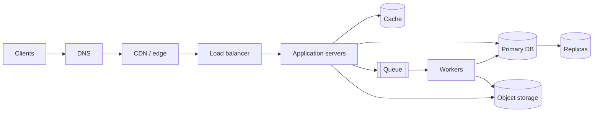

import H from '@site/src/components/Highlight';
import C from '@site/src/components/Color';
import Plain from '@site/src/components/Plain';
import Jargon from '@site/src/components/Jargon';
import Depth from '@site/src/components/Depth';
import Trace, { TraceStep } from '@site/src/components/Trace';

# What Is System Design?

> **What you will be able to do after this page**
>
> - Say what system design *is* without listing technologies.
> - Explain why a design question has no right answer, and what is being graded instead.
> - Draw the boundary between high-level design and low-level design, and know which one you are being asked for.
> - Name the four questions that sit underneath every design decision you will ever make.

If you have never designed a system, start here. If you have built services for years but freeze when someone says "design Twitter", start here too — the freeze is almost always a missing frame, not missing knowledge.

<Plain>

Think about a single coffee shop. One person takes the order, makes the coffee, and hands it over. It works perfectly — until forty people walk in at once.

Now you have decisions to make, and none of them is obviously right. Hire a second barista? Buy a faster machine? Let people order ahead on an app so the queue spreads out? Pre-make the popular drinks, accepting that some go cold and get thrown away?

Every one of those *helps something and hurts something else*. A second barista costs wages. Pre-making drinks wastes coffee. Ordering ahead means building an app and dealing with it breaking.

**That is system design.** Not the coffee — the reasoning. You are choosing how to arrange a handful of well-understood parts so the whole thing keeps working as more people arrive, while being honest about what each choice costs you. Software just swaps baristas for servers and coffee for data. The thinking is identical, and it is the thinking — not the vocabulary — that takes time to build.

</Plain>

---

## 1. The definition, unpacked

> <H>**System design is deciding how to arrange components so that a system meets its requirements under its constraints — and being able to say what each arrangement costs.**</H>

Three clauses, all load-bearing.

<Jargon
  plain="The individual pieces you arrange — things that do one job each, like 'stores the data' or 'spreads traffic between servers'."
  term="components"
  also={['building blocks', 'services']}>

When someone says *"walk me through the components"*, they want you to name the boxes and say what each is for. The pieces themselves are standard; **which** ones you pick and **how** you wire them is the design.

</Jargon>

### "Arrange components"

You are not inventing new machinery. Load balancers, caches, queues, databases and object stores already exist and behave in known ways. Design is **composition**: which pieces, how many, connected how, with data flowing in which direction.

This is why the vocabulary in [Part A](/systemDesign/concepts) matters so much. You cannot compose pieces whose behaviour you do not know. Someone who genuinely understands what a cache does — including what it does when it is *wrong* — designs better systems than someone who has memorised twenty architecture diagrams.

<Depth title="Why there are so few components, and why they barely change">

There are perhaps a dozen primitive components in all of system design — load balancer, cache, queue, database, object store, search index, CDN, worker pool, and a handful more. That list has been roughly stable for twenty years while the products implementing it churned constantly.

The reason is that each exists to solve a **physics or economics problem** that does not change:

- A cache exists because [RAM is ~5,000× faster than a network round trip](./04-latency-numbers.md). That ratio is set by hardware, not fashion.
- A queue exists because producers and consumers run at different speeds and something must absorb the difference.
- A load balancer exists because one machine has finite cores and a finite network card.
- Replication exists because machines fail independently and disks die.

Products churn — Kafka displaced RabbitMQ for some jobs, ScyllaDB displaced Cassandra for others — but the *category* survives, because the underlying constraint survives. This is why learning mechanisms pays off far better than learning products: <C color="orange">vendor names have a half-life of about five years and the concepts do not</C>.

</Depth>

### "Meets its requirements"

A system that is beautiful and does not do the job is a failed design. Requirements come first, always, and most of them are not written down. Extracting them is a skill in itself — that is [the next page](./02-requirements-and-constraints.md).

### "Under its constraints"

Constraints are what make it hard. Money. Team size. Latency budget. Existing systems you cannot delete. Regulations about where bytes may physically live. Remove the constraints and every design problem becomes trivial: put everything on one enormous machine.

> <H>**The whole discipline lives in the gap between what you want and what you are allowed to spend.**</H>

### "Say what it costs"

This is the part that separates a designer from someone reciting architecture. Every choice buys something and sells something else:

| Choice | <C color="green">Buys</C> | <C color="crimson">Sells</C> |
| :--- | :--- | :--- |
| Add a cache | Read latency, DB load | Freshness, a whole class of invalidation bugs |
| Add a replica | Read capacity, failover | Consistency, money, operational surface |
| Split into services | Independent deploys, team autonomy | Local function calls become network calls that fail |
| Denormalize | Read speed | Write amplification, update anomalies |
| Add a queue | Absorbs spikes, decouples | End-to-end latency, ordering, exactly-once headaches |

If you can only state the left column, <C color="crimson">you are not designing — you are pattern-matching</C>.

---

## 2. Why there is no right answer

A design question is not a puzzle with a solution hidden inside it. It is closer to a negotiation.

Consider one question: *should a user's timeline be built when they read it, or when someone they follow writes a post?*

Both answers work. Step through each and watch where the cost lands.

<Trace title="Fan-out on WRITE (push)" subtitle="Alice, who has 3 million followers, posts one message.">

<TraceStep
  title="Alice writes a post"
  state={{ 'Work at write': '1 row', 'Work at read': '—', 'Storage used': '1 copy', 'Alice waits': '~5 ms' }}
  changed={['Work at write', 'Storage used']}
  note="So far this is cheap and obvious.">

The post is saved once, to the posts table. Nothing else has happened yet.

</TraceStep>

<TraceStep
  title="The system looks up Alice's followers"
  state={{ 'Work at write': '1 row + 1 query', 'Work at read': '—', 'Storage used': '1 copy', 'Alice waits': '~10 ms' }}
  changed={['Work at write', 'Alice waits']}
  note="3 million rows come back. This is the moment the design commits.">

To deliver the post, we need the list of everyone following Alice. That list is 3 million entries long.

</TraceStep>

<TraceStep
  title="Copy the post into 3 million timelines"
  cost="3,000,000 writes"
  state={{ 'Work at write': '3M writes', 'Work at read': '—', 'Storage used': '3M copies', 'Alice waits': 'seconds — unless queued' }}
  changed={['Work at write', 'Storage used', 'Alice waits']}
  note="One post became three million writes. This is called write amplification.">

Every follower gets their own pre-built copy of the timeline entry. The system is doing the work **now** so that nobody has to do it later.

Alice cannot wait seconds for a post button, so in practice this is pushed onto a background queue — which is itself a design decision with its own costs.

</TraceStep>

<TraceStep
  title="Bob opens the app"
  cost="1 read"
  state={{ 'Work at write': '3M writes', 'Work at read': '1 lookup', 'Storage used': '3M copies', 'Bob waits': '~1 ms' }}
  changed={['Work at read', 'Bob waits']}
  note="The read is trivially fast because all the work already happened.">

Bob's timeline is already built and sitting there. One lookup, done. **~1 ms.**

</TraceStep>

</Trace>

<Trace title="Fan-out on READ (pull)" subtitle="The same post, the opposite choice.">

<TraceStep
  title="Alice writes a post"
  cost="1 write"
  state={{ 'Work at write': '1 row', 'Work at read': '—', 'Storage used': '1 copy', 'Alice waits': '~5 ms' }}
  changed={['Work at write', 'Storage used']}
  note="And that is the entire write path. Nothing else happens.">

The post is saved once. No follower lookup, no copying. The system has decided to do the work **later**.

</TraceStep>

<TraceStep
  title="Bob opens the app"
  state={{ 'Work at write': '1 row', 'Work at read': 'starting…', 'Storage used': '1 copy', 'Bob waits': '0 ms' }}
  changed={['Work at read']}>

Bob follows 300 people. There is no pre-built timeline for him — it has to be assembled right now, while he waits.

</TraceStep>

<TraceStep
  title="Fetch recent posts from all 300 followees"
  cost="300 lookups"
  state={{ 'Work at write': '1 row', 'Work at read': '300 lookups', 'Storage used': '1 copy', 'Bob waits': '~150 ms' }}
  changed={['Work at read', 'Bob waits']}
  note="The cost that vanished from the write path reappears here, on every single read.">

Three hundred separate lookups, one per person Bob follows.

</TraceStep>

<TraceStep
  title="Merge and sort, then return 20"
  cost="+50 ms"
  state={{ 'Work at write': '1 row', 'Work at read': '300 lookups + sort', 'Storage used': '1 copy', 'Bob waits': '~200 ms' }}
  changed={['Work at read', 'Bob waits']}
  note="Bob does this every time he refreshes. Alice posted once.">

All those posts are merged into one list, sorted by time, and the top 20 are returned. **~200 ms.**

</TraceStep>

</Trace>

Put the two end states side by side and the trade-off is no longer abstract:

| | Fan-out on write | Fan-out on read |
| :--- | :--- | :--- |
| Cost per post | <C color="crimson">3,000,000 writes</C> | <C color="green">1 write</C> |
| Cost per timeline view | <C color="green">1 lookup, ~1 ms</C> | <C color="crimson">300 lookups, ~200 ms</C> |
| Storage | <C color="crimson">3M copies</C> | <C color="green">1 copy</C> |
| Breaks on | Celebrities | Everyone, once traffic grows |

<Jargon
  plain="Doing the work early and storing the answer, versus doing it late and computing it fresh."
  term="fan-out on write vs fan-out on read"
  also={['push vs pull', 'precompute vs compute-on-demand']}>

The same trade-off reappears constantly under different names — materialised views, denormalization, caching, precomputation. <C color="orange">It is always the same question: pay now and store, or pay later and compute.</C>

</Jargon>

Which is right? Neither. Twitter ran fan-out on write, then discovered that a celebrity posting caused a write storm across tens of millions of timelines, and ended up **hybrid**: push for normal accounts, pull for celebrities, merged at read time. That answer only exists because of a specific constraint — a follower distribution with an extreme tail.

Change the constraint and the answer flips. A team chat app where the largest channel has 5,000 members? Pure fan-out on write, forever, no hybrid needed.

> <H>**The answer is a function of the constraints. State the constraints, and the design mostly follows. Skip them, and no amount of architecture knowledge saves you.**</H>

### What is actually being evaluated

In an interview — and in a real design review — nobody is checking your diagram against a reference solution. They are watching for:

1. **Do you establish constraints before drawing?** <C color="crimson">Drawing first is the single most common failure.</C>
2. **Do you know what your components actually do?** "I'll add Kafka" invites "why not SQS?" — and the answer must be about ordering and replay, not familiarity.
3. **Do you find your own bottleneck?** Strong candidates attack their own design before being asked.
4. **Can you state the cost of your choice?** Every "I'd add X" should be followed, unprompted, by "which costs us Y."
5. **Do you scope sanely?** Designing a full payments system when asked for a URL shortener is a red flag, not diligence.

---

## 3. High-level vs low-level design

Two different questions, two different interview rounds, two different skills. Knowing which one you are in matters.

```
  HIGH-LEVEL DESIGN (HLD)            │  LOW-LEVEL DESIGN (LLD)
  ───────────────────────────────────┼──────────────────────────────────
  Boxes are services and datastores  │  Boxes are classes and objects
  Arrows are network calls           │  Arrows are method calls
  Failure = a machine dies           │  Failure = a race condition
  Scale = 10M users                  │  Scale = 200 lines that stay readable
  Question: "design YouTube"         │  Question: "design a parking lot"
  Graded on: trade-offs              │  Graded on: abstraction, SOLID, extensibility
```

The tell is whether <C color="orange">**the network is in the picture**</C>. If two components can fail independently across a wire, you are doing HLD. If everything runs in one process and the hard part is who owns which responsibility, you are doing LLD.

"Design a parking lot" trips people up because it *sounds* like a scale question. It is not. Nobody cares about 10M parking lots — they care whether you can model `Vehicle`, `Spot`, `Ticket` and `PricingStrategy` so that adding electric-vehicle charging later touches one class instead of nine. That lives in [Part E](/systemDesign/low-level-design).

---

## 4. The four questions underneath everything

Strip away the vocabulary and every design decision is one of these four.

### Q1. Where does the data live?

Every system is, underneath, a decision about where bytes rest and who is allowed to change them. Single database? Sharded? Replicated? In RAM? On object storage? Duplicated into a search index?

Answering this first constrains everything else, because <C color="orange">**data is the hard part to move**</C>. You can rewrite a service in a week. Re-sharding a 40 TB database is a multi-quarter project with an incident report attached.

### Q2. Is this path synchronous or asynchronous?

For each operation: must the user wait for it?

```
  Upload a video
  ├── store the file                → sync   (user must know it landed)
  ├── write the DB row              → sync   (needed to show "processing")
  ├── transcode to 5 resolutions    → ASYNC  (takes minutes)
  ├── generate thumbnails           → ASYNC
  ├── run copyright matching        → ASYNC
  └── notify subscribers            → ASYNC
```

Everything you move off the synchronous path makes the user-visible operation faster and the system more resilient — and buys you a queue, a worker fleet, retry semantics, and a "why is my video still processing" support ticket. This is the trade-off you will make most often in your career.

### Q3. What happens when this piece fails?

Not *if*. At any real scale, something is always broken. For each component: what breaks, what degrades, what stays up?

The good answer is rarely "it never fails" and usually "it degrades" — search goes stale, recommendations fall back to trending, the feed serves from cache. A system where every failure is total is a system with one design flaw repeated everywhere.

### Q4. What does this cost?

In money, in engineer-hours, and in operational load. A design that needs a 12-person platform team is wrong for a startup of 6, no matter how correct it is on a whiteboard. Cost is a *design constraint*, not an afterthought — and it is the axis most study material silently ignores.

Amazon's Prime Video team [collapsed a microservice pipeline back into a monolith](/systemDesign/case-studies) and cut infrastructure cost by 90%. Nothing about their architecture was ignorant. The costs simply landed differently than expected once real traffic arrived.

---

## 5. The shape of every system

At enough altitude, nearly every large system looks like this:



Learning system design is largely learning, for each box: what it does, how it fails, what it costs, and when to leave it out. That is [Part A](/systemDesign/concepts), box by box.

The second half is knowing **when this picture is overkill**. A product with 500 users needs one server and a managed database. Reaching for the full diagram on day one is not foresight — <C color="crimson">it is the most expensive mistake in the discipline</C>, because you pay for the complexity every single day while waiting for scale that may never arrive.

---

## 6. Vocabulary you will see everywhere

| Term | Meaning |
| :--- | :--- |
| **Latency** | How long one operation takes. |
| **Throughput** | How many operations complete per unit time. Independent of latency. |
| **QPS / RPS** | Queries (requests) per second — the standard unit of load. |
| **p50 / p99** | Percentile latency. p99 = the slowest 1% of requests. The number users actually complain about. |
| **Availability** | Fraction of time the system serves correctly. Quoted in nines. |
| **Durability** | Probability that stored data survives. Distinct from availability. |
| **Consistency** | Whether a read reflects the most recent write. Comes in [many strengths](/systemDesign/concepts). |
| **Horizontal scaling** | Add more machines. |
| **Vertical scaling** | Make one machine bigger. |
| **Stateless** | The server holds no per-user memory between requests, so any server can serve any request. |
| **Single point of failure (SPOF)** | A component whose death takes the whole system down. |
| **Bottleneck** | The component that limits total throughput. There is always exactly one. |
| **Back pressure** | A slow consumer signalling upstream to slow down instead of collapsing. |

---

## Rapid-fire recall

1. Complete the sentence: system design is deciding how to arrange components so that…
2. Why does "design Twitter" have no correct answer?
3. Fan-out on write and fan-out on read: which constraint decides between them, and what did Twitter actually end up doing?
4. What is the single tell that separates an HLD question from an LLD question?
5. Why is "design a parking lot" not a scaling question?
6. Name the four questions underneath every design decision.
7. Why is *where the data lives* worth deciding first?
8. Give three things you gain and three you lose by moving work off the synchronous path.
9. What is wrong with drawing the full CDN-LB-cache-queue diagram for a product with 500 users?
10. A candidate says "I'd add Kafka here" and stops. What is missing?

<details>
<summary>Answers</summary>

1. …the system meets its **requirements** under its **constraints** — and being able to say what each arrangement **costs**.
2. Because the answer is a function of constraints that were never stated. Change the follower distribution, the latency budget, or the money available, and a different design becomes correct.
3. The **follower distribution**. A long tail of celebrities makes pure push catastrophic on write; pure pull is too slow for everyone. Twitter went **hybrid** — push for normal accounts, pull for celebrities, merged at read time.
4. Whether **the network is in the picture** — whether two components can fail independently across a wire.
5. Because nobody runs 10 million parking lots. It grades object modelling: whether `Vehicle`, `Spot`, `Ticket` and `PricingStrategy` are separated well enough that a new requirement touches one class instead of nine.
6. Where does the data live? Is this path sync or async? What happens when this piece fails? What does it cost?
7. Because data is the expensive thing to move. Services can be rewritten in a week; re-sharding a large database is a multi-quarter project.
8. **Gain:** faster user-visible response, spike absorption, isolation from downstream failure. **Lose:** end-to-end latency, ordering guarantees, and operational complexity (queue, workers, retries, DLQ, "still processing" states).
9. You pay for the complexity every day — in money, in deploy time, in on-call load, in onboarding — while waiting for scale that may never come. One server and a managed database is the correct design at that size.
10. The cost. Every "I'd add X" needs an unprompted "which costs us Y", plus a reason X beats the obvious alternative (why Kafka and not SQS? ordering and replay, presumably — say so).

</details>

---

**Next:** [Requirements & Constraints](./02-requirements-and-constraints.md) — how to turn "design Twitter" into numbers you can actually design against.
