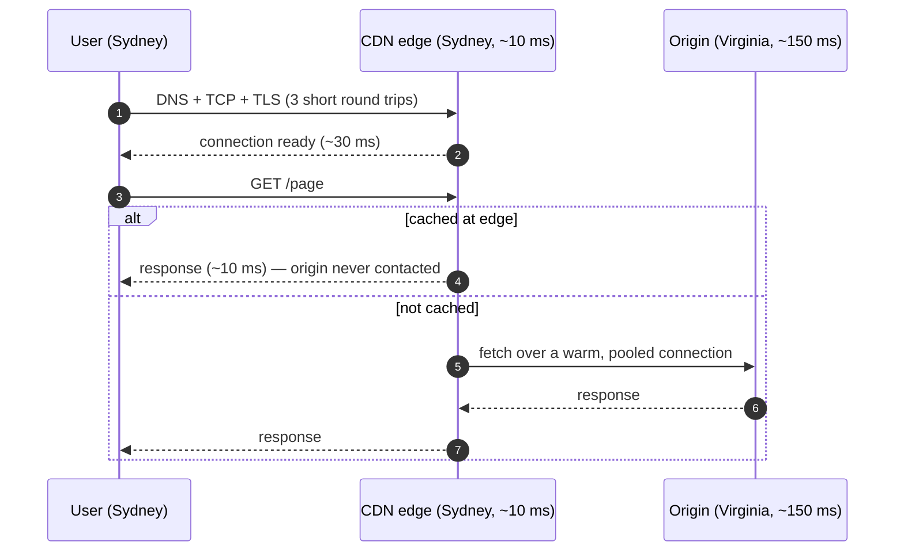

import H from '@site/src/components/Highlight';
import C from '@site/src/components/Color';
import Plain from '@site/src/components/Plain';
import Jargon from '@site/src/components/Jargon';
import Depth from '@site/src/components/Depth';
import Trace, { TraceStep } from '@site/src/components/Trace';

# Latency Numbers & The Cost of Distance

> **What you will be able to do after this page**
>
> - Recall the latency hierarchy well enough to sanity-check any design in your head.
> - Compute the physical floor on a network round trip between two cities.
> - Explain why a cache hit is ~100× faster than a disk read, and why that ratio drives so much architecture.
> - Spot the design where the latency budget cannot possibly be met, before building it.

Every architectural instinct worth having comes from internalising these numbers. Not to recite them — to *feel* them, so that "we'll just call that service in the loop" sets off an alarm.

<Plain>

Everything a computer does takes time, and the differences are far larger than most people imagine.

Here is the trick that makes it stick. Pretend the fastest operation — reading a value the processor already has close at hand — takes **one second**. Scale everything else by the same factor:

- Reading from the computer's memory: **under two minutes**
- Reading from a modern SSD: **about four hours**
- Asking another machine in the same building: **almost six days**
- Asking a machine on the other side of the world: **nearly five years**

Nothing is "slow" here — a real cross-ocean request takes about a seventh of a second. But the *ratios* are what matter. Adding one trip across the world to a design is like replacing a one-second task with a five-year one.

Once you feel that, a lot of design advice stops sounding arbitrary. "Don't call a service inside a loop" is not a style preference. It is the difference between a second and five years, repeated a hundred times.

</Plain>

---

## 1. The hierarchy

Approximate, modern-hardware numbers. Precision does not matter; **orders of magnitude do**.

| Operation | Time | In "human" scale (×1 billion) |
| :--- | ---: | :--- |
| L1 cache reference | 1 ns | 1 second |
| Branch mispredict | 3 ns | 3 seconds |
| L2 cache reference | 4 ns | 4 seconds |
| Mutex lock/unlock | 17 ns | 17 seconds |
| **Main memory reference** | **100 ns** | **1.7 minutes** |
| Compress 1 KB (Snappy) | 2 μs | 33 minutes |
| **Read 1 MB sequentially from RAM** | **~10 μs** | **2.8 hours** |
| SSD random read | ~16 μs | 4.4 hours |
| **Round trip within a datacenter** | **~500 μs** | **5.8 days** |
| **Read 1 MB sequentially from SSD** | **~200 μs** | **2.3 days** |
| **Disk seek (HDD)** | **~2 ms** | **23 days** |
| Read 1 MB sequentially from HDD | ~1 ms | 11 days |
| **Round trip California ↔ Netherlands** | **~150 ms** | **4.8 years** |

The right-hand column is the point. If an L1 hit were one second, a transatlantic round trip would be **five years**. That is the gap you are managing every time you decide whether something is a local computation, a datacenter call, or an internet call.

### The four numbers to actually memorise

If you keep nothing else:

```
   memory reference          100 ns      ~0.0001 ms
   SSD random read            16 μs      ~0.016 ms      160×  slower than RAM
   datacenter round trip     500 μs      ~0.5 ms         5,000× slower than RAM
   cross-continent RTT       150 ms                  1,500,000× slower than RAM
```

Everything else can be derived from these four with a shrug and a factor of two.

---

## 2. Why sequential beats random, everywhere

The same device gives wildly different throughput depending on access pattern:

| | Random | Sequential |
| :--- | :--- | :--- |
| **HDD** | ~100 IOPS (seek-bound, ~10 ms each) | ~150 MB/s |
| **SSD** | ~100K IOPS | ~500 MB/s (SATA), ~3 GB/s (NVMe) |
| **RAM** | fast, but cache-miss-bound | ~10 GB/s, prefetcher-friendly |

An HDD seek moves a physical arm. That is why a spinning disk manages ~100 random reads/second but streams hundreds of megabytes/second sequentially — a **1000×** difference on identical hardware.

This single fact explains an enormous amount of storage design:

- **B-trees** keep data sorted so that range scans are sequential.
- **LSM trees** turn random writes into sequential appends, then merge in the background — which is why write-heavy stores (Cassandra, RocksDB, LevelDB) use them.
- **Kafka** is fast because it only ever appends and only ever reads forward, so a "slow" disk delivers gigabytes per second.
- **Columnar formats** (Parquet) store each column contiguously so an analytical query scanning three of forty columns reads three contiguous runs instead of striding across every row.

> <H>Whenever a storage system seems surprisingly fast, the answer is usually "it made the access pattern sequential."</H>

---

## 3. The speed of light is in your latency budget

Light in vacuum: 300,000 km/s. In fibre, roughly **200,000 km/s** (~2/3, due to refractive index). Real routes are not great-circle straight, so a practical rule:

> **RTT floor ≈ (great-circle distance in km) ÷ 100 ms**
> — i.e. distance ÷ 200,000 km/s, doubled for the round trip, then padded for routing reality.

| Route | Distance | Theoretical RTT | Real-world RTT |
| :--- | ---: | ---: | ---: |
| Same datacenter | < 1 km | ~0 | 0.5 ms |
| Same city | ~50 km | 0.5 ms | 1–2 ms |
| New York ↔ Chicago | 1,150 km | 11 ms | ~20 ms |
| New York ↔ London | 5,600 km | 56 ms | ~70 ms |
| London ↔ Mumbai | 7,200 km | 72 ms | ~110 ms |
| California ↔ Netherlands | 9,000 km | 90 ms | ~150 ms |
| London ↔ Sydney | 17,000 km | 170 ms | ~250 ms |

<H>**This floor is not negotiable.**</H> No CDN, no protocol upgrade, no faster server removes it. If your p99 budget is 100 ms and the user is in Sydney while the database is in Virginia, the design is already impossible — the round trip alone eats 2.5× the budget. The only fixes are architectural: move data closer (edge, regional replicas), or stop making the user wait for that hop.

<Jargon
  plain="The time for a message to get to the other machine and the reply to come back."
  term="round-trip time, or RTT"
  also={['latency', 'a round trip', 'a network hop']}>

Design conversations are conducted in **round trips**, not milliseconds — *"that's two extra round trips"* is the unit of criticism. The reason is that the millisecond cost of one round trip depends on where the machines are, but <C color="orange">the *number* of round trips is a property of your design</C>, and it is the part you control.

</Jargon>

### What a "simple" page load actually costs

An uncached HTTPS request to a cross-continent origin. Step through it and watch the clock — the content itself is the *last* thing that happens.

<Trace title="Half a second before any content" subtitle="User in Sydney, server in Virginia. Nothing here is your application code.">

<TraceStep
  title="The user clicks a link"
  state={{ 'Elapsed': '0 ms', 'Round trips': '0', 'Bytes of content': '0', 'Where we are': 'browser' }}
  note="Everything that follows is protocol overhead. Your server has not been contacted yet.">

The browser has a URL and nothing else — not even the address of the machine to talk to.

</TraceStep>

<TraceStep
  title="DNS — turn the name into an address"
  cost="+50 ms"
  state={{ 'Elapsed': '50 ms', 'Round trips': '1', 'Bytes of content': '0', 'Where we are': 'resolver' }}
  changed={['Elapsed', 'Round trips', 'Where we are']}
  note="Usually cached, and free when it is. This is the cold case.">

Ask a resolver where `example.com` lives. It answers with an IP address. See [DNS](../02-networking/01-dns.md).

</TraceStep>

<TraceStep
  title="TCP handshake — agree to talk"
  cost="+150 ms"
  state={{ 'Elapsed': '200 ms', 'Round trips': '2', 'Bytes of content': '0', 'Where we are': 'origin, Virginia' }}
  changed={['Elapsed', 'Round trips', 'Where we are']}
  note="A full trip to Virginia and back, purely to establish that both sides are listening.">

SYN → SYN-ACK → ACK. One round trip across the Pacific, and still no request has been sent.

</TraceStep>

<TraceStep
  title="TLS handshake — agree how to encrypt"
  cost="+150 ms"
  state={{ 'Elapsed': '350 ms', 'Round trips': '3', 'Bytes of content': '0', 'Where we are': 'origin, Virginia' }}
  changed={['Elapsed', 'Round trips']}
  note="TLS 1.3 costs one round trip. TLS 1.2 cost two — this is the single biggest win of the version bump.">

Exchange keys and certificates so the connection is private. See [TLS](../02-networking/03-tls.md).

</TraceStep>

<TraceStep
  title="Finally — send the request"
  cost="+150 ms"
  state={{ 'Elapsed': '500 ms', 'Round trips': '4', 'Bytes of content': 'first byte', 'Where we are': 'origin, Virginia' }}
  changed={['Elapsed', 'Round trips', 'Bytes of content']}
  note="Half a second gone, and the server spent perhaps 5 ms of it doing actual work.">

`GET /` goes out; the first byte of the response comes back. **~500 ms elapsed.**

Optimising your application code here would be optimising 1% of the elapsed time.

</TraceStep>

<TraceStep
  title="Now put a CDN 10 ms away"
  cost="−450 ms"
  state={{ 'Elapsed': '~50 ms', 'Round trips': '4 (but short ones)', 'Bytes of content': 'first byte', 'Where we are': 'edge, Sydney' }}
  changed={['Elapsed', 'Round trips', 'Where we are']}
  note="The number of round trips did not change. Their length did.">

The same four round trips now happen against an edge server in Sydney, ~10 ms away, over a connection that is already warm.

<H>This is what a CDN actually does for content it cannot even cache: it moves the handshakes close to the user.</H>

</TraceStep>

</Trace>

As a sequence, with the CDN in place:



Which is exactly why the standard toolkit exists:

- **CDN / edge termination** — end TCP and TLS ~10 ms away instead of 150 ms away. Biggest single win available.
- **Connection reuse (keep-alive, HTTP/2 multiplexing)** — pay the handshakes once, not per request.
- **TLS 1.3** — one round trip instead of two; **0-RTT resumption** for repeat visitors.
- **QUIC / HTTP/3** — folds transport and crypto handshakes together, ~1 RTT to first byte, and no head-of-line blocking on packet loss.
- **DNS caching and prefetch** — remove the lookup from the critical path.

---

## 4. Using the numbers as a design check

The technique: write the latency budget as a sum before you build.

**"Timeline loads in under 200 ms at p99."**

```
  user → edge (same continent)            20 ms
  edge → origin region                    40 ms
  LB → app server                          1 ms
  app → cache (hit)                        1 ms
  app → DB (miss path)                     5 ms
  serialize + render                      10 ms
  ────────────────────────────────────────────
  ~77 ms happy path.  Budget: 200 ms.  Headroom for p99 spikes: yes.
```

Now the same design with one bad decision — assembling the timeline from 200 individual per-post lookups:

```
  200 sequential cache reads × 1 ms  =  200 ms   ← budget gone, alone
```

The fix is visible before a line of code: **batch** them (one `MGET`, ~2 ms), or **precompute** the timeline so the read is a single lookup. This is the "N+1 in a distributed system" failure, and latency arithmetic catches it at design time rather than in a load test.

### Rules of thumb that fall out of the table

| Rule | Because |
| :--- | :--- |
| <C color="crimson">Never make a network call inside a loop</C> | Each iteration costs 1,000× a memory access |
| Batch aggressively | 100 round trips → 1 turns 50 ms into 0.5 ms |
| Parallelise independent calls | 5 sequential 20 ms calls = 100 ms; in parallel = 20 ms |
| Cache anything crossing a region boundary | You are saving ~100 ms, not ~1 ms |
| Prefer one big sequential read to many small random ones | Up to 1000× on spinning disks, still ~10× on SSD |
| Put compute next to its data | Moving 1 GB across a WAN costs far more than the query |
| A hop you delete is worth more than a hop you optimise | 0 ms is the only reliable optimisation |

---

## 5. Latency is a distribution, not a number

The table gives typical values. Production gives a distribution with a long right tail, caused by GC pauses, queueing behind a slow request, TCP retransmits, noisy neighbours, cold caches, and lock contention.

```
  requests
     │█
     │█
     │██
     │████
     │███████▄▄▄___                      ← the tail is where users live
     └─────────────────────────────────► latency
      p50    p90   p99          p99.9
      10ms   25ms  120ms        900ms
```

Two consequences worth carrying around:

<C color="orange">**Fan-out amplifies tails.**</C> A request that touches 100 services waits for the slowest of 100. With a 1% chance each of hitting the tail, ~63% of requests hit at least one. Your p50 becomes your dependencies' p99.

<C color="orange">**Queueing goes non-linear near saturation.**</C> Latency does not rise smoothly with load; it rises gently, then explodes. From queueing theory, wait time scales roughly with `ρ / (1 − ρ)` where ρ is utilisation:

```
  50% utilised   →  wait ≈ 1× service time
  80% utilised   →  wait ≈ 4×
  90% utilised   →  wait ≈ 9×
  95% utilised   →  wait ≈ 19×
  99% utilised   →  wait ≈ 99×
```

<Depth title="Where ρ/(1−ρ) comes from, and why real systems are worse than it predicts">

Model a server as an **M/M/1 queue** — arrivals are random (Poisson), service times are random (exponential), one server. Let λ be the arrival rate, μ the service rate, and utilisation ρ = λ/μ.

The expected number of jobs in the system is `L = ρ/(1−ρ)`, and by Little's Law `L = λW`, so the expected time in system is:

```
  W = 1/(μ − λ)  =  (1/μ) · 1/(1−ρ)
```

That is *service time* × `1/(1−ρ)`. Subtract the service time itself and the **waiting** component is service time × `ρ/(1−ρ)` — the table above.

The important part is the shape, not the constant: there is a `1/(1−ρ)` term, so as ρ → 1 the wait goes to infinity. It is a **pole**, not a slope. This is why capacity graphs look flat and then vertical, and why "we still have 15% headroom" is a dangerous thing to believe.

**Real systems are worse than M/M/1 predicts**, for three reasons:

1. **Arrivals are burstier than Poisson.** Real traffic is correlated — retries, cron jobs, and cache expiries all cluster. Burstiness raises effective utilisation above the average you measured.
2. **Service times have long tails.** M/M/1 assumes exponential service times; real ones are heavy-tailed (one slow query, one GC pause). Variance in service time directly increases queueing delay — the Pollaczek–Khinchine formula makes this explicit: waiting time scales with the *second moment* of service time, not just the mean.
3. **Feedback loops.** A slow server triggers client timeouts, which trigger retries, which raise λ — pushing ρ up exactly when you need it to fall. This is the retry storm, and it is why a system near saturation does not degrade gracefully but collapses.

The practical consequence: <C color="orange">target 60–70% utilisation not because the maths says 70% is safe, but because the maths is optimistic and you need margin for the ways reality violates its assumptions</C>.

</Depth>
This is why <C color="crimson">"the servers are only at 85% CPU, we're fine"</C> is wrong, and why capacity planning targets ~60–70% utilisation. <H>The last 15% of headroom is not waste — it is the entire difference between a p99 of 50 ms and a p99 of 5 seconds.</H>

---

## Rapid-fire recall

1. Give the four numbers worth memorising, in order.
2. RAM vs SSD vs datacenter RTT vs cross-continent RTT — roughly what multiples separate each step?
3. Why is a random HDD read ~1000× worse than sequential, and name two storage designs built around that fact?
4. What is the RTT floor between London and Sydney, and can engineering remove it?
5. Why does an uncached cross-continent HTTPS request take ~500 ms before any content arrives, and what does a CDN actually eliminate?
6. A design does 200 sequential 1 ms cache reads inside a 200 ms budget. What is wrong and what are the two fixes?
7. Five independent 20 ms calls: sequential vs parallel latency?
8. Why does a request fanning out to 100 services see its p50 governed by its dependencies' p99?
9. At 90% utilisation, roughly how much does queueing multiply wait time? At 99%?
10. Why do capacity plans target 60–70% utilisation rather than 90%?

<details>
<summary>Answers</summary>

1. Memory reference **100 ns** · SSD random read **~16 μs** · datacenter RTT **~500 μs** · cross-continent RTT **~150 ms**.
2. RAM → SSD ≈ **160×**. RAM → datacenter RTT ≈ **5,000×**. Datacenter RTT → cross-continent ≈ **300×**. RAM → cross-continent ≈ **1.5 million×**.
3. A random read moves a physical arm (~10 ms seek), capping the drive near 100 IOPS, while sequential streaming avoids seeking entirely. **LSM trees** turn random writes into sequential appends; **Kafka** only appends and reads forward. (B-trees and columnar formats also qualify.)
4. About **250 ms** real-world (~170 ms theoretical). No — it is set by the speed of light in fibre. Only architecture helps: move the data closer, or take the hop off the user's critical path.
5. Four sequential round trips — DNS, TCP handshake, TLS handshake, request/response — each ~150 ms. A CDN terminates TCP and TLS at an edge ~10 ms away, so only the final fetch (if uncached) crosses the ocean.
6. Two hundred sequential round trips consume the entire budget by themselves. Fix by **batching** them into one multi-get (~2 ms), or by **precomputing** the timeline so the read is a single lookup.
7. Sequential **100 ms**; parallel **20 ms** (the slowest one).
8. Because the request must wait for the slowest of its 100 calls. With a 1% tail chance each, 1 − 0.99¹⁰⁰ ≈ **63%** of requests hit at least one tail event, so the tail becomes the typical case.
9. ~**9×** service time at 90%; ~**99×** at 99% (`ρ/(1−ρ)`).
10. Because latency explodes non-linearly near saturation. The headroom above 70% is what keeps p99 from collapsing during a traffic spike or a partial failure — it is insurance, not waste.

</details>

---

**Next:** [Back-of-the-Envelope Estimation](./05-back-of-the-envelope-estimation.md) — turning user counts into servers, storage and bandwidth in sixty seconds.
