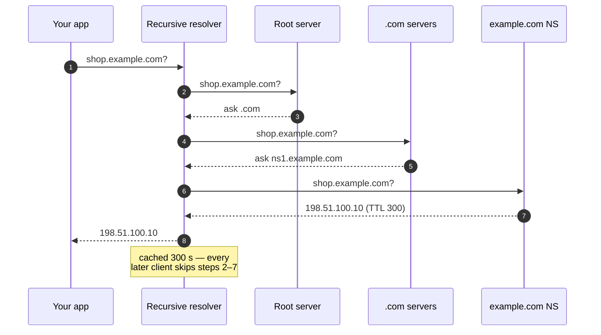

import H from '@site/src/components/Highlight';
import C from '@site/src/components/Color';
import Plain from '@site/src/components/Plain';
import Jargon from '@site/src/components/Jargon';
import Depth from '@site/src/components/Depth';
import Trace, { TraceStep } from '@site/src/components/Trace';

# DNS — How A Name Becomes An Address

> **What you will be able to do after this page**
>
> - Trace a cold DNS resolution through all four server types, in order.
> - Explain what TTL actually controls, and why it is a deploy-time constraint rather than a detail.
> - Say what each record type is for, and why `CNAME` at the apex is a problem.
> - Explain how DNS becomes a load balancer, and the three reasons it is a *bad* one.

DNS is the first thing that happens in every request, it runs before any of your code, and <C color="orange">it is the layer most outages are eventually traced back to</C>. It is worth more attention than it usually gets.

<Plain>

You know a shop by its name — "the bakery on the high street". Your delivery driver needs something else entirely: a street address and a postcode.

Computers have the same split. People remember `youtube.com`; machines can only talk to numbers like `142.250.185.14`. Something has to translate, every single time, before anything else can happen.

That translator is DNS, and the surprising part is that **no single machine knows all the answers.** There is no master list. Instead there is a chain of "I don't know, but I know who does" — a bit like asking a stranger for directions, being told "ask at the post office", and being told there "it's the third house past the church".

Two consequences fall out of that design, and they explain nearly everything on this page. First, the answers get **remembered for a while** so the chain does not run every time — which makes DNS fast, and makes changes slow to take effect. Second, because it runs before your code, when DNS breaks **everything looks broken at once**, even though every one of your servers is perfectly healthy.

</Plain>

---

## 1. The four kinds of server

A resolution involves four distinct roles. Confusing them is the usual source of confusion about DNS.

```
   your app
      │  "where is api.example.com?"
      ▼
  ┌─────────────────┐
  │ STUB RESOLVER   │  the OS. Checks its cache, then asks upstream.
  └────────┬────────┘
           ▼
  ┌─────────────────┐
  │ RECURSIVE       │  your ISP, or 8.8.8.8 / 1.1.1.1.
  │ RESOLVER        │  Does the actual work. Caches aggressively.
  └────────┬────────┘
           │  ┌──────────────────────────────────────────┐
           ├─►│ ROOT server  (13 logical, anycast)       │  "ask .com"
           │  └──────────────────────────────────────────┘
           │  ┌──────────────────────────────────────────┐
           ├─►│ TLD server   (.com)                      │  "ask ns1.example.com"
           │  └──────────────────────────────────────────┘
           │  ┌──────────────────────────────────────────┐
           └─►│ AUTHORITATIVE server (example.com)       │  "93.184.216.34"
              └──────────────────────────────────────────┘
```

Read the roles carefully:

- **Stub resolver** — in your OS. Tiny. Asks one question, caches the answer.
- **Recursive resolver** — does the legwork on your behalf. <C color="orange">This is where the cache that matters lives</C> — it serves millions of clients, so one query warms it for everyone behind it.
- **Root / TLD servers** — they do not know your IP. They only know *who to ask next*. Root knows the TLD servers; the TLD server knows your registered nameservers.
- **Authoritative server** — holds the actual records. The answer of record.

Only the first query is expensive. Everything after it is served from a cache somewhere in that chain.

<Trace title="One cold lookup for shop.example.com" subtitle="Nothing is cached anywhere. Watch what each server actually knows.">

<TraceStep
  title="Your app asks the operating system"
  state={{ 'What we know': 'a name only', 'Currently asking': 'OS stub resolver', 'Elapsed': '0 ms', 'Answer': '—' }}
  note="No network traffic yet — this is a local cache check.">

Your code calls `connect("shop.example.com")`. The OS checks its own small cache. Empty.

</TraceStep>

<TraceStep
  title="The OS asks a recursive resolver"
  state={{ 'What we know': 'a name only', 'Currently asking': 'recursive resolver (ISP / 1.1.1.1)', 'Elapsed': '10 ms', 'Answer': '—' }}
  changed={['Currently asking', 'Elapsed']}
  note="This is the machine that does the real work — and holds the cache that matters, because it serves millions of clients.">

Your machine hands the whole problem to a resolver and waits. It will do the walking.

</TraceStep>

<TraceStep
  title="Resolver asks a root server"
  cost="+30 ms"
  state={{ 'What we know': 'a name only', 'Currently asking': 'root server', 'Elapsed': '40 ms', 'Answer': '“ask the .com servers”' }}
  changed={['Currently asking', 'Elapsed', 'Answer']}
  note="The root has no idea where your site is. It only knows who runs each top-level domain.">

*"Where is shop.example.com?"* → **"I don't know. Ask whoever runs `.com`."**

</TraceStep>

<TraceStep
  title="Resolver asks the .com servers"
  cost="+30 ms"
  state={{ 'What we know': 'a name only', 'Currently asking': '.com TLD servers', 'Elapsed': '70 ms', 'Answer': '“ask ns1.example.com”' }}
  changed={['Currently asking', 'Elapsed', 'Answer']}
  note="Still no address. Each hop narrows the search by one label, right to left.">

*"Where is shop.example.com?"* → **"I don't know. But `example.com` is handled by these nameservers."**

</TraceStep>

<TraceStep
  title="Resolver asks the authoritative server"
  cost="+50 ms"
  state={{ 'What we know': 'IP address!', 'Currently asking': 'authoritative NS for example.com', 'Elapsed': '120 ms', 'Answer': '198.51.100.10, TTL 300' }}
  changed={['What we know', 'Currently asking', 'Elapsed', 'Answer']}
  note="The TTL is the important half of this answer — it says how long everyone may remember it.">

This server actually holds the records. → **"198.51.100.10, and you may cache that for 300 seconds."**

</TraceStep>

<TraceStep
  title="Everyone caches on the way back"
  state={{ 'What we know': 'IP address', 'Currently asking': 'nobody', 'Elapsed': '120 ms', 'Answer': 'cached at resolver + OS' }}
  changed={['Currently asking', 'Answer']}
  note="And the reason a TTL change takes effect slowly: you cannot un-tell the caches.">

The answer is stored at the resolver and in your OS. **The next lookup — from you or from anyone else on that resolver — costs ~0 ms** for the next 300 seconds.

<H>The whole cost of DNS is paid once and shared by everyone behind that resolver. That is why it is invisible until it breaks.</H>

</TraceStep>

</Trace>

The same walk as a sequence:



### The cold path, timed

```
  browser cache        0 ms        (checked first, tiny TTLs)
  OS stub cache        0 ms
  → recursive resolver ~10 ms      usually within your ISP
    → root             ~30 ms      almost always cached at the resolver
    → TLD (.com)       ~30 ms      almost always cached at the resolver
    → authoritative    ~50 ms
  ──────────────────────────────
  cold: ~100–150 ms.   warm: ~0 ms.
```

<H>The whole cost of DNS is paid on the first request and amortised to nothing afterwards — which is exactly why it is invisible until the day it is not.</H>

---

## 2. Record types worth knowing

| Record | Maps | Notes |
| :--- | :--- | :--- |
| **A** | name → IPv4 | The basic one |
| **AAAA** | name → IPv6 | Same thing, 128-bit |
| **CNAME** | name → another **name** | An alias. Resolution continues from the target |
| **NS** | zone → authoritative nameservers | Delegation. This is what the TLD returns |
| **MX** | domain → mail servers | With priorities |
| **TXT** | name → arbitrary text | SPF, DKIM, domain-ownership proofs |
| **SRV** | service → host + **port** | Service discovery; the rare record that carries a port |
| **PTR** | IP → name | Reverse lookup. Used by mail anti-spam, and for little else |
| **ALIAS / ANAME** | name → name, flattened | Vendor-specific. Solves the apex problem below |

### The apex CNAME problem

You want `example.com` (the **apex**, or "naked domain") to point at `myapp.cloudprovider.net`. The natural move is a `CNAME`. <C color="crimson">The spec forbids it.</C>

The reason is mechanical: a `CNAME` means *"this name is an alias — discard everything else and continue from the target"*. But the apex **must** carry `NS` and `SOA` records to exist as a zone at all. A `CNAME` cannot coexist with them.

<C color="green">The fix</C> is a provider-side `ALIAS`/`ANAME` record: the authoritative server resolves the target itself and returns the resulting `A` record, so the client sees a plain `A` and the spec stays intact. Cloudflare calls this CNAME flattening; Route 53 calls it an alias record. <C color="orange">It only works because your DNS provider is doing the extra resolution for you</C> — which is why it is a provider feature and not a record type.

---

## 3. TTL is a deploy constraint

Every record carries a **TTL** in seconds, telling resolvers how long they may cache it. It looks like a tuning knob. It is really a commitment about how fast you can move.

```
  You change an A record at T=0.

  ┌───────────────────────────────────────────────────────────┐
  │ TTL = 300s                                                │
  │  T=0    change published                                  │
  │  T=300  the last resolver that cached the old value       │
  │         expires it. Only now is the change fully live.    │
  └───────────────────────────────────────────────────────────┘

  TTL = 86400s  →  you have committed to a full day of stale answers.
```

<H>A record's TTL is the minimum time a failover takes. If your DNS TTL is 24 hours, your DNS-based disaster recovery plan takes 24 hours.</H>

<Jargon
  plain="How long everyone else is allowed to remember an answer before asking again."
  term="TTL — time to live"
  also={['cache lifetime', 'record expiry']}>

TTL appears all over system design — on DNS records, cache entries, session tokens, CDN objects. It always means the same thing: <C color="orange">how long a copy may be trusted before it must be re-fetched</C>. Short TTL = fresh but expensive. Long TTL = cheap but stale.

</Jargon>

| TTL | Use for | Cost |
| :--- | :--- | :--- |
| 30–60 s | Records you may need to fail over fast | More queries; more load on authoritative servers |
| 300 s (5 min) | The sane default for application endpoints | Balanced |
| 3600 s (1 h) | Stable infrastructure records | Slow to change |
| 86400 s (1 d) | `NS`, `MX` — things that essentially never move | Effectively immutable for a day |

**The migration pattern:** lower the TTL to 60 s *at least one old-TTL period before* the change, make the change, verify, then raise it again. Lowering the TTL at the moment you need to move is too late — resolvers already hold the old value under the old, long TTL.

### Resolvers that ignore you

Some resolvers clamp TTLs to their own minimum. Some browsers cache independently of the OS. Some client libraries — <C color="crimson">notably the JVM, which historically cached DNS forever by default</C> — hold a resolution for the process lifetime. So the real rule is:

> Plan for DNS changes to propagate *mostly* within the TTL, and for a long tail that ignores it entirely. <C color="crimson">Never treat DNS as a mechanism for a fast, complete cutover.</C>

---

## 4. DNS as a load balancer

You can return multiple `A` records and let clients pick, or return different answers to different clients. This is the cheapest possible global traffic distribution — and it has three real problems.

### Round-robin DNS

Return several IPs; resolvers hand them out in rotation.

```
  api.example.com.  60  IN  A  198.51.100.10
                    60  IN  A  198.51.100.11
                    60  IN  A  198.51.100.12
```

| | |
| :--- | :--- |
| <C color="green">Free, no infrastructure, works everywhere</C> | |
| <C color="crimson">No health awareness</C> | A dead server keeps receiving traffic until you edit the zone and the TTL expires |
| <C color="crimson">No load awareness</C> | Distribution is by resolver, not by request. A big ISP resolver sends all its users to one IP |
| <C color="crimson">Client caching defeats it</C> | The client pins one IP for the TTL, or forever |

### GeoDNS and latency-based routing

The authoritative server inspects the resolver's IP (or the [EDNS Client Subnet](https://datatracker.ietf.org/doc/html/rfc7871) extension) and returns the nearest region's address. This is how a global service points European users at a European cluster.

<C color="orange">It routes by *resolver* location, not user location</C> — which is accurate for an ISP resolver and wrong for someone using a public resolver in another country. ECS was introduced to fix exactly this, by passing along a truncated client subnet.

### Anycast — the one that actually works well

The same IP address is announced from many locations, and **BGP** routes each client to the topologically nearest one. There is no DNS trickery: one address, many machines, the network chooses.

<H>Anycast moves the routing decision from DNS (which caches, and cannot detect failure) into BGP (which reconverges in seconds and is health-aware).</H>

This is how the DNS root servers themselves work — 13 logical roots, well over a thousand physical instances — and how CDNs, public resolvers like `1.1.1.1`, and DDoS scrubbing services operate.

<Depth title="What BGP actually is, and how one IP address can exist in fifty places">

**BGP** — the Border Gateway Protocol — is how the internet decides where traffic goes at the largest scale. The internet is not one network; it is ~75,000 independent networks (**autonomous systems**: ISPs, cloud providers, universities, large companies), each with its own routing policy. BGP is the protocol they use to tell each other *"traffic for these IP ranges can reach its destination through me."*

Those announcements propagate outward, and every router builds a table of "for this destination prefix, my best next hop is that neighbour". "Best" is chosen mostly by policy and path length, **not** by latency — a fact that surprises people, and explains why traffic sometimes takes geographically absurd routes.

**Anycast** exploits one property of this design: nothing stops *several* networks from announcing the **same** IP prefix from different physical locations. When Cloudflare announces `1.1.1.1` from 300 cities, every router simply picks whichever announcement looks best from where it sits. A user in Delhi and a user in Toronto send packets to the identical address and reach different machines, with no DNS involvement and no application awareness.

Why this is so much better than DNS-based routing for the edge:

- <C color="green">**Failure handling is automatic.**</C> If a location goes down it withdraws its announcement, and routers reconverge within seconds. A DNS-based scheme must wait out the TTL, and clients that cache aggressively never move at all.
- <C color="green">**There is nothing to cache.**</C> The address is genuinely the same everywhere, so no stale answer can pin a user to a dead site.
- <C color="green">**DDoS traffic is divided, not concentrated.**</C> An attack on an anycast address is absorbed across every site announcing it, rather than converging on one datacenter. This is the entire basis of DDoS scrubbing services.

The catch: anycast is **stateless-friendly, connection-hostile in principle**. If routing changes mid-connection, packets can arrive at a different machine that knows nothing about your TCP session. In practice routes are stable enough that this is rare, and it is one reason UDP-based protocols (DNS, and now QUIC with its connection IDs) suit anycast especially well.

</Depth>

### Where DNS load balancing belongs

<C color="green">Use DNS to pick a **region**</C> — a coarse, slow-changing decision, tolerant of caching.
<C color="crimson">Do not use DNS to pick a **server**</C> — that decision needs health checks and per-request granularity, which is a [load balancer's](/systemDesign/concepts) job.

---

## 5. How DNS breaks

Worth knowing because these are the failure modes that appear in real postmortems.

**Expired domain registration.** The most embarrassing total outage available, and entirely preventable with auto-renew and a monitored expiry alert.

**The negative-cache trap.** A `NXDOMAIN` response is cached too, per the zone's `SOA` minimum TTL. Publish a record *after* something has queried for it and been told it does not exist, and you wait out the negative TTL — which is often longer than you expect.

**A single authoritative provider.** In October 2016, a DDoS against Dyn took down Twitter, Spotify, Reddit and GitHub — none of which had been attacked. <C color="orange">Their nameservers had.</C> The mitigation is `NS` records at two independent providers.

**DNS as a hidden SPOF for internal services.** Service discovery over DNS means every internal call depends on resolution working. Resolver failure then presents as *everything* failing at once, which is a confusing page to receive at 3 a.m.

**Resolver cache poisoning.** Injecting forged answers into a recursive resolver. Mitigated by source-port randomisation and, properly, by **DNSSEC**, which signs records so a resolver can verify authenticity. Adoption remains partial.

---

## 6. In a design discussion

Mentioning DNS at the right moment signals that you know where a request actually begins:

- **"First the client resolves the domain — I'd use latency-based routing to send them to the nearest region."** Establishes multi-region entry without hand-waving.
- **"I'd keep the TTL at 60 seconds on this record so regional failover is a minute, not an hour."** Connects a config value to a recovery objective.
- **"I wouldn't fail over between servers with DNS — clients cache. That's the load balancer's job; DNS picks the region."** Correct layering.
- **"Anycast for the edge, so routing is handled by BGP rather than by DNS caching."** How CDNs actually work.

---

## Rapid-fire recall

1. Name the four server roles in a resolution, and say which one holds the cache that matters.
2. What do the root and TLD servers actually return?
3. Roughly what does a cold resolution cost, and a warm one?
4. Why is a `CNAME` at the zone apex forbidden, and what is the fix?
5. What does a TTL really commit you to?
6. Describe the correct procedure for changing a record you may need to move quickly.
7. Give three reasons round-robin DNS is a poor load balancer.
8. How does anycast differ from GeoDNS, and why is it better at handling failure?
9. What is the negative-cache trap?
10. Why did a 2016 attack on one DNS provider take down Twitter, Spotify and GitHub simultaneously?

<details>
<summary>Answers</summary>

1. **Stub resolver** (OS) → **recursive resolver** → **root** → **TLD** → **authoritative**. The **recursive resolver** holds the cache that matters, because it serves millions of clients and one query warms it for all of them.
2. Not your address — a **referral**. The root says "ask the `.com` servers"; the TLD says "ask these registered nameservers". Only the authoritative server has the record.
3. Cold ≈ **100–150 ms**; warm ≈ **0 ms**. The cost is paid once and amortised away, which is why DNS is invisible until it breaks.
4. A `CNAME` means "discard everything else at this name and follow the alias", but the apex must carry `NS` and `SOA` records to exist as a zone. The fix is a provider-side **ALIAS/ANAME** (CNAME flattening): the authoritative server resolves the target and returns a plain `A`.
5. The **minimum time any change takes to fully propagate** — and therefore the floor on a DNS-based failover.
6. Lower the TTL to ~60 s **at least one old-TTL period before** the change, make and verify the change, then raise the TTL again. Lowering it at cutover time is too late.
7. **No health awareness** (dead servers keep getting traffic), **no load awareness** (distribution is per resolver, not per request), and **client-side caching** pins a client to one IP regardless.
8. GeoDNS returns *different answers* based on the resolver's location and is limited by caching and by resolver-vs-user location. Anycast announces *one address* from many places and lets **BGP** choose; routing reconverges in seconds and is health-aware, with no cache to wait out.
9. `NXDOMAIN` responses are cached too, governed by the zone's `SOA` minimum. If something queries a name before you publish it, you must wait out the negative TTL before the new record is visible.
10. The DDoS hit **Dyn**, their shared authoritative DNS provider. The sites themselves were healthy but unreachable because no one could resolve their names — which is why `NS` records should be split across two independent providers.

</details>

---

**Next:** [TCP & UDP](./02-tcp-and-udp.md) — the handshake you pay for on every new connection, and when to throw the guarantees away.
