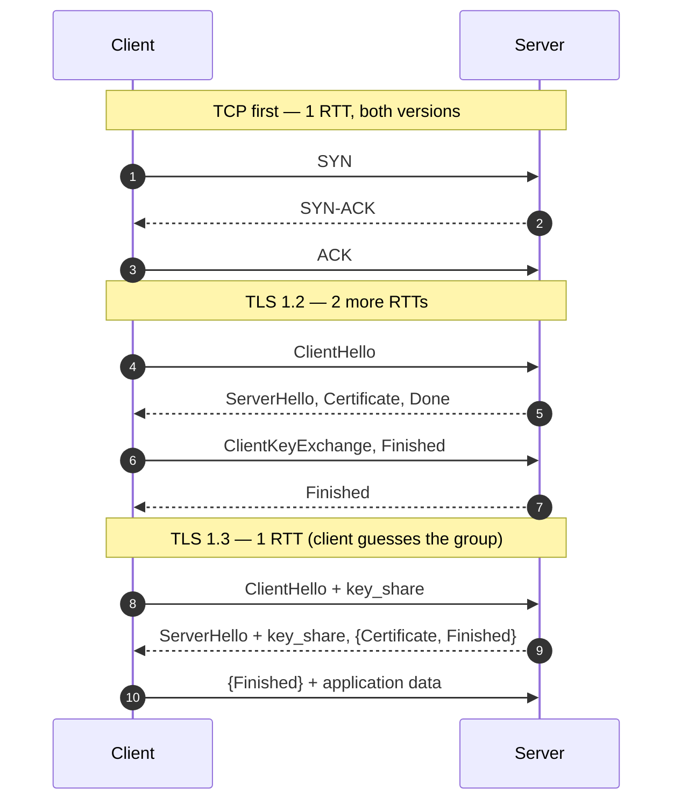

import H from '@site/src/components/Highlight';
import C from '@site/src/components/Color';
import Plain from '@site/src/components/Plain';
import Jargon from '@site/src/components/Jargon';
import Depth from '@site/src/components/Depth';
import Trace, { TraceStep } from '@site/src/components/Trace';

# TLS — Encryption In Transit

> **What you will be able to do after this page**
>
> - State the three things TLS guarantees, and the one it does not.
> - Trace the TLS 1.3 handshake and say what 1.3 removed from 1.2.
> - Explain 0-RTT resumption and the replay risk that comes with it.
> - Decide where to terminate TLS, and say what mTLS adds.

TLS is the layer everyone enables and few can describe. In a design discussion it shows up as a **latency cost**, a **termination point**, and an **identity mechanism** — three distinct roles.

<Plain>

Imagine posting a confidential letter. You want three things.

**Nobody reads it on the way.** So you seal it in an opaque envelope.

**Nobody swaps the pages.** So you add a tamper-evident seal — if it is broken, the recipient knows.

**You are really writing to who you think.** This one is harder. Anyone can put up a sign saying "Head Office". So you rely on a trusted third party — something like a passport office — that vouches for identities. You trust the passport office, the passport office vouches for them, therefore you trust them.

TLS is those three things for network traffic: an envelope, a seal, and a chain of vouching. The little padlock in a browser means all three checks passed.

The part worth internalising is that **the vouching happens before any data moves.** Both sides have to exchange greetings, present credentials, and agree on a secret. That conversation takes time — and on a connection to the other side of the world, that setup can cost more than everything else on the page combined.

</Plain>

---

## 1. What it guarantees

| Guarantee | Meaning | Provided by |
| :--- | :--- | :--- |
| **Confidentiality** | An observer cannot read the traffic | Symmetric encryption (AES-GCM, ChaCha20) |
| **Integrity** | An observer cannot modify it undetected | AEAD authentication tags |
| **Authentication** | You are talking to who you think | X.509 certificates + a chain to a trusted CA |

And the one it does not:

<C color="crimson">TLS does not hide *who* you are talking to, or *how much*.</C> An observer still sees the destination IP, the packet sizes, and the timing. The SNI field in the handshake historically leaked the hostname in plaintext too — Encrypted Client Hello (ECH) is the fix, still rolling out.

<H>Encryption in transit is not encryption at rest, and neither is access control. They solve three different problems and you need all three.</H>

---

## 2. The handshake

<Jargon
  plain="Ending the encrypted connection at one machine and continuing in plain text behind it."
  term="TLS termination"
  also={['SSL termination', 'TLS offload']}>

*"Where do we terminate TLS?"* is a real architecture question, not a detail. The answer decides whether your load balancer can read paths and headers (and therefore route intelligently and cache), and whether traffic inside your network is encrypted. See §5 below.

</Jargon>

### TLS 1.2 — two round trips

```
   CLIENT                                       SERVER
     │──── ClientHello (ciphers, random) ──────►│
     │◄─── ServerHello, Certificate, ──────────│
     │     ServerKeyExchange, Done              │        RTT 1
     │──── ClientKeyExchange, ─────────────────►│
     │     ChangeCipherSpec, Finished           │
     │◄─── ChangeCipherSpec, Finished ─────────│        RTT 2
     │═════ application data ══════════════════►│
```

Plus TCP's own handshake underneath, so: <C color="crimson">**3 RTTs before the first byte of your request**</C>. On a 150 ms link that is 450 ms of pure protocol overhead.

### TLS 1.3 — one round trip

1.3's central insight: the client can **guess** which key-exchange group the server will pick and send its key share immediately.

```
   CLIENT                                       SERVER
     │──── ClientHello + key_share ────────────►│
     │◄─── ServerHello + key_share, ───────────│
     │     {Certificate, Finished}              │        RTT 1  ← encrypted already
     │──── {Finished} + application data ──────►│
```

Side by side, including the TCP handshake underneath — which is where the real cost lives:



<C color="green">One RTT, and the certificate itself is encrypted.</C> If the client guesses the group wrong, the server sends a `HelloRetryRequest` and you are back to two — but the common groups are guessed correctly nearly always.

1.3 also **removed** a great deal, which is why it is both faster and safer:

- <C color="crimson">Static RSA key exchange</C> — gone. All key exchange is now (EC)DHE, so every session has **forward secrecy**: stealing the server's private key later does not decrypt recorded past traffic.
- <C color="crimson">CBC-mode ciphers, RC4, SHA-1, compression, renegotiation</C> — gone. Each had been the root of a named attack (BEAST, CRIME, POODLE, Lucky13).
- The cipher-suite list shrank from dozens to five, which <C color="orange">eliminates the whole category of misconfiguration where a server silently negotiates something weak</C>.

---

## 3. Resumption and 0-RTT

A returning client should not repeat the full handshake. TLS 1.3 issues a **session ticket** after the first connection; presenting it later skips the certificate exchange.

**0-RTT** goes further: the client sends application data *in its very first flight*, encrypted with a key derived from the previous session.

```
   CLIENT                                       SERVER
     │──── ClientHello + ticket + ─────────────►│
     │     {early application data}             │   ← request arrives in RTT 0
     │◄─── ServerHello, {response} ────────────│
```

<C color="green">Zero round trips of protocol overhead for repeat visitors.</C> And a real catch:

<H>0-RTT data is replayable. An attacker who captures the early-data flight can send it again, and the server cannot distinguish the copy from the original.</H>

The reason is structural — there is no server-provided nonce in the first flight yet, so nothing binds the request to a single occurrence. The rule that follows:

- <C color="green">Send only idempotent requests as 0-RTT data</C> — `GET`, cache-friendly reads.
- <C color="crimson">Never send a `POST` that moves money, or anything with a side effect, in 0-RTT.</C>

Concretely, here is the attack — and why the protocol cannot stop it for you:

<Trace title="Replaying 0-RTT early data" subtitle="An attacker who can capture packets does not need to break any encryption.">

<TraceStep
  title="A legitimate returning client"
  state={{ 'Requests server saw': '1', 'Attacker holds': 'nothing', 'Can decrypt?': 'no', 'Damage': 'none' }}
  note="0-RTT is genuinely valuable — it removes the last round trip for repeat visitors.">

The client has a session ticket from an earlier connection, so it sends its request **in the very first flight**, encrypted with a key derived from that session.

</TraceStep>

<TraceStep
  title="An attacker records the packets"
  state={{ 'Requests server saw': '1', 'Attacker holds': 'a copy of the flight', 'Can decrypt?': 'no', 'Damage': 'none yet' }}
  changed={['Attacker holds']}
  note="They cannot read it. They do not need to.">

Anyone on the path can capture the bytes. The encryption holds — the attacker learns nothing about the contents.

</TraceStep>

<TraceStep
  title="The attacker sends the identical bytes again"
  cost="the whole attack"
  state={{ 'Requests server saw': '2', 'Attacker holds': 'a copy of the flight', 'Can decrypt?': 'no', 'Damage': 'request executed twice' }}
  changed={['Requests server saw', 'Damage']}
  note="No nonce from the server exists yet in the first flight, so nothing binds the request to a single occurrence.">

They replay the captured flight to the server. It decrypts correctly — because it *is* a valid request — and the server has <C color="crimson">no way to distinguish the copy from the original</C>.

</TraceStep>

<TraceStep
  title="If it was a GET — harmless"
  state={{ 'Requests server saw': '2', 'Attacker holds': 'a copy', 'Can decrypt?': 'no', 'Damage': 'none' }}
  changed={['Damage']}
  note="This is exactly why clients and CDNs restrict early data to safe methods.">

Reading the same page twice changes nothing. <C color="green">The request was idempotent, so the replay is a non-event.</C>

</TraceStep>

<TraceStep
  title="If it was a POST that moves money — not harmless"
  cost="double charge"
  state={{ 'Requests server saw': '2', 'Attacker holds': 'a copy', 'Can decrypt?': 'no', 'Damage': 'charged twice' }}
  changed={['Damage']}
  note="The same failure as the payments example under HTTP idempotency — arriving here through the transport instead of a retry.">

The transfer executes twice. The attacker never decrypted anything, never forged anything, and never broke any cryptography.

<H>The protocol is telling you something general: "safe to run twice" is a property you must design into your endpoints, because the transport can and will deliver a request more than once.</H>

</TraceStep>

</Trace>

Most HTTP clients and CDNs enforce this by only allowing safe methods in early data. It connects directly to [idempotency](/systemDesign/concepts) as a design property: <C color="orange">the protocol is telling you that "safe to repeat" is a property you must design for, not assume</C>.

---

## 4. Certificates and trust

A certificate binds a **public key** to a **name**, signed by a Certificate Authority the client already trusts.

```
  Root CA  (in the OS/browser trust store, self-signed, offline)
      │ signs
  Intermediate CA  (online, does the day-to-day signing)
      │ signs
  Leaf certificate  (api.example.com — what your server presents)
```

The server must send the **leaf and the intermediates**. <C color="crimson">Forgetting the intermediate chain is the single most common TLS misconfiguration</C> — and it fails maddeningly: browsers often cache intermediates from other sites and succeed, while `curl` and mobile apps fail cleanly. "It works in my browser but the mobile app can't connect" is very often this.

<Depth title="What AEAD means, and why TLS 1.3 allows only five cipher suites">

**AEAD** stands for *Authenticated Encryption with Associated Data*, and it is the reason the cipher list shrank so dramatically.

Before AEAD, confidentiality and integrity were separate steps that had to be combined by hand, and there are three ways to combine them:

- **Encrypt-then-MAC** — encrypt, then authenticate the ciphertext. Provably sound.
- **MAC-then-encrypt** — authenticate the plaintext, then encrypt the result. What TLS 1.2's CBC suites did, and <C color="crimson">it is the source of a decade of attacks</C> (Lucky13, POODLE, BEAST), because the receiver must decrypt *before* it can check authenticity — so a malformed message reveals timing and error information about a decryption you should never have performed.
- **Encrypt-and-MAC** — do both over the plaintext independently. Also problematic.

An AEAD construction removes the choice entirely: encryption and authentication are a single primitive with one key and one call. You cannot assemble it wrongly, because you are not assembling it. The two in wide use:

- **AES-GCM** — AES in counter mode plus GHASH authentication. Extremely fast where hardware AES instructions exist (essentially all modern server and desktop CPUs).
- **ChaCha20-Poly1305** — a stream cipher plus a Poly1305 authenticator. Faster than AES-GCM *in software*, which is why mobile devices without AES hardware negotiate it preferentially.

The "associated data" part means some fields — record headers, sequence numbers — are **authenticated but not encrypted**, which is exactly what a protocol needs: routing information visible, contents hidden, both tamper-evident.

This is why TLS 1.3 has five cipher suites rather than dozens. Every non-AEAD construction was removed, along with static RSA key exchange, compression (CRIME) and renegotiation. <C color="green">The result is that a TLS 1.3 server essentially cannot be misconfigured into weak cryptography</C> — the weak options are not in the protocol to select. That is a design lesson well beyond TLS: **removing the ability to make a mistake beats documenting how to avoid it.**

</Depth>

**Operational realities worth designing for:**

- **Expiry is an outage.** Certificates are now capped at ~13 months and moving shorter. <C color="green">Automate renewal (ACME/Let's Encrypt) and alert on days-remaining</C>, because a manual annual renewal *will* eventually be missed.
- **Revocation barely works.** CRLs are large and stale; OCSP adds a network call to a third party on the connection path. **OCSP stapling** — the server fetches its own signed status and includes it in the handshake — is the practical answer. In reality, <C color="orange">short lifetimes have replaced revocation as the actual mitigation</C>.
- **Wildcards trade convenience for blast radius.** `*.example.com` covers everything and means one compromised key covers everything.

---

## 5. Where to terminate

The decision that actually appears in architecture diagrams.

```
  (a) EDGE TERMINATION
      client ══TLS══► CDN/LB ──plaintext──► app servers
      + one place to manage certs; cheap backends; TLS offloaded from app CPU
      − plaintext inside your network

  (b) RE-ENCRYPTION
      client ══TLS══► LB ══TLS══► app servers
      + encrypted end to end; LB can still inspect and route on L7
      − double the crypto work; certificates to manage on both hops

  (c) PASSTHROUGH
      client ═════════TLS═════════► app servers
      + LB never sees plaintext; strongest confidentiality
      − LB is limited to L4: no path routing, no header inspection, no caching
```

<H>Terminating TLS at the edge is the single biggest latency win available, because it turns three cross-continent round trips into three round trips to a nearby city.</H>

That is most of what a [CDN](/systemDesign/concepts) does for dynamic content it cannot cache: the handshakes happen ~10 ms away, and only the final fetch crosses the ocean over an already-warm connection.

**Which to pick:** <C color="green">(a) for most systems</C>, with the internal network treated as trusted-ish; **(b)** when compliance or a zero-trust posture requires encryption on every hop; **(c)** only when the load balancer genuinely must not see plaintext, accepting that you give up all L7 features.

---

## 6. mTLS — certificates in both directions

Normally only the server proves its identity. **Mutual TLS** has the client present a certificate too.

```
  standard TLS:   client verifies server
  mTLS:           client verifies server  AND  server verifies client
```

This makes TLS an **authentication** mechanism, not just an encryption one — and its properties are unusually good for service-to-service traffic:

| | |
| :--- | :--- |
| <C color="green">Identity is cryptographic</C> | Not a bearer token that leaks in a log or a URL |
| <C color="green">Nothing to steal in transit</C> | The private key never leaves the client |
| <C color="green">Works below the application</C> | No code change; the sidecar or LB enforces it |
| <C color="crimson">Certificate distribution is the hard part</C> | Every workload needs a key, rotated, at scale |

<C color="orange">That last row is the whole reason service meshes exist.</C> Issuing, rotating and revoking a short-lived certificate for every pod is not something you want in application code — so Istio, Linkerd and SPIFFE/SPIRE do it in a sidecar, and mTLS becomes a configuration flag rather than a project.

For public APIs, mTLS is usually too heavy (client certificate management on someone else's machines) and OAuth is the right layer instead. <C color="green">For internal service-to-service traffic, mTLS is close to the gold standard.</C>

---

## Rapid-fire recall

1. Name TLS's three guarantees and the one thing it does not hide.
2. How many round trips before the first request byte in TLS 1.2 over TCP? In 1.3?
3. What is the trick that let 1.3 save a round trip?
4. What is forward secrecy, and which 1.3 removal guarantees it?
5. What is 0-RTT, and what is the specific risk?
6. Which requests may safely be sent as 0-RTT data, and why does this connect to idempotency?
7. What is the most common TLS misconfiguration, and why does it fail inconsistently?
8. Why has revocation largely been replaced by short certificate lifetimes?
9. Compare the three termination strategies and say what passthrough costs you.
10. What does mTLS add over TLS, what is its hardest part, and what solves it?

<details>
<summary>Answers</summary>

1. **Confidentiality**, **integrity**, **authentication**. It does **not** hide *who* you are talking to or *how much* — destination IP, packet sizes and timing remain visible (and SNI leaked the hostname until ECH).
2. **1.2:** 1 RTT for TCP + 2 for TLS = **3 RTTs**. **1.3:** 1 + 1 = **2 RTTs** (and 1 with 0-RTT resumption).
3. The client **guesses the key-exchange group** and sends its key share in the ClientHello, so the shared secret is established in the first exchange. A wrong guess costs a `HelloRetryRequest`.
4. A stolen server private key cannot decrypt previously recorded sessions. Guaranteed by removing **static RSA key exchange** — all 1.3 key exchange is ephemeral (EC)DHE.
5. Sending application data in the client's **first flight**, using a key from a previous session, for zero protocol round trips. The risk is **replay** — nothing in that flight binds it to a single occurrence, so a captured copy can be resent.
6. Only **safe/idempotent** requests (`GET`). It shows that "safe to repeat" is a property you must design for explicitly — the transport can and does deliver a request twice.
7. **Omitting the intermediate certificates** from the chain. Browsers often cache intermediates from other sites and succeed, while `curl` and mobile clients fail — hence "works in my browser, breaks in the app".
8. CRLs are large and stale, and OCSP adds a third-party network call to the connection path. OCSP stapling helps, but in practice a certificate that expires in weeks limits exposure more reliably than revocation infrastructure does.
9. **Edge termination** — cheapest and fastest, plaintext internally. **Re-encryption** — encrypted on every hop, double crypto cost, L7 features retained. **Passthrough** — the LB never sees plaintext, but is restricted to **L4**: no path routing, no header inspection, no caching.
10. The **client also presents a certificate**, making identity cryptographic rather than a bearer token. The hard part is **certificate distribution and rotation** for every workload — which is what service meshes (Istio, Linkerd, SPIFFE/SPIRE) exist to automate.

</details>

---

**Next:** [HTTP, 1.1 → 2 → 3](./04-http-evolution.md) — what each version fixed, and what it did not.
