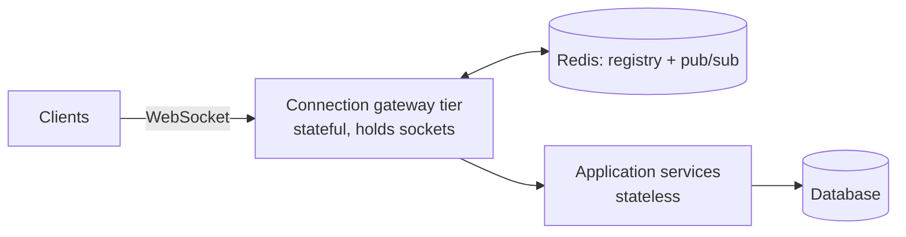

import H from '@site/src/components/Highlight';
import C from '@site/src/components/Color';
import Plain from '@site/src/components/Plain';
import Jargon from '@site/src/components/Jargon';
import Depth from '@site/src/components/Depth';
import Trace, { TraceStep } from '@site/src/components/Trace';

# Real-Time Communication

> **What you will be able to do after this page**
>
> - Choose between polling, long polling, SSE, WebSockets and webhooks from requirements.
> - Explain what a persistent connection costs the server, in memory and in architecture.
> - Say why WebSockets make your servers stateful, and what that forces you to build.
> - Design a webhook endpoint that survives duplicates, retries and a hostile sender.

HTTP is request/response: the client asks, the server answers. <C color="orange">Everything on this page is a workaround for the fact that the server cannot start the conversation.</C>

<Plain>

You are expecting a parcel. There are a few ways to find out when it arrives.

**Walk to the letterbox every five minutes.** Simple, and mostly wasted effort — the box is empty nearly every time. That is **polling**.

**Stand at the letterbox and wait.** You find out the instant it arrives, but you cannot do anything else while waiting. That is **long polling**.

**Ask the postman to ring the bell.** One arrangement, then you get on with your life and hear about deliveries as they happen. That is **Server-Sent Events** — the postman can ring you, but the arrangement is one-directional.

**Install an intercom.** Now either of you can speak at any time. Far more capable, and it is a permanent line that has to be maintained. That is a **WebSocket**.

**Give the depot your phone number.** They call you when something happens. Nothing is held open at all — but they need a number that reaches you. That is a **webhook**, and it is how one company's servers notify another's.

The trap is assuming the intercom is always the best. <C color="orange">A permanent open line is real ongoing cost</C> — and if only one side ever has news, asking the postman to ring is simpler, cheaper, and does the job.

</Plain>

---

## 1. The five options

```
  SHORT POLLING          client asks repeatedly
    C ──?──► S   "anything?"  "no"
    C ──?──► S   "anything?"  "no"        ← wasteful, simple, works everywhere
    C ──?──► S   "anything?"  "yes!"

  LONG POLLING           server holds the request open
    C ──?──► S ................. (held 30s) ..... "yes!"
    C ──?──► S ................. (held 30s) ..... "timeout, ask again"

  SSE                    one connection, server streams events
    C ──?──► S ═══► event ═══► event ═══► event ═══►     (one direction)

  WEBSOCKET              upgraded connection, both directions
    C ◄══► S   full duplex, any framing, until someone closes

  WEBHOOK                server→server, no connection held at all
    S1 ──POST──► S2   "this happened"      ← S2 must be publicly reachable
```

---

## 2. Short polling

The client asks on a timer.

<C color="green">Trivially simple, works through every proxy and firewall, no state on the server.</C> And the arithmetic is brutal:

```
  1M clients polling every 5 s  =  200,000 QPS
  If 1% of polls have new data, 198,000 QPS returns "nothing".
```

<C color="crimson">You pay full request cost — connection, TLS if not reused, auth, a database query — 99 times out of 100 to learn nothing happened.</C>

It also gives you the worst of both latency worlds: poll slowly and updates are stale; poll quickly and you multiply load.

<C color="green">Use it when</C> updates are genuinely infrequent and staleness of a minute is acceptable — a build status, a background job's progress, a dashboard refreshed every 30 seconds. It is under-rated for exactly these cases, because it costs nothing to operate.

---

## 3. Long polling

The client sends a request; **the server does not answer until it has something**, or until a timeout. On response, the client immediately re-requests.

<C color="green">Near-real-time delivery over ordinary HTTP</C>, no protocol upgrade, works through anything. It was how Facebook chat and Gmail worked for years.

The costs are structural:

- <C color="crimson">Every waiting client holds an open request</C>, so a thread-per-request server dies immediately. You need an async/event-driven server (Node, Netty, Go, async Python) to hold 100K idle requests cheaply.
- <C color="crimson">A gap after every message</C> — between the response and the next request, events must be buffered or they are lost.
- Proxies and load balancers time out idle connections, so you must respond before their timeout (typically 30–60 s) and reconnect.

<C color="orange">Long polling is best understood as a compatibility fallback</C>, not a first choice. Socket.IO and similar libraries still use it when WebSockets are blocked.

---

## 4. Server-Sent Events

One long-lived HTTP response that never ends; the server writes events into it as they occur.

```http
GET /events                     Content-Type: text/event-stream

data: {"type":"price","value":42}

id: 1043
data: {"type":"price","value":43}

: this is a heartbeat comment
```

<H>SSE is the option people forget, and it is the right answer more often than WebSockets are.</H>

| | |
| :--- | :--- |
| <C color="green">Plain HTTP</C> | Works with existing auth, cookies, compression, HTTP/2, proxies and CDNs |
| <C color="green">Automatic reconnection</C> | Built into the browser's `EventSource` — you get it for free |
| <C color="green">Resumable</C> | The `id:` field is replayed as `Last-Event-ID` on reconnect, so you can resume without gaps |
| <C color="green">Simple server side</C> | Just keep writing to a response stream |
| <C color="crimson">One direction only</C> | Client→server needs a normal request |
| <C color="crimson">Text only</C> | Binary must be base64-encoded |
| <C color="orange">6-connection limit on HTTP/1.1</C> | Per browser, per origin — a non-issue over HTTP/2 |

<C color="green">Use SSE when data flows one way</C>: live scores, notifications, price tickers, progress bars, log tails, streaming LLM tokens. If the client's messages are occasional, a plain `POST` alongside the stream is simpler than a WebSocket and keeps every HTTP benefit.

---

## 5. WebSockets

A real bidirectional connection, established by upgrading an HTTP request:

```http
GET /socket HTTP/1.1
Upgrade: websocket
Connection: Upgrade
Sec-WebSocket-Key: dGhlIHNhbXBsZSBub25jZQ==

HTTP/1.1 101 Switching Protocols          ← after this, it is no longer HTTP
```

After the `101`, the connection carries framed messages in both directions until someone closes it. <C color="green">Lowest possible latency, minimal per-message overhead (~2–14 bytes of framing), any payload format.</C>

<C color="green">Use when both sides send frequently:</C> chat, collaborative editing, multiplayer games, trading interfaces, live cursors.

<Jargon
  plain="Both sides can send whenever they like, at the same time, without taking turns."
  term="full-duplex"
  also={['bidirectional', 'a persistent connection']}>

Contrast with **half-duplex** (strict turn-taking, like HTTP request/response). The phrase to reach for in a design discussion is <C color="green">*"this needs a persistent full-duplex connection"*</C> — and immediately after it, *"which makes those servers stateful"*, because that is the consequence interviewers are listening for.

</Jargon>

### The cost: your servers become stateful

This is the part that matters in a design discussion, and it is where WebSockets stop being a protocol choice and become an architecture choice.

```
  STATELESS HTTP                      WEBSOCKETS
  any server can serve any request    a user is PINNED to one server

  ┌───┐  ┌───┐  ┌───┐                 ┌───┐  ┌───┐  ┌───┐
  │ A │  │ B │  │ C │                 │ A │  │ B │  │ C │
  └───┘  └───┘  └───┘                 └─┬─┘  └─┬─┘  └─┬─┘
    ▲      ▲      ▲                     │      │      │
    └──────┴──────┘                   alice  bob    carol
     LB routes freely                  held open, indefinitely
```

<H>A WebSocket connection is server state. Alice is on server A; if Bob on server B sends her a message, server B has no way to reach her — unless you build one.</H>

Follow one message from Alice to Bob and watch exactly where the design breaks:

<Trace title="Alice messages Bob — and it never arrives" subtitle="Two gateway servers, no message bus. The bug that appears the moment you add a second server.">

<TraceStep
  title="Both users connect"
  state={{ 'Alice on': 'server A', 'Bob on': 'server B', 'A knows about Bob': 'no', 'Message delivered': 'no' }}
  note="The load balancer spread them across servers, which is exactly what it is supposed to do.">

Alice's WebSocket lands on **server A**. Bob's lands on **server B**. Neither server knows the other's users exist.

</TraceStep>

<TraceStep
  title="Alice sends 'hello'"
  state={{ 'Alice on': 'server A', 'Bob on': 'server B', 'A knows about Bob': 'no', 'Message delivered': 'no' }}
  changed={['Message delivered']}>

Server A receives the message, saves it to the database, and needs to push it to Bob.

</TraceStep>

<TraceStep
  title="Server A looks for Bob's connection"
  cost="message lost"
  state={{ 'Alice on': 'server A', 'Bob on': 'server B', 'A knows about Bob': 'no', 'Message delivered': 'NEVER' }}
  changed={['Message delivered']}
  note="Bob will see the message only when he reloads and re-reads the database — which is not a chat app.">

Server A checks its own open sockets. **Bob is not among them.**

<C color="crimson">The message is saved but never delivered in real time. Nothing errored. Nothing was logged. It simply does not arrive.</C>

</TraceStep>

<TraceStep
  title="The fix — a message bus between servers"
  state={{ 'Alice on': 'server A', 'Bob on': 'server B', 'A knows about Bob': 'via Redis', 'Message delivered': 'yes' }}
  changed={['A knows about Bob', 'Message delivered']}
  note="Redis Pub/Sub, NATS or Kafka. Every gateway subscribes; any gateway can reach any user.">

Server A publishes to a channel for Bob. **Server B is subscribed**, receives it, and writes it down Bob's socket.

</TraceStep>

<TraceStep
  title="And a connection registry"
  state={{ 'Alice on': 'server A', 'Bob on': 'server B', 'Registry': 'bob → server B (TTL 30s)', 'Message delivered': 'yes' }}
  changed={['Registry']}
  note="With a TTL and heartbeats, so a crashed server's entries expire instead of black-holing messages.">

To answer *"is Bob even online, and where?"*, gateways record their connections in Redis.

<H>These two components are not optional extras. The moment you run a second server, a chat design without them is silently broken — and it is the single most commonly missed piece when candidates draw this system.</H>

</TraceStep>

</Trace>

What that forces into the design:

**A message bus between servers.** Redis Pub/Sub, NATS or Kafka, so any server can deliver to a connection held by any other. <C color="orange">This is not optional the moment you have two servers</C>, and it is the single most-missed component when candidates draw a chat system.

**A connection registry.** "Which server holds Alice?" — usually Redis, with a TTL and heartbeats, so a crashed server's entries expire.

**Deployment becomes disruptive.** Every deploy drops every connection. Thousands of clients reconnect simultaneously — a <C color="crimson">thundering herd against your auth and state-loading path</C>. Mitigate with staggered rollouts and **jittered** client reconnect backoff.

**Scaling is by connection count, not request rate.** A mostly-idle connection still costs a socket, a TLS session and a buffer — call it 10–50 KB. 1M connections is 10–50 GB of RAM before any traffic, plus kernel file-descriptor limits to raise. A single well-tuned box can hold ~100K–1M; this is why dedicated gateway tiers exist.

**Load balancers need sticky routing** and timeouts long enough not to sever idle connections.

<Depth title="The connection-count maths, and why C10K became C10M">

A stateless HTTP server is sized by **requests per second**. A WebSocket server is sized by **concurrent connections**, and the two have almost nothing to do with each other — a million idle connections generate no requests at all and can still exhaust a machine.

**What one idle connection costs:**

| Resource | Per connection | For 1M connections |
| :--- | ---: | ---: |
| Kernel socket buffers (tuned down) | ~4–10 KB | 4–10 GB |
| TLS session state | ~5–20 KB | 5–20 GB |
| Application object (user id, subscriptions, timers) | ~1–5 KB | 1–5 GB |
| File descriptor | 1 | 1M — needs `ulimit`/`fs.file-max` raised |

So **1M connections is ~10–35 GB of RAM before a single message flows**, and the default per-process file-descriptor limit of 1024 must be raised by three orders of magnitude.

**The C10K problem** (Dan Kegel, 1999) was the observation that handling even 10,000 concurrent connections was hard, because the prevailing model was one thread per connection. At ~1 MB of stack per thread, 10K connections meant 10 GB of stack and a scheduler thrashing between threads that were almost all idle.

The fix was **event-driven I/O**: one thread watching thousands of sockets via `epoll` (Linux) or `kqueue` (BSD), doing work only for sockets that are actually ready. `select()` and `poll()` could not scale because they are **O(n)** in the number of watched descriptors — the kernel walks the entire set on every call. `epoll` is **O(1)** for readiness notification: you register interest once, and the kernel hands back only the ready descriptors. That single change is why Nginx, Node.js, Netty and Go's runtime can hold connection counts that would have been absurd in 1999.

Today the framing is **C10M** — ten million connections on one machine — and the remaining bottlenecks have moved down the stack: per-packet kernel overhead, socket buffer memory, and lock contention in the network stack. Approaches include kernel-bypass networking (DPDK), `SO_REUSEPORT` to shard accept queues across cores, and aggressive buffer tuning.

**What this means for design:** <C color="orange">connection capacity and request capacity are separate budgets, and you must size both.</C> A gateway tier holding 500K connections may be nearly idle on CPU while being completely full on memory — which is exactly why the gateway tier is separated from the application tier, so each scales on the resource that actually constrains it.

</Depth>

### The gateway pattern

The standard resolution: separate the connection-holding tier from the business logic.



<C color="green">Gateways scale on connection count and rarely deploy; application services stay stateless and deploy constantly.</C> This is roughly how Slack, Discord and every large chat system are built.

---

## 6. Webhooks

Server-to-server, and the inverse of everything above: <C color="orange">instead of holding a connection, you give the sender your URL and they `POST` to it</C>.

```
  Stripe ──POST /webhooks/stripe──► your server      "payment succeeded"
```

<C color="green">No connection held, no polling, scales to any number of receivers.</C> Costs: the receiver must be publicly reachable, and delivery is now a distributed systems problem.

### Receiving webhooks correctly

Four requirements, all of which are commonly got wrong:

**Verify the signature.** Senders sign the body with a shared secret (`Stripe-Signature`, `X-Hub-Signature-256`). <C color="crimson">An unverified webhook endpoint is an unauthenticated public API that mutates your data.</C> Verify against the **raw body** before parsing — re-serialising the JSON changes the bytes and breaks the HMAC.

**Be idempotent.** <C color="crimson">At-least-once delivery means duplicates are guaranteed, not hypothetical.</C> Record the event ID and ignore repeats. Without this, a retried `payment.succeeded` ships the order twice.

**Respond fast, process later.** Senders time out in seconds and retry on timeout. <C color="green">Validate, enqueue, return `202` immediately</C>, then do the real work in a [worker](/systemDesign/concepts). Processing inline is the most common webhook bug: slow processing causes a timeout, which causes a retry, which causes duplicate work, which makes it slower.

**Do not trust ordering.** `payment.succeeded` can arrive before `payment.created`. Use timestamps or event versions and tolerate out-of-order arrival.

### Sending webhooks correctly

Retries with exponential backoff and jitter; a dead-letter queue after N failures; a signature on every request; a stable event ID; and a delivery-log UI so the receiver can debug and replay. Treat a customer's endpoint as slow and unreliable, because <C color="orange">it is a stranger's server and it will be down sometimes</C>.

---

## 7. Choosing

| Requirement | Choose |
| :--- | :--- |
| Updates every few minutes, simplicity wins | <C color="green">Short polling</C> |
| Server→client only, near real-time | <C color="green">SSE</C> |
| Both directions, high frequency | <C color="green">WebSockets</C> |
| Server→server notification | <C color="green">Webhooks</C> |
| Must traverse a hostile corporate proxy | <C color="green">Long polling</C> as fallback |
| Streaming an LLM response token by token | <C color="green">SSE</C> |
| Chat, collaborative editing, games | <C color="green">WebSockets</C> |
| Live dashboard, one-way metrics | <C color="green">SSE</C> |

<H>Default to SSE for one-way and WebSockets only when the client genuinely sends as often as the server does. Reaching for WebSockets by reflex buys stateful servers, a message bus and a disruptive deploy story you may not have needed.</H>

---

## Rapid-fire recall

1. What single limitation of HTTP does everything on this page work around?
2. Compute the load from 1M clients short-polling every 5 seconds, and say what fraction is wasted.
3. What kind of server does long polling require, and why?
4. Name three things SSE gives you for free that you would build yourself over WebSockets.
5. When is SSE the wrong choice?
6. What does a WebSocket connection do to your server's statelessness, and what two components does that force you to add?
7. Why is deploying a WebSocket service disruptive, and what mitigates it?
8. Roughly what does an idle connection cost, and what does 1M connections imply?
9. Describe the gateway pattern and what each tier optimises for.
10. Give the four rules for receiving webhooks correctly, and the bug caused by breaking the third.

<details>
<summary>Answers</summary>

1. **The server cannot initiate.** HTTP is request/response, so the client must ask or a connection must be held open.
2. 1,000,000 ÷ 5 = **200,000 QPS**. If 1% of polls have data, **~198,000 QPS** return nothing — full request cost (connection, auth, query) for no information.
3. An **async/event-driven** server (Node, Go, Netty, async Python). Every waiting client holds an open request, so a thread-per-request model exhausts its thread pool immediately.
4. **Automatic reconnection** (`EventSource`), **resumption without gaps** (`id:` replayed as `Last-Event-ID`), and **plain-HTTP compatibility** — existing auth, cookies, compression, proxies and HTTP/2 multiplexing.
5. When the **client also sends frequently** — chat, collaborative editing, games. SSE is one-directional and text-only.
6. It makes servers **stateful**: a user is pinned to the one server holding their socket. That forces a **message bus** (Redis Pub/Sub, NATS, Kafka) so any server can deliver to any connection, and a **connection registry** answering "which server holds Alice?".
7. Every deploy **drops every connection**, and all clients reconnect at once — a thundering herd against auth and state loading. Mitigate with **staggered rollouts** and **jittered client backoff**.
8. **~10–50 KB** per idle connection (socket, TLS session, buffers). 1M connections ≈ **10–50 GB of RAM** before any traffic, plus raised file-descriptor limits — hence dedicated gateway tiers.
9. A **stateful gateway tier** holds sockets and scales on connection count, deploying rarely; **stateless application services** hold the business logic and deploy constantly; **Redis** carries the registry and pub/sub between them.
10. **Verify the signature** against the raw body · **be idempotent** on event ID · **respond fast and process asynchronously** (`202`, then a worker) · **do not assume ordering**. Breaking the third causes a timeout → retry → **duplicate processing**, which makes the backlog worse.

</details>

---

**Next:** Traffic Management & The Edge — load balancers, reverse proxies, CDNs and rate limiting. *(Coming next.)*
