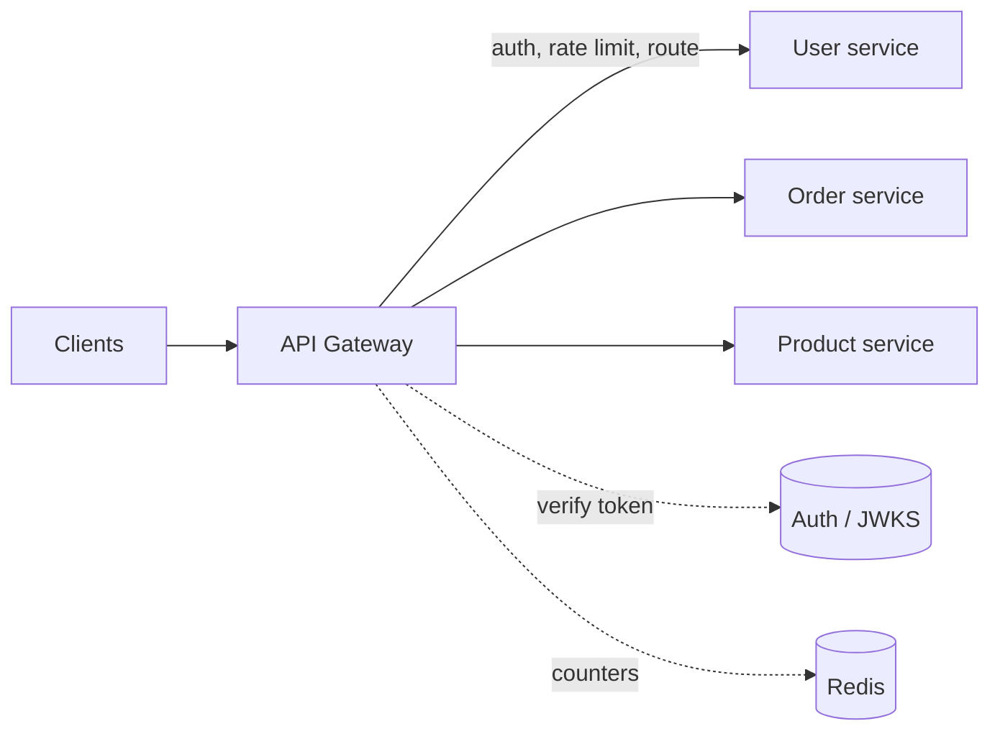

import H from '@site/src/components/Highlight';
import C from '@site/src/components/Color';
import Plain from '@site/src/components/Plain';
import Jargon from '@site/src/components/Jargon';
import Depth from '@site/src/components/Depth';
import Trace, { TraceStep } from '@site/src/components/Trace';

# Reverse Proxies & API Gateways

> **What you will be able to do after this page**
>
> - Tell a forward proxy from a reverse proxy in one sentence, and never mix them up again.
> - Say what belongs in a gateway and — more importantly — what does not.
> - Explain the BFF pattern and the problem it solves that a single gateway cannot.
> - Recognise when a gateway has quietly become a distributed monolith.

A reverse proxy and a load balancer are often the same piece of software wearing different hats. The interesting question is not *what is it* but <C color="orange">*how much responsibility should it take on*</C> — and that is where designs go wrong.

<Plain>

Two people sit at the front of an office building, and they are doing opposite jobs.

**The first works for the staff inside.** When employees want to send post out, it all goes through them. Outsiders never learn who sent what — they just see the company address. That is a **forward proxy**: it works on behalf of the people *inside*, hiding them from the outside world.

**The second works for the building.** Visitors arrive asking for people by name. They check appointments, hand out badges, direct people to the right floor, and turn away anyone without a reason to be there. Visitors never wander the building or learn where anyone sits. That is a **reverse proxy**: it works on behalf of the *servers*, hiding them from the outside world.

Same desk, same chair, opposite direction.

Now imagine the receptionist gradually taking on more: checking ID, logging every visit, capping how many visitors each person gets per hour, translating for foreign guests, and collecting documents from three departments so the visitor only makes one stop. That is an **API gateway** — a reverse proxy that has taken on jobs every backend would otherwise duplicate.

The catch is the obvious one: <C color="crimson">give the receptionist enough responsibilities and the entire building stops working when they take a day off.</C>

</Plain>

---

## 1. Forward vs reverse, settled

<Jargon
  plain="Whose side the middleman is on — the people making requests, or the servers answering them."
  term="forward proxy vs reverse proxy"
  also={['egress proxy vs ingress proxy']}>

The one-line test: <C color="green">a forward proxy hides **clients** from servers; a reverse proxy hides **servers** from clients.</C> The word "reverse" is about direction of concealment, nothing else.

</Jargon>

```
  FORWARD PROXY  (acts for the client)
    [ clients ] ──► [ proxy ] ──► the internet
    server sees the proxy, not the client
    used for: corporate egress filtering, caching, anonymity, bypassing geo-blocks

  REVERSE PROXY  (acts for the server)
    the internet ──► [ proxy ] ──► [ your servers ]
    client sees the proxy, not the servers
    used for: TLS termination, load balancing, caching, routing, hiding topology
```

Everything in the rest of this section is a reverse proxy.

---

## 2. What a reverse proxy earns you

Even the plainest reverse proxy — Nginx, Envoy, HAProxy, Caddy — does several jobs that are miserable to do in every backend separately:

| Job | Why it belongs here |
| :--- | :--- |
| **TLS termination** | One place to install and renew certificates, instead of on every service |
| **Load balancing** | See [the previous page](./01-load-balancers.md) |
| **Static file serving** | Nginx serving a file is far cheaper than your application doing it |
| **Compression** | gzip/brotli once at the edge rather than in every service |
| **Request buffering** | Absorb a slow client so your app worker is not held hostage by someone on 3G |
| **Routing** | `/api` to one pool, `/static` to another, by path or hostname |
| **Hiding topology** | Clients cannot see how many services exist or where they live |

That fifth row is underappreciated. <C color="orange">A slow client uploading over a poor connection can occupy an application worker for 30 seconds doing nothing.</C> An event-driven proxy holds thousands of such connections cheaply, and only hands a complete request to the backend — which is why putting Nginx in front of a thread-per-request application often multiplies its effective capacity with no code change.

---

## 3. The API gateway

A gateway is a reverse proxy that has taken on **cross-cutting concerns** — the things every service would otherwise implement, slightly differently, with slightly different bugs.



Follow one request through and watch how much never reaches a backend:

<Trace title="One request through a gateway" subtitle="GET /api/orders/123 — from an authenticated mobile client.">

<TraceStep
  title="Request arrives at the gateway"
  state={{ 'Stage': 'received', 'Backends contacted': '0', 'Identity': 'unknown', 'Verdict': 'pending' }}
  note="The gateway is the only publicly reachable address. No backend has a public IP.">

`GET /api/orders/123`, with an `Authorization: Bearer …` header. TLS is terminated here.

</TraceStep>

<TraceStep
  title="Authenticate — verify the token"
  state={{ 'Stage': 'authenticated', 'Backends contacted': '0', 'Identity': 'user 8842', 'Verdict': 'pending' }}
  changed={['Stage', 'Identity']}
  note="Signature verification uses a cached public key — no network call per request.">

The JWT signature is checked against a cached JWKS key set, and expiry is validated.

<C color="crimson">An invalid token is rejected here — `401`, zero backend load.</C> That is the point: rejection is cheapest at the edge.

</TraceStep>

<TraceStep
  title="Rate limit — check this user's budget"
  state={{ 'Stage': 'rate checked', 'Backends contacted': '0', 'Identity': 'user 8842', 'Verdict': 'within limit (43/100)' }}
  changed={['Stage', 'Verdict']}
  note="Limiting by user id is only possible because authentication happened first. Order matters.">

A counter in Redis says user 8842 has made 43 requests this minute against a limit of 100. Allowed.

</TraceStep>

<TraceStep
  title="Route — pick the backend"
  state={{ 'Stage': 'routed', 'Backends contacted': '0', 'Identity': 'user 8842', 'Verdict': '→ order-service' }}
  changed={['Stage', 'Verdict']}
  note="The client asked for a path. It has no idea a service called order-service exists.">

`/api/orders/*` maps to the order service pool. The gateway also strips the `/api` prefix and injects `X-User-Id: 8842` plus a trace header.

</TraceStep>

<TraceStep
  title="Forward, and handle the response"
  cost="1 backend call"
  state={{ 'Stage': 'complete', 'Backends contacted': '1', 'Identity': 'user 8842', 'Verdict': '200 OK' }}
  changed={['Stage', 'Backends contacted', 'Verdict']}
  note="The backend trusted X-User-Id because it is only reachable through the gateway — which is a security assumption worth stating explicitly.">

The order service returns the order. The gateway compresses it, adds CORS headers, records latency metrics, and responds.

<H>The backend never handled TLS, never parsed a token, never counted a rate limit, and never learned the client's IP. It did one job.</H>

</TraceStep>

</Trace>

### What belongs in a gateway

| <C color="green">Belongs</C> | <C color="crimson">Does not belong</C> |
| :--- | :--- |
| Authentication (verify the token) | Authorization beyond coarse checks — *"can user 8842 see order 123?"* needs domain data |
| Rate limiting and quotas | Business validation |
| Routing and path rewriting | Data transformation between domain shapes |
| TLS termination, CORS, compression | Orchestrating multi-step workflows |
| Request/response logging, tracing headers | Anything requiring a database the gateway owns |
| API key management, tenant identification | Retry logic that changes business meaning |

<H>The dividing line: a gateway may decide whether a request proceeds. It should not decide what the request means.</H>

The moment your gateway needs to know that an order belongs to a user, it needs the order domain — and you have started moving business logic into a component every single team must change together.

<Depth title="How a gateway turns into a distributed monolith">

This is the most common way a microservice architecture quietly regresses, and it happens gradually enough that nobody notices the moment it went wrong.

**The progression:**

1. The gateway starts as routing and auth. Uncontroversial, clearly correct.
2. A mobile team needs user *and* order data in one call for a slow network. Reasonable — the gateway aggregates the two.
3. Another team needs a slightly different combination. Added.
4. A field name differs between two services, so the gateway maps it. Added.
5. A workflow needs three calls in sequence with a conditional. Added.
6. Now the gateway holds business logic for eleven teams in one deployable.

**What you have built.** Every team's changes queue behind one deploy. The gateway's test suite requires knowledge of every domain. An outage in the gateway is a total outage. Nobody owns it — or, worse, a platform team owns it and becomes a bottleneck for every product change. <C color="crimson">You have the operational cost of microservices and the coupling of a monolith, which is the worst available combination.</C>

**The tells**, any one of which should prompt a rethink:

- The gateway has its own database.
- Changing one service requires a coordinated gateway release.
- The gateway's config or code needs domain knowledge to review.
- Teams are blocked waiting for gateway changes.
- The gateway has a queue of feature requests.

**The escapes:**

- **Push logic back down.** If two clients need combined data, the *service* can expose a composite endpoint it owns.
- **Split the gateway per client type** — the BFF pattern below. Each is owned by the team that consumes it, so the coupling disappears.
- **Use a mesh for infrastructure concerns.** mTLS, retries and timeouts belong in a [sidecar](./05-service-mesh.md), not in a shared gateway.
- **Keep the shared gateway strictly dumb**: authentication, rate limiting, routing, TLS. Nothing domain-shaped.

The general principle beyond gateways: <C color="orange">any shared component that accumulates domain logic becomes a coordination point, and coordination points become the limit on how fast an organisation can ship.</C> That is Conway's Law arriving as a deployment pipeline.

</Depth>

---

## 4. Backend for Frontend

One gateway for everyone forces a compromise: the mobile app wants small responses over a slow link, the web app wants rich ones, and a partner API needs a stable contract that never changes.

**BFF** gives each client type its own gateway, owned by the team that builds that client.

```
   iOS / Android ──► [ mobile BFF ]  ─┐
   Web app       ──► [ web BFF ]     ─┼──► user · order · product services
   Partners      ──► [ public API ]  ─┘
```

| | |
| :--- | :--- |
| <C color="green">Each BFF is shaped for its client</C> | Mobile gets trimmed payloads and aggregated calls; web gets full objects |
| <C color="green">Owned by the client team</C> | No cross-team coordination to change a response shape |
| <C color="green">Independent release cadence</C> | Shipping an iOS feature does not touch the web path |
| <C color="crimson">Duplicated logic across BFFs</C> | Auth, logging and tracing get implemented three times |
| <C color="crimson">More things to run</C> | Three deployables instead of one |

<C color="green">The usual resolution is both</C>: a thin shared edge proxy doing TLS, coarse rate limiting and routing, with per-client BFFs behind it holding aggregation and shaping. The shared layer stays dumb and stable; the client-specific layers change constantly and independently.

> GraphQL is frequently used *as* a BFF — it is one way of letting each client ask for the shape it wants. See [its real costs](../02-networking/05-rest-grpc-graphql.md) before adopting it for that reason alone.

---

## 5. Choosing

| Situation | Reach for |
| :--- | :--- |
| One service, needs TLS and static files | <C color="green">Plain reverse proxy (Nginx, Caddy)</C> |
| Several services, one client type | <C color="green">A thin gateway</C> — routing, auth, rate limiting |
| Several services, several very different clients | <C color="green">Shared edge + BFF per client</C> |
| Public API for third parties | <C color="green">Full gateway</C> — keys, quotas, versioning, developer portal |
| Service-to-service calls inside the cluster | <C color="crimson">Not a gateway</C> — that is a [mesh](./05-service-mesh.md) concern |

That last row is a common mistake: routing internal traffic through the public gateway adds a hop, a bottleneck, and a failure domain, for no benefit. <C color="orange">Gateways are for north–south traffic (in and out of the system). Meshes are for east–west traffic (between services).</C>

---

## 6. In a design discussion

- **"A thin gateway doing TLS, JWT verification and rate limiting — deliberately no business logic, so it doesn't become a coordination point for every team."** States the boundary *and* the reason.
- **"A mobile BFF, because the mobile team needs to change response shapes without coordinating with web."** Frames BFF as an organisational solution, which is what it is.
- **"Reject unauthenticated requests at the edge so bad traffic never reaches a backend."** The cheapest place to say no.
- **"Gateway for north–south, mesh for east–west."** Correct layering in five words.

---

## Rapid-fire recall

1. Give the one-line test distinguishing a forward from a reverse proxy.
2. Name four jobs a plain reverse proxy does, and explain why request buffering matters for a thread-per-request app.
3. What is a "cross-cutting concern", and give three that belong in a gateway.
4. Why must authentication run before rate limiting in the request pipeline?
5. State the dividing line for what belongs in a gateway.
6. Why is *"can user 8842 see order 123?"* the wrong check for a gateway to make?
7. List four tells that a gateway has become a distributed monolith.
8. What problem does BFF solve that a single shared gateway cannot?
9. Name BFF's two main costs, and the arrangement that mitigates them.
10. Explain north–south vs east–west, and which component serves each.

<details>
<summary>Answers</summary>

1. A **forward proxy hides clients from servers**; a **reverse proxy hides servers from clients**. "Reverse" refers only to the direction of concealment.
2. TLS termination, load balancing, static file serving, compression, request buffering, routing, hiding topology (any four). **Buffering** matters because a slow client can otherwise occupy an application worker for tens of seconds; an event-driven proxy absorbs that cheaply and hands over only complete requests.
3. Work every service would otherwise implement separately and inconsistently. Examples: **authentication**, **rate limiting**, **TLS termination**, CORS, compression, tracing headers, request logging.
4. Because useful rate limits are **per identity** (per user, per API key). Without knowing who the caller is, you can only limit by IP — which is both too coarse (shared NATs) and too easy to evade.
5. <H>A gateway may decide **whether** a request proceeds. It must not decide **what the request means**.</H>
6. Because it requires **domain data** — knowing that order 123 belongs to user 8842 means the gateway needs the order domain, which pulls business logic into a component every team must change together.
7. It has its own database · service changes require coordinated gateway releases · reviewing its config needs domain knowledge · teams are blocked waiting on it · it has a feature-request queue.
8. **Differing client needs.** Mobile wants trimmed, aggregated payloads; web wants rich ones; partners need a frozen contract. One gateway forces a compromise, and every change requires cross-team coordination.
9. **Duplicated cross-cutting logic** and **more deployables to operate**. Mitigated by a **thin shared edge** (TLS, coarse rate limiting, routing) with BFFs behind it holding only aggregation and shaping.
10. **North–south** is traffic entering and leaving the system — that is the gateway's job. **East–west** is service-to-service traffic inside it — that is a service mesh's job. Routing internal calls through the public gateway adds a hop, a bottleneck and a failure domain for no benefit.

</details>

---

**Next:** [CDNs](./03-cdn.md) — moving bytes closer to users, and the invalidation problem that comes with it.
