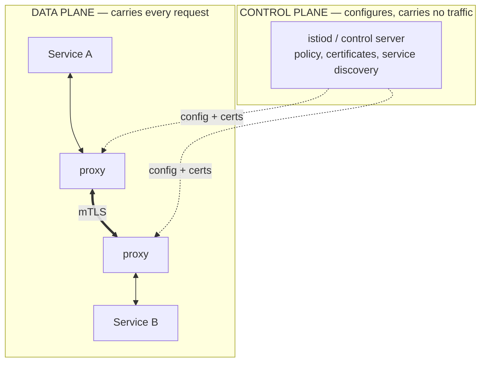

import H from '@site/src/components/Highlight';
import C from '@site/src/components/Color';
import Plain from '@site/src/components/Plain';
import Jargon from '@site/src/components/Jargon';
import Depth from '@site/src/components/Depth';
import Trace, { TraceStep } from '@site/src/components/Trace';

# Service Mesh

> **What you will be able to do after this page**
>
> - Explain the sidecar pattern and what problem it actually solves.
> - Separate the data plane from the control plane, and say which one carries your traffic.
> - List what a mesh gives you for free, and price what it costs.
> - Say confidently when a mesh is the wrong answer — which is most of the time.

A service mesh is the most over-adopted component in this section. It solves a real problem extremely well, and <C color="crimson">most teams that install one do not yet have that problem</C>.

<Plain>

A company grows to forty buildings. Every building needs the same things: check ID at the door, keep a visitor log, retry the intercom if nobody answers, and refuse entry when a floor is at capacity.

You could train every receptionist in all of that. It works — until you want to change the ID policy, and now you retrain forty people, at forty different speeds, and six of them get it subtly wrong. Some buildings use an old handbook nobody updated.

The alternative is to <C color="green">stop asking the buildings to do it</C>. Put a small, identical security booth outside each door. Every person entering or leaving passes through the booth. The booths are all the same, they are all updated centrally, and the people inside the buildings go back to doing their actual jobs.

That is a **service mesh**. The booth is a **sidecar proxy** — a small program running next to each service, intercepting all its network traffic. The service stops implementing retries, encryption, and traffic rules; the booth does it.

The trade is stated plainly enough in the picture: <C color="crimson">you now run forty booths</C>. They use power, they add a few seconds to every entry, and when the central booth-management system misbehaves, it misbehaves everywhere at once. For four buildings this is obviously not worth it. Somewhere between four and forty, it becomes obviously worth it.

</Plain>

---

## 1. The problem it solves

In a system of many services, every service must handle the same set of network concerns:

```
  retries with backoff      timeouts           circuit breaking
  mTLS                      load balancing     connection pooling
  distributed tracing       metrics            traffic shifting for canaries
```

Without a mesh, each of those lives in a **library** in each service. That works — until you have services in four languages.

| Problem | Consequence |
| :--- | :--- |
| A library per language | The Go, Java, Python and Node versions drift in behaviour |
| Upgrades require redeploys | Changing the retry policy means every team ships a release |
| Inconsistent defaults | One service retries 5×, another 0×, and nobody knows which |
| Observability gaps | A service that forgot to add tracing is a hole in every trace |
| Security is opt-in | One service skipping mTLS undermines the whole boundary |

<H>A mesh moves these concerns from your code into the network layer, where they can be configured uniformly and changed without touching or redeploying a single service.</H>

<Jargon
  plain="A small helper process running alongside each service, handling all its network traffic."
  term="the sidecar pattern"
  also={['sidecar proxy', 'the data plane proxy']}>

Named for a motorcycle sidecar — it travels with the main vehicle but is not part of it. In Kubernetes it is a **second container in the same pod**, sharing the network namespace, which is what lets it intercept traffic without the application knowing.

</Jargon>

---

## 2. Data plane and control plane

The split that structures every mesh, and the distinction interviewers listen for.



| | Data plane | Control plane |
| :--- | :--- | :--- |
| What it is | The sidecar proxies (usually Envoy) | The management server (istiod, Linkerd controller) |
| What it does | Intercepts and forwards every request | Distributes config, issues certificates, tracks endpoints |
| On the request path? | <C color="crimson">Yes — every single request</C> | <C color="green">No</C> |
| If it fails | Traffic stops | <C color="green">Traffic continues with the last known config</C> |

<C color="green">That last row is the most important property of the design.</C> The control plane failing does **not** stop traffic — proxies keep running with their cached configuration. You lose the ability to *change* things, and certificate rotation eventually breaks, but the system keeps serving. A mesh whose control plane was on the request path would be an unacceptable single point of failure.

---

## 3. One request through a mesh

Watch how much happens that the application never knows about:

<Trace title="Service A calls Service B" subtitle="A's code does a plain HTTP GET to http://service-b/orders. Nothing else.">

<TraceStep
  title="Service A makes an ordinary HTTP call"
  state={{ 'Where': 'Service A', 'Encrypted': 'no', 'Retries used': '0', 'App code involved': 'yes' }}
  note="No TLS library, no retry library, no service registry client. The application is deliberately naive.">

`GET http://service-b/orders` — plain HTTP, to what looks like a local hostname.

</TraceStep>

<TraceStep
  title="Iptables silently redirects to the local sidecar"
  state={{ 'Where': "A's sidecar", 'Encrypted': 'no (localhost)', 'Retries used': '0', 'App code involved': 'no' }}
  changed={['Where', 'App code involved']}
  note="This is the whole trick: traffic is intercepted at the network layer, so the application needs no mesh awareness at all.">

Traffic never leaves the pod unintercepted. Rules installed at pod startup redirect outbound traffic to the sidecar on localhost.

</TraceStep>

<TraceStep
  title="The sidecar resolves and chooses an instance"
  state={{ 'Where': "A's sidecar", 'Encrypted': 'no yet', 'Retries used': '0', 'Instance chosen': 'B-3 of 6' }}
  changed={['Instance chosen']}
  note="Load balancing happens here, per request — client-side, with no separate load balancer hop.">

The control plane has already told this proxy which healthy instances of `service-b` exist. It picks one using its configured policy.

</TraceStep>

<TraceStep
  title="mTLS — both sides prove identity"
  state={{ 'Where': 'network', 'Encrypted': 'yes (mTLS)', 'Retries used': '0', 'Instance chosen': 'B-3' }}
  changed={['Where', 'Encrypted']}
  note="Certificates were issued and rotated by the control plane. No team wrote code for this or managed a key.">

A's proxy presents A's certificate; B's proxy presents B's. Both verify. <C color="green">The traffic is now encrypted and mutually authenticated — with no application involvement.</C>

</TraceStep>

<TraceStep
  title="B-3 fails with a 503"
  cost="retry triggered"
  state={{ 'Where': "A's sidecar", 'Encrypted': 'yes', 'Retries used': '1', 'Instance chosen': 'B-5 (new)' }}
  changed={['Retries used', 'Instance chosen']}
  note="Retry policy is configuration, not code. Changing it from 2 attempts to 3 is a config push, not forty deploys.">

A's proxy sees the failure, and per its retry policy tries a **different** instance. Service A's code is still waiting on its single `GET` and knows nothing.

</TraceStep>

<TraceStep
  title="B-5 succeeds, telemetry recorded"
  state={{ 'Where': 'Service A', 'Encrypted': 'yes', 'Retries used': '1', 'App code involved': 'yes (receives 200)' }}
  changed={['Where', 'App code involved']}
  note="Every mesh hop emits identical metrics and trace spans — so the observability has no gaps from teams that forgot to instrument.">

The response returns through both proxies. Latency, status, retry count and trace spans are emitted automatically.

<H>The application made one plain HTTP call. It got mTLS, client-side load balancing, a retry against a different instance, and full telemetry — without a line of code or a library dependency.</H>

</TraceStep>

</Trace>

---

## 4. What it costs

Genuinely useful, and genuinely not free. The costs are usually under-stated by people advocating adoption.

| Cost | Magnitude |
| :--- | :--- |
| **Latency** | ~0.5–2 ms added per hop (two proxies per call). A 5-hop request pays it 5 times |
| **Memory** | ~50–100 MB per sidecar. 500 pods ≈ 25–50 GB of pure overhead |
| **CPU** | A few percent per pod, more under high throughput or heavy mTLS |
| **Operational complexity** | A distributed system to debug, on top of the one you were debugging |
| **Debugging difficulty** | <C color="crimson">"Is it my service, the sidecar, or the mesh config?"</C> becomes a routine question |
| **Upgrade risk** | Mesh upgrades touch the request path of every service simultaneously |

That fifth row is the real one. <C color="crimson">A mesh adds a layer that can fail in ways your team has never seen and cannot easily reason about</C> — a subtly wrong retry policy causing amplification, an mTLS certificate rotation failing for one namespace, a proxy running out of memory. These are hard problems, and they arrive on top of your existing hard problems.

<Depth title="Why retries in a mesh can take down the system you were protecting">

This deserves particular attention because it is a mesh-specific failure that is **worse** than not having a mesh at all, and it catches good teams.

**The mechanism.** Retries are configured per hop. Consider a request chain A → B → C → D, with a modest "retry up to 3 times" policy at each hop.

D becomes slow. Now count the requests actually generated:

```
  C retries D            → 3 attempts
  B retries C, each of which retries D   → 3 × 3  =  9 attempts at D
  A retries B, each of which…            → 3 × 3 × 3 = 27 attempts at D
```

<C color="crimson">One user request becomes 27 requests to the struggling service.</C> Retries **multiply** along the chain rather than adding. D was slow; now D is receiving 27× its normal load, so it gets slower, so more requests time out, so more retries fire. The system cannot recover, because recovery requires the capacity that the retries are consuming.

This is a **retry storm**, and it appears in a large fraction of public postmortems. What makes the mesh version dangerous is that <C color="orange">retries are now on by default, uniformly, across services whose owners never thought about them</C> — the very uniformity that makes a mesh valuable is what makes this failure global rather than local.

**The defences, and you want several:**

**Retry budgets.** Rather than "3 attempts per request", cap retries as a *percentage of total traffic* — for example, retries may not exceed 10% of requests to a service. Under normal conditions retries are rare and all are permitted; under widespread failure the budget is exhausted and retries stop automatically. This is the single most effective fix, and it is why Envoy and Linkerd both implement budgets rather than plain counts.

**Retry at one layer only.** Pick the layer closest to the user, or the one that can most meaningfully decide, and <C color="green">disable retries everywhere else</C>. Multiplication requires at least two retrying layers.

**Circuit breakers.** After a failure threshold, stop sending to the failing instance entirely for a cooldown period. This converts "retry harder" into "stop hitting it", which is what a struggling service actually needs.

**Deadlines that propagate.** Pass a deadline with the request — *"this whole operation must complete within 2 seconds"* — and have every hop honour the remaining time. A retry that cannot finish before the deadline is not attempted, since its result will be discarded anyway. This bounds total work regardless of chain depth, and it is the most robust of the four.

**Retry only idempotent requests.** A mesh cannot know your semantics, so by default it retries anything. <C color="crimson">Retrying a non-idempotent `POST` on timeout can duplicate a payment</C> — exactly the failure from the [HTTP idempotency trace](../02-networking/04-http-evolution.md), now happening automatically at the infrastructure layer without any team having chosen it.

The general lesson: <C color="orange">a mechanism that makes a good policy universal also makes a bad policy universal.</C> Uniformity amplifies whatever you configure, in both directions.

</Depth>

---

## 5. When not to use one

The honest guidance, since defaults in this area tend toward over-adoption:

| Situation | Verdict |
| :--- | :--- |
| Fewer than ~10 services | <C color="crimson">No.</C> A shared library or plain gateway is far cheaper |
| One or two languages | <C color="crimson">Probably not.</C> A good library gives most of the benefit with none of the runtime cost |
| No Kubernetes | <C color="crimson">Harder to justify</C> — the sidecar model assumes an orchestrator that injects it |
| No dedicated platform capacity | <C color="crimson">No.</C> Somebody must own upgrades and debugging, permanently |
| "We might need it later" | <C color="crimson">No.</C> It can be adopted later; complexity taken early is paid daily |
| Many services, several languages, mTLS mandated | <C color="green">Yes.</C> This is the case it was built for |
| Strict compliance requiring encryption everywhere | <C color="green">Yes</C> — automatic certificate rotation is hard to beat |
| Progressive delivery across many services | <C color="green">Yes</C> — percentage traffic shifting is genuinely excellent |

<H>The question is not "do we want mTLS, retries and tracing?" — everyone does. It is "do we have enough services in enough languages that a library cannot deliver them?" Below that threshold, a library is strictly better.</H>

**Lighter options, in increasing order of cost:**

1. **A shared client library.** Retries, timeouts, tracing, metrics. Cheapest by far if you have one or two languages.
2. **A gateway for north–south only.** Covers ingress concerns without touching service-to-service traffic.
3. **Sidecar-less / ambient mesh.** Newer designs (Istio ambient, Cilium via eBPF) move the data plane into a per-node component or the kernel, cutting the per-pod memory and latency cost substantially — the main objection to the classic model.
4. **A full sidecar mesh.** Maximum capability, maximum cost.

---

## 6. In a design discussion

- **"We have 40 services in four languages and mTLS is mandated — that's the case for a mesh. At six services I'd use a shared library instead."** Names the threshold rather than the technology.
- **"Data plane is Envoy sidecars on the request path; control plane distributes config and certs and is *not* on the request path, so if it's down traffic keeps flowing with cached config."** The distinction that shows real understanding.
- **"Retry budgets rather than fixed retry counts, or retries multiply along the call chain — 3 per hop over 3 hops is 27 requests to the service that's already struggling."** The failure mode that matters most.
- **"Deadline propagation, so total work is bounded regardless of how deep the chain goes."** A senior answer.

---

## Rapid-fire recall

1. What problem does a mesh solve that a shared library cannot?
2. What is a sidecar, and how does it intercept traffic without application changes?
3. Distinguish the data plane from the control plane, and say what happens when each fails.
4. Name four things a mesh provides without any application code.
5. Where does client-side load balancing happen in a mesh, and what hop does it remove?
6. Give the latency and memory cost of a sidecar, and compute the memory overhead for 500 pods.
7. Show why 3 retries per hop over a 3-hop chain produces 27 requests.
8. What is a retry budget, and why is it better than a retry count?
9. Why is deadline propagation the most robust defence against retry amplification?
10. Give three situations where a mesh is the wrong answer, and what to use instead.

<details>
<summary>Answers</summary>

1. **Uniform behaviour across many languages, changeable without redeploying services.** A library must be reimplemented per language (where it drifts) and requires every team to ship a release to change a policy.
2. A small proxy process running alongside the service — in Kubernetes, a second container in the same pod sharing its network namespace. **Iptables rules** installed at pod startup redirect all inbound and outbound traffic through it, so the application needs no mesh awareness.
3. **Data plane** = the sidecar proxies, on the request path for every call. **Control plane** = the management server distributing config and certificates, *not* on the request path. Data plane failure stops traffic; **control plane failure does not** — proxies continue with cached config, losing only the ability to change things (and eventually certificate rotation).
4. mTLS with automatic certificate rotation · retries and timeouts · circuit breaking · client-side load balancing · distributed tracing and uniform metrics · traffic shifting for canaries (any four).
5. In the **calling service's own sidecar**, per request, using endpoint data from the control plane. It removes the separate **load balancer hop** between services.
6. ~**0.5–2 ms** per hop (two proxies per call) and ~**50–100 MB** per sidecar. 500 pods ≈ **25–50 GB** of pure overhead.
7. Retries multiply rather than add: C makes 3 attempts at D; B retries C 3 times, each doing 3 → 9; A retries B 3 times, each doing 9 → **27 attempts at D** from one user request.
8. A cap on retries as a **percentage of total traffic** (e.g. ≤10%) rather than a fixed count per request. Under normal conditions retries are rare and all proceed; under widespread failure the budget exhausts and retries **stop automatically**, so the mechanism cannot amplify a failure it was meant to mask.
9. Because it **bounds total work regardless of chain depth**. Each hop honours the remaining time and does not attempt a retry that cannot finish before the deadline — its result would be discarded anyway. Counts and budgets limit retries per layer; a deadline limits the whole operation.
10. Fewer than ~10 services → **a shared client library**. One or two languages → **a library**. No dedicated platform team to own upgrades and debugging → **a gateway for north–south only**. ("We might need it later" → adopt it later; complexity taken early is paid daily.)

</details>

---

**Next:** Data Storage & Modeling — SQL vs NoSQL, indexes, denormalization and where bytes actually rest. *(Coming next.)*
