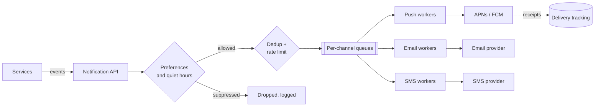

import H from '@site/src/components/Highlight';
import C from '@site/src/components/Color';
import Plain from '@site/src/components/Plain';
import Jargon from '@site/src/components/Jargon';
import Depth from '@site/src/components/Depth';
import Trace, { TraceStep } from '@site/src/components/Trace';

# Notification Systems

> **What you will be able to do after this page**
>
> - Design a fan-out that survives a celebrity-scale send.
> - Handle third-party providers that fail, rate-limit and lose messages.
> - Respect user preferences and quiet hours without special-casing everywhere.
> - Explain why deduplication and batching matter more than delivery speed.

A notification service looks like "send a message" and is really <C color="orange">a fan-out problem, a third-party integration problem, and a user-trust problem wearing one name.</C>

<Plain>

A school needs to tell parents that a trip is cancelled.

**The simple version:** the office phones each family. Forty families, forty calls, fine.

**Now scale it.** Four thousand families, and each has chosen how they want to be reached — some by text, some by email, some by the app. <C color="crimson">Phoning them one at a time from the office does not work</C>; the office does nothing else all day and the last family hears at 6pm.

Several problems arrive together, and none is about the message itself.

**Different channels have different rules.** The text service refuses more than a hundred a minute. Email addresses bounce. Some app installs no longer exist.

**Some people must not be contacted now.** A parent in another timezone should not get a 3am alert. Someone who opted out of trip notices should get nothing.

**And the worst failure is not a missed message.** It is the **same** message arriving four times — <C color="crimson">that is when people turn notifications off entirely</C>, and then you cannot reach them about anything, ever again.

<H>The hard part is never sending. It is deciding who genuinely should receive it, exactly once, at a moment they will tolerate.</H>

</Plain>

---

## 1. The shape



<C color="green">The critical property is that filtering happens **before** the queues.</C> Deciding whether to send is cheap; sending is expensive and irreversible. Every suppression that happens after a message reaches a provider has already cost money and possibly annoyed someone.

<Jargon
  plain="Sending one logical notification to a large number of recipients."
  term="fan-out"
  also={['broadcast', 'multicast delivery']}>

The same [fan-out on write versus read](../01-foundations/01-what-is-system-design.md) trade appears here, with one difference: <C color="orange">a notification must actually be delivered, so it cannot be computed lazily at read time.</C> The work is unavoidable — only its scheduling is negotiable.

</Jargon>

---

## 2. The celebrity send

<Trace title="Notifying 8 million followers" subtitle="One event, an enormous fan-out. Watch what breaks.">

<TraceStep
  title="Naive — expand synchronously"
  cost="request times out"
  state={{ 'Recipients': '8M', 'Where expanded': 'in the request', 'API latency': 'minutes', 'Provider load': 'burst' }}
  changed={['Recipients', 'Where expanded', 'API latency']}
  note="The publishing request cannot complete, and a retry starts the whole fan-out again.">

The API call that triggers the notification tries to enumerate 8 million recipients inline.

</TraceStep>

<TraceStep
  title="Enqueue a fan-out job instead"
  state={{ 'API latency': '~10 ms', 'Where expanded': 'background worker', 'Provider load': 'still a burst', 'Duplicate risk': 'high' }}
  changed={['API latency', 'Where expanded', 'Duplicate risk']}
  note="The API returns immediately. The problem moves to the worker, where it belongs.">

The API writes one job and returns `202`. <C color="green">A worker expands the recipient list.</C>

</TraceStep>

<TraceStep
  title="The worker dies at recipient 3 million"
  cost="duplicates on retry"
  state={{ 'Sent': '3M', 'On retry': 'restarts from 0', 'Duplicate risk': 'CRITICAL', 'Users affected': '3M get it twice' }}
  changed={['Sent', 'On retry', 'Users affected']}
  note="A single long-running job is exactly the shape that cannot survive a deploy.">

<C color="crimson">Three million people receive the notification twice</C> — the failure that makes users disable notifications permanently.

</TraceStep>

<TraceStep
  title="Chunk the fan-out"
  state={{ 'Structure': '8,000 jobs × 1,000 recipients', 'On crash': 'one chunk repeats', 'Duplicate risk': 'bounded', 'Parallelism': 'yes' }}
  changed={['Structure', 'On crash', 'Duplicate risk', 'Parallelism']}
  note="The same chunking argument as any long job — resilience and parallelism from one change.">

<C color="green">A crash re-runs at most 1,000 recipients</C>, and chunks process in parallel.

</TraceStep>

<TraceStep
  title="Add per-recipient idempotency"
  state={{ 'Key': '(notification_id, user_id)', 'On chunk repeat': 'no duplicate sent', 'Duplicate risk': 'eliminated', 'Cost': '1 dedup check per send' }}
  changed={['Key', 'On chunk repeat', 'Duplicate risk', 'Cost']}
  note="A unique constraint or a TTL'd set. The check is cheap; the alternative is losing the user.">

Record `(notification_id, user_id)` before sending. <C color="green">A repeated chunk finds the key and skips.</C>

</TraceStep>

<TraceStep
  title="Rate-limit toward providers"
  state={{ 'Send rate': 'capped per provider', 'Provider errors': 'none', 'Completion': 'minutes, spread', 'Duplicate risk': 'none' }}
  changed={['Send rate', 'Provider errors', 'Completion']}
  note="Providers rate-limit you; exceeding it means throttling, errors and reputational damage on email.">

Workers pull at a controlled rate rather than flooding.

<H>Delivering 8 million notifications over ten minutes is almost always better than attempting it in ten seconds — the recipient cannot tell, and the providers certainly can.</H>

</TraceStep>

</Trace>

---

## 3. Channels differ more than they look

| Channel | Latency | Reliability | Cost | Notes |
| :--- | :--- | :--- | :--- | :--- |
| **Push (APNs/FCM)** | Seconds | <C color="orange">Best effort — no delivery guarantee</C> | Free | Tokens expire; must be pruned |
| **SMS** | Seconds | Good | <C color="crimson">Expensive per message</C> | Carrier filtering; strict regulation |
| **Email** | Seconds–minutes | Good | Cheap | <C color="crimson">Reputation-managed — sending badly gets you blocked</C> |
| **In-app** | Instant | <C color="green">You control it</C> | Free | Only while the user is present |
| **Webhook** | Seconds | Depends on receiver | Free | Treat the receiver as unreliable |

<C color="crimson">Push notifications are not guaranteed.</C> APNs and FCM are best-effort: a device that is off, offline, or has a full queue may never receive it. <C color="green">Anything important must also exist in an in-app inbox</C>, so the user can find it when they open the app — the push is a hint, not the delivery.

<C color="crimson">Email reputation is a shared, slow-moving asset.</C> High bounce rates, spam complaints and sending to stale addresses degrade deliverability for **all** your mail, including password resets. Practical requirements: honour bounces and unsubscribes immediately, separate transactional and marketing sending domains, and authenticate with SPF, DKIM and DMARC.

---

## 4. Preferences and trust

<Depth title="Why deduplication and batching matter more than speed">

The metric that actually determines a notification system's value is **not delivery rate** — it is <C color="orange">the fraction of users who still have notifications enabled.</C> Every unnecessary or duplicated message pushes that number down, and it does not recover.

**The failure modes that cause opt-outs**, in order of damage:

**1. Duplicates.** The same message twice reads as broken. Prevent with a per-recipient idempotency key on `(notification_id, user_id)` — not just at the queue level, since retries occur at several layers.

**2. Floods.** Fifty "someone liked your post" notifications in an hour. <C color="green">The fix is aggregation, not suppression</C>: hold a short window, then send *"23 people liked your post"* as one message. It is more useful **and** less annoying — the rare case where the cheaper option is also the better product.

**3. Notifications at 3am.** Quiet hours must be evaluated in the **user's** timezone, and a queued notification must be re-checked at send time, not only at enqueue time — a message queued at 22:50 and sent at 23:10 has crossed the boundary.

**4. Notifications about things the user already saw.** If they are actively viewing the conversation, do not push it. <C color="green">Presence-aware suppression</C> — checking whether the in-app channel already delivered it — is one of the highest-value refinements and is often missing.

**5. Irrelevant categories.** Preferences must be per **category** and per **channel** — "comments by push, weekly digest by email, marketing never" — not a single on/off switch. A single switch forces users to choose between everything and nothing, and they choose nothing.

**The preference check has an ordering that matters:**

```
  1. Global opt-out / unsubscribed        → stop
  2. Category preference for this type    → stop if off
  3. Channel preference for this category → pick allowed channels
  4. Quiet hours in the user's timezone   → defer, do not drop
  5. Rate limit per user per period       → aggregate or defer
  6. Deduplicate against recent sends     → skip
  7. Send
```

<C color="crimson">Steps 4 and 5 defer rather than drop</C>, while 1, 2 and 6 stop entirely. Conflating "not now" with "not at all" either loses messages the user wanted or sends them at the wrong time.

**A note on transactional versus marketing.** Password resets, security alerts and payment receipts must **bypass** preference and quiet-hour checks — a user who muted notifications still needs to know their password changed. <C color="orange">Marking a message transactional must be a controlled decision</C>, because every team will want their notification classified that way, and a system where everything is transactional has no preferences at all.

**Measure the right things:**

| Metric | Tells you |
| :--- | :--- |
| <C color="green">Opt-out rate per category</C> | Which notifications are unwanted — the most important number |
| Open/action rate | Whether they are useful |
| Duplicate rate | Whether idempotency is working |
| Time to delivery, p99 | Whether the pipeline is healthy |
| Bounce and complaint rate | Email reputation risk |

<H>A notification system optimised for delivery volume will maximise the number of users who turn it off. Optimise instead for the number who still find it useful — which usually means sending considerably less.</H>

</Depth>

---

## 5. In a design discussion

- **"Chunk the fan-out into 1,000-recipient jobs with a `(notification_id, user_id)` idempotency key — a worker crash mid-send would otherwise notify three million people twice."** The failure and the fix.
- **"Push is best-effort, so anything important also lands in an in-app inbox. The push is a hint, not the delivery."** A correction most designs need.
- **"Aggregate: '23 people liked your post', not 23 notifications. More useful and less annoying."** Product judgement in an architecture answer.
- **"Quiet hours are re-checked at send time, in the user's timezone — a message queued at 22:50 and sent at 23:10 has crossed the line."** The detail that shows real experience.

---

## Rapid-fire recall

1. Why must preference filtering happen before the queues?
2. How does notification fan-out differ from timeline fan-out?
3. What breaks when a fan-out worker dies mid-send, and what are the two fixes?
4. Why is delivering 8M notifications over ten minutes better than ten seconds?
5. Why are push notifications not a delivery guarantee, and what follows?
6. Why is email reputation a shared risk across message types?
7. What is the metric that really determines a notification system's value?
8. Rank the five failure modes that cause opt-outs.
9. Which preference steps defer and which stop entirely, and why does the distinction matter?
10. Why must transactional classification be controlled?

<details>
<summary>Answers</summary>

1. Because **deciding not to send is cheap and sending is expensive and irreversible**. A suppression applied after a message reaches a provider has already cost money and possibly annoyed the user.
2. A timeline can be computed **lazily at read time**; a notification **must actually be delivered**, so the work is unavoidable. Only its **scheduling** is negotiable.
3. On retry it **restarts from the beginning**, so everyone already notified is notified **again**. Fixes: **chunk** the fan-out so a crash repeats at most one chunk, and a **per-recipient idempotency key** on `(notification_id, user_id)`.
4. Because **the recipient cannot tell the difference**, while providers can — exceeding their rate limits causes throttling, errors and, for email, reputational damage.
5. APNs and FCM are **best-effort**: a device that is off, offline, or has a full queue may never receive it. Therefore anything important must **also exist in an in-app inbox**, with the push acting as a hint.
6. Because bounce and complaint rates degrade deliverability for **all** mail from your domain — including password resets and security alerts, not just the marketing that caused it.
7. **The fraction of users who still have notifications enabled** — not delivery rate. Every unnecessary or duplicate message reduces it, and it does not recover.
8. **Duplicates** · **floods** · **notifications at 3am** · **notifications about something already seen** · **irrelevant categories**.
9. **Quiet hours and per-user rate limits defer**; **global opt-out, category preference and deduplication stop**. Conflating them either loses messages the user wanted or delivers them at a time they will resent.
10. Because transactional messages **bypass preferences and quiet hours**, and every team will want their notification classified that way. A system where everything is transactional effectively has **no preferences at all**.

</details>

---

**Next:** [Search Autocomplete](./07-search-autocomplete.md) — suggestions in under 100 milliseconds.
