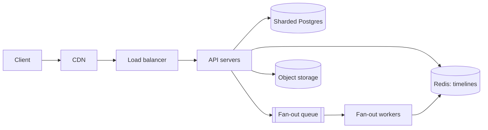

import H from '@site/src/components/Highlight';
import C from '@site/src/components/Color';
import Plain from '@site/src/components/Plain';
import Jargon from '@site/src/components/Jargon';
import Depth from '@site/src/components/Depth';
import Trace, { TraceStep } from '@site/src/components/Trace';

# The Framework

> **What you will be able to do after this page**
>
> - Run a 45-minute design round with a repeatable structure instead of improvising.
> - Know what to say in each of the seven moves, and roughly how long to spend.
> - Recognise the four ways candidates lose rounds they had the knowledge to win.
> - Handle "how would you scale this?" and "what breaks first?" without being caught out.

A design round is not a knowledge test. It is a **simulation of a design meeting**, and you are being evaluated on whether someone would want you in one.

<Plain>

Imagine being asked to plan a wedding in 45 minutes, out loud, in front of someone.

You could panic and start listing flowers. Or you could do what a professional planner does: *"How many guests? What's the budget? Indoors or outdoors? Any dates fixed?"* — then sketch the shape, then go deep on the one part that will actually be hard.

Nobody expects a finished plan. They are watching **how you approach a problem too big for the time available**: do you find out what matters before deciding, do you handle the hard part or avoid it, and can you explain your reasoning as you go?

A system design interview is that, with servers. The single most common mistake is the same one too — starting to name things (*"we'll use Kafka, and Redis, and…"*) before establishing what the problem actually is. <C color="crimson">It reads as someone reciting a menu rather than solving a problem.</C>

This page is the professional planner's routine: seven moves, in order, with rough timings, so you never have to improvise the structure and can spend all your attention on the actual thinking.

</Plain>

---

## 1. The seven moves

Timings assume a 45-minute round. Adjust proportionally.

```
  1. Clarify scope             5 min    what are we building, and what are we NOT
  2. Estimate                  5 min    QPS, storage, read:write ratio
  3. Define the API            3 min    the contract, before any boxes
  4. Design the data model     5 min    entities, access patterns, storage choice
  5. Draw the high-level       10 min   the boxes, and the request path through them
  6. Deep dive                 12 min   one or two components, in real detail
  7. Bottlenecks & failures    5 min    attack your own design before they do
```

The order is not arbitrary. Each step constrains the next, so doing them out of order means revisiting decisions in front of your interviewer.

---

## 2. Move by move

### 1. Clarify scope (5 min)

Pick three or four core features and **explicitly park the rest**.

> "For Twitter I'll cover posting, following, and the home timeline. I'm going to leave out DMs, search, ads and moderation — tell me if you'd rather I include one."

Two things are happening here. You are making the problem finishable in 45 minutes, and you are demonstrating that you scope work rather than boiling oceans. <C color="green">Saying what is *out* scores as highly as saying what is in.</C>

Then ask the [six questions that matter](../01-foundations/02-requirements-and-constraints.md): DAU, read:write ratio, staleness tolerance, what must never be lost, traffic spikiness, geography. Six, not twenty.

### 2. Estimate (5 min)

Out loud, in round numbers. Use `QPS ≈ daily events ÷ 100,000` and [the constants](../01-foundations/05-back-of-the-envelope-estimation.md).

The two numbers that earn the most credit:

- **read:write ratio** — announces whether this is a caching problem or a partitioning problem
- **peak write QPS** — announces whether you need to shard at all

End with the one-sentence summary: *"So: read-heavy at about 200:1, 120K peak reads, 600 peak writes, 3 TB/day mostly images. The read path is the design problem."* That sentence tells the interviewer you know where the difficulty is, and it sets up everything you do next.

### 3. Define the API (3 min)

Three to five endpoints, signatures only.

```
POST /v1/posts              { text, media_id? }        → { post_id, created_at }
GET  /v1/timeline?cursor=   → { posts[], next_cursor }
POST /v1/users/{id}/follow                             → 202 Accepted
```

Cheap and disproportionately valuable: it forces you to commit to what the system actually does, and it lets you mention **cursor pagination over offset pagination** (offsets skew when rows are inserted mid-scroll and get slower the deeper you page) — a small detail that signals real experience.

### 4. Data model (5 min)

Entities, relationships, and — most importantly — **access patterns**. The access pattern chooses the storage, not the other way round.

> "Posts are written once and read by follower ID in reverse-chronological order. That is a partition key of user, sorted by time. Postgres sharded by user ID works; so does Cassandra. I'll take Postgres because we also need transactional follow/unfollow."

Say where each kind of data lives: relational rows in the DB, blobs in object storage, precomputed timelines in Redis, full-text in a search index. Putting a 2 MB image in a database column is the classic thing to avoid saying.

### 5. High-level design (10 min)

*Now* draw. Start with the request path and add components only when a requirement forces them.



Narrate a single request end to end — "Bob opens the app, so: CDN miss, LB, API server, one Redis lookup for his timeline, hydrate post bodies with an MGET, return." A narrated path is far more convincing than a static diagram, and it makes gaps obvious to you before they do to them.

**Justify each box as you add it.** "A queue here because fan-out takes seconds and the user shouldn't wait." A box with no stated reason invites the question you least want.

<Jargon
  plain="The one part of the system that limits everything else — fix everything around it and the total barely improves."
  term="the bottleneck"
  also={['the constraint', 'the limiting factor']}>

Every system has exactly one at a time. <C color="green">Naming your own design's bottleneck before the interviewer does</C> is one of the strongest signals available — it shows you evaluate your work rather than defend it.

</Jargon>

### 6. Deep dive (12 min)

The largest block, and where rounds are actually won. The interviewer usually picks; if they don't, offer:

> "The interesting part is timeline fan-out — want me to go deep there, or on the sharding scheme?"

Go **genuinely deep**: the algorithm, the data structures, the edge cases, the failure modes, the numbers. For fan-out that means the celebrity problem, the hybrid push/pull split, the timeline cap, what happens when a fan-out worker dies mid-job (idempotency), and how a timeline is rebuilt if Redis is lost.

> <H>Depth beats breadth. One component understood thoroughly outscores eight components named.</H>

### 7. Bottlenecks and failures (5 min)

Attack your own design. Strong candidates do this unprompted.

- **Where is the bottleneck?** There is always exactly one. Name it and say what you'd do at 10×.
- **What breaks when each component dies?** Redis down → rebuild from DB, degraded latency. A shard down → those users error, everyone else fine. Queue backed up → timelines lag, posting still works.
- **What is the hot-key / hot-shard problem?** In almost every design there is one. Celebrity accounts, a viral post, a single popular product.
- **What do I regret?** Naming a weakness in your own design reads as confidence, not doubt.

---

Two candidates, the same question, the same knowledge. Step through the first ten minutes of each:

<Trace title="The same question, two openings" subtitle='"Design Twitter." Minutes 0–10, side by side.'>

<TraceStep
  title="Minute 0 — the question lands"
  state={{ 'Candidate A': 'thinking', 'Candidate B': 'thinking', 'Interviewer knows': 'nothing yet' }}
  note="Identical starting position. Everything that follows is process, not knowledge.">

*"Design Twitter for me."*

</TraceStep>

<TraceStep
  title="Minutes 0–2"
  cost="A commits early"
  state={{ 'Candidate A': 'drawing boxes', 'Candidate B': 'scoping features', 'Interviewer knows': 'A is guessing' }}
  changed={['Candidate A', 'Candidate B', 'Interviewer knows']}
  note="A has chosen an architecture before knowing which problem it solves.">

**A** starts drawing: client, load balancer, app servers, database, Redis.

**B** says: *"I'll cover posting, following and the home timeline, and leave out DMs, search and ads — tell me if you'd rather include one."*

</TraceStep>

<TraceStep
  title="Minutes 2–7"
  state={{ 'Candidate A': 'naming technologies', 'Candidate B': 'estimating QPS', 'Interviewer knows': 'B knows where the difficulty is' }}
  changed={['Candidate A', 'Candidate B', 'Interviewer knows']}
  note="B has produced the two numbers that decide the architecture. A has produced a diagram that could describe any website.">

**A** adds Kafka and Cassandra, unprompted, with no stated reason.

**B** computes: 120K peak reads, 600 peak writes, **200:1 read-heavy**, 3 TB/day mostly images — *"so the read path is the design problem."*

</TraceStep>

<TraceStep
  title="Minute 8 — the hint"
  cost="A misses it"
  state={{ 'Candidate A': 'ignores it, continues', 'Candidate B': 'follows it immediately', 'Interviewer knows': 'A cannot self-correct' }}
  changed={['Candidate A', 'Candidate B', 'Interviewer knows']}
  note="A pointed question about one specific part is never idle curiosity. It marks the exact spot where the design breaks.">

Interviewer: *"Interesting — what happens if that user has 50 million followers?"*

**A**: *"It'd scale, we have Kafka."* **B**: *"Ah — that breaks my fan-out. Let me handle celebrities separately…"*

</TraceStep>

<TraceStep
  title="Minute 10 — the gap"
  state={{ 'Candidate A': 'defending a guess', 'Candidate B': 'deep in the real problem', 'Interviewer knows': 'who they would want in a design meeting' }}
  changed={['Candidate A', 'Candidate B', 'Interviewer knows']}
  note="Neither candidate has been asked a single knowledge question. The round has already been decided.">

**A** now defends an architecture chosen in minute one, and every follow-up exposes it further.

**B** is working on the hybrid push/pull timeline — the genuinely interesting part of the problem.

<H>They may know exactly the same things. The difference is entirely that B established the problem before choosing an answer.</H>

</TraceStep>

</Trace>

## 3. The four ways candidates lose

Nearly every failed round is one of these, and none is about missing knowledge.

<C color="crimson">**Drawing before clarifying.**</C> Committing to an architecture before knowing which one the problem needs. Then either defending a wrong design or visibly rebuilding it. Fix: no boxes before minute 10.

<C color="crimson">**Breadth without depth.**</C> Naming twelve components in twelve minutes and understanding none. It reads as pattern-matching from a video. Fix: choose one component and go three levels down.

<C color="crimson">**Silence.**</C> Thinking hard without narrating. The interviewer cannot grade what they cannot hear. Fix: say the alternatives you are weighing — *"I'm deciding between push and pull fan-out; push costs writes, pull costs reads…"* — the reasoning **is** the answer.

<C color="crimson">**Ignoring the hints.**</C> "Interesting… what happens if that user has 50 million followers?" is not curiosity. <C color="orange">It is a rescue attempt.</C> When an interviewer asks a pointed question about one specific part, that is where the problem is. Follow them there.

---

## 4. Phrases that carry weight

| <C color="crimson">Instead of</C> | <C color="green">Say</C> |
| :--- | :--- |
| "I'd use Kafka." | "I'd use a log-based queue — Kafka — because I need ordering per user and replay after a worker bug. SQS would be simpler but gives me neither." |
| "We'll cache it." | "Cache-aside in Redis, 5-minute TTL. Staleness is acceptable here because the requirement allows 30 seconds of lag; the risk is a stampede on expiry, so I'd add jitter." |
| "It'll scale." | "This shards cleanly by user ID because every query has a user in it. It would *not* shard cleanly by post ID, because the timeline query would fan out to every shard." |
| "That's the standard approach." | "The common answer is X. Here I'd do Y instead, because our write volume is low enough that X's complexity isn't earned." |
| "I don't know." | "I haven't operated one at that scale. My mental model is X — is that roughly right?" |

The last one matters. <H>**Admitting a boundary honestly and then reasoning from first principles scores well.**</H> <C color="crimson">Bluffing scores badly</C>, and interviewers detect it easily.

---

<Depth title="What the interviewer is actually writing down">

Most large companies score design rounds against a rubric of four to six dimensions, not a single impression. Knowing the dimensions tells you where to spend your 45 minutes.

**1. Problem navigation.** Did you scope, ask clarifying questions, and manage the time yourself? A candidate who needs to be steered scores low here even if the final design is good — because in a real design meeting nobody will steer you.

**2. Technical depth.** Can you go three levels down on at least one component? This is graded on *depth reached*, not *breadth covered*, which is why the deep dive is worth more than the diagram. One component explained to the level of data structures, edge cases and failure modes beats eight components named.

**3. Trade-off reasoning.** Did you compare alternatives and justify a choice against *this* problem's constraints? The observable behaviour is unprompted sentences of the form *"X, because Y — the alternative Z would cost us W."* Its absence is what makes a candidate sound like they are reciting.

**4. Handling ambiguity and pushback.** When challenged, do you re-examine or defend? Interviewers frequently push on a **correct** decision to see which you do. <C color="green">The right response is to engage with the objection and then either revise or explain why you still think it holds</C> — both score; digging in without engaging does not.

**5. Communication.** Could a colleague follow you? Narrating alternatives as you weigh them is not filler; it is the primary evidence of your reasoning, because the interviewer cannot grade silence.

**6. Seniority calibration.** Senior candidates are expected to raise things nobody asked about: operational cost, migration path, failure modes, what they would monitor, what they would build first versus later. <C color="orange">A design that is technically correct but ignores cost and operations reads as junior regardless of the candidate's years.</C>

**What is *not* on the rubric**, and candidates over-invest in anyway: memorising reference architectures, naming specific products, drawing tidy diagrams, and covering every feature. None of it appears in the scoring, and the last one actively costs you time you needed for the deep dive.

</Depth>

## 5. Practising

<C color="crimson">Reading design solutions is close to worthless</C> — it builds recognition, and the round tests generation.

<C color="green">**Do this instead:**</C> pick a problem, set a 45-minute timer, and talk out loud to an empty room with a whiteboard or a sheet of paper. Record yourself. Watch it back at 1.5×. It is excruciating and it is the fastest improvement available, because you hear the silences, the hedging, and the moment you started drawing before you had constraints.

A workable rotation:

| Week | Focus |
| :--- | :--- |
| 1 | Warm-ups — URL shortener, pastebin, rate limiter. Learn the *rhythm* of the seven moves. |
| 2 | Read-heavy at scale — Twitter, Instagram, news feed. Caching, fan-out, denormalization. |
| 3 | Write-heavy and realtime — WhatsApp, metrics ingestion, ad-click aggregator. Partitioning, streams. |
| 4 | Weird shapes — Uber (geospatial), Ticketmaster (contention and spikes), web crawler (politeness and dedup). |

By week 4 the framework should be invisible to you and obvious to the interviewer.

---

## Rapid-fire recall

1. List the seven moves in order with rough timings.
2. Why does scope come before estimation, and estimation before drawing?
3. Which two estimated numbers earn the most credit, and what does each announce?
4. Why define the API before drawing the architecture?
5. What decides the storage technology — and what does not?
6. What should follow every box you add to the diagram?
7. Why does depth beat breadth in the deep dive?
8. Name the four ways candidates lose.
9. An interviewer asks "what if that user has 50 million followers?" What is happening?
10. What is the single highest-value practice technique, and why is reading solutions not it?

<details>
<summary>Answers</summary>

1. Clarify scope (5) → estimate (5) → API (3) → data model (5) → high-level design (10) → deep dive (12) → bottlenecks and failures (5).
2. Each step constrains the next. Scope decides what you estimate; the estimates decide the architecture. Reversing the order means visibly rebuilding decisions in front of the interviewer.
3. **Read:write ratio** — announces whether this is a caching/duplication problem or a partitioning problem. **Peak write QPS** — announces whether sharding is needed at all.
4. It forces commitment to what the system actually does before you commit to how, it is cheap, and it creates a natural place to show detail like cursor pagination.
5. The **access patterns** decide it. Not familiarity, not popularity, and not the technology's reputation for scale.
6. The reason it is there — the requirement that forces it. An unjustified box invites exactly the question you don't want.
7. Because naming components demonstrates recall, which is cheap; tracing one component's algorithm, edge cases and failure modes demonstrates understanding, which is what the round is for.
8. Drawing before clarifying · breadth without depth · silence (not narrating the reasoning) · ignoring pointed hints.
9. It is a **rescue attempt**, not idle curiosity. It marks the exact spot where your design breaks — here, the celebrity fan-out problem. Follow them there immediately.
10. **Timed, spoken practice, recorded and watched back.** Reading builds recognition; the round tests generation under time pressure while narrating — a different skill entirely.

</details>

---

**Next:** the design drills, grouped by the pattern each one teaches. *(Coming soon.)* Meanwhile, the framework leans on [Requirements & Constraints](../01-foundations/02-requirements-and-constraints.md) and [Back-of-the-Envelope Estimation](../01-foundations/05-back-of-the-envelope-estimation.md).
