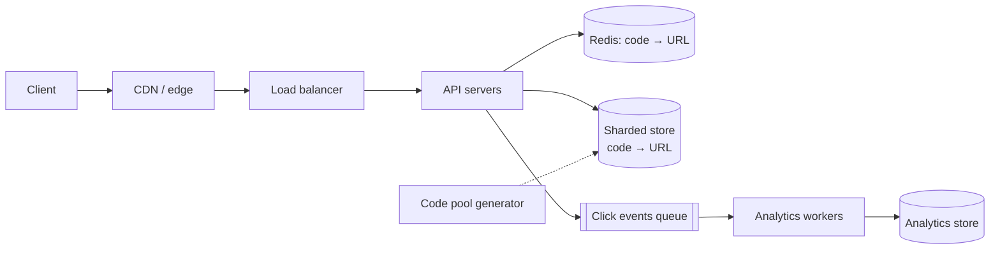

import H from '@site/src/components/Highlight';
import C from '@site/src/components/Color';
import Plain from '@site/src/components/Plain';
import Jargon from '@site/src/components/Jargon';
import Depth from '@site/src/components/Depth';
import Trace, { TraceStep } from '@site/src/components/Trace';

# Design a URL Shortener

> **The drill:** design a service like bit.ly. The canonical warm-up — small enough to finish in 45 minutes, and it exercises ID generation, read-heavy caching, and one genuinely interesting choice.

<Plain>

A cloakroom takes coats and gives out tickets.

The ticket is short — three or four characters — because people have to read it out, type it, and put it in their pocket. The coat is not short. The whole point is that a small thing stands in for a large one.

Two properties matter and they pull in different directions.

**Tickets must be unique.** Two people with ticket `47` is a disaster.

**Tickets must be short.** Twenty characters is safe and useless.

So the design question is: how do you hand out short, unique tickets when there are two attendants working, without them having to check with each other before every ticket?

And one more, which the interviewer will ask: <C color="orange">should a ticket be guessable?</C> If tickets go `1, 2, 3`, anyone can try `48` and see somebody else's coat.

</Plain>

---

## 1. Scope

**In:** shorten a long URL; redirect a short URL; optional custom alias; optional expiry; click analytics.
**Out** (say it explicitly): user accounts, teams, branded domains, link previews, spam moderation.

**The six questions, answered:**

| Question | Answer | Consequence |
| :--- | :--- | :--- |
| Scale | 100M new URLs/day | 1,000+ writes/sec |
| Read:write | <C color="orange">~100:1</C> | Read-dominated — cache is the design |
| Staleness | Seconds fine | Async analytics, cacheable redirects |
| Durability | URLs must never be lost | Durable store; analytics can be lossy |
| Spikiness | 2× | Standard |
| Geography | Global | CDN / edge redirects |

---

## 2. Estimate

```
  Writes:  100M/day  ÷ 10⁵  =  ~1,000/s      peak ~2,000/s
  Reads:   10B/day   ÷ 10⁵  =  ~100,000/s    peak ~200,000/s

  Storage: 100M/day × 500 B × 5 years  ≈  90 TB
  Short code space: 62⁷ ≈ 3.5 trillion    (7 chars of [a-zA-Z0-9])
```

<C color="green">Two conclusions before drawing anything:</C> 2,000 writes/sec fits a single well-tuned primary, so sharding is about **volume**, not write throughput. And 200,000 reads/sec must be served from cache and the edge — never from the database.

---

## 3. API

```
POST /v1/urls        { url, custom_alias?, expires_at? }  → { short_code, short_url }
GET  /{short_code}                                        → 301/302 redirect
GET  /v1/urls/{code}/stats                                → { clicks, referrers, … }
```

<C color="orange">`301` vs `302` is a real question and interviewers ask it.</C> `301` (permanent) is cached by browsers, so subsequent clicks never reach you — great for load, <C color="crimson">and you lose the click analytics and cannot change the destination.</C> `302` sends every click to you. <C color="green">Most shorteners use `302`</C>, because analytics is the product.

---

## 4. Generating the code

<Trace title="Four ways to make a short code" subtitle="Each fails for a different reason. The last one works.">

<TraceStep
  title="Hash the URL, take 7 characters"
  cost="collisions"
  state={{ 'Uniqueness': 'not guaranteed', 'Guessable': 'no', 'Coordination': 'none', 'Verdict': 'needs collision handling' }}
  changed={['Uniqueness', 'Guessable', 'Verdict']}
  note="Truncating a hash reduces the space, and the birthday bound applies to the truncation.">

MD5 the URL, base62-encode, take 7 characters. <C color="crimson">Different URLs can collide</C>, so every insert needs a check-and-retry — an extra read on the write path.

Also: the same URL always produces the same code, which may be desirable or may leak that someone else shortened it.

</TraceStep>

<TraceStep
  title="Random 7 characters"
  state={{ 'Uniqueness': 'check required', 'Guessable': 'no', 'Coordination': 'none', 'Verdict': 'workable' }}
  changed={['Uniqueness', 'Verdict']}
  note="Collision probability is low but nonzero, so you still need a uniqueness constraint and retry.">

<C color="green">Unguessable and needs no coordination</C>, at the cost of a uniqueness check per insert.

</TraceStep>

<TraceStep
  title="Auto-increment ID, base62-encoded"
  cost="enumerable"
  state={{ 'Uniqueness': 'guaranteed', 'Guessable': 'YES', 'Coordination': 'central sequence', 'Verdict': 'reject' }}
  changed={['Uniqueness', 'Guessable', 'Coordination', 'Verdict']}
  note="Codes go aaaaaab, aaaaaac — anyone can walk the space and read every link.">

Guaranteed unique with no check. <C color="crimson">And sequential, so every link is enumerable</C> — a privacy failure for a service holding links people assume are semi-private.

Also a central sequence is a write-path coordination point.

</TraceStep>

<TraceStep
  title="Counter-based, but shuffled"
  state={{ 'Uniqueness': 'guaranteed', 'Guessable': 'no', 'Coordination': 'ranges only', 'Verdict': 'good' }}
  changed={['Guessable', 'Coordination', 'Verdict']}
  note="A keyed permutation of the counter — reversible, so no lookup needed to decode.">

Take a [Snowflake-style id or a ticket-server range](../14-building-blocks/01-unique-id-generation.md), then apply a **format-preserving permutation** before encoding.

<C color="green">Unique by construction, no collision check, and not enumerable.</C>

</TraceStep>

<TraceStep
  title="Or: pre-generate a pool of codes"
  state={{ 'Uniqueness': 'guaranteed', 'Guessable': 'no', 'Coordination': 'batched', 'Write path': 'one pop' }}
  changed={['Coordination', 'Write path']}
  note="An offline job fills a table of unused random codes; servers claim blocks of them.">

<H>A background job generates random unused codes into a pool; each server claims a block. Creating a link is then a pop from a local block — no collision check, no coordination, and codes are unguessable.</H>

</TraceStep>

</Trace>

---

## 5. High-level design



**Data model.** The store is a pure key-value lookup by `short_code` — <C color="green">a strong argument for a key-value store rather than relational</C>, since there are no joins, no transactions and one access pattern. Shard by `short_code` hash: perfectly even, always present in the query, immutable.

**The redirect path is the hot path.** Cache `code → url` in Redis with a long TTL; the mapping is immutable once created, so <C color="green">invalidation is a non-problem</C> — the rare edit or deletion can simply delete the key.

---

## 6. The deep dive interviewers pick

<Depth title="Analytics without slowing the redirect, and the custom-alias trap">

**Click tracking must not be on the critical path.** A redirect should be a cache read and a `302`. Writing an analytics row synchronously adds a database write to the hottest path in the system, at 200,000 requests/second.

<C color="green">Fire an event onto a queue and return immediately</C> — or better, log it and let a collector batch-ship it. Analytics is [the tolerable-loss bucket](../01-foundations/02-requirements-and-constraints.md): losing 0.1% of click events changes nothing, while slowing every redirect changes everything.

Aggregation is then a stream job producing per-code counters, with the [counter techniques](../14-building-blocks/05-counters-at-scale.md) — batch, shard hot codes, accept approximation. A viral link is a hot key, so its counter needs sharding or in-process aggregation.

**Custom aliases introduce the one real coordination problem.** Generated codes need no uniqueness check if drawn from a pool. <C color="crimson">A user-chosen alias must be checked against everything, including codes not yet issued from the pool.</C>

The clean resolution: **partition the namespace.** Generated codes are exactly 7 characters; custom aliases must be 8+ or must start with a reserved character. <C color="green">The two sets cannot collide by construction</C>, so a custom alias needs only a uniqueness check against other custom aliases, and the pool needs no awareness of them at all.

This is worth saying out loud in an interview — it turns a coordination problem into a namespace decision, which is the kind of move interviewers are looking for.

**Other things they will push on:**

**Expiry.** A TTL on the row plus a background sweep. <C color="orange">Do not reuse expired codes</C> — someone has the old link, and reuse means their click lands on a stranger's destination.

**Abuse.** Shorteners are used to disguise malicious URLs. Realistic answers: check against a reputation service on creation, rate-limit per account and per IP, and support fast takedown by deleting the cache key and the row.

**Why not use the URL as the key?** Because the same URL shortened by two people should generally give two codes (separate analytics), and because the URL is too long to be an efficient key.

**Where this breaks at 10×.** The redirect path is already cache-and-edge served, so it scales horizontally. The constraint becomes **storage volume** and **analytics write volume** — both solved by partitioning, both boring. <C color="green">That is the honest answer: this system scales well, which is why it is a warm-up.</C>

</Depth>

---

## 7. What a good answer sounds like

> *"100:1 read-heavy, so the redirect path is the design: cache in Redis, serve from the edge, `302` because analytics is the product. Codes come from a pre-generated pool so creation needs no collision check and no coordination — and they're not enumerable, unlike base62 of an auto-increment. Custom aliases live in a separate length namespace so they can't collide with generated codes. Clicks go on a queue; a redirect never waits for an analytics write. The store is key-value sharded by code — no joins, one access pattern. At 10× the constraint is storage and analytics volume, both of which partition cleanly."*

---

## Rapid-fire recall

1. What read:write ratio does this have, and what does it decide?
2. Why `302` rather than `301`, and what does that cost?
3. Give the four code-generation approaches and why each of the first three is imperfect.
4. Why is a pre-generated pool the cleanest option?
5. Why is auto-increment base62 rejected despite guaranteeing uniqueness?
6. Why is cache invalidation a non-problem here?
7. Why must click tracking be off the critical path?
8. What is the custom-alias problem, and the namespace fix?
9. Why must expired codes not be reused?
10. What becomes the constraint at 10×?

<details>
<summary>Answers</summary>

1. Roughly **100:1**. It makes the **redirect path the entire design** — cache and edge, never the database.
2. **`302`** sends every click to your servers so you can record analytics and change the destination. **`301`** is browser-cached, which removes load but **loses analytics and makes the destination unchangeable**.
3. **Hash-and-truncate** (collisions, needs check-and-retry) · **random** (needs a uniqueness check) · **auto-increment base62** (enumerable, and a central coordination point) · **counter plus permutation** (works).
4. Because creation becomes **popping a code from a locally-held block** — no collision check, no coordination on the write path, and codes are unguessable.
5. Because codes become **sequential and enumerable**, so anyone can walk the space and read every link — a privacy failure for a service holding links people treat as semi-private.
6. Because the `code → url` mapping is **immutable once created**. There is nothing to invalidate; edits and deletions simply delete the key.
7. Because the redirect is the hottest path at ~200,000 req/s, and a synchronous analytics write would add a database write to every one. Clicks go to a **queue** — analytics is a tolerable-loss category.
8. A user-chosen alias **must be checked against all codes, including unissued pool entries**. Fix: **partition the namespace** — generated codes are exactly 7 characters, custom aliases 8+ — so the two sets cannot collide by construction.
9. Because **old links still exist in the wild**. Reusing a code means someone's existing link lands on a stranger's destination.
10. **Storage volume** and **analytics write volume** — both partition cleanly, which is why this problem is a warm-up rather than a hard one.

</details>

---

**Next:** [Design a Distributed Key-Value Store](./03-key-value-store.md) — the theory pages, applied.
