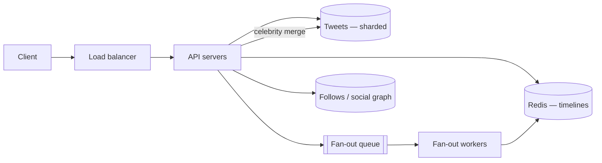

import H from '@site/src/components/Highlight';
import C from '@site/src/components/Color';
import Plain from '@site/src/components/Plain';
import Jargon from '@site/src/components/Jargon';
import Depth from '@site/src/components/Depth';
import Trace, { TraceStep } from '@site/src/components/Trace';

# Design Twitter

> **The drill:** the most-asked design question. It is really one question — *how do you build a timeline?* — and the interviewer is waiting to see whether you find the celebrity problem yourself.

<Plain>

A noticeboard where you only see notices from people you have chosen to follow.

The awkward part is that **your board is different from everyone else's**. There is no single board to maintain; there are as many boards as there are people, each a different combination of the same notices.

Two ways to keep them.

**Assemble on demand.** When someone walks up, gather the recent notices from each person they follow, sort by time, and show the top twenty. Nothing stored in advance, and they wait while you do it — every visit.

**Keep each board ready.** When someone posts, immediately pin a copy to the board of every person who follows them. Walking up means glancing at a finished board.

The second is obviously better for a place where far more people read than write.

Until someone with three million followers posts, and you must pin three million copies while everyone else's notices queue behind you.

<H>The interviewer is waiting for you to notice that. Everything else in this design is standard; the celebrity case is the question.</H>

</Plain>

---

## 1. Scope

**In:** post a tweet; follow/unfollow; home timeline; user timeline.
**Out:** DMs, search, notifications, ads, moderation, media processing.

| Question | Answer | Consequence |
| :--- | :--- | :--- |
| Scale | 300M DAU | Real distributed system |
| Read:write | <C color="orange">~200:1</C> | Precompute; cache; replicate |
| Staleness | Seconds acceptable | **Async fan-out is permitted** |
| Durability | Tweets must not be lost | Durable store; timelines rebuildable |
| Follower distribution | <C color="crimson">Extreme tail</C> | The whole problem |

<C color="green">That last row is the requirement you must extract yourself.</C> "How are followers distributed?" is the clarifying question that decides the design, and asking it early is a strong signal.

---

## 2. Estimate

```
  Reads:  300M × 20 views/day  = 6×10⁹/day  →  60,000/s avg, 120,000/s peak
  Writes: 30M posts/day                     →     300/s avg,     600/s peak
  Ratio:  ~200:1

  Storage: 30M × 300 B text + metadata ≈ 40 GB/day → ~73 TB over 5 years
```

<C color="green">Two conclusions:</C> 600 peak writes/sec fits one primary — sharding is for **volume**, not write throughput. And 120,000 reads/sec means timelines must be **precomputed and cached**, never assembled per request.

---

## 3. API and data model

```
POST /v1/tweets                  { text }        → { tweet_id, created_at }
GET  /v1/timeline?cursor=        → { tweets[], next_cursor }
POST /v1/users/{id}/follow       → 202 Accepted
```

<C color="green">Cursor pagination, not offset</C> — offsets skew as new tweets are inserted above you, and degrade the deeper you page.

**Storage:**

| Data | Store | Shard key |
| :--- | :--- | :--- |
| `tweets` | Sharded KV / wide-column | `tweet_id` |
| `follows` | Sharded relational or KV | `follower_id` (and a reverse index by `followee_id`) |
| `timelines` | <C color="orange">Redis — a capped list of tweet **ids**</C> | `user_id` |

<C color="green">Timelines hold ids, not tweet bodies.</C> One tweet fanned to 3M timelines is 3M × 8 bytes, not 3M × 300 bytes — and edits or deletions need touch only the tweet, not every copy.

---

## 4. The design, and the celebrity problem

<Trace title="Building the timeline" subtitle="Push, then the failure, then the hybrid.">

<TraceStep
  title="Fan-out on write — the default"
  state={{ 'Write cost': 'N follower writes', 'Read cost': '1 lookup', 'Ordinary user (300)': 'fine', 'Celebrity (3M)': '—' }}
  changed={['Write cost', 'Read cost', 'Ordinary user (300)']}
  note="Correct for the overwhelming majority of accounts, given a 200:1 read ratio.">

On post, look up followers and insert the tweet id into each of their cached timelines, asynchronously via a queue.

<C color="green">Reads become a single Redis lookup.</C>

</TraceStep>

<TraceStep
  title="A celebrity posts"
  cost="write storm"
  state={{ 'Write cost': '3M writes for one post', 'Fan-out queue': 'saturated', 'Ordinary user (300)': 'DELAYED', 'Celebrity (3M)': 'broken' }}
  changed={['Write cost', 'Fan-out queue', 'Ordinary user (300)', 'Celebrity (3M)']}
  note="The critical consequence: it is not just slow for the celebrity — everyone else's posts queue behind it.">

<C color="crimson">One action generates millions of writes, and the fan-out pipeline backs up for every other user.</C>

</TraceStep>

<TraceStep
  title="Hybrid — exclude celebrities from fan-out"
  state={{ 'Celebrity posts': 'stored once, not fanned out', 'Ordinary posts': 'fanned out', 'Read cost': '1 lookup + small merge', 'Verdict': 'works' }}
  changed={['Celebrity posts', 'Read cost', 'Verdict']}
  note="Above a follower threshold, switch that account to the pull path.">

On read: take the precomputed timeline, **merge** recent tweets from the few celebrities this user follows, sort, return.

<C color="green">Works because the asymmetry is favourable — celebrities have many followers, but users follow few celebrities.</C>

</TraceStep>

<TraceStep
  title="Cap and rebuild"
  state={{ 'Timeline size': 'capped at ~800 ids', 'Storage': 'users × cap', 'Redis lost': 'rebuild from tweets + follows', 'Verdict': 'bounded' }}
  changed={['Timeline size', 'Storage', 'Redis lost']}
  note="The timeline is a cache, not a source of truth — which is what makes holding it in memory acceptable.">

Deep scrolling falls back to a slower query path. <C color="green">A lost timeline is regenerated, so Redis can be treated as a cache.</C>

</TraceStep>

<TraceStep
  title="Inactive users"
  cost="wasted work"
  state={{ 'Fan-out target': 'active users only', 'Writes saved': 'large fraction', 'Inactive user returns': 'timeline built on demand' }}
  changed={['Fan-out target', 'Writes saved', 'Inactive user returns']}
  note="A large share of accounts are dormant. Fanning out to them is pure waste.">

<H>Do not fan out to accounts that have not logged in recently. Build their timeline on demand when they return — this removes a large fraction of all fan-out writes for no user-visible cost.</H>

</TraceStep>

</Trace>



---

## 5. What interviewers push on next

<Depth title="The follow-ups, and where candidates run out of answers">

**"What happens when a user follows someone new?"** Their timeline lacks that person's history. Either backfill it, or accept that new content appears going forward and old content requires the pull path. <C color="green">A small instance of the same push/pull decision</C> — say that, rather than treating it as a new problem.

**"How do you delete a tweet?"** Because timelines hold **ids**, deletion means deleting the tweet and filtering deleted ids at read time — <C color="green">no need to scrub millions of timelines.</C> This is the payoff for storing references rather than content, and it is worth naming explicitly.

**"How do you pick the celebrity threshold?"** From the distribution, not aesthetically: set it where the write cost of fanning out exceeds the aggregate read cost of merging. <C color="orange">Too low and reads do too much merging; too high and the write pipeline still saturates.</C> It is a tunable to revisit.

**"What about the social graph itself?"** Follows are a bipartite graph needing two access patterns: *who do I follow* (for the pull merge) and *who follows me* (for fan-out). <C color="green">Maintain both directions</C> — a single-direction index makes one of the two operations a full scan.

**"Ranked timeline instead of chronological?"** This genuinely changes the design. A ranked feed cannot be precomputed by insertion order, because ranking depends on the viewer and on features computed at request time. The standard shape: <C color="green">precompute a **candidate set** by fan-out, then rank at read time</C> — trading read work for relevance. Say this if asked; do not volunteer it unprompted, as it expands scope considerably.

**"What breaks first at 10×?"** The fan-out pipeline, and specifically its **tail**. Ordinary fan-out scales by adding workers; celebrity handling and the merge path do not scale as cleanly. The other pressure is Redis memory for timelines — bounded by `active users × cap`, which is why the cap and the inactive-user optimisation matter.

**The failure modes worth raising unprompted:**

| Failure | Effect | Mitigation |
| :--- | :--- | :--- |
| Redis timeline lost | Timelines empty | Rebuild from tweets + follows; degraded but correct |
| Fan-out workers lag | Tweets appear late | Alert on **oldest message age**, not queue depth |
| Fan-out worker dies mid-job | Partial fan-out, duplicates on retry | Chunk the job; make insertion idempotent |
| A tweet goes viral | Hot key on that tweet's row | Cache it; the timeline path is unaffected |

<H>The single most common way to lose this question is to design pure push or pure pull and not notice the tail. The interviewer's follow-up is always the celebrity — arriving there yourself is the whole point of the exercise.</H>

</Depth>

---

## 6. What a good answer sounds like

> *"200:1 read-heavy with seconds of tolerable staleness, so precompute: fan out on write into per-user Redis timelines holding tweet ids, capped at a few hundred. That breaks for celebrities — one post becomes millions of writes and delays everyone else's fan-out — so accounts above a follower threshold are excluded and merged at read time instead. It works because users follow few celebrities even though celebrities have many followers. Timelines are a rebuildable cache, so losing Redis is degradation, not data loss. Skip fan-out for dormant accounts. Deletion is cheap because timelines store ids. At 10× the pressure is the fan-out tail and Redis memory."*

---

## Rapid-fire recall

1. Which clarifying question decides this design, and why?
2. Why does 600 peak writes/sec not require sharding for throughput?
3. Why do timelines store ids rather than tweet bodies? Give two reasons.
4. What exactly goes wrong when a celebrity posts, and who is affected?
5. Which asymmetry makes the read-time merge cheap?
6. Why is the timeline safe to hold in Redis?
7. Why skip fan-out for inactive users?
8. Why is deleting a tweet cheap in this design?
9. Why does the social graph need two indexes?
10. How does a ranked timeline change the architecture?

<details>
<summary>Answers</summary>

1. **"How are followers distributed?"** The extreme tail is what breaks pure fan-out on write, and it is the constraint the whole design turns on.
2. Because a **single well-tuned primary handles a few thousand writes/sec**. Sharding here is driven by **storage volume** (~73 TB over five years), not write throughput.
3. **Storage** — one tweet fanned to 3M timelines is 3M × 8 bytes rather than 3M × 300 bytes. And **mutability** — edits and deletions touch only the tweet, not millions of copies.
4. One post becomes **millions of timeline writes**, saturating the fan-out pipeline so **every other user's tweets are delayed behind it**. It is not just slow for the celebrity.
5. **Celebrities have many followers, but users follow few celebrities** — so the pull path applies to only a handful of accounts per read.
6. Because it is a **derived, rebuildable cache** — regenerable from the tweets and follows tables. Losing it degrades latency, not correctness.
7. Because a large share of accounts are dormant, so fanning out to them is **pure waste**. Build their timeline on demand when they return.
8. Because timelines hold **ids**, so deletion means removing the tweet and **filtering deleted ids at read time** — no need to scrub millions of timelines.
9. Fan-out needs **who follows me**; the celebrity merge needs **who do I follow**. Maintaining only one direction makes the other operation a full scan.
10. Ranking depends on the viewer and on features computed at request time, so the top entries **cannot be precomputed by insertion order**. Fan-out produces a **candidate set** and ranking happens at read time — trading read work for relevance.

</details>

---

**Next:** [Design Instagram](./05-instagram.md) — the same shape, plus media.
