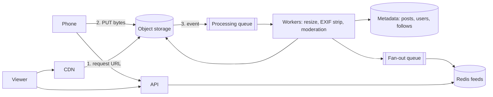

import H from '@site/src/components/Highlight';
import C from '@site/src/components/Color';
import Plain from '@site/src/components/Plain';
import Jargon from '@site/src/components/Jargon';
import Depth from '@site/src/components/Depth';
import Trace, { TraceStep } from '@site/src/components/Trace';

# Design Instagram

> **The drill:** a feed like [Twitter's](./04-twitter.md), plus media. The feed part is the same problem; <C color="orange">the interesting half is everything that happens to a photo between upload and display.</C>

<Plain>

A photo lab that also runs a noticeboard.

The noticeboard part is familiar — each person sees pictures from those they follow.

The lab part is new, and it is where the work is.

**A photo arrives large.** Several megabytes from a modern phone. It will be displayed as a thumbnail in a grid, a medium image in a feed, and occasionally full size. Sending the original every time is enormously wasteful — <C color="crimson">the phone downloads five megabytes to show a picture the size of a postage stamp.</C>

**So the lab makes several prints of each photo** at different sizes, immediately, and files them. Every later request gets the right size.

**And prints are handed over from a local counter**, not fetched from the central archive each time — because photos are large, they never change, and the same popular ones are requested constantly.

Two properties make all of this possible, and they are worth stating: <C color="green">a photo is written once and never modified, and it is read enormously more often than it is written.</C> Anything with those properties should be processed once, in advance, and served from as close to the reader as possible.

</Plain>

---

## 1. Scope and estimates

**In:** upload a photo with a caption; follow users; view a feed; view a profile grid.
**Out:** stories, reels, DMs, search, ads, comments (mention them as out of scope).

```
  50M DAU, 10 feed opens/day  →  500M feed reads/day  ≈  6,000/s avg, 18,000/s peak
  5% post once/day            →  2.5M uploads/day     ≈  30/s avg, 100/s peak
  Read:write ≈ 200:1

  Original photo ~3 MB, derivatives ~1 MB total
  Storage:  2.5M × 4 MB  ≈  10 TB/day  →  ~18 PB over 5 years
```

<C color="green">Three conclusions before drawing:</C> read-heavy so precompute the feed; **10 TB/day dominated entirely by media**, so photos go to object storage and never near the database; and 100 uploads/sec is trivial for the database but significant for the transcoding pipeline.

---

## 2. The upload path

<Trace title="A photo from phone to feed" subtitle="The half of this design that is not Twitter.">

<TraceStep
  title="Client requests permission to upload"
  cost="~5 ms of API time"
  state={{ 'Bytes through API': '0', 'Photo location': 'phone', 'DB row': 'none', 'Derivatives': 'none' }}
  changed={['Bytes through API', 'Photo location']}
  note="The API validates, checks quota, generates a key, and returns a presigned URL. It never touches the bytes.">

`POST /v1/uploads` returns a **presigned URL** for object storage.

</TraceStep>

<TraceStep
  title="Phone uploads directly to object storage"
  state={{ 'Bytes through API': '0', 'Photo location': 'object storage', 'DB row': 'none', 'Derivatives': 'none' }}
  changed={['Photo location']}
  note="Three megabytes over a slow mobile connection never occupies an application worker.">

<C color="green">The bytes bypass your servers entirely</C> — see [object storage](../04-data-storage/06-object-storage.md).

</TraceStep>

<TraceStep
  title="Storage event triggers processing"
  state={{ 'Photo location': 'object storage', 'DB row': 'created (processing)', 'Derivatives': 'queued', 'Visible': 'to author only' }}
  changed={['DB row', 'Derivatives', 'Visible']}
  note="Prefer the storage event over a client callback — a phone that uploads then loses signal would otherwise orphan the object.">

An object-created event lands on a queue. A worker writes the metadata row with status `processing`.

</TraceStep>

<TraceStep
  title="Generate derivatives"
  cost="the expensive step"
  state={{ 'Derivatives': 'thumb, small, medium, large', 'CPU': 'significant', 'Visible': 'to author only', 'Time': '1–5 s' }}
  changed={['Derivatives', 'CPU', 'Time']}
  note="Also: strip EXIF (which contains GPS location), validate the actual bytes, and run safety classification.">

Resize into several sizes and formats (WebP/AVIF alongside JPEG), <C color="green">strip EXIF metadata</C>, verify the file really is an image, and run moderation classifiers.

</TraceStep>

<TraceStep
  title="Publish and fan out"
  state={{ 'DB row': 'ready', 'Derivatives': 'stored', 'Visible': 'to followers', 'Fan-out': 'queued' }}
  changed={['DB row', 'Visible', 'Fan-out']}
  note="Only now does the post enter follower feeds — the same fan-out design as Twitter, carrying photo ids.">

Status flips to `ready` and a fan-out job inserts the post id into follower feeds.

<H>The user saw "posted" within a second of the upload finishing. Everything expensive happened afterwards, and the post simply became visible when it was ready.</H>

</TraceStep>

<TraceStep
  title="Delivery"
  state={{ 'Served from': 'CDN edge', 'Origin traffic': 'a few % of requests', 'Size served': 'matched to display', 'Cache': 'immutable, 1 year' }}
  changed={['Served from', 'Origin traffic', 'Size served', 'Cache']}
  note="Photos are immutable, so the URL contains a content hash and can be cached forever.">

Feeds return **CDN URLs** for the size the client needs. <C color="green">Immutable content means a one-year `immutable` cache header and no invalidation problem.</C>

</TraceStep>

</Trace>



---

## 3. What differs from Twitter

| | Twitter | Instagram |
| :--- | :--- | :--- |
| Payload | ~300 B text | <C color="orange">Multi-MB media</C> |
| Write path | Immediate | <C color="orange">Async processing before visible</C> |
| Storage driver | Metadata | <C color="crimson">Media — 99% of volume</C> |
| Delivery | API responses | <C color="green">CDN, immutable, cacheable forever</C> |
| Feed content | Text inline | Ids plus CDN URLs |
| Cost driver | Compute and Redis | <C color="crimson">Storage and egress</C> |

<C color="green">The feed design is identical</C> — fan-out on write, hybrid for high-follower accounts, capped rebuildable timelines in Redis. Say that explicitly rather than re-deriving it; it demonstrates you recognise a solved sub-problem.

---

## 4. The parts interviewers probe

<Depth title="Storage economics, media variants, and the things people forget">

**Storage is the dominant cost, and lifecycle policies are the answer.** At 10 TB/day, five years is ~18 PB before replication. <C color="green">Tier by age</C>: recent photos in standard storage, older ones in infrequent-access, archival tiers beyond that. Because access follows a steep power law — almost all views are of recent content — <C color="green">this cuts the storage bill several-fold with no code change</C>, provided lifecycle rules exist from day one rather than being retrofitted.

**Choosing which derivatives to generate is a real trade.** Every variant costs storage and processing time. Generating twelve sizes for a photo nobody views is waste; generating two and resizing at request time moves cost to the read path where volume is 200× higher. <C color="orange">The usual answer is a small fixed set generated eagerly, plus on-demand generation with caching for rare sizes.</C>

**EXIF stripping is a privacy requirement, not a nicety.** Photos carry GPS coordinates, device identifiers and timestamps. <C color="crimson">Serving the original file publishes the user's home address.</C> Strip it during processing, and never serve the original object directly.

**Validate the bytes, not the declared type.** A client can claim any content type. Verify magic numbers and dimensions in the worker, quarantine anything that fails, and never let user-supplied `Content-Type` reach the CDN unchecked.

**The profile grid is a different query from the feed.** A user's own posts in reverse-chronological order is a simple indexed query on `(user_id, created_at)` — <C color="green">no fan-out involved.</C> Candidates sometimes try to serve it from the feed cache; it does not belong there.

**Likes and counters.** A viral post's like count is a [hot counter](../14-building-blocks/05-counters-at-scale.md) — batch increments, shard the row, accept approximation. Nobody can tell 1,203,847 from 1.2M, and the exact figure is not worth serialising writes for.

**Failure modes worth raising unprompted:**

| Failure | Effect | Handling |
| :--- | :--- | :--- |
| Processing worker dies | Post stuck in `processing` | Chunked, idempotent, retried; a sweeper re-queues stale rows |
| Upload never confirmed | Orphaned object in storage | Reconciliation job comparing storage against metadata |
| Moderation classifier down | Cannot safely publish | <C color="orange">Hold as pending rather than publishing unchecked</C> |
| CDN miss storm after a deploy | Origin egress spike | Immutable URLs mean it should not happen — check cache keys |

<H>The shape to carry away: the feed is a solved problem you should recognise and reuse; the media pipeline is where this question is actually assessed. Show that uploads bypass your servers, that processing is asynchronous and idempotent, and that delivery is immutable and edge-cached.</H>

</Depth>

---

## 5. What a good answer sounds like

> *"The feed is the Twitter design — fan-out on write into capped Redis timelines holding post ids, hybrid for high-follower accounts. The interesting half is media. Uploads go straight to object storage via a presigned URL, so multi-megabyte transfers never occupy an application worker. A storage event triggers async processing: resize into a few variants, strip EXIF, validate the bytes, run moderation. The post becomes visible when processing completes. Delivery is CDN-only with immutable content-hash URLs cached for a year. Storage is 99% of volume and the dominant cost, so lifecycle tiering from day one. The profile grid is a plain indexed query, not the feed cache."*

---

## Rapid-fire recall

1. Which half of this problem is already solved, and by which drill?
2. Why does the upload bypass your API servers, and what triggers processing?
3. Why prefer a storage event over a client callback?
4. Name four things the processing worker does besides resizing.
5. Why can photo URLs be cached for a year with no invalidation strategy?
6. What dominates storage volume and cost, and what reduces it?
7. What is the trade in choosing how many derivatives to generate?
8. Why is EXIF stripping a requirement rather than a nicety?
9. Why does the profile grid not come from the feed cache?
10. What should happen if the moderation classifier is unavailable?

<details>
<summary>Answers</summary>

1. **The feed** — identical to [Design Twitter](./04-twitter.md): fan-out on write into capped, rebuildable Redis timelines with a hybrid pull path for high-follower accounts.
2. Because multi-megabyte transfers over slow connections would **occupy an application worker for the duration**. The client uploads directly to object storage via a **presigned URL**, and an **object-created event** triggers processing.
3. Because a client that uploads successfully and then **crashes or loses connectivity** never calls back, leaving an orphaned object with no metadata row. The storage event fires regardless.
4. **Strip EXIF metadata** · **validate the actual bytes** (magic numbers, dimensions) · **run moderation classification** · **generate multiple formats** (WebP/AVIF alongside JPEG).
5. Because photos are **immutable** and the URL contains a **content hash** — the URL can never refer to different bytes, so there is nothing to invalidate.
6. **Media**, at ~99% of volume — 10 TB/day, ~18 PB over five years before replication. **Lifecycle tiering by age** reduces it several-fold, exploiting the steep power law in access.
7. Every variant costs **storage and processing** even if never viewed; too few means **resizing on the read path**, where volume is ~200× higher. Usual answer: a small eager set plus on-demand generation with caching for rare sizes.
8. Because EXIF carries **GPS coordinates, device identifiers and timestamps** — serving the original file publishes the user's home address.
9. Because it is a **simple indexed query** on `(user_id, created_at)` over the user's own posts, with no fan-out involved. It is a different access pattern that the feed cache does not serve.
10. **Hold the post as pending rather than publishing it unchecked** — fail closed. Publishing unmoderated content because a classifier is down is the wrong trade for a public feed.

</details>

---

**Next:** [Design YouTube](./06-youtube.md) — media at a much larger scale.
