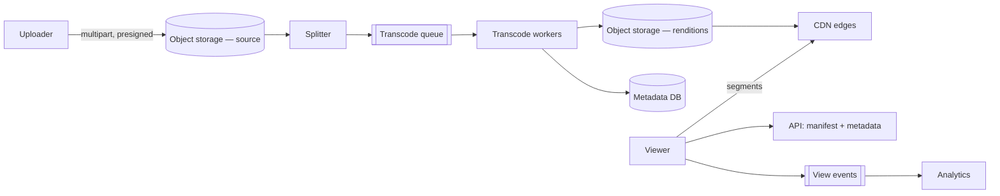

import H from '@site/src/components/Highlight';
import C from '@site/src/components/Color';
import Plain from '@site/src/components/Plain';
import Jargon from '@site/src/components/Jargon';
import Depth from '@site/src/components/Depth';
import Trace, { TraceStep } from '@site/src/components/Trace';

# Design YouTube

> **The drill:** video upload, processing and delivery at scale. <C color="orange">The design is dominated by one number — bandwidth — and by a processing pipeline measured in hours rather than seconds.</C>

<Plain>

A cinema chain that also accepts films from the public.

**Accepting a film** is not like accepting a photograph. It arrives as a single enormous reel that takes a long time to hand over, and if the handover is interrupted at 90% you do not want to start again.

**Then it must be prepared.** The same film is needed in several qualities — for a phone on a train, for a laptop, for a large screen. Preparing each is slow work, and it is the same work repeated per quality.

**And it is cut into short segments.** Not stored as one continuous reel, because a viewer on a poor connection should be able to drop to a lower quality **mid-film**, at the next segment boundary, without restarting.

**Delivery is the whole business.** One film watched by a million people is a million deliveries, and each is enormous. <C color="crimson">Sending every one from the central vault is impossible</C> — the pipes are not large enough and the cost would be absurd. So copies live in local depots everywhere, and almost every viewer is served from one near them.

<H>Photos are a storage problem. Video is a bandwidth problem, and every part of the design follows from that.</H>

</Plain>

---

## 1. Scope and the number that matters

**In:** upload, transcode, stream, search by title, view counts.
**Out:** recommendations, comments, live streaming, monetisation, copyright matching (name them as out of scope, and note copyright matching is a genuinely large subsystem).

```
  Uploads:   500 hours of video/minute      →  ~30,000 hours/hour
  Views:     1B hours watched/day
  Bandwidth: 1B hours/day × ~3 Mbps average
             ≈ 3 × 10⁹ hours·Mbps/day  →  on the order of 100+ Tbps sustained
```

<C color="crimson">That bandwidth figure is the design.</C> No origin serves it. <C color="green">A CDN is not an optimisation here — it is the only way the system exists</C>, and saying so early frames everything that follows.

Storage: one hour of source video plus all its renditions is roughly 5–10 GB, so ~30,000 hours/hour implies **hundreds of terabytes per day**.

---

## 2. Upload and processing

<Trace title="A 2-hour video from upload to playable" subtitle="Where the time goes, and why each step exists.">

<TraceStep
  title="Resumable, multipart upload"
  state={{ 'Where': 'client → object storage', 'Through API': '0 bytes', 'Resumable': 'yes', 'Playable': 'no' }}
  changed={['Where', 'Resumable']}
  note="A multi-gigabyte upload over hours will be interrupted. Multipart means a failed part retries alone.">

Presigned **multipart** upload directly to object storage. <C color="green">Parts upload in parallel and a failed part retries without restarting the whole file.</C>

</TraceStep>

<TraceStep
  title="Split into chunks for parallel transcoding"
  cost="the key trick"
  state={{ 'Chunks': '~120 × 1 min', 'Parallelism': 'high', 'Playable': 'no', 'Elapsed': 'minutes' }}
  changed={['Chunks', 'Parallelism', 'Elapsed']}
  note="Transcoding a 2-hour video serially takes hours. Chunked, it is limited only by available workers.">

Split at keyframe boundaries into short segments. <C color="green">Each segment transcodes independently on a different worker.</C>

</TraceStep>

<TraceStep
  title="Transcode each chunk into every rendition"
  cost="N × M jobs"
  state={{ 'Renditions': '144p…4K + codecs', 'Jobs': 'chunks × renditions', 'CPU': 'enormous', 'Playable': 'partially' }}
  changed={['Renditions', 'Jobs', 'CPU', 'Playable']}
  note="This is the dominant compute cost in the entire system, and it is embarrassingly parallel.">

Each chunk becomes many outputs — several resolutions, several codecs (H.264 for compatibility, AV1/VP9 for efficiency).

<C color="green">Publish low resolutions first</C> so the video becomes watchable while higher ones are still processing.

</TraceStep>

<TraceStep
  title="Package into an adaptive streaming format"
  state={{ 'Format': 'HLS / DASH manifest + segments', 'Client can': 'switch quality mid-play', 'Playable': 'yes', 'Elapsed': 'minutes to hours' }}
  changed={['Format', 'Client can', 'Playable']}
  note="The manifest lists every rendition and segment; the player chooses per segment based on measured bandwidth.">

<C color="green">Adaptive bitrate is why segmentation matters</C> — the player drops to a lower rendition at the next segment boundary rather than buffering.

</TraceStep>

<TraceStep
  title="Distribute to the edge"
  state={{ 'Popular video': 'pre-pushed to edges', 'Long tail': 'pulled on first request', 'Origin load': 'small fraction', 'Playable': 'globally' }}
  changed={['Popular video', 'Long tail', 'Origin load']}
  note="Popularity is extremely skewed — a small number of videos account for most viewing.">

<H>Push anticipated-popular content to edges proactively; let the long tail populate on first request. The distribution is steep enough that this keeps origin traffic to a small fraction of total.</H>

</TraceStep>

</Trace>

---

## 3. The architecture



<Jargon
  plain="Cutting video into short segments at several quality levels, so the player can change quality between segments."
  term="adaptive bitrate streaming"
  also={['HLS', 'DASH', 'ABR']}>

The manifest is a small text file listing renditions and segment URLs. <C color="green">All the intelligence is in the client</C> — it measures throughput and buffer level and picks the next segment's quality itself, which is why streaming scales: the server just serves static files.

</Jargon>

<C color="green">That last point is worth emphasising in an interview.</C> Once packaged, video delivery is **static file serving** — no application logic per request, which is precisely what makes CDN delivery possible at these volumes.

---

## 4. What interviewers push on

<Depth title="Transcoding economics, the long tail, and what is genuinely hard">

**Transcoding is the dominant compute cost, and the trade-offs are real.**

Each additional rendition costs CPU during processing and storage forever. <C color="orange">More efficient codecs (AV1) cut delivery bandwidth substantially and cost far more CPU to encode</C> — which is worth it for popular videos watched millions of times and a waste for a video watched twice.

<C color="green">So encode adaptively based on expected popularity:</C> everything gets a baseline H.264 ladder; videos that gain traction get re-encoded into more efficient codecs later. This is a genuine YouTube-scale optimisation and a strong thing to propose — it recognises that **encoding cost is per-video while delivery cost is per-view**, so the economics differ by orders of magnitude between the head and the tail.

**The popularity distribution shapes everything.** A small fraction of videos accounts for most viewing. Consequences:

- **Caching works extremely well** — a small edge cache serves most requests.
- **Pre-positioning is worthwhile** for anticipated-popular content (a major release, a channel with a large subscriber base).
- <C color="crimson">The long tail is expensive per view</C> — cold, fetched from origin, cached briefly, evicted. There is no fixing this; there is only recognising it.

**Storage tiering follows.** Source files are kept for re-encoding but almost never read after processing — <C color="green">archive them.</C> Rarely-watched renditions can move to cheaper tiers or, for the coldest content, be deleted and regenerated on demand from the source.

**What is genuinely hard, and worth naming as such:**

**Copyright matching at upload.** Fingerprinting every upload against a reference database of claimed content, at 500 hours per minute. It is a large-scale similarity search problem and a whole system in itself. <C color="orange">Saying "that's a substantial subsystem I'd scope separately" is a better answer than attempting it.</C>

**Live streaming is a different system.** No pre-processing possible, latency measured in seconds, transcoding on the fly, and different protocols. Do not conflate the two.

**View counting.** A hot counter on a viral video, plus fraud detection — a view must be more than a request, or the count is trivially inflated. [Batched, sharded, approximate](../14-building-blocks/05-counters-at-scale.md), with deduplication by session.

**Failure modes:**

| Failure | Effect | Handling |
| :--- | :--- | :--- |
| Transcode worker dies | One chunk incomplete | Chunk-level retry — the reason for chunking |
| Upload interrupted | Partial file | Multipart resume |
| A video goes viral | Edge miss storm | Pre-position; request coalescing at the edge |
| Origin egress spike | Cost and saturation | Should not happen if edge hit ratio is high — investigate cache keys |

<H>The framing that separates a good answer: photos are a storage problem, video is a bandwidth problem. Every decision — segmentation, adaptive bitrate, codec selection, edge distribution, tiering — exists to reduce bytes delivered or to move them closer to the viewer.</H>

</Depth>

---

## 5. What a good answer sounds like

> *"The number that matters is delivery bandwidth — on the order of 100 Tbps sustained — so this is a CDN problem before it is anything else. Uploads go multipart and resumable straight to object storage. Processing splits the video at keyframes into chunks so transcoding is parallel rather than serial, produces an ABR ladder, and publishes low resolutions first so the video is watchable early. Packaging into HLS/DASH means delivery is static file serving with no per-request logic, which is what makes edge distribution work. Popularity is steeply skewed, so pre-position the head and let the tail pull through. Encode expensive codecs only for videos that earn it — encoding cost is per video, delivery cost is per view. Copyright matching is a separate subsystem I'd scope out."*

---

## Rapid-fire recall

1. What single number dominates this design, and what follows from it?
2. Why must uploads be multipart and resumable?
3. Why is the video split into chunks before transcoding? Give two benefits.
4. Why publish low resolutions first?
5. What is adaptive bitrate, and where does the decision logic live?
6. Why does packaging make CDN delivery possible?
7. Why encode AV1 only for some videos?
8. How does the popularity distribution shape caching and pre-positioning?
9. Why archive source files, and what can be regenerated on demand?
10. Why is live streaming a different system?

<details>
<summary>Answers</summary>

1. **Delivery bandwidth** — on the order of 100+ Tbps sustained. No origin can serve it, so **CDN edge delivery is the only way the system exists**, not an optimisation.
2. Because a multi-gigabyte upload over hours **will be interrupted**. Multipart means a failed part retries alone rather than restarting the whole file, and parts upload in parallel.
3. **Parallel transcoding** — a 2-hour video transcodes in minutes rather than hours, limited only by workers. And **chunk-level retry** — a worker dying costs one chunk, not the whole job.
4. So the video becomes **watchable while higher renditions are still processing**, rather than the creator waiting for the full ladder before anything is visible.
5. Cutting video into short segments at multiple quality levels so the player can switch quality **between segments**. The decision logic lives **in the client**, which measures throughput and buffer level.
6. Because once packaged, serving video is **static file serving with no per-request application logic** — exactly what a CDN does well and at volume.
7. Because **encoding cost is per video while delivery cost is per view**. Expensive efficient codecs pay for themselves on videos watched millions of times and are pure waste on videos watched twice.
8. A small fraction of videos accounts for most viewing, so **edge caching is highly effective** and **pre-positioning anticipated-popular content is worthwhile**. The long tail remains expensive per view, which is inherent rather than fixable.
9. Because sources are needed for **future re-encoding** but almost never read after processing. **Cold renditions** can be deleted and regenerated on demand from the archived source.
10. Because there is **no pre-processing window** — transcoding happens on the fly, latency is measured in seconds, and the protocols differ. Conflating it with VOD produces a design that serves neither.

</details>

---

**Next:** [Design Spotify](./07-spotify.md) — streaming with a very different access pattern.
