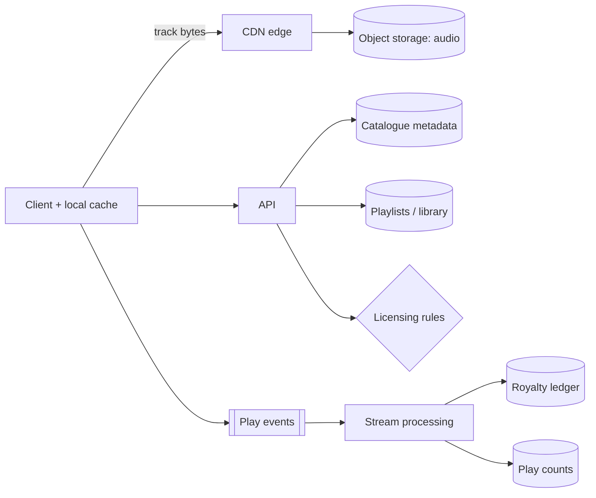

import H from '@site/src/components/Highlight';
import C from '@site/src/components/Color';
import Plain from '@site/src/components/Plain';
import Jargon from '@site/src/components/Jargon';
import Depth from '@site/src/components/Depth';
import Trace, { TraceStep } from '@site/src/components/Trace';

# Design Spotify

> **The drill:** music streaming. Superficially [YouTube](./06-youtube.md) with smaller files — and the differences in access pattern, catalogue size and licensing make it a genuinely different design.

<Plain>

A record shop where nobody buys anything; they listen.

Compared with a cinema, three things are different, and each changes the design.

**The catalogue is finite and shared.** There are perhaps a hundred million songs in the world, and everyone draws from the same set. A video site has an unbounded catalogue that grows by hundreds of hours per minute; <C color="green">a music catalogue is a fixed library you could, in principle, put a copy of everywhere.</C>

**Each item is small.** A song is a few megabytes, not gigabytes. So caching is cheap — a phone can hold hundreds of songs, and an edge server can hold a substantial fraction of everything people actually play.

**Listening is repetitive.** People watch a film once and play a song hundreds of times. <C color="green">The same bytes are requested by the same person again and again</C>, which makes client-side caching unusually effective.

And one constraint that has nothing to do with engineering: <C color="crimson">you do not own the music.</C> What may be played, where, and by whom is governed by contracts that vary by country and change over time — and every play must be counted accurately, because it determines payment.

</Plain>

---

## 1. Scope and estimates

**In:** stream a track; search; playlists; offline download; play counts.
**Out:** recommendations (mention it as a separate ML system), social features, podcasts, ads.

```
  500M users, 100M MAU active daily-ish
  Catalogue: ~100M tracks × ~3 MB (compressed, one bitrate) ≈ 300 TB
             × several bitrates/formats  ≈  1–2 PB total

  Streams: 100M users × 30 tracks/day = 3B plays/day → ~35,000/s avg
  Bandwidth: 3B × 3 MB/day ≈ 9 PB/day → ~800 Gbps average
```

<C color="green">Compare with YouTube:</C> two orders of magnitude less bandwidth, and a catalogue small enough that **the entire popular subset fits at the edge**. That is the fact the design is built on.

---

## 2. The access pattern is the design

<Trace title="Playing a track" subtitle="Watch how rarely anything reaches origin.">

<TraceStep
  title="Client cache first"
  cost="0 network"
  state={{ 'Served from': 'device storage', 'Network': 'none', 'Origin': 'untouched', 'Latency': '~0 ms' }}
  changed={['Served from', 'Network', 'Latency']}
  note="Repetitive listening means a large share of plays are of tracks the device already holds.">

The client caches recently and frequently played tracks locally.

<C color="green">A meaningful fraction of all plays never touch the network at all.</C>

</TraceStep>

<TraceStep
  title="Edge cache"
  state={{ 'Served from': 'CDN edge', 'Network': 'short hop', 'Origin': 'untouched', 'Latency': '~20 ms' }}
  changed={['Served from', 'Network', 'Latency']}
  note="Because the catalogue is finite and popularity is concentrated, edge hit ratios are very high.">

A miss goes to the nearest edge, which holds the popular catalogue.

</TraceStep>

<TraceStep
  title="Origin — the rare case"
  state={{ 'Served from': 'object storage', 'Network': 'full path', 'Origin': 'small fraction of plays', 'Latency': '~100 ms' }}
  changed={['Served from', 'Origin', 'Latency']}
  note="Obscure tracks only. The long tail exists but is a small share of total plays.">

<C color="green">Origin serves the long tail</C>, which is a small fraction of requests.

</TraceStep>

<TraceStep
  title="Prefetch the next track"
  cost="removes gaps"
  state={{ 'Playing': 'track N', 'Downloading': 'track N+1', 'Gap between tracks': 'none', 'User experience': 'seamless' }}
  changed={['Playing', 'Downloading', 'Gap between tracks']}
  note="Playlists and albums make the next track highly predictable — the strongest possible case for prefetching.">

<H>Because the next track is known in advance, it can be fetched while the current one plays. This is the single largest perceived-quality difference from video, where what comes next is unpredictable.</H>

</TraceStep>

<TraceStep
  title="Report the play"
  state={{ 'Event': 'queued asynchronously', 'Playback affected': 'no', 'Used for': 'royalties, counts, recommendations', 'Accuracy': 'must be high' }}
  changed={['Event', 'Used for', 'Accuracy']}
  note="Unlike view counts, this feeds payments — so it is closer to billing than to analytics.">

A play event goes on a queue. <C color="orange">Playback never waits for it</C>, and the event is not the tolerable-loss category it would be for a view count.

</TraceStep>

</Trace>



---

## 3. What is genuinely different from video

| | YouTube | Spotify |
| :--- | :--- | :--- |
| Catalogue | <C color="orange">Unbounded, growing</C> | <C color="green">Finite (~100M), shared</C> |
| Item size | GB | <C color="green">A few MB</C> |
| Repeat plays | Rare | <C color="green">Constant</C> |
| Client cache viability | Poor | <C color="green">Excellent</C> |
| Next item predictable | No | <C color="green">Yes — playlists, albums</C> |
| Bandwidth | ~100 Tbps | ~1 Tbps |
| Dominant constraint | <C color="crimson">Bandwidth</C> | <C color="crimson">Licensing and catalogue metadata</C> |

<C color="green">Naming that last row is what separates a considered answer from "it's YouTube with smaller files".</C>

---

## 4. The parts that are actually hard

<Depth title="Licensing, accurate play counting, and offline">

**Licensing is a first-class design constraint, not a footnote.**

Rights are granted per **territory**, per **rights holder**, and per **time window**. A track available in Germany may not be available in Japan; a licence may lapse and the track must disappear. <C color="crimson">Availability is therefore a property of (track, country, time), not of the track.</C>

Design consequences that follow directly:

- **Availability must be evaluated at request time**, against the user's territory — so it cannot simply be baked into a cached response body.
- **Catalogue changes constantly** as licences are granted and withdrawn, so the metadata layer sees continuous writes even though the audio files do not change.
- **Playlists must degrade gracefully.** A playlist containing a track unavailable in your country should skip it, not fail — and this is a common source of bugs.
- <C color="green">Geo-restriction cannot be enforced purely at the CDN</C>, because edge caching does not know territory rules; the client obtains a short-lived, territory-checked token from the API before fetching audio.

**Play counting is closer to billing than to analytics.**

Royalties are computed from plays, so the count determines payments to rights holders. That changes the requirements:

| View counts (YouTube) | Play counts (Spotify) |
| :--- | :--- |
| Approximate is fine | <C color="crimson">Must be accurate and auditable</C> |
| Lossy queue acceptable | Durable, reconcilable event log |
| Simple deduplication | Fraud detection required |

<C color="green">So plays are recorded as an immutable event log</C>, aggregated for both counts and royalties — the [event-plus-counter pattern](../14-building-blocks/05-counters-at-scale.md), where the counter is a derived cache and the log is the authority.

**A "play" also needs defining.** Typically a threshold — 30 seconds — and there is a real incentive to game it: bot farms streaming a track repeatedly to generate royalties. <C color="orange">Fraud detection is a genuine subsystem</C>: per-account rate limits, device fingerprinting, detecting coordinated patterns and implausible listening behaviour.

**Offline download is DRM, not caching.**

Downloaded audio must be encrypted and playable only while the subscription is active, which requires a licence with an expiry the client checks — and periodic re-validation, or a cancelled subscriber keeps the music indefinitely. <C color="orange">This is a client-side security problem</C>, and worth acknowledging rather than hand-waving.

**Search and the metadata layer.** Searching 100M tracks by title, artist, album and lyrics is an inverted-index problem — Elasticsearch or similar, populated from the catalogue database, with the [search-engine caveat](../04-data-storage/01-sql-vs-nosql.md) that it is a derived index and never the system of record.

**Recommendations are a separate system.** Collaborative filtering and audio-feature models producing precomputed per-user candidate sets, served from a key-value store. <C color="green">Scope it out explicitly</C> unless asked — it is an ML system, not a distributed systems problem, and attempting both in 45 minutes serves neither.

<H>The summary that distinguishes this from video: a bounded catalogue of small, repeatedly-played, immutable files makes delivery comparatively easy. The difficulty moves into metadata that changes constantly for legal reasons, and into counting plays accurately because money depends on it.</H>

</Depth>

---

## 5. What a good answer sounds like

> *"Unlike video, the catalogue is finite and small per item, so client and edge caches carry most plays and bandwidth is roughly two orders of magnitude lower. The next track is predictable from the playlist, so prefetching removes gaps entirely. The hard parts aren't delivery: availability is a function of track, territory and time because licences vary and lapse, so it's evaluated per request with a short-lived token rather than baked into a cached response. And play counts drive royalty payments, so they're an immutable auditable event log with fraud detection, not an approximate counter. Offline is DRM with expiring licences. Recommendations I'd scope as a separate ML system."*

---

## Rapid-fire recall

1. Give three properties of the catalogue that differ from video, and their consequences.
2. Roughly how does bandwidth compare with YouTube, and why?
3. Why is client-side caching far more effective here?
4. Why is prefetching viable here and not for video?
5. Why is availability a property of `(track, country, time)`?
6. Why can geo-restriction not be enforced at the CDN alone?
7. How do play counts differ in requirements from view counts?
8. What data structure records plays, and why?
9. Why does defining "a play" matter, and what does it invite?
10. Why is offline download a DRM problem rather than a caching one?

<details>
<summary>Answers</summary>

1. **Finite and shared** (a fixed library, so the popular subset fits at the edge) · **small per item** (a few MB, so caching is cheap) · **repeatedly played** (the same bytes requested again and again, making client caches effective).
2. Roughly **two orders of magnitude lower** — ~1 Tbps against ~100 Tbps. Because items are thousands of times smaller and a large share of plays are served from client or edge caches.
3. Because tracks are **small, immutable and replayed constantly**, so a phone can hold hundreds and hit them repeatedly. Video is large and typically watched once.
4. Because the **next item is known in advance** from a playlist or album. Video has no comparably predictable successor, so there is nothing specific to prefetch.
5. Because rights are granted **per territory, per rights holder and per time window** — a track available in one country may not be in another, and licences lapse. So availability must be evaluated per request rather than stored as a property of the track.
6. Because **edge caches do not know territory rules**. The client obtains a **short-lived, territory-checked token** from the API before fetching audio, so the rule is enforced at the API rather than at the cache.
7. Play counts **determine royalty payments**, so they must be **accurate and auditable** with fraud detection, whereas view counts can be approximate and lossy.
8. An **immutable event log**, aggregated into counts and royalties. The counter is a derived cache; the log is the authority — so figures are reproducible and correctable.
9. Because a threshold (typically 30 seconds) decides whether royalties are owed, which creates a **direct financial incentive to game it** — bot farms streaming repeatedly. That makes fraud detection a genuine subsystem.
10. Because downloaded audio must be **playable only while the subscription is active**, requiring encryption plus an expiring licence the client re-validates. Otherwise a cancelled subscriber keeps the library permanently.

</details>

---

**Next:** [Design WhatsApp](./08-whatsapp.md) — the realtime messaging drill.
