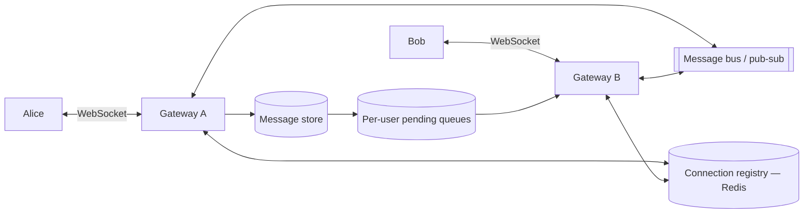

import H from '@site/src/components/Highlight';
import C from '@site/src/components/Color';
import Plain from '@site/src/components/Plain';
import Jargon from '@site/src/components/Jargon';
import Depth from '@site/src/components/Depth';
import Trace, { TraceStep } from '@site/src/components/Trace';

# Design WhatsApp

> **The drill:** realtime messaging. The design turns on one fact — <C color="orange">connections are server state</C> — and on what happens when the recipient is offline, which is most of the time.

<Plain>

A message service where people are reachable at some times and not others.

**If both are present**, it is easy: pass the note across.

**If the recipient is out**, you cannot just fail. You hold the note and hand it over when they return. <C color="green">So the service is not really a delivery pipe — it is a mailbox with a delivery pipe attached</C>, and the mailbox is the part that always works.

Then the operational reality of holding open lines.

**Each connected person occupies a line.** Not much individually; enormously in aggregate when there are hundreds of millions of them.

**The lines are held by specific operators.** If Alice is on operator A's board and Bob on operator B's, <C color="crimson">operator A has no way to reach Bob</C> — they are not sitting together. Something has to carry the message between operators, and that something is the piece people forget.

**And the boards are replaced regularly.** Every time the switchboard is upgraded, every line drops and everyone reconnects at once — a stampede that must be planned for rather than discovered.

</Plain>

---

## 1. Scope and estimates

**In:** 1:1 messages, group messages, delivery and read receipts, online presence, offline delivery, media.
**Out:** voice/video calls, end-to-end encryption key management (acknowledge it, scope it), status/stories.

```
  2B users, ~500M concurrently connected at peak
  100B messages/day  →  ~1.2M messages/s average, higher at peak

  Connection memory: 500M × ~20 KB  ≈  10 TB of RAM just to hold connections
  Message storage: mostly transient — delivered then optionally deleted
```

<C color="crimson">That 10 TB figure is the point.</C> This system is sized by **concurrent connections**, not by request rate — an unusual profile, and stating it early frames the whole design.

---

## 2. Connections make servers stateful

<Jargon
  plain="A connection held open so the server can send without being asked."
  term="persistent connection"
  also={['WebSocket', 'long-lived TCP', 'the connection gateway']}>

Once a server holds a user's connection, <C color="crimson">that user is pinned to that server</C> — the load balancer cannot route their inbound messages anywhere else. This is [the statefulness problem](../02-networking/06-realtime-communication.md), and it is what the architecture must contain.

</Jargon>

<Trace title="Alice messages Bob" subtitle="Four states of Bob, four different paths.">

<TraceStep
  title="Alice sends"
  state={{ 'Alice on': 'gateway A', 'Bob': 'unknown', 'Message': 'persisted first', 'Delivered': 'no' }}
  changed={['Alice on', 'Message']}
  note="Persist before attempting delivery — the message must survive even if delivery fails.">

Gateway A receives the message, assigns an id, and **writes it to durable storage** before anything else.

</TraceStep>

<TraceStep
  title="Look up where Bob is"
  state={{ 'Registry': 'bob → gateway B', 'Bob': 'online', 'Message': 'persisted', 'Delivered': 'in progress' }}
  changed={['Registry', 'Bob', 'Delivered']}
  note="A connection registry in Redis, with TTL and heartbeats so a crashed gateway's entries expire.">

The **connection registry** says Bob is connected to gateway B.

</TraceStep>

<TraceStep
  title="Route via the message bus"
  cost="the piece people forget"
  state={{ 'Path': 'A → bus → B → Bob', 'Delivered': 'yes', 'Receipt': 'sent to Alice', 'Bob': 'online' }}
  changed={['Path', 'Delivered', 'Receipt']}
  note="Without a bus between gateways, gateway A simply cannot reach a user held by gateway B.">

Gateway A publishes to Bob's channel; gateway B is subscribed and writes down Bob's socket.

<C color="green">This inter-gateway bus is mandatory the moment there is more than one gateway.</C>

</TraceStep>

<TraceStep
  title="Bob is offline"
  state={{ 'Registry': 'no entry for bob', 'Message': 'queued in his mailbox', 'Delivered': 'pending', 'Receipt': 'sent (one tick)' }}
  changed={['Registry', 'Message', 'Delivered', 'Receipt']}
  note="The common case — most users are offline most of the time. The mailbox is the primary mechanism, not a fallback.">

The message sits in Bob's **per-user pending queue** until he reconnects.

</TraceStep>

<TraceStep
  title="Bob reconnects"
  state={{ 'Bob': 'online, gateway C', 'Pending drained': 'in order', 'Delivered': 'yes', 'Receipt': 'two ticks' }}
  changed={['Bob', 'Pending drained', 'Delivered', 'Receipt']}
  note="Ordering per conversation matters; global ordering across all conversations does not.">

On connect, Bob's gateway drains his pending queue in order and registers him in the registry.

</TraceStep>

<TraceStep
  title="Bob has three devices"
  cost="fan-out per user"
  state={{ 'Devices': '3', 'Delivery': 'to each device', 'Per-device cursor': 'tracked', 'Read receipt': 'when any device reads' }}
  changed={['Devices', 'Delivery', 'Per-device cursor']}
  note="Multi-device turns per-user delivery into per-device delivery with independent progress.">

<H>Each device needs its own delivery cursor, so a message read on the phone still syncs to the laptop. Multi-device is a bigger design change than it appears — the unit of delivery stops being the user.</H>

</TraceStep>

</Trace>



---

## 3. The gateway tier

<C color="green">Separate the connection-holding tier from business logic</C>, for reasons that follow directly from the numbers:

| Tier | Scales on | Deploy frequency | State |
| :--- | :--- | :--- | :--- |
| **Gateways** | <C color="orange">Concurrent connections</C> | Rarely | Sockets |
| **Application services** | Request rate | Constantly | Stateless |

<C color="crimson">Every gateway deploy drops every connection it holds.</C> Millions of clients reconnect simultaneously — a thundering herd against authentication and the registry. Mitigations: **staggered rollout**, **jittered client backoff**, and keeping gateways simple enough that they rarely need to change.

---

## 4. What interviewers push on

<Depth title="Ordering, groups, and end-to-end encryption">

**Ordering: per conversation, never global.**

Global ordering across all messages would require a single sequencer — a throughput ceiling of one. <C color="green">Order within a conversation is what users perceive</C>, so sequence per conversation.

Two mechanisms, and the choice matters:

- **Server-assigned sequence numbers per conversation** — simple, and requires all messages in a conversation to pass a common point.
- **Client timestamps plus a conversation-scoped counter**, reconciled server-side — avoids the bottleneck, and needs care because [client clocks are untrustworthy](../06-distributed-systems/04-time-and-ordering.md).

<C color="orange">Say explicitly that global ordering is neither needed nor achievable</C> — candidates often try to provide it and paint themselves into a corner.

**Groups change the delivery arithmetic.**

A 1,000-member group message becomes 1,000 deliveries (more with multi-device). Two approaches, the same [fan-out trade](./04-twitter.md) as feeds:

- **Fan-out on write** — copy into every member's queue. Fast delivery; expensive for large groups.
- **Fan-out on read** — store once per group, members pull. Cheap write; more read work and harder per-member receipts.

<C color="green">Most systems push for small groups and impose a size limit</C>, which is why group sizes are capped — the cap is a design decision, not an arbitrary product choice.

**End-to-end encryption changes what the server can do, and is worth naming precisely.**

With E2EE, the server relays ciphertext it cannot read. Consequences:

- <C color="crimson">No server-side search</C> — search must run on the client over locally-held messages.
- <C color="crimson">No server-side spam or abuse detection on content</C> — only metadata-based signals remain.
- <C color="crimson">Group fan-out must encrypt per recipient device</C>, since each has different keys — which is why large E2EE groups are expensive and why sender-key schemes exist to amortise it.
- <C color="green">Multi-device requires key synchronisation</C>, a genuinely hard subproblem.
- <C color="orange">Media is encrypted with a per-message key</C>; the ciphertext can live on a CDN while the key travels in the message.

<C color="green">Scope E2EE explicitly</C>: acknowledge these consequences, and say key management is a subsystem you would treat separately. That reads far better than either ignoring it or attempting the Signal protocol in ten minutes.

**Presence is more expensive than it looks.** "Online" status for a user with 500 contacts means a status change fans out to 500 subscribers. At scale this can exceed message traffic. Mitigations: <C color="green">only push presence for open conversations</C>, coarsen it (`last seen recently` rather than a live flag), and rate-limit transitions.

**Receipts multiply traffic.** Delivered and read receipts are themselves messages, so a chat generates roughly 3× the message volume. In a group, read receipts are per member per message — <C color="crimson">quadratic in group size</C>, which is another reason groups are capped.

**Failure modes:**

| Failure | Effect | Handling |
| :--- | :--- | :--- |
| Gateway crashes | Its users disconnect | Clients reconnect with jitter; registry entries expire by TTL |
| Registry unavailable | Cannot locate recipients | Fall back to queueing everything; degrade to offline-style delivery |
| Message bus lag | Delivery delayed | Messages are already persisted — delay, not loss |
| Client offline for weeks | Large pending queue | Cap retention; deliver most recent first |

<H>The through-line: persist first, deliver second. Once the message is durably stored, every delivery failure becomes a latency problem rather than a data-loss problem — which is what lets everything else be best-effort.</H>

</Depth>

---

## 5. What a good answer sounds like

> *"This is sized by concurrent connections, not request rate — 500M connections is around 10 TB of RAM just to hold them, so gateways are a separate tier from business logic. Persist the message before attempting delivery, so any failure downstream is a delay rather than a loss. A connection registry says which gateway holds a user, and a pub/sub bus carries messages between gateways — without it, a gateway simply can't reach a user held by another. Offline users have a pending queue drained on reconnect, which is the common case rather than the fallback. Ordering is per conversation; global ordering is neither needed nor achievable. Multi-device makes delivery per-device with independent cursors. E2EE would remove server-side search and content moderation, and I'd scope key management separately."*

---

## Rapid-fire recall

1. What is this system sized by, and what is the resulting figure?
2. Why must the message be persisted before delivery is attempted?
3. What two components are mandatory once there is more than one gateway?
4. Why is the offline path the primary mechanism rather than a fallback?
5. Why is every gateway deploy disruptive, and what mitigates it?
6. Why is global message ordering neither needed nor achievable?
7. How does multi-device change the unit of delivery?
8. Give three capabilities E2EE removes from the server.
9. Why can presence traffic exceed message traffic?
10. Why are group sizes capped?

<details>
<summary>Answers</summary>

1. **Concurrent connections**, not request rate. 500M connections at ~20 KB each is roughly **10 TB of RAM** before any messages flow.
2. So that **any downstream delivery failure is a latency problem rather than data loss**. Once durably stored, delivery can be retried indefinitely and everything after it can be best-effort.
3. A **connection registry** (which gateway holds which user) and a **pub/sub message bus** between gateways. Without the bus, a gateway cannot reach a user connected to a different gateway.
4. Because **most users are offline most of the time**, so the per-user pending queue handles the majority of messages. The system is a mailbox with a delivery pipe attached, not the reverse.
5. Because it **drops every connection the gateway holds**, and millions of clients reconnect simultaneously — a thundering herd against auth and the registry. Mitigated by **staggered rollout**, **jittered client backoff**, and keeping gateways simple so they change rarely.
6. **Not needed** because users only perceive order within a conversation. **Not achievable** because it would require a single global sequencer, capping throughput at one.
7. Delivery becomes **per device rather than per user**, each with its own cursor — so a message read on one device still syncs to the others, and fan-out multiplies by device count.
8. **Server-side search** · **content-based spam and abuse detection** · **cheap group fan-out** (must encrypt per recipient device). It also makes **multi-device key synchronisation** a hard subproblem.
9. Because a status change **fans out to every contact with an open conversation** — a user with 500 contacts generates 500 notifications per transition, and transitions are frequent.
10. Because **fan-out is linear in group size** and **read receipts are quadratic** (per member, per message). The cap is a deliberate design decision bounding both.

</details>

---

**Next:** [Design Google Docs](./09-google-docs.md) — concurrent editing, which is a genuinely different problem.
