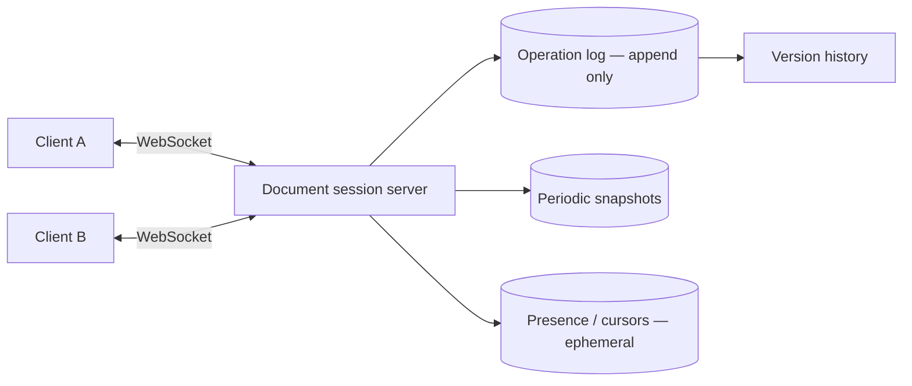

import H from '@site/src/components/Highlight';
import C from '@site/src/components/Color';
import Plain from '@site/src/components/Plain';
import Jargon from '@site/src/components/Jargon';
import Depth from '@site/src/components/Depth';
import Trace, { TraceStep } from '@site/src/components/Trace';

# Design Google Docs

> **The drill:** real-time collaborative editing. Unlike most drills this is not a scaling problem — <C color="orange">it is a correctness problem</C>, and the hard part fits in a single document.

<Plain>

Two people editing the same sheet of paper at the same time, in different rooms, each with a copy.

Alice inserts a word at position 5. Bob, at the same moment, deletes a word at position 3.

Each sends their change to the other. And Bob's deletion has **shifted everything after position 3**, so when Alice's "insert at position 5" arrives, position 5 is no longer the place she meant. <C color="crimson">Applied naively, her word lands somewhere she did not intend, and the two copies now differ.</C>

Neither did anything wrong. The instructions were correct when written and became wrong in transit, because the document moved underneath them.

Two ways out.

**Rewrite the instruction as it arrives.** Knowing Bob deleted at position 3, adjust Alice's "insert at 5" to "insert at 4". Requires knowing exactly what happened in between, and the bookkeeping is exacting.

**Stop using positions.** Give every character a permanent identity that never shifts, so an insertion says *"after **this** character"* rather than *"at position 5"*. Deleting something elsewhere cannot change what "after this character" means. <C color="green">Nothing needs adjusting because nothing moved.</C>

The second sounds obviously better and costs more memory per character. That trade is the whole of this design.

</Plain>

---

## 1. Scope

**In:** multiple users editing one document concurrently; changes visible within ~100 ms; cursors and presence; offline editing with later sync; history.
**Out:** rich formatting semantics, comments, suggestions mode, spreadsheets (different data model).

<C color="green">Say the scale honestly:</C> a document has a handful of concurrent editors, not millions. <C color="orange">The scaling dimension is *number of documents*, which shards trivially by document id.</C> The difficulty is entirely within one document.

| Question | Answer |
| :--- | :--- |
| Concurrent editors per doc | Typically < 10, occasionally ~50 |
| Latency | Under ~100 ms for a keystroke to appear |
| Consistency | <C color="crimson">All replicas must converge to the same document</C> |
| Offline | Must work, and merge later |
| Durability | <C color="crimson">Never lose a keystroke</C> |

---

## 2. Why naive approaches fail

<Trace title="Two concurrent edits" subtitle="Each approach, and where it breaks.">

<TraceStep
  title="Send the whole document"
  cost="last write wins"
  state={{ 'Alice sends': 'full doc', 'Bob sends': 'full doc', 'Result': "one overwrites the other", 'Converged': 'yes, wrongly' }}
  changed={['Alice sends', 'Bob sends', 'Result']}
  note="Converges, and silently destroys one person's work — the same failure as LWW anywhere.">

Both replicas agree afterwards. <C color="crimson">One user's edits are gone with no warning.</C>

</TraceStep>

<TraceStep
  title="Lock the document"
  state={{ 'Concurrency': 'one editor at a time', 'Correct': 'yes', 'Collaborative': 'NO', 'Verdict': 'defeats the purpose' }}
  changed={['Concurrency', 'Collaborative', 'Verdict']}
  note="Correct and not the product. Worth mentioning to show you considered it, then discarding.">

Correct, and it is no longer collaborative editing.

</TraceStep>

<TraceStep
  title="Send positional operations"
  cost="positions shift"
  state={{ 'Alice op': 'insert "x" at 5', 'Bob op': 'delete at 3', 'Applied naively': 'divergence', 'Converged': 'NO' }}
  changed={['Alice op', 'Bob op', 'Applied naively', 'Converged']}
  note="The core problem: an operation is written against a document state that has already changed by the time it arrives.">

<C color="crimson">Bob's delete shifts every later index, so Alice's "position 5" now means the wrong place.</C> The two replicas diverge.

</TraceStep>

<TraceStep
  title="OT — transform the operation on arrival"
  state={{ 'Alice op arrives': 'insert at 5', 'Transformed to': 'insert at 4', 'Converged': 'yes', 'Cost': 'exacting bookkeeping' }}
  changed={['Alice op arrives', 'Transformed to', 'Converged', 'Cost']}
  note="Operational Transformation — what Google Docs actually uses, typically with a central server to order operations.">

<C color="green">Each incoming operation is adjusted against the operations applied since it was created.</C>

Correct, and <C color="crimson">the transformation functions are notoriously difficult to get right</C> for every pair of operation types.

</TraceStep>

<TraceStep
  title="CRDT — give characters identities"
  state={{ 'Character id': 'unique, ordered, immutable', 'Alice op': 'insert after id-7f3', 'Converged': 'yes, automatically', 'Cost': 'metadata per character' }}
  changed={['Character id', 'Alice op', 'Converged', 'Cost']}
  note="No transformation needed — the operation refers to something that cannot move.">

Every character has a permanent identifier. An insert says *"after `id-7f3`"*, which remains meaningful regardless of what else happened.

<H>Because operations reference immutable identities rather than positions, merging is commutative and associative — replicas converge whatever order the operations arrive in, with no central coordinator.</H>

</TraceStep>

<TraceStep
  title="The CRDT cost"
  cost="tombstones and metadata"
  state={{ 'Per character': 'id + metadata', 'Deleted characters': 'tombstoned, not removed', 'Document growth': 'unbounded without compaction', 'Verdict': 'manageable' }}
  changed={['Per character', 'Deleted characters', 'Document growth']}
  note="A deleted character must remain as a tombstone, or an operation referencing it becomes meaningless.">

<C color="crimson">A document edited heavily accumulates metadata far larger than its visible text</C> — needing periodic compaction once no replica can reference the tombstones.

</TraceStep>

</Trace>

---

## 3. OT versus CRDT

<Jargon
  plain="Two ways to let concurrent edits merge without a central lock."
  term="OT and CRDT"
  also={['operational transformation', 'conflict-free replicated data type']}>

**OT** transforms incoming operations against concurrent ones — usually with a **central server** ordering them. **CRDTs** design the data type so merging is inherently order-independent, needing **no coordinator**.

</Jargon>

| | OT | CRDT |
| :--- | :--- | :--- |
| Needs a central server | <C color="orange">Usually yes</C> | <C color="green">No — peer-to-peer viable</C> |
| Metadata overhead | <C color="green">Low</C> | <C color="crimson">High — id per character, tombstones</C> |
| Implementation difficulty | <C color="crimson">Very high — transform functions</C> | <C color="green">Moderate — merge is the type's property</C> |
| Offline for long periods | Harder — long transform chains | <C color="green">Natural</C> |
| Used by | Google Docs | Figma, Automerge, Yjs, many newer tools |

<C color="green">Both are correct answers.</C> Saying *"OT with a central server, or a CRDT if we wanted offline-first and peer-to-peer"* and naming the trade is a stronger answer than picking one and defending it as the only option.

---

## 4. The system around the algorithm

**Documents shard by document id** — each is an independent unit, so this scales by adding servers with no cross-shard interaction. <C color="green">All active editors of one document must connect to the same session server</C>, which makes routing consistent-hash by document id.

**Store the operation log, not just the document.** Operations are appended; the current document is a **fold** over them, with periodic snapshots so opening a document does not replay from the beginning. <C color="green">This is [event sourcing](../09-architecture-styles/03-event-sourcing-and-cqrs.md)</C>, and here it is genuinely the right shape — version history and undo come free, because the domain *is* a sequence of operations.

**Presence and cursors are ephemeral** — broadcast, never persisted. Losing them costs nothing.

---

## 5. What interviewers push on

<Depth title="Offline, undo, and the parts that are harder than the merge">

**Offline editing is where CRDTs earn their overhead.** A client offline for a week accumulates hundreds of operations against a stale document. With a CRDT they merge automatically, whatever else happened. <C color="crimson">With OT, transforming a long chain against a long chain is expensive and error-prone</C>, which is why offline-first tools have largely converged on CRDTs.

**Undo is harder than it looks.** In a single-user editor, undo pops a stack. Collaboratively, it must be **selective**: undoing *your* last change, not the last change *anyone* made — and your change may be buried under later edits by others.

<C color="green">The correct model is that undo generates a new inverse operation</C> rather than removing history. Undoing an insert emits a delete of that character id; undoing a delete re-inserts. This keeps the log append-only and makes undo just another operation that merges normally.

**Snapshots and compaction.** Replaying a million operations to open a document is unacceptable, so snapshot periodically and replay from there. For CRDTs, tombstones can be garbage-collected once every replica has acknowledged past that point — <C color="orange">which requires knowing every replica's position, and an offline client can block collection indefinitely.</C> Practical systems bound this with a cutoff, forcing a very stale client to resynchronise from a snapshot instead.

**Access control changes mid-session.** Revoking someone's access while they are editing must terminate their session and reject their in-flight operations. <C color="crimson">Checking permissions only at document-open is a real vulnerability</C> — permissions must be re-validated per operation batch, or at least on a short interval.

**Large documents.** A very long document should not require every client to hold and merge the whole structure. Practical systems split into blocks or sections, with operations scoped to a block — reducing metadata and merge cost, at the price of handling operations spanning block boundaries.

**What this drill is really testing.** Almost uniquely among these questions, <H>the answer is not "shard it and add caching". It is recognising that concurrent mutation of shared ordered state has no naive solution, and being able to name OT and CRDTs and state their trade honestly.</H>

Candidates who try to answer this with load balancers and read replicas have missed the question entirely — and interviewers use it precisely because it cannot be answered by pattern-matching to the other drills.

</Depth>

---

## 6. What a good answer sounds like

> *"This isn't a scaling problem — documents shard trivially by id and there are only a handful of concurrent editors. The difficulty is inside one document: positional operations break because concurrent edits shift indices, so replicas diverge. Two real solutions: OT, which transforms incoming operations against concurrent ones and usually needs a central server to order them — that's what Docs uses, and the transform functions are the hard part. Or a CRDT, giving every character an immutable identity so operations reference something that can't move, making merges commutative and coordination-free — at the cost of per-character metadata and tombstones. I'd take a CRDT if offline-first matters. Store the operation log with periodic snapshots, which gives history and undo naturally; undo emits an inverse operation rather than rewriting history. Presence is ephemeral."*

---

## Rapid-fire recall

1. Why is this not primarily a scaling problem, and what does shard trivially?
2. Why do positional operations diverge under concurrent editing?
3. What does OT do, and what does it usually require?
4. What does a CRDT change about how an operation is expressed?
5. Why do CRDT merges converge regardless of arrival order?
6. What does a CRDT cost, and why can deleted characters not simply be removed?
7. Compare OT and CRDT on coordination, metadata and implementation difficulty.
8. Why store the operation log rather than only the document?
9. Why is collaborative undo harder than single-user undo, and how is it modelled?
10. What can block tombstone garbage collection, and how is it bounded?

Answers

1. Because a document has only a handful of concurrent editors; the scaling dimension is the **number of documents**, which shards trivially by document id. The difficulty is entirely **within one document**.
2. Because an operation is written against a document state that **changes before it arrives** — a concurrent delete shifts every later index, so "insert at position 5" no longer refers to the intended place.
3. **Operational Transformation** adjusts an incoming operation against the operations applied since it was created. It usually requires a **central server** to establish a total order of operations.
4. Operations reference **immutable character identities** ("insert after `id-7f3`") rather than positions — so nothing an operation refers to can move.
5. Because merging becomes **commutative, associative and idempotent** — the merge is a property of the data type itself, so any arrival order produces the same result with no coordination.
6. **Per-character metadata and tombstones.** Deleted characters must remain as tombstones because other operations may still reference them; removing them would make those operations meaningless.
7. **Coordination**: OT usually needs a central server; CRDTs need none. **Metadata**: OT low, CRDT high. **Implementation**: OT very hard (transform functions for every operation pair); CRDT moderate (merge is inherent to the type).
8. Because the document is a **fold over the operations**, so the log gives **version history and undo for free** — and periodic snapshots keep opening a document fast. The domain genuinely is a sequence of operations.
9. Because it must be **selective** — undoing *your* last change rather than the most recent change by anyone, and yours may be buried under later edits. It is modelled as **emitting a new inverse operation**, keeping the log append-only.
10. An **offline client that has not acknowledged** past that point, since tombstones cannot be collected while any replica might still reference them. Bounded by a **cutoff** that forces very stale clients to resynchronise from a snapshot.

---

**Next:** [Design Uber](./10-uber.md) — matching riders to drivers in real time.
