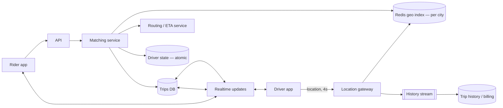

import H from '@site/src/components/Highlight';
import C from '@site/src/components/Color';
import Plain from '@site/src/components/Plain';
import Jargon from '@site/src/components/Jargon';
import Depth from '@site/src/components/Depth';
import Trace, { TraceStep } from '@site/src/components/Trace';

# Design Uber

> **The drill:** match riders to nearby drivers in real time. <C color="orange">Two distinct problems wear one name</C> — finding candidates (a geospatial index problem) and choosing among them (a matching problem) — and conflating them is the usual failure.

<Plain>

A taxi office with drivers moving around a city.

**Finding who is nearby** means knowing roughly where everyone is. Drivers report their position constantly, and the office needs to answer *"who is within two miles of this address?"* in a fraction of a second, without checking every driver.

**Choosing which one to send** is a different question, and the obvious answer is wrong. The closest driver as the crow flies may be on the other side of a river with no bridge for three miles. <C color="crimson">Straight-line distance is not travel time</C>, and travel time is what the rider experiences.

**And there is a race.** Three requests arrive at once and the same driver is nearest to all three. Offer them to all three and two riders are told a driver is coming who is not. <C color="crimson">One driver can only accept one trip</C>, and the system must enforce that.

**Finally, the reporting itself is the load.** Fifty thousand drivers each reporting every four seconds is more writes per second than the ride requests by a wide margin — and almost all of it is disposable within seconds.

</Plain>

---

## 1. Scope and estimates

**In:** driver location updates; find nearby drivers; match and dispatch; trip lifecycle; ETA.
**Out:** pricing and surge (mention as separate), payments, ratings, driver onboarding, routing engine internals.

```
  Active drivers (peak, globally):  ~1M
  Location update interval:          4 s
  Location writes:  1M / 4 s      =  250,000 writes/s

  Ride requests:    ~5,000/s
  Ratio: location updates are ~50× the ride requests
```

<H>The dominant write load is not rides — it is location telemetry, by roughly 50×. Any design that stores every location update in the primary database has already failed.</H>

---

## 2. Where locations live

<Trace title="250,000 location writes per second" subtitle="Each step removes load the previous one could not carry.">

<TraceStep
  title="Write every update to Postgres"
  cost="index thrash"
  state={{ 'Writes/s': '250,000', 'Store': 'relational, indexed', 'Index churn': 'severe', 'Verdict': 'fails immediately' }}
  changed={['Writes/s', 'Store', 'Index churn', 'Verdict']}
  note="Updating an indexed column means deleting and reinserting an index entry — 250,000 times a second.">

<C color="crimson">Every update rewrites index entries and generates MVCC garbage faster than vacuum can reclaim it.</C>

</TraceStep>

<TraceStep
  title="Recognise that current location is disposable"
  state={{ 'Durability needed': 'none — superseded in 4 s', 'Store': 'Redis', 'Writes/s': '250,000', 'Verdict': 'viable' }}
  changed={['Durability needed', 'Store', 'Verdict']}
  note="Losing a position update costs nothing; the next one arrives four seconds later.">

<C color="green">Current position is the ultimate tolerable-loss data.</C> Keep it in Redis (`GEOADD`/`GEOSEARCH`), and persist to durable storage only for history and billing, asynchronously and batched.

</TraceStep>

<TraceStep
  title="Shard by city"
  state={{ 'Shard key': 'city / region', 'Cross-shard queries': 'never', 'Load per shard': 'manageable', 'Verdict': 'good' }}
  changed={['Shard key', 'Cross-shard queries', 'Load per shard']}
  note="A rare case with a natural, stable, evenly-loaded shard key that is present in every query.">

Proximity queries are inherently local — a rider in London never needs Tokyo's drivers.

<C color="green">This satisfies all four shard-key requirements, which is unusually convenient.</C>

</TraceStep>

<TraceStep
  title="Only reindex on meaningful movement"
  cost="order-of-magnitude reduction"
  state={{ 'Writes/s': '~25,000', 'Trigger': 'cell change or distance threshold', 'Accuracy loss': 'negligible', 'Verdict': 'good' }}
  changed={['Writes/s', 'Trigger', 'Accuracy loss']}
  note="A driver who has moved eight metres does not need reindexing.">

Update the spatial index only when the driver crosses a cell boundary or moves beyond a threshold.

</TraceStep>

<TraceStep
  title="Query cell plus neighbours, then filter"
  state={{ 'Query': '9 cells', 'Candidates': '~50 drivers', 'Then': 'exact distance filter', 'Latency': 'a few ms' }}
  changed={['Query', 'Candidates', 'Then', 'Latency']}
  note="One cell misses drivers just across a boundary — the classic geospatial bug.">

<C color="green">Query the 3×3 block of cells, then compute true distance</C> — see [geospatial indexing](../14-building-blocks/03-geospatial-indexing.md).

</TraceStep>

</Trace>

---

## 3. Matching is not proximity

<Jargon
  plain="Finding who is nearby, versus deciding which of them to send."
  term="candidate generation vs ranking"
  also={['retrieval and ranking']}>

<C color="green">Proximity produces candidates cheaply; ranking chooses among a small set expensively.</C> This two-stage shape appears in search, recommendations and ads as well — cheap retrieval, expensive scoring on the survivors.

</Jargon>

**Ranking uses more than distance:**

| Signal | Why |
| :--- | :--- |
| **ETA from a routing engine** | Straight-line distance ignores rivers, one-ways and traffic |
| Driver acceptance likelihood | An offer that will be declined wastes seconds |
| Direction of travel | A driver heading away is worse than one heading toward |
| Fairness across drivers | Systematically starving some drivers loses them |
| Global efficiency | The locally-best match may be globally poor |

<C color="orange">That last row is worth raising.</C> Greedy per-request matching assigns the nearest driver to whoever asked first. **Batched matching** — collecting requests over a few seconds and solving an assignment problem across them — produces materially better global outcomes, at the cost of a small delay. It is a genuine design choice and a strong thing to propose.

---

## 4. The dispatch race

<C color="crimson">The correctness problem in this design.</C> One driver, three simultaneous requests.

```
  1. Candidates generated for request A, B, C — driver D is in all three
  2. Offer sent to D for request A
  3. D must be EXCLUDED from candidates for B and C while the offer is live
  4. D accepts → trip created, D unavailable
     D declines or times out → D returns to the pool, next candidate offered
```

<C color="green">The mechanism is a short-lived exclusive lock on the driver</C>, with a TTL so a crashed dispatcher cannot strand them. Implemented as an atomic `SET NX` with expiry, or a state column updated with a conditional write.

<C color="crimson">Do not model this as a long-held lock.</C> Offers time out in seconds; a lock with no expiry removes a driver from the pool permanently when a dispatcher crashes — and [locks without fencing are unsafe anyway](../06-distributed-systems/03-consensus-and-quorums.md), so the trip creation itself should be conditional on the driver still being available.

---

## 5. The rest of the system



<Depth title="Trip state, surge, and what breaks">

**The trip is a state machine, and it must be durable.**

```
  requested → matched → accepted → arrived → in_progress → completed
                    ↘ cancelled (from several states)
```

<C color="green">Store transitions, not just current state</C> — disputes, refunds and driver payments all need the history, and the timestamps of each transition are what billing is computed from. Transitions should be **idempotent**, because both apps retry over unreliable mobile networks.

**Both parties need live updates**, which means persistent connections — the same [gateway pattern](./08-whatsapp.md) as messaging, with the same statefulness consequences.

**Surge pricing is a separate system**, and worth scoping out explicitly. It computes supply/demand ratios per area over a short window and adjusts a multiplier. <C color="orange">Uber's H3 hexagonal grid exists largely for this</C> — hexagons have equidistant neighbours, which makes spatial smoothing of demand cleaner than squares. Mention it, do not build it.

**ETA is a routing problem, not a geometry problem.** Real ETAs come from a road-network graph with live traffic — a substantial system in itself. <C color="green">Scope it as a service you call</C>, and note that its latency is on the matching path, so results are cached per origin/destination cell pair.

**Failure modes:**

| Failure | Effect | Handling |
| :--- | :--- | :--- |
| Redis geo index lost | Cannot find drivers in that city | Rebuild from the next round of location updates — ~4 seconds |
| Driver app loses connectivity | Stale position; may be offered a trip they cannot take | Age out positions; require acceptance to confirm |
| Dispatcher crashes mid-offer | Driver locked | TTL on the lock releases them |
| Matching service overloaded | Riders wait | Shed by city; degrade to simpler nearest-driver ranking |
| Routing service down | No ETAs | <C color="green">Fall back to straight-line distance</C> — degraded but functional |

That last row is a good example of [graceful degradation](../10-reliability/03-graceful-degradation.md): straight-line distance is a *worse* match, and it is far better than no dispatch at all.

**Where it breaks at 10×.** Not the ride volume — that shards by city. The pressures are **location write volume** (mitigated by movement thresholds), **matching latency** during peaks in dense cities, and **routing service capacity**, which is called once per candidate per request unless results are cached.

<H>The shape to carry away: separate high-churn disposable telemetry from durable transactional state, shard the whole thing by city because geography partitions naturally, and treat matching as candidate generation followed by ranking — with an atomic exclusion so one driver is never promised twice.</H>

</Depth>

---

## 6. What a good answer sounds like

> *"The dominant write load is location telemetry — around 250,000 writes a second, roughly 50× the ride requests — and it's disposable, superseded every four seconds. So it lives in Redis, sharded by city, updated only on meaningful movement, with history streamed asynchronously to durable storage for billing. Proximity queries hit the cell plus its eight neighbours, then filter by real distance. That gives candidates; choosing among them is a separate ranking problem using ETA from a routing service, not straight-line distance, plus acceptance likelihood and direction. The correctness issue is that one driver can be nearest to several requests at once, so dispatch takes a short TTL'd exclusive lock and trip creation is conditional on the driver still being free. The trip is a durable state machine with idempotent transitions. Surge and routing are separate systems I'd call, not build."*

---

## Rapid-fire recall

1. What is the dominant write load, and how does it compare with ride requests?
2. Why does storing every location update in a relational database fail?
3. Why is current position the ultimate tolerable-loss data?
4. Why is city an unusually good shard key?
5. What two techniques reduce location write volume, and by how much?
6. Why query nine cells rather than one?
7. Distinguish candidate generation from ranking, and name three ranking signals beyond distance.
8. What is the dispatch race, and how is it resolved safely?
9. Why must the driver lock have a TTL?
10. What should happen when the routing service is unavailable?

<details>
<summary>Answers</summary>

1. **Location telemetry** — roughly 250,000 writes/second at 1M drivers reporting every 4 seconds, about **50× the ride request rate**.
2. Because **updating an indexed column deletes and reinserts an index entry**, so the index churns 250,000 times a second and MVCC garbage accumulates faster than vacuum reclaims it.
3. Because it is **superseded within four seconds** by the next update — losing one costs nothing, so durability guarantees would be paid for and never used.
4. Because proximity queries are **inherently local**, so it satisfies all four shard-key requirements: high cardinality, even-ish distribution, **present in every query**, and stable.
5. **Only reindex on cell change or a distance threshold** (roughly an order of magnitude reduction) and **keep positions in Redis rather than a durable store**.
6. Because a cell boundary can fall between two drivers metres apart, so a single-cell query **misses drivers just across the boundary**. The 3×3 block covers the radius, then exact distance filters.
7. **Candidate generation** finds who is nearby cheaply; **ranking** chooses among a small set expensively. Beyond distance: **ETA from a routing engine**, **acceptance likelihood**, **direction of travel**, **fairness**, **global assignment efficiency**.
8. One driver can be the best candidate for **several simultaneous requests**. Resolved by taking a **short-lived exclusive lock** on the driver while an offer is outstanding, with trip creation **conditional on them still being available**.
9. So a **crashed dispatcher cannot strand the driver** — without expiry, a failure removes them from the pool permanently.
10. **Fall back to straight-line distance.** It produces worse matches and is far better than no dispatch — degraded service rather than an outage.

</details>

---

**Next:** [Design Ticketmaster](./11-ticketmaster.md) — extreme contention on a small number of items.
