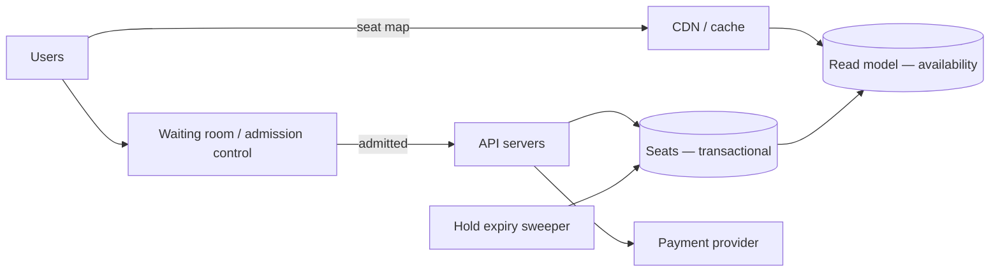

import H from '@site/src/components/Highlight';
import C from '@site/src/components/Color';
import Plain from '@site/src/components/Plain';
import Jargon from '@site/src/components/Jargon';
import Depth from '@site/src/components/Depth';
import Trace, { TraceStep } from '@site/src/components/Trace';

# Design Ticketmaster

> **The drill:** ticket sales with an on-sale rush. <C color="crimson">The only drill here where correctness under extreme contention matters more than throughput</C> — selling the same seat twice is worse than being slow.

<Plain>

A concert hall with two thousand seats, and fifty thousand people arriving at ten o'clock precisely to buy them.

Everything about this is unusual.

**Demand exceeds supply by 25×**, so most people will not get a ticket. The system's job is not to serve everyone — <C color="orange">it is to serve two thousand people correctly and tell the rest honestly.</C>

**The items are unique and indivisible.** Not "ten thousand of a product" but seat J14, one of them, and either you have it or you do not.

**Selling one twice is unacceptable.** Not a metric that degrades — a person arriving at a concert to find someone in their seat. <C color="crimson">This is a correctness requirement, not a performance one.</C>

**People need time to pay.** A seat cannot be sold the instant it is clicked; the buyer needs a couple of minutes to enter card details. So the seat must be **held** — and if they abandon, released for someone else.

**And the load is a spike, not a rate.** Nothing at 09:59, everything at 10:00. Autoscaling cannot react in time; the capacity must be there already, or the excess must be turned away deliberately.

</Plain>

---

## 1. Scope and the shape of the load

**In:** browse events; view seat availability; hold a seat; pay; confirm. Handle the on-sale spike.
**Out:** dynamic pricing, resale marketplace, fraud/bot detection (name it — it is genuinely large), venue management.

```
  Popular event: 50,000 concurrent users, 2,000 seats
  On-sale spike:  ~100× normal traffic, arriving within seconds
  Browse:read     enormous — everyone refreshing the seat map
  Purchase:write  bounded by 2,000 — the inventory IS the ceiling
```

<H>The write volume is capped by the number of seats. The read volume is not capped by anything. Those need completely different treatment, and separating them is the core insight.</H>

---

## 2. Reads and writes are different problems

<Trace title="Serving 50,000 people for 2,000 seats" subtitle="Two paths, opposite requirements.">

<TraceStep
  title="The seat map — read path"
  state={{ 'Requests': 'enormous', 'Consistency needed': 'approximate', 'Serve from': 'cache / CDN', 'Staleness': 'a second or two' }}
  changed={['Requests', 'Consistency needed', 'Serve from']}
  note="A seat map that is one second stale is fine — the user will discover the truth when they try to hold.">

<C color="green">Availability display can be cached and slightly stale.</C> Fifty thousand people refreshing must never touch the database.

</TraceStep>

<TraceStep
  title="Holding a seat — write path"
  cost="must be exact"
  state={{ 'Requests': 'bounded by seats', 'Consistency needed': 'STRICT', 'Serve from': 'transactional store', 'Staleness': 'none permitted' }}
  changed={['Requests', 'Consistency needed', 'Serve from', 'Staleness']}
  note="This is where correctness lives, and it is a small fraction of total traffic.">

<C color="crimson">A hold must be atomic and exact.</C> Two people cannot hold seat J14.

</TraceStep>

<TraceStep
  title="The hold, done wrong"
  cost="double-sold"
  state={{ 'Pattern': 'SELECT then UPDATE', 'Concurrent holds': 'both succeed', 'Result': 'seat sold twice', 'Verdict': 'broken' }}
  changed={['Pattern', 'Concurrent holds', 'Result', 'Verdict']}
  note="The lost update anomaly, in the one place it is least acceptable.">

Read availability, check it is free, then write. <C color="crimson">Two requests both read "free" and both write</C> — the [lost update](../04-data-storage/04-transactions-and-isolation.md).

</TraceStep>

<TraceStep
  title="The hold, done right"
  state={{ 'Pattern': 'conditional UPDATE', 'Concurrent holds': 'exactly one wins', 'Result': 'correct', 'Verdict': 'safe' }}
  changed={['Pattern', 'Concurrent holds', 'Result', 'Verdict']}
  note="The database arbitrates. Check the affected row count — zero means someone else got it.">

```sql
UPDATE seats
   SET status = 'held', held_by = ?, hold_expires_at = now() + interval '5 minutes'
 WHERE seat_id = ? AND status = 'available';
```

<C color="green">Exactly one update matches. The loser sees zero rows affected and is told the seat has gone.</C>

</TraceStep>

<TraceStep
  title="The hold expires"
  cost="the state nobody designs"
  state={{ 'User': 'abandoned checkout', 'Seat': 'still held', 'Without expiry': 'seat lost forever', 'With expiry': 'returns to pool' }}
  changed={['User', 'Seat', 'With expiry']}
  note="Expiry is what makes holding safe — it is the TTL that replaces a compensating transaction.">

<C color="green">The hold carries an expiry.</C> A sweeper (or a lazy check on read) releases expired holds back to availability.

<H>The TTL is doing the work a distributed transaction would otherwise have to do: if payment never completes, nothing needs to be undone — the hold simply lapses.</H>

</TraceStep>

<TraceStep
  title="Payment succeeds"
  state={{ 'Seat': 'sold', 'Idempotency key': 'present', 'Retry': 'returns original result', 'Verdict': 'complete' }}
  changed={['Seat', 'Idempotency key', 'Retry']}
  note="Payment is an external call, so at-least-once is guaranteed — an idempotency key is mandatory.">

On confirmation, the seat moves from `held` to `sold`, conditional on the hold still belonging to this user.

</TraceStep>

</Trace>

---

## 3. Handling the spike

<C color="crimson">Autoscaling cannot help</C> — it takes minutes and the spike arrives in seconds. Three real mechanisms:

**A virtual waiting room.** Admit users to the purchase flow at a controlled rate; everyone else waits with a position and an estimate. <C color="green">This converts an uncontrolled stampede into a queue you can serve at your actual capacity</C>, and it is what real ticketing systems do.

**Pre-scale for known events.** The on-sale time is known in advance. Provision ahead of it rather than reacting.

**Shed aggressively at the edge.** Beyond capacity, return a fast, honest rejection rather than a slow timeout — [failing fast beats buffering](../08-async-and-events/04-backpressure.md).

<Jargon
  plain="Letting a controlled number of users into the purchase flow and making the rest wait in an ordered queue."
  term="virtual waiting room"
  also={['admission control', 'queue-it pattern']}>

<C color="green">The key property is fairness and honesty</C>: a user with position 14,000 knows where they stand, rather than repeatedly failing at a checkout that was never going to work.

</Jargon>

---

## 4. The architecture



<C color="green">Note the seat map is served from a read model, not from the transactional store.</C> The write path stays small and exact; the read path stays enormous and approximate — and they scale independently.

---

## 5. What interviewers push on

<Depth title="Where to hold inventory, fairness, and bots">

**Should holds live in Redis or the database?**

Redis is faster and its TTLs are automatic. <C color="crimson">But the seat is the system of record, and a Redis failure would lose holds or, worse, allow double-selling if the database does not know about them.</C>

The defensible answers:

- <C color="green">**Database as the authority**, with the conditional `UPDATE` doing the arbitration.</C> Simple, exactly correct, and 2,000 writes is trivial — the write volume is bounded by inventory, so a single primary is comfortable.
- **Redis for hold coordination with the database as the authority**, using Redis to fail fast on obviously-taken seats and the database to make the actual decision.

<C color="crimson">Redis alone as the authority is the answer to avoid</C>, and interviewers probe it. The write volume never justified it, and the correctness cost is real.

**Fairness is a product requirement with a design consequence.** Pure first-come-first-served rewards whoever has the fastest connection and the best script. Options: a **randomised lottery** among those present at on-sale, a **queue with randomised initial ordering**, or verified-fan pre-registration. <C color="orange">Each is a legitimate answer and the interviewer is looking for you to recognise that "fair" needs defining.</C>

**Bots are the dominant real-world problem**, and it is honest to say so. Automated purchasing for resale means a large share of demand may not be human. Countermeasures — device fingerprinting, behavioural analysis, rate limiting per identity, verified accounts, CAPTCHA on entry — are a substantial subsystem. <C color="green">Name it and scope it out</C> rather than attempting it.

**Seat selection versus best-available.** Letting users pick specific seats maximises contention on desirable ones. **Best-available** allocation — the system assigns from a pool — <C color="green">dramatically reduces contention</C> because no two users are competing for the same specific row. Many high-demand on-sales use it for exactly this reason, and proposing it shows you are thinking about the contention rather than only handling it.

**Hold duration is a real trade.** Too short and legitimate buyers fail at payment; too long and inventory is locked up by abandoned carts during the only minutes that matter. Typically 5–10 minutes, sometimes shortened dynamically under extreme demand.

**Failure modes:**

| Failure | Effect | Handling |
| :--- | :--- | :--- |
| Payment provider slow | Holds expire mid-payment | Extend the hold on payment initiation; reconcile after |
| Sweeper stops | Expired holds never released | Lazy expiry check on read as a backstop |
| Read model lags | Seat map shows sold seats as free | Acceptable — the hold attempt is authoritative and will fail honestly |
| Database primary fails | No purchases | This is the [CP choice](../06-distributed-systems/01-cap-and-pacelc.md): refuse rather than risk double-selling |

<H>That last row is the summary of the whole drill. When a seat's availability cannot be determined with certainty, the correct behaviour is to fail the purchase — an error is recoverable, two people in one seat is not.</H>

</Depth>

---

## 6. What a good answer sounds like

> *"Reads and writes have opposite requirements here. The seat map is enormous read volume that tolerates a second of staleness, so it's served from a cached read model. Purchases are bounded by inventory — 2,000 writes — but must be exact, so they go to a transactional store with a conditional `UPDATE … WHERE status = 'available'`, and the loser sees zero rows affected. Holds carry a TTL, which is what removes the need for a distributed transaction: if payment never completes, the hold simply lapses. The spike can't be autoscaled into, so a virtual waiting room admits users at our actual capacity and tells everyone else their position honestly. Best-available allocation reduces contention substantially versus seat picking. Bots are the real-world problem and I'd scope that separately. If we can't determine availability with certainty, we refuse the purchase — this is the one drill where CP is obviously right."*

---

## Rapid-fire recall

1. Why do reads and writes need opposite treatment here?
2. What caps the write volume, and why does that matter?
3. Show the correct hold operation and explain why the naive version fails.
4. What work is the hold TTL doing?
5. Why can autoscaling not handle the on-sale spike, and what can?
6. What does a virtual waiting room actually provide beyond load control?
7. Why is Redis-as-authority for holds the answer to avoid?
8. How does best-available allocation reduce contention?
9. What is the trade in choosing hold duration?
10. What should happen if seat availability cannot be determined with certainty?

<details>
<summary>Answers</summary>

1. **Reads** are enormous and tolerate staleness — served from a cached read model. **Writes** are bounded by inventory and must be **exactly correct** — served from a transactional store. Conflating them either overloads the database or risks double-selling.
2. **The number of seats.** There can never be more successful purchases than inventory, so 2,000 writes is trivial for a single primary — which is why correctness can be prioritised over write throughput without cost.
3. `UPDATE seats SET status='held', … WHERE seat_id = ? AND status = 'available'`, then check the affected row count. The naive `SELECT` then `UPDATE` is a **lost update** — two requests both read "available" and both write.
4. It **replaces a distributed transaction**. If payment never completes, nothing needs compensating — the hold simply lapses and the seat returns to the pool.
5. Because autoscaling takes **minutes** and the spike arrives in **seconds**. What works: a **virtual waiting room**, **pre-scaling for the known on-sale time**, and **shedding aggressively at the edge**.
6. **Fairness and honesty** — a user knows their position and estimated wait, rather than repeatedly failing at a checkout that was never going to succeed.
7. Because the seat is the **system of record**, and a Redis failure could lose holds or permit double-selling. The write volume (bounded by inventory) never justified moving authority out of the database.
8. Because **no two users compete for the same specific seat** — the system assigns from a pool rather than letting everyone converge on the same desirable row.
9. **Too short** and legitimate buyers fail during payment; **too long** and abandoned carts lock inventory during the only minutes that matter. Typically 5–10 minutes, sometimes shortened under extreme demand.
10. **Refuse the purchase.** An error is recoverable; two people holding the same seat is not. This is the clearest case in these drills for choosing consistency over availability.

</details>

---

**Next:** [Design an Ad Click Aggregator](./12-ad-click-aggregator.md) — high-volume streaming with exactness requirements.
