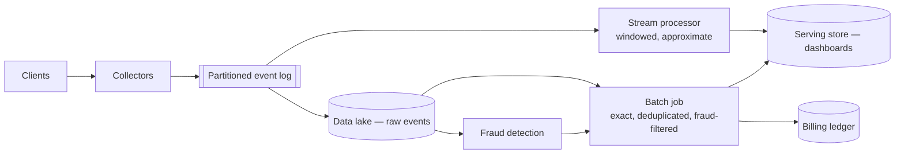

import H from '@site/src/components/Highlight';
import C from '@site/src/components/Color';
import Plain from '@site/src/components/Plain';
import Jargon from '@site/src/components/Jargon';
import Depth from '@site/src/components/Depth';
import Trace, { TraceStep } from '@site/src/components/Trace';

# Design an Ad Click Aggregator

> **The drill:** ingest billions of click events and produce accurate per-advertiser aggregates. <C color="orange">The best streaming-systems drill</C>, because it forces you to reconcile enormous volume with a requirement for exactness — advertisers are billed from these numbers.

<Plain>

A company counts how many people respond to each advertisement, and bills advertisers accordingly.

**The volume is enormous** — billions of responses a day.

**And the count must be right**, because it is an invoice. This is unusual: most systems counting at this volume are happy to be approximately right. Here, being 2% high means overcharging customers, and being 2% low means giving away revenue.

Two more properties make it awkward.

**Responses arrive late.** Someone's phone is in a tunnel; the response is recorded and uploaded twenty minutes later. <C color="orange">Which hour does it belong to — when it happened, or when it arrived?</C> Both answers are defensible and they give different invoices.

**Some responses are not real.** Automated clicking exists precisely because it costs advertisers money. <C color="crimson">The count is only meaningful if the fraudulent ones are removed</C> — and detecting them may take hours, after the initial numbers were already published.

So the system must produce numbers fast enough to be useful and correct enough to bill on, and those two requirements have different deadlines.

</Plain>

---

## 1. Scope and estimates

**In:** ingest click and impression events; aggregate by advertiser, campaign and time window; serve near-real-time dashboards; produce billable totals.
**Out:** ad serving and auction (a separate, latency-critical system), targeting, creative management.

```
  10B events/day  →  ~120,000/s average, ~500,000/s peak
  Event size ~1 KB →  ~10 TB/day raw

  Dashboard freshness: seconds to a minute
  Billing accuracy:     exact, reconcilable, auditable
```

<H>Two consumers with incompatible requirements: a dashboard that wants numbers within seconds, and a billing system that wants numbers that are exactly right. The design must serve both, and it cannot serve both with one path.</H>

---

## 2. Two paths, deliberately

<Trace title="One event stream, two answers" subtitle="Fast and approximate, then slow and exact.">

<TraceStep
  title="Ingest"
  state={{ 'Path': 'client → collector → log', 'Durability': 'replicated log', 'Latency': 'ms', 'Aggregated': 'not yet' }}
  changed={['Path', 'Durability']}
  note="Write to a partitioned, replicated log first. Everything downstream is a consumer of it.">

Events land in a [log-based stream](../08-async-and-events/02-log-based-streams.md), partitioned by advertiser so one advertiser's events stay ordered and co-located.

<C color="green">The log is the source of truth</C> — replayable, durable, and the thing both paths read.

</TraceStep>

<TraceStep
  title="Fast path — streaming aggregation"
  cost="approximate"
  state={{ 'Latency': 'seconds', 'Accuracy': 'approximate', 'Handles late data': 'poorly', 'Used for': 'dashboards' }}
  changed={['Latency', 'Accuracy', 'Handles late data', 'Used for']}
  note="A stream processor maintaining windowed counters, written to a serving store.">

A stream job aggregates into per-minute windows and writes to a fast key-value store.

<C color="green">Advertisers see near-live numbers</C>, which is what a dashboard needs.

</TraceStep>

<TraceStep
  title="Late events arrive"
  cost="the fast path is now wrong"
  state={{ 'Event time': '10:05', 'Arrival time': '10:40', 'Fast path window': 'already closed', 'Count': 'understated' }}
  changed={['Event time', 'Arrival time', 'Fast path window', 'Count']}
  note="Mobile, tunnels, batching, retries — late arrival is normal, not exceptional.">

The 10:00–10:05 window closed at 10:06. <C color="crimson">An event belonging to it arrives at 10:40 and is either dropped or counted in the wrong window.</C>

</TraceStep>

<TraceStep
  title="Slow path — batch recomputation"
  state={{ 'Latency': 'hours', 'Accuracy': 'exact', 'Handles late data': 'yes — reprocesses the window', 'Used for': 'billing' }}
  changed={['Latency', 'Accuracy', 'Handles late data', 'Used for']}
  note="A batch job re-reads the log for a completed period once late data has settled, and recomputes from scratch.">

<C color="green">Hours later, recompute each window from the log</C> — by then late events have arrived and fraud filtering has run.

</TraceStep>

<TraceStep
  title="The slow path overwrites the fast one"
  state={{ 'Dashboard (recent)': 'fast path', 'Dashboard (settled)': 'batch result', 'Billing': 'batch result only', 'Verdict': 'both needs met' }}
  changed={['Dashboard (recent)', 'Dashboard (settled)', 'Billing']}
  note="Recent numbers are provisional and labelled as such; settled numbers are authoritative.">

<H>Recent windows show provisional streaming numbers; once a window has settled, the batch result replaces it and is what gets billed. Advertisers see fast numbers immediately and correct numbers eventually — and are told which is which.</H>

</TraceStep>

</Trace>

---

## 3. Event time versus processing time

<Jargon
  plain="When the event actually happened, versus when your system got round to handling it."
  term="event time vs processing time"
  also={['watermarks', 'windowing', 'late arriving data']}>

<C color="green">Aggregate by **event time**</C>, or your hourly numbers depend on your own processing delays — a backlog would move revenue between hours. <C color="crimson">And event time means windows can never be definitively closed</C>, because a late event may always arrive.

</Jargon>

**Watermarks** are how stream processors handle this: a watermark asserts *"we believe all events with time earlier than T have arrived"*, allowing a window to be emitted. Events arriving after the watermark are **late**, and you choose:

| Policy | Effect |
| :--- | :--- |
| Drop late events | <C color="crimson">Simple, and undercounts</C> |
| Update the window | Correct; downstream consumers must handle revisions |
| Route to a side output | <C color="green">Handled by the batch path</C> — the usual answer here |

<C color="orange">The watermark is a heuristic, not a guarantee</C> — set it too tight and you drop real data; too loose and results are delayed. This is exactly why the batch path exists.

---

## 4. Exactly-once, honestly

Billing means duplicates matter. <C color="crimson">And [exactly-once delivery is impossible](../06-distributed-systems/05-idempotency-and-delivery.md)</C> — so the answer is deduplication, not a delivery guarantee.

```
  Every click carries a client-generated event id.
  Aggregation deduplicates on (event_id) within a bounded window.
  The batch path deduplicates over the full period when recomputing.
```

<C color="green">The batch path's deduplication is the authoritative one</C>, because it sees the whole period at once rather than a sliding window. This is the honest version of "exactly once": <C color="green">at-least-once ingestion, plus deduplication at the point where the number becomes a number that matters.</C>

---

## 5. The architecture



<C color="green">Both paths read the same log</C>, which is what makes the batch result trustworthy — it is not a different data source that might disagree, but the same events processed more carefully.

<Depth title="Fraud, hot advertisers, and why raw events are kept forever">

**Fraud detection is why the batch path cannot be optional.**

Invalid traffic — bots, click farms, accidental double-taps, misconfigured integrations — can be a meaningful fraction of raw events. Detecting it requires context the stream path does not have: <C color="orange">patterns across time, across users, across campaigns.</C> A single click is never obviously fraudulent; a thousand from one device in an hour is.

So the pipeline is: **raw counts** (streaming, provisional) → **filtered counts** (batch, after fraud analysis) → **billable counts**. Advertisers are billed on the third, and disputes are resolved by re-running the filter over retained raw events.

<C color="green">This is why raw events are retained.</C> Aggregates alone cannot answer *"why was I charged for these 40,000 clicks?"* — and that question gets asked, by customers with lawyers.

**Hot advertisers create partition skew.** A single enormous campaign concentrates events in one partition, saturating one consumer while others idle — [the hot partition problem](../05-data-at-scale/02-partitioning-and-sharding.md).

Mitigations: <C color="green">sub-partition hot keys</C> (`advertiser_id:bucket`, summed on read), or pre-aggregate at the collector so the stream carries counts rather than individual events. <C color="green">Pre-aggregation is powerful here</C> — collectors batching one second of events per advertiser reduce downstream volume by orders of magnitude, and the loss window is one second of counts, which the batch path corrects anyway.

**Idempotent writes to the serving store.** Windowed results should be written as *"the count for advertiser A in window W is N"* — an idempotent overwrite — rather than an increment. <C color="green">Then reprocessing a window is safe</C>, and it is what allows the batch path to overwrite the streaming result without double-counting.

**The lambda architecture caveat, worth raising.** Running a streaming and a batch path is the classic **lambda architecture**, and its known cost is <C color="crimson">maintaining the same aggregation logic twice, in two systems, and keeping them consistent.</C> Logic drift between them produces numbers that disagree for reasons nobody can explain.

The **kappa** alternative uses one streaming system for both, replaying the log through the same code to recompute. <C color="green">One implementation, no drift</C>, and it demands a stream processor that can reprocess history efficiently and handle very late data. Mentioning this trade — and that modern stream processors make kappa increasingly viable — is a strong signal.

**Where it breaks at 10×.** Ingest scales with partitions. The pressures become **partition skew from large advertisers**, **batch job duration** approaching its window, and **storage cost for retained raw events** — the last addressed by [lifecycle tiering](../04-data-storage/06-object-storage.md), since raw events are read rarely after the batch has run.

<H>The framing that distinguishes a good answer: this is not a counting problem, it is a *reconciliation* problem. Fast numbers and correct numbers are different products with different deadlines, and the design's job is to produce both from one durable log and be explicit about which is which.</H>

</Depth>

---

## 6. What a good answer sounds like

> *"Two consumers with incompatible requirements: dashboards want seconds, billing wants exactness. So events land in a partitioned durable log, and two paths read it. A stream job produces per-minute windows for dashboards — fast and provisional. A batch job recomputes the same windows hours later from the same log, after late events have settled and fraud filtering has run, and that result overwrites the streaming one and is what we bill. Aggregate by event time, not processing time, with watermarks and late events routed to the batch path. Exactly-once is deduplication on a client-supplied event id, not a delivery guarantee. Raw events are retained because 'why was I charged for this' is a question customers ask. The known cost is maintaining aggregation logic twice — kappa with replay avoids that if the stream processor can handle it."*

---

## Rapid-fire recall

1. What makes this different from ordinary high-volume counting?
2. Which two consumers have incompatible requirements, and how are both served?
3. Why aggregate by event time rather than processing time?
4. What is a watermark, and why is it a heuristic?
5. Give three policies for late events and say which suits this design.
6. How is "exactly once" actually achieved here?
7. Why is the batch path's deduplication authoritative?
8. Why must raw events be retained, and for how long is that expensive?
9. What causes partition skew, and give two mitigations.
10. What is the lambda architecture's known cost, and what is the alternative?

<details>
<summary>Answers</summary>

1. **The counts are invoices.** Most systems counting at this volume tolerate approximation; here being 2% off means overcharging customers or giving away revenue.
2. **Dashboards** need seconds and tolerate approximation; **billing** needs exactness and tolerates hours. Served by **two paths reading the same durable log** — a stream job for provisional numbers, a batch job that recomputes and overwrites once the window has settled.
3. Because aggregating by processing time makes hourly figures depend on **your own delays** — a backlog would move revenue between hours. Event time is the property of the event, not of your system.
4. An assertion that **all events earlier than time T are believed to have arrived**, allowing a window to be emitted. It is a heuristic because a later event may always arrive — too tight drops real data, too loose delays results.
5. **Drop them** (simple, undercounts) · **update the window** (correct, requires consumers to handle revisions) · **route to a side output** (handled by the batch path — the answer here).
6. **At-least-once ingestion plus deduplication** on a client-generated event id — first within a bounded window in the stream, then authoritatively over the whole period in the batch job. Exactly-once delivery is impossible.
7. Because it **sees the entire period at once** rather than a sliding window, so it can deduplicate across the full range including very late arrivals.
8. Because **aggregates cannot answer "why was I charged for these clicks?"**, and that question is asked by customers in disputes. Retention is expensive in storage, addressed by **lifecycle tiering** since raw events are rarely read after the batch has run.
9. **A single very large advertiser** concentrating events in one partition. Mitigations: **sub-partition the hot key** (`advertiser_id:bucket`, summed on read) and **pre-aggregate at the collector** so the stream carries counts rather than individual events.
10. Maintaining the **same aggregation logic twice, in two systems**, with the risk of drift producing unexplainable disagreements. The alternative is **kappa** — one streaming system that replays the log through the same code to recompute.

</details>

---

**Next:** [Design a Web Crawler](./13-web-crawler.md) — politeness, deduplication and traps.
